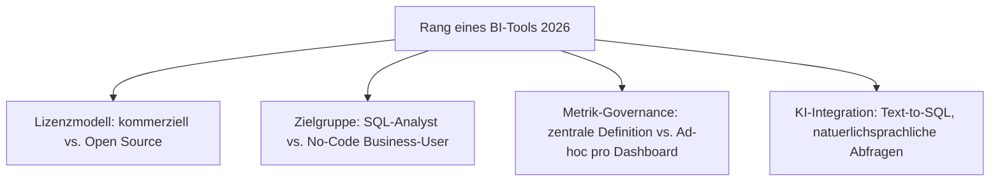
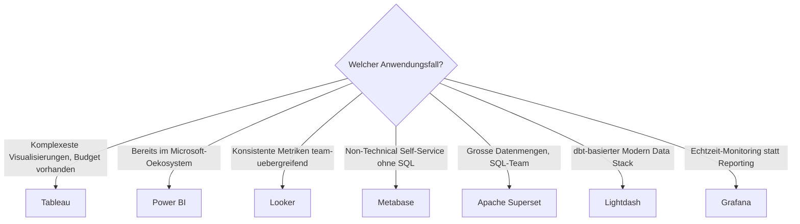

# Beste BI- & Analytics-Tools 2026 — Top-15-Topliste

Die [Evolution und Architekturen digitaler BI- & Analytics-Tools](evolution-digitaler-bi-analytics-tools.md) ordnet diese Kategorie chronologisch — von IT-getriebenen Enterprise-Suiten über Self-Service-Dashboards bis zu KI-gestützten Text-to-SQL-Assistenten. Diese Seite übersetzt die Chronologie in eine **Momentaufnahme 2026**: 15 Werkzeuge, die heute tatsächlich produktiv im Einsatz sind.

---

## Bewertungskriterien

---

## Top 15 im Überblick

| Rang | Tool | Generation | Lizenzmodell | Besondere Stärke |
|---|---|---|---|---|
| 1 | **Tableau** | 2 (Self-Service-Durchbruch) | Kommerziell | Unerreicht bei komplexen, ausdrucksstarken Visualisierungen |
| 2 | **Power BI** | 3 (Cloud-native SaaS-BI) | Kommerziell | Tiefe Excel-/Microsoft-365-Integration, günstiger Einstiegspreis |
| 3 | **Looker** | 3 (Cloud-native SaaS-BI) | Kommerziell (Google Cloud) | LookML-Metrik-Schicht sorgt für konsistente Kennzahlen team-übergreifend |
| 4 | **Metabase** | 4 (Open-Source-SQL-BI) | Open Source | Einfachstes Tool für Nicht-Techniker:innen, „Question"-Interface ohne SQL |
| 5 | **Apache Superset** | 4 (Open-Source-SQL-BI) | Open Source | Leistungsstärkste Open-Source-Option für große Datenmengen und SQL-Teams |
| 6 | **ThoughtSpot** | 6 (KI-gestützte Text-to-SQL-BI) | Kommerziell | Pionier der Search-&-AI-driven Analytics |
| 7 | **Qlik Sense** | 2 (Self-Service-Durchbruch, Nachfolger von QlikView) | Kommerziell | Assoziatives In-Memory-Datenmodell für explorative Analyse |
| 8 | **Sisense** | 3 (Cloud-native SaaS-BI) | Kommerziell | Eingebettete Analytics für Produkt-Dashboards in eigener Software |
| 9 | **Lightdash** | 5 (Modern-Data-Stack-nativ) | Open Source | dbt-native Metrik-Definition, nahtlos im Modern Data Stack |
| 10 | **Redash** | 4 (Open-Source-SQL-BI) | Open Source | Leichtgewichtig, ideal zum schnellen Teilen von SQL-Abfrageergebnissen |
| 11 | **Google Looker Studio** | 5 (Modern-Data-Stack-nativ) | Kostenlos | Kostenloser Einstieg, tief im BigQuery-/Google-Ökosystem verankert |
| 12 | **Grafana** | Ergänzung 2026 | Open Source | Marktführer für Echtzeit-Monitoring-Dashboards statt klassischem Reporting |
| 13 | **Mode Analytics** | 5 (Modern-Data-Stack-nativ) | Kommerziell | SQL-Notebooks kombiniert mit Visualisierung für datenaffine Analyst:innen |
| 14 | **Domo** | 3 (Cloud-native SaaS-BI) | Kommerziell | All-in-one-Plattform inkl. Datenintegration für weniger technische Teams |
| 15 | **MicroStrategy** | 1 (klassische Enterprise-Suiten) | Kommerziell | Nach wie vor verbreitet in großen, regulierten Enterprise-Umgebungen |

---

## Highlights im Detail

### Rang 1–3: Die drei Enterprise-Platzhirsche
Tableau, Power BI und Looker dominieren weiterhin das kommerzielle Segment — jedes mit einer eigenen Kern-Stärke: Visualisierungstiefe (Tableau), Microsoft-Integration (Power BI) oder Metrik-Governance (Looker), siehe [Generationen 2–3](evolution-digitaler-bi-analytics-tools.md#generation-3-cloud-native-saas-bi-2012-2015).

### Rang 4–5, 9–10: Die Open-Source-Welle
Metabase, Apache Superset, Lightdash und Redash zeigen, dass Self-Service-BI heute auch ohne Lizenzkosten produktionsreif ist — mit klarer Arbeitsteilung: Metabase für Business-User, Superset für große SQL-Workloads, Lightdash für dbt-zentrierte Teams.

### Rang 6: KI-native BI als eigene Nische
ThoughtSpot steht stellvertretend für [Generation 6](evolution-digitaler-bi-analytics-tools.md#generation-6-ki-gestutzte-text-to-sql-bi-2023-2026) — die etablierten Anbieter (Power BI Copilot, Looker mit Gemini) ziehen mit KI-Funktionen in ihre bestehenden Suiten nach, statt eigene neue Produkte zu bauen.

### Rang 12: Grenzfall Monitoring vs. BI
Grafana wird oft nicht als klassisches BI-Tool wahrgenommen, dominiert aber den angrenzenden Bereich Echtzeit-Monitoring-Dashboards und wird zunehmend auch für allgemeine Analytics eingesetzt.

---

## Entscheidungshilfe nach Anwendungsfall

---

## 🔗 Verwandte Themen

- [Startseite](../../../index.md) — zurück zur Dokumentations-Zentrale
- [Evolution und Architekturen digitaler BI- & Analytics-Tools](evolution-digitaler-bi-analytics-tools.md) — chronologisches Generationenmodell, dessen aktuellen Stand diese Topliste zusammenfasst
- [Produktionsreife Open-Source-BI- & Analytics-Tools nach Generation (Top 3)](produktionsreife-bi-analytics-tools-generationen-2026-topliste.md) — dieselbe Chronologie durch das konservative Fünf-Filter-Sieb; nur Metabase, Apache Superset und Grafana bestehen — fünf von sechs Generationen sind vollständig proprietär
- [Beste Vektordatenbanken 2026 (Top 15)](vektordatenbanken-2026-topliste.md) — verwandte Datenbank-Vertiefung im selben Bereich
- [Datenbanken & Big Data: Übersicht für KI-Anwendungen](index.md)
