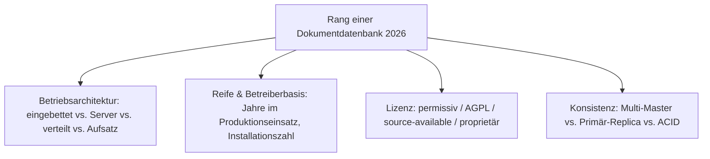
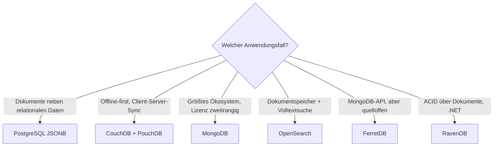

# Beste Dokumentdatenbanken 2026 — Top-15-Topliste

Die [Evolution und Architekturen digitaler Dokumentdatenbanken](evolution-digitaler-dokumentdatenbanken.md) ordnet diese Kategorie chronologisch — von den XML-Vorläufern über die JSON-Dokument-Welle und die Scale-out-Ära bis zur Multi-Model-Konvergenz, der Lizenz-Zäsur und dem Dokument-Modell als Feature. Diese Seite übersetzt die Chronologie in eine **Momentaufnahme 2026**: 15 Systeme, mit denen JSON-Dokumente heute tatsächlich gespeichert werden.

---

## Bewertungskriterien

---

## Top 15 im Überblick

| Rang | System | Generation | Lizenz | Besondere Stärke |
|---|---|---|---|---|
| 1 | **MongoDB** | 2 (JSON-Dokument-Welle) | SSPL (nicht OSI) | Marktführer, beste Entwickler-Ergonomie, riesiges Treiber- und Tooling-Ökosystem |
| 2 | **PostgreSQL JSONB** | 4 (Multi-Model & Konvergenz) | PostgreSQL License | Dokumente und relationale Daten in einer Transaktion, ein Backup, ein Betriebswissen |
| 3 | **CouchDB** | 2 (JSON-Dokument-Welle) | Apache-2.0 | HTTP-nativ, Multi-Master-Replikation, Foundation-getragen — die offline-first-Referenz |
| 4 | **Couchbase** | 3 (Scale-out) | BSL (nicht OSI) | Memcached-Geschwindigkeit plus Persistenz, SQL-artige Query-Sprache (N1QL) |
| 5 | **Elasticsearch** | 4–5 (Konvergenz / Lizenz-Zäsur) | AGPL-3.0 / SSPL / Elastic | Dokumentspeicher plus Volltextsuche plus Vektorsuche in einer Plattform |
| 6 | **OpenSearch** | 5 (Lizenz-Zäsur, Gegenbewegung) | Apache-2.0 | Apache-lizenzierte Elasticsearch-Abspaltung, seit 2024 unter der Linux Foundation |
| 7 | **Azure Cosmos DB** | 4 (Multi-Model & Konvergenz) | proprietär (Managed) | Global verteilt, mehrere APIs (Dokument, Graph, Tabelle) auf einem Kern |
| 8 | **Amazon DocumentDB** | 4 (Multi-Model & Konvergenz) | proprietär (Managed) | MongoDB-API-kompatibel auf AWS-Storage-Layer |
| 9 | **Firestore** | 4 (Multi-Model & Konvergenz) | proprietär (Managed) | Serverless, Echtzeit-Synchronisation, tief in Firebase/GCP integriert |
| 10 | **RavenDB** | 2 (JSON-Dokument-Welle) | AGPL-3.0 | ACID-Transaktionen über Dokumente, für das .NET-Ökosystem |
| 11 | **ArangoDB** | 4 (Multi-Model & Konvergenz) | BSL (nicht OSI) | Dokument, Graph und Key-Value in einer Engine mit einer Query-Sprache (AQL) |
| 12 | **PouchDB** | 2 (JSON-Dokument-Welle) | Apache-2.0 | CouchDB-kompatibel im Browser, synchronisiert offline-first mit einem Server |
| 13 | **FerretDB** | 6 (Dokument als Feature) | Apache-2.0 | MongoDB-Wire-Protokoll als quelloffener Aufsatz auf PostgreSQL |
| 14 | **eXist-db** | 1 (XML-Vorläufer) | LGPL-2.1 | Native XML-Datenbank mit XQuery, weiterhin in Digital-Humanities-Projekten |
| 15 | **SQLite (JSONB)** | 6 (Dokument als Feature) | gemeinfrei | Binäres JSON in der eingebetteten Ein-Datei-Datenbank, seit 2024 |

---

## Highlights im Detail

### Rang 1–3: Marktführer, pragmatische Wahl, offene Referenz
MongoDB dominiert die Kategorie, wird aber seit 2018 unter der nicht-OSI-Lizenz SSPL vertrieben; **PostgreSQL JSONB** ist für viele Projekte die pragmatischere Wahl; **CouchDB** ist die einzige große, klassisch quelloffene Dokumentdatenbank, siehe [Generation 2](evolution-digitaler-dokumentdatenbanken.md#generation-2-die-json-dokument-welle-2005-2010).

### Rang 4–6, 11: die Lizenz-Zäsur
Couchbase (BSL 2021), Elasticsearch (SSPL 2021, AGPL zurück 2024) und ArangoDB (BSL 2023) haben ihre Community-Lizenzen verschärft — **OpenSearch** ist die Apache-lizenzierte Antwort auf Elasticsearch, siehe [Generation 5](evolution-digitaler-dokumentdatenbanken.md#generation-5-die-lizenz-zasur-2018-2021).

### Rang 13: das Dokument-Modell kehrt zu Postgres zurück
FerretDB übersetzt MongoDB-Wire-Protokoll auf PostgreSQL — dieselbe „Feature statt eigene Kategorie"-Bewegung, die die eigenständige Vektordatenbank verdrängt, siehe [Generation 6](evolution-digitaler-dokumentdatenbanken.md#generation-6-dokument-modell-als-feature-serverless-2021-2026).

---

## Entscheidungshilfe nach Anwendungsfall

!!! tip "Bereits vertieft in diesem Wiki"
    Für den PostgreSQL-Betrieb — auch als Dokumentspeicher über JSONB — existiert das [PostgreSQL DBA Praxis-Handbuch](../../../entwicklung/infrastruktur/postgresql-dba-praxis.md).

---

## 🔗 Verwandte Themen

- [Startseite](../../../index.md) — zurück zur Dokumentations-Zentrale
- [Evolution und Architekturen digitaler Dokumentdatenbanken](evolution-digitaler-dokumentdatenbanken.md) — chronologisches Generationenmodell, dessen aktuellen Stand diese Topliste zusammenfasst
- [Produktionsreife Dokumentdatenbanken nach Generation (Top 2)](produktionsreife-dokumentdatenbanken-generationen-2026-topliste.md) — dieselbe Chronologie durch das konservative Fünf-Filter-Sieb: CouchDB und PouchDB
- [Beste relationale Datenbanken 2026 (Top 15)](relationale-datenbanken-2026-topliste.md) — PostgreSQL JSONB als Dokumentspeicher-Alternative
- [Evolution und Architekturen digitaler Vektordatenbanken](evolution-digitaler-vektordatenbanken.md) — dieselbe „Feature statt eigene Kategorie"-Bewegung
- [PostgreSQL DBA Praxis-Handbuch](../../../entwicklung/infrastruktur/postgresql-dba-praxis.md)
- [Datenbanken & Big Data: Übersicht für KI-Anwendungen](index.md)
