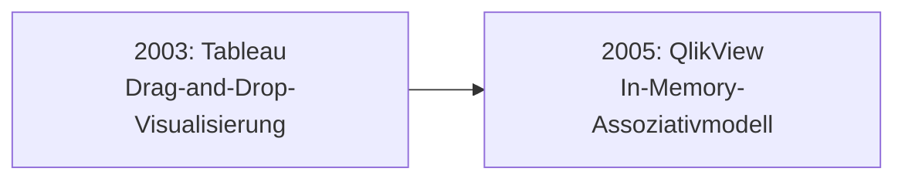
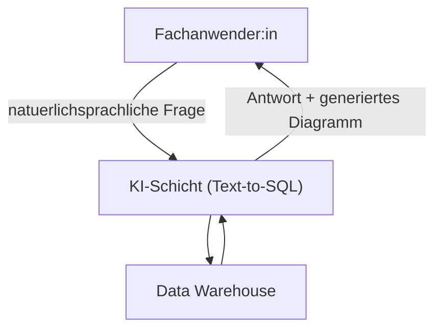

# Evolution und Architekturen digitaler BI- & Analytics-Tools

Business-Intelligence-Werkzeuge haben sich von IT-getriebenen Enterprise-Suiten über Self-Service-Dashboards bis zu KI-gestützten Text-to-SQL-Assistenten entwickelt. Diese Zeitachse ordnet die wichtigsten Architektur-Generationen chronologisch ein.

!!! note "Hinweis: Generationen überlappen sich"
    Die Zeiträume sind grobe Orientierung — klassische Enterprise-Suiten (Generation 1) werden parallel zu KI-gestützten Tools (Generation 6) bis heute produktiv eingesetzt. Entscheidend ist die **Architektur** (IT-zentriert vs. Self-Service, Lizenz vs. Open Source), nicht allein das Erscheinungsjahr.

---

## Generation 1: Klassische Enterprise-BI-Suiten, 1990er – 2000er

| System | Ursprung | Prinzip |
|---|---|---|
| **Business Objects** | 1990 | Eine der ersten kommerziellen BI-Suiten, IT-Abteilung erstellt Berichte für Fachbereiche. |
| **Cognos** | 1969 (BI-Fokus ab 1990er) | Enterprise-Reporting mit zentraler IT-Kontrolle über Datenmodelle. |
| **MicroStrategy** | 1989 | Umfangreiche Enterprise-Analytics-Plattform, hoher Implementierungsaufwand. |

- **Architektur:** On-Premise-Installation, zentrale IT-Abteilung modelliert Daten und erstellt Berichte, Fachbereiche konsumieren nur.
- **Schwäche:** Lange Wartezeiten zwischen Fachbereichs-Anfrage und fertigem Bericht — die IT-Abteilung wird zum Flaschenhals.

---

## Generation 2: Self-Service-BI-Durchbruch, 2003 – 2005

- **Tableau (2003):** Erlaubt Fachanwender:innen erstmals, Visualisierungen per Drag-and-Drop selbst zu erstellen — ohne IT-Abteilung als Zwischenschritt.
- **QlikView (2005):** Ergänzt ein assoziatives In-Memory-Datenmodell, das explorative Abfragen ohne vordefinierte Join-Pfade erlaubt.
- **Bedeutung:** Verschiebt die Kontrolle über Berichtserstellung von der IT-Abteilung zu Business-Analysten — der Grundstein für „Self-Service-BI" als eigene Kategorie.

---

## Generation 3: Cloud-native SaaS-BI, 2012 – 2015

| System | Jahr | Besonderheit |
|---|---|---|
| **Looker** | 2012 | Führt **LookML** ein — eine code-definierte Metrik-Schicht, die sicherstellt, dass alle Nutzer:innen dieselben Kennzahlen-Definitionen sehen. |
| **Power BI** | 2015 | Microsofts Antwort auf Tableau, mit tiefer Excel- und Office-365-Integration. |

Beide Systeme verlagern BI vollständig in die Cloud und senken die Einstiegshürde gegenüber den schwergewichtigen Enterprise-Suiten der Generation 1 drastisch.

---

## Generation 4: Open-Source-SQL-BI, 2013 – 2016

Diese Generation demokratisiert Self-Service-BI zusätzlich über die Lizenzkosten-Dimension — ohne Umweg über eine kommerzielle Suite:

| System | Jahr | Prinzip |
|---|---|---|
| **Redash** | 2013 | Leichtgewichtiges, SQL-first BI-Tool zum Teilen von Abfrageergebnissen. |
| **Metabase** | 2015 | „Question"-Interface erlaubt Filtern und Gruppieren per Klick, ganz ohne SQL-Kenntnisse. |
| **Apache Superset** | 2016 (Airbnb-Ursprung) | Leistungsstarke, SQL-zentrierte Plattform für große Datenmengen, später Apache-Top-Level-Projekt. |

---

## Generation 5: Modern-Data-Stack-natives BI, 2020 – 2022

Mit dem Aufstieg von dbt als Transformationsschicht entstehen BI-Tools, die sich direkt an dessen Metrik-Definitionen anschließen, statt eigene Datenmodelle zu pflegen:

| System | Jahr | Besonderheit |
|---|---|---|
| **Lightdash** | 2021 | dbt-natives BI-Tool — Metriken werden direkt aus dbt-Modellen übernommen. |
| **Looker Studio** (vormals Google Data Studio) | 2016, kostenlos ausgebaut | Kostenloses BI-Tool tief im Google-Cloud-/BigQuery-Ökosystem verankert. |
| **Mode Analytics** | 2013, Ausbau bis 2022 | Kombiniert SQL-Notebooks mit Visualisierung für datenaffine Analyst:innen. |

---

## Generation 6: KI-gestützte Text-to-SQL-BI, 2023 – 2026

Statt Dashboards manuell zu bauen, stellen Fachanwender:innen zunehmend natürlichsprachliche Fragen direkt an die Daten:

- **ThoughtSpot:** Pionier der Search-&-AI-driven-Analytics, Fragen in natürlicher Sprache statt Dashboard-Navigation.
- **Power BI Copilot:** Generiert Berichte und Zusammenfassungen direkt aus natürlichsprachlichen Anfragen.
- **Looker mit Gemini:** Google integriert generative KI direkt in die LookML-Metrik-Schicht.
- **Metabase KI-Fragen:** Auch Open-Source-Tools ziehen mit natürlichsprachlichen Abfrage-Assistenten nach.

---

## Alternative Sortier- & Klassifikationskriterien

### 1. Lizenzmodell
- **Kommerzielle Enterprise-Suiten** — Tableau, Power BI, Looker, ThoughtSpot.
- **Open Source, selbst gehostet** — Metabase, Apache Superset, Redash, Lightdash.

### 2. Zielgruppe
- **IT-/Analysten-zentriert (SQL-first)** — Apache Superset, Redash, Mode.
- **Business-User-zentriert (No-Code)** — Metabase, Tableau, Power BI.

### 3. Metrik-Governance
- **Code-definierte, zentrale Metrik-Schicht** — Looker (LookML), Lightdash (dbt-nativ).
- **Ad-hoc-Definition pro Dashboard** — die meisten klassischen Self-Service-Tools.

---

## 🔗 Verwandte Themen

- [Beste BI- & Analytics-Tools 2026 (Top 15)](bi-analytics-tools-2026-topliste.md) — Momentaufnahme 2026, die diese Chronologie in eine gerankte Topliste übersetzt
- [Produktionsreife Open-Source-BI- & Analytics-Tools nach Generation (Top 3)](produktionsreife-bi-analytics-tools-generationen-2026-topliste.md) — dasselbe Generationenmodell durch ein konservatives Fünf-Filter-Sieb; die Lizenz-Achse siebt, nicht der Speicher
- [Datenbanken & Big Data: Übersicht für KI-Anwendungen](index.md)
- [Beste Cloud-LMS & LXP 2026 (Top 20)](../../e-learning/cloud-lms-2026-topliste.md) — verwandtes SaaS-Bewertungsmuster im Bildungsbereich
