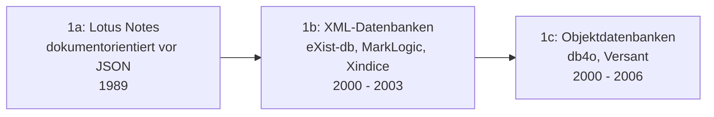
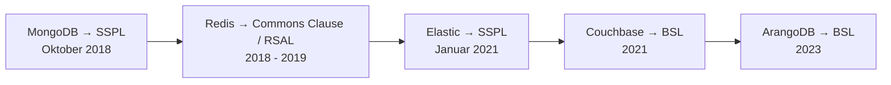

# Evolution und Architekturen digitaler Dokumentdatenbanken

Dokumentdatenbanken speichern selbstbeschreibende Datensätze — meist JSON — statt Zeilen in festen Tabellen. Diese Zeitachse ordnet die wichtigsten Architektur-Generationen chronologisch ein: von den XML- und objektorientierten Vorläufern über die JSON-Dokument-Welle und die Scale-out-Ära bis zur Multi-Model-Konvergenz, der großen Lizenz-Zäsur und dem heutigen „Dokument-Modell als Feature".

!!! note "Hinweis: Generationen überlappen sich"
    Die Zeiträume sind grobe Orientierung — CouchDB (Generation 2) wird bis heute für offline-first-Synchronisation eingesetzt, parallel zu PostgreSQL-JSONB (Generation 6). Entscheidend ist die **Architektur** (eigenständige Dokument-Engine vs. Dokument-Typ einer relationalen Datenbank, Einzelknoten vs. verteilt), nicht allein das Erscheinungsjahr.

---

## Generation 1: XML-Datenbanken & objektorientierte Vorläufer, 1998 – 2006

- **Lotus Notes (1989):** die eigentliche konzeptionelle Wurzel — eine dokumentorientierte, replizierende Datenbank Jahrzehnte vor JSON.
- **XML-Datenbanken (2000 – 2003):** **eXist-db**, **MarkLogic**, **Apache Xindice** speichern hierarchische XML-Dokumente nativ und fragen sie per XPath/XQuery ab.
- **Objektdatenbanken:** **db4o**, **Versant** persistieren Programmier-Objektgraphen direkt — technisch verwandt, aber am Impedance-Mismatch mit der Anwendungssprache gescheitert.

---

## Generation 2: Die JSON-Dokument-Welle, 2005 – 2010

Der Durchbruch: Dokumente als **JSON**, Zugriff über HTTP-APIs, schemafreie Sammlungen.

| System | Jahr | Architektur & Lizenz |
|---|---|---|
| **CouchDB** | 2005 | JSON über HTTP/REST, MVCC, Multi-Master-Replikation, in Erlang; Apache-2.0, von der Apache Software Foundation getragen |
| **MongoDB** | 2009 | BSON (binäres JSON), eigene Query-Sprache, für Entwickler-Ergonomie optimiert; AGPL-3.0 (bis 2018) |
| **RavenDB** | 2010 | Dokumentdatenbank für das .NET-Ökosystem mit ACID-Transaktionen; AGPL-3.0 |
| **PouchDB** | 2012 | CouchDB-kompatibel, läuft im Browser und in Node.js, synchronisiert mit CouchDB; Apache-2.0 |

CouchDB und MongoDB verkörpern zwei Philosophien: CouchDB die **Replikation und HTTP-Nativität**, MongoDB die **Entwickler-Ergonomie und den schnellen Einstieg**.

---

## Generation 3: Scale-out & das CAP-Theorem in der Praxis, 2009 – 2013

Dokumentdatenbanken werben mit horizontaler Skalierung — die Praxis zeigt die Kosten:

- **Sharding & Replica Sets:** MongoDB verteilt Sammlungen über viele Knoten; **Couchbase** (2011, aus CouchOne + Membase) kombiniert Memcached-Geschwindigkeit mit Persistenz.
- **Eventual Consistency:** Die frühen Standardeinstellungen (unbestätigte Schreibvorgänge, Lesen von Replicas) führen zu dokumentierten Datenverlust-Vorfällen und prägen den Ruf der Kategorie für Jahre.
- **Lehre:** Konsistenz-Garantien müssen explizit und per Default sicher sein — spätere Versionen korrigieren das.

---

## Generation 4: Multi-Model & Konvergenz, 2014 – 2018

Die Grenze zwischen Dokument- und anderen Datenbanken verschwimmt:

| Ansatz | System | Jahr |
|---|---|---|
| **Multi-Model** (Dokument + Graph + Key-Value) | ArangoDB | 2012/2016 |
| **Dokument-API auf verteiltem Kern** | Azure Cosmos DB | 2017 |
| **JSONB in der relationalen Datenbank** | PostgreSQL 9.4 | 2014 |
| **JSON-Funktionen in MySQL** | MySQL 5.7 | 2015 |

Die wichtigste Entwicklung dieser Generation: **PostgreSQL mit JSONB** wird für die meisten Dokument-Workloads „gut genug" — Dokumente und relationale Daten in derselben Transaktion, mit denselben Backups und demselben Betriebswissen.

---

## Generation 5: Die Lizenz-Zäsur, 2018 – 2021

Die kommerziell getragenen Dokumentdatenbanken verlassen praktisch geschlossen die Open-Source-Definition:

- **MongoDB (Oktober 2018):** wechselt von AGPL auf die **Server Side Public License (SSPL)** — von der Open Source Initiative ausdrücklich **nicht anerkannt**.
- **Couchbase (2021), ArangoDB (2023):** Community Editions wechseln auf die **Business Source License (BSL)** — kein freier Produktionseinsatz oberhalb definierter Grenzen.
- **Die Gegenbewegung:** quelloffene Forks entstehen — **OpenSearch** (2021, Apache-2.0, aus Elasticsearch), **FerretDB** (2021, MongoDB-kompatibler Aufsatz auf PostgreSQL), **Valkey** (2024, aus Redis).
- **CouchDB** bleibt unberührt — Apache-2.0, von der Apache Software Foundation und nicht von einem einzelnen Unternehmen getragen.

---

## Generation 6: Dokument-Modell als Feature & serverless, 2021 – 2026

Die Kategorie kehrt zu ihren Wurzeln zurück — das Dokument wird zum **Datentyp einer bestehenden Datenbank** statt zur eigenen Datenbank:

| Entwicklung | Basis | Jahr |
|---|---|---|
| **FerretDB** — MongoDB-Wire-Protokoll auf PostgreSQL/SQLite | PostgreSQL | 2021 (1.0: 2023) |
| **Microsoft DocumentDB** — quelloffene MongoDB-kompatible PostgreSQL-Erweiterung | PostgreSQL | 2025 |
| **SQLite `JSONB`** — binäres JSON in der eingebetteten Datenbank | SQLite | 2024 |
| **MongoDB Atlas Serverless** | MongoDB Cloud | 2022 |

!!! tip "Bezug zu diesem Repository"
    Die aktuelle Werkzeuglandschaft vergleicht [Beste Dokumentdatenbanken 2026 (Top 15)](dokumentdatenbanken-2026-topliste.md), die konservativ gefilterte Fassung [Produktionsreife Dokumentdatenbanken nach Generation](produktionsreife-dokumentdatenbanken-generationen-2026-topliste.md).

---

## Alternative Sortier- & Klassifikationskriterien

### 1. Betriebsarchitektur

- **Eingebettet / clientseitig** — PouchDB, SQLite-JSONB.
- **Eigenständiger Server** — CouchDB, MongoDB, RavenDB.
- **Verteilt (Shard/Replica)** — MongoDB Cluster, Couchbase, Cosmos DB.
- **Kompatibilitäts-Aufsatz auf einer anderen Datenbank** — FerretDB, Microsoft DocumentDB.

### 2. Konsistenzmodell

- **Multi-Master mit Konfliktauflösung** — CouchDB, PouchDB (offline-first).
- **Primär-Replica mit einstellbarer Konsistenz** — MongoDB, Couchbase.
- **ACID auf Dokumentebene** — RavenDB, PostgreSQL-JSONB.

### 3. Lizenzmodell

- **Permissiv / Foundation-getragen** — CouchDB (Apache-2.0, ASF), OpenSearch (Apache-2.0, Linux Foundation).
- **Copyleft (AGPL)** — RavenDB, Elasticsearch (seit 2024 wieder wählbar).
- **Source-available / nicht-OSI** — MongoDB (SSPL), Couchbase (BSL), ArangoDB (BSL).
- **Proprietär / Managed-only** — MarkLogic, Cosmos DB, Firestore, Amazon DocumentDB.

---

## 🔗 Verwandte Themen

- [Beste Dokumentdatenbanken 2026 (Top 15)](dokumentdatenbanken-2026-topliste.md) — Momentaufnahme, die diese Chronologie in eine gerankte Topliste übersetzt
- [Produktionsreife Dokumentdatenbanken nach Generation (Top 2)](produktionsreife-dokumentdatenbanken-generationen-2026-topliste.md) — dasselbe Generationenmodell durch das konservative Fünf-Filter-Sieb
- [Evolution und Architekturen digitaler relationaler Datenbanken](evolution-digitaler-relationale-datenbanken.md) — Generation 4 dort (JSONB) macht die eigenständige Dokumentdatenbank für viele Workloads überflüssig
- [Evolution und Architekturen digitaler Vektordatenbanken](evolution-digitaler-vektordatenbanken.md) — dieselbe „Feature statt eigene Kategorie"-Bewegung für Vektorsuche
- [PostgreSQL DBA Praxis-Handbuch](../../../entwicklung/infrastruktur/postgresql-dba-praxis.md)
- [Datenbanken & Big Data: Übersicht für KI-Anwendungen](index.md)
