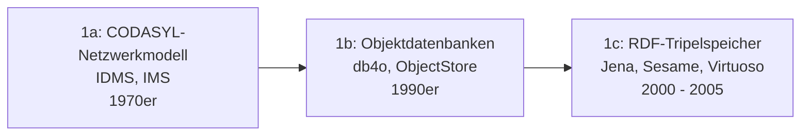
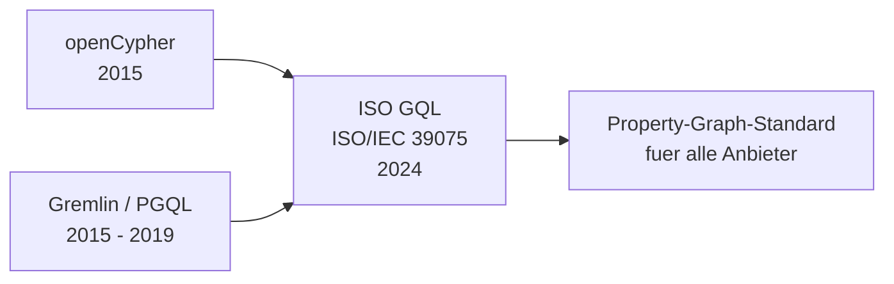

# Evolution und Architekturen digitaler Graphdatenbanken

Graphdatenbanken speichern Daten als **Knoten und Kanten** statt als Zeilen in Tabellen — Beziehungen sind erststrangige Objekte mit eigenen Eigenschaften, nicht nachträglich per Join rekonstruiert. Diese Zeitachse ordnet die wichtigsten Architektur-Generationen chronologisch ein: von den navigierenden Vorläufern und RDF-Tripelspeichern über die Property-Graph-Pioniere und das „Graphen im großen Maßstab"-Problem bis zur Query-Sprachen-Standardisierung (GQL) und dem Graph als Feature bestehender Datenbanken.

!!! note "Hinweis: Zwei Modellstränge, überlappende Generationen"
    Graphdatenbanken zerfallen in zwei Traditionen: den **RDF-/Tripel-Strang** (SPARQL, W3C-Standards, aus dem Semantic Web) und den **Property-Graph-Strang** (Cypher, Gremlin, aus der Anwendungsentwicklung). Beide laufen durch dieselbe Zeitachse. Die Zeiträume sind grobe Orientierung — Apache Jena (Generation 1) wird bis heute produktiv betrieben, parallel zu GraphRAG-Systemen der Generation 6.

---

## Generation 1: Navigierende Vorläufer & RDF-Tripelspeicher, 1970 – 2005

- **Navigierende Datenbanken (1970er):** Das CODASYL-Netzwerkmodell und hierarchische Systeme (IMS) verknüpften Datensätze über Zeiger — von der relationalen Welle verdrängt, weil das Schema starr an den Zugriffspfaden klebte.
- **RDF-Tripelspeicher (2000 – 2005):** **Apache Jena**, **Sesame** (heute RDF4J) und **Virtuoso** speichern Wissen als Subjekt-Prädikat-Objekt-Tripel und fragen es per SPARQL ab — die erste breit eingesetzte, standardisierte Graph-Technologie, getragen vom Semantic Web.

---

## Generation 2: Property-Graph-Pioniere & native Engines, 2007 – 2011

Der Durchbruch des Begriffs „Graphdatenbank": Knoten und Kanten tragen jetzt **Key-Value-Eigenschaften**, die Speicher-Engine ist auf Traversierung statt auf Tabellen-Scans optimiert.

| System | Jahr | Architektur & Lizenz |
|---|---|---|
| **Neo4j** | 2007 | Native Property-Graph-Engine, „index-free adjacency", Abfragesprache Cypher; GPL-3.0 (Community) / kommerziell |
| **OrientDB** | 2010 | Multi-Model (Graph + Dokument), Java; Apache-2.0 |
| **FlockDB** | 2010 | Von Twitter für den Social Graph, bewusst flach (keine tiefen Traversierungen); Apache-2.0 |
| **AllegroGraph** | 2004/2010 | RDF-Tripelspeicher mit Property-Graph-Erweiterung; proprietär |

**Neo4j** prägt die Kategorie: „index-free adjacency" bedeutet, dass jeder Knoten physische Zeiger auf seine Nachbarn hält — eine Kantentraversierung kostet konstante Zeit, unabhängig von der Datenbankgröße.

---

## Generation 3: Verteilte Graphen & das Partitionierungsproblem, 2011 – 2015

Graphen lassen sich schlecht über Rechner verteilen — jede Kante, die zwei Partitionen verbindet, wird zum Netzwerk-Aufruf:

- **Titan (2012):** Verteilte Graphdatenbank, die auf **Cassandra oder HBase** als Speicher-Backend aufsetzt — skaliert horizontal, erbt aber deren Betriebskomplexität.
- **Facebook TAO (2013):** Kein Produkt, sondern ein Aufsatz auf MySQL, der Facebooks Social Graph mit aggressivem Caching bedient — die Blaupause für „Graph-API über bestehender Datenbank".
- **Apache Giraph:** Pregel-artige Batch-Graph-Verarbeitung auf Hadoop — Analyse, keine transaktionale Datenbank.
- **Lehre:** Native Graph-Performance und horizontale Verteilung stehen im Konflikt; die meisten Systeme wählen eine Seite.

---

## Generation 4: Traversierungs-Standardisierung & Multi-Model, 2015 – 2019

| Entwicklung | System | Jahr |
|---|---|---|
| **Apache TinkerPop / Gremlin** als herstellerneutrale Traversierungssprache | JanusGraph, Neptune, Cosmos DB | ab 2015 |
| **openCypher** — Neo4j öffnet Cypher als offene Spezifikation | Neo4j, später AGE, Memgraph | 2015 |
| **JanusGraph** — Titan-Fork unter der Linux Foundation | (aus Titan) | 2017 |
| **Amazon Neptune** — verwalteter Dienst mit Gremlin + SPARQL | AWS | 2017 |
| **Dgraph** — verteilt, GraphQL-nativ, in Go | Dgraph Labs | 2016 |

Diese Generation trennt die **Abfragesprache** vom Produkt: Gremlin und openCypher werden zu Ökosystemen, gegen die mehrere Datenbanken antreten.

---

## Generation 5: Query-Sprachen-Konvergenz & Cloud-Managed, 2019 – 2023

- **Managed-Dienste:** Neo4j Aura, TigerGraph Cloud, Amazon Neptune — Betrieb als Produkt, kein Server-Management.
- **Neue Engines:** **Memgraph** (2017, In-Memory, C++, Cypher-kompatibel, Echtzeit), **NebulaGraph** (2019, verteilt, Apache-2.0).
- **GQL:** Die ISO standardisiert 2024 mit **ISO/IEC 39075 (GQL)** erstmals eine deklarative Graph-Abfragesprache — analog zu SQL:1986 für relationale Datenbanken.

---

## Generation 6: Graph als Feature & GraphRAG, 2023 – 2026

Wie bei Dokument- und Vektordatenbanken kehrt das Modell als **Datentyp einer bestehenden Datenbank** zurück:

| Entwicklung | Basis | Jahr |
|---|---|---|
| **Apache AGE** — openCypher als PostgreSQL-Erweiterung | PostgreSQL | 2020 (Apache-Inkubator 2022) |
| **DuckPGQ** — Property-Graph-Abfragen in DuckDB | DuckDB | 2024 |
| **SQL/PGQ** — Property-Graph-Syntax im SQL:2023-Standard | jede SQL-Datenbank | 2023 |
| **KùzuDB** — eingebettete, spaltenorientierte Graph-Engine | dateibasiert | 2022 |
| **Microsoft GraphRAG** — Wissensgraph als Retrieval-Schicht für LLMs | (Aufsatz) | 2024 |

**GraphRAG** gibt der Kategorie 2024/2025 neuen Schub: Statt nur Vektorähnlichkeit nutzen Retrieval-Systeme einen aus den Quelldokumenten extrahierten Wissensgraphen, um Beziehungen und Mehr-Hop-Fragen zu beantworten — siehe [Semantische & RAG-Wissenssysteme](../../dokumentation/semantische-rag-wissenssysteme-2026-topliste.md).

!!! tip "Bezug zu diesem Repository"
    Die aktuelle Werkzeuglandschaft vergleicht [Beste Graphdatenbanken 2026 (Top 15)](graphdatenbanken-2026-topliste.md), die konservativ gefilterte Fassung [Produktionsreife Graphdatenbanken nach Generation](produktionsreife-graphdatenbanken-generationen-2026-topliste.md).

---

## Alternative Sortier- & Klassifikationskriterien

### 1. Datenmodell

- **RDF / Tripel (SPARQL)** — Apache Jena, RDF4J, Virtuoso, GraphDB, Stardog.
- **Property-Graph (Cypher / GQL)** — Neo4j, Memgraph, Apache AGE, NebulaGraph.
- **Property-Graph (Gremlin / TinkerPop)** — JanusGraph, Amazon Neptune, Cosmos DB.

### 2. Betriebsarchitektur

- **Eingebettet** — KùzuDB, RDF4J (als Bibliothek).
- **Eigenständiger Server, eigener Speicher** — Neo4j, Memgraph, Apache Jena (Fuseki).
- **Verteilt mit eigenem Storage-Dienst** — NebulaGraph, Dgraph.
- **Aufsatz auf einem Pflicht-Backend** — JanusGraph (Cassandra/HBase/ScyllaDB + Suchindex).
- **Erweiterung einer bestehenden Datenbank** — Apache AGE (PostgreSQL), DuckPGQ (DuckDB).

### 3. Lizenzmodell

- **Permissiv / Foundation-getragen** — Apache AGE, JanusGraph, NebulaGraph, Apache Jena (alle Apache-2.0/ASF).
- **Copyleft (GPL)** — Neo4j Community Edition (GPL-3.0), Virtuoso Open-Source-Edition (GPL-2.0).
- **Source-available / nicht-OSI** — ArangoDB (BSL seit 2023), Memgraph (BSL).
- **Proprietär / Managed-only** — Amazon Neptune, Azure Cosmos DB, TigerGraph, Stardog, RDFox, Ontotext GraphDB.

---

## 🔗 Verwandte Themen

- [Beste Graphdatenbanken 2026 (Top 15)](graphdatenbanken-2026-topliste.md) — Momentaufnahme, die diese Chronologie in eine gerankte Topliste übersetzt
- [Produktionsreife Graphdatenbanken nach Generation (Top 2)](produktionsreife-graphdatenbanken-generationen-2026-topliste.md) — dasselbe Generationenmodell durch das konservative Fünf-Filter-Sieb
- [Evolution und Architekturen digitaler relationaler Datenbanken](evolution-digitaler-relationale-datenbanken.md) — Generation 6 dort (Postgres als Erweiterungs-Plattform) ist der Kontext, in dem Apache AGE entsteht
- [Evolution und Architekturen digitaler Dokumentdatenbanken](evolution-digitaler-dokumentdatenbanken.md) · [digitaler Vektordatenbanken](evolution-digitaler-vektordatenbanken.md) — dieselbe „Feature statt eigene Kategorie"-Bewegung
- [Beste semantische & RAG-Wissenssysteme 2026 (Top 20)](../../dokumentation/semantische-rag-wissenssysteme-2026-topliste.md) — GraphRAG-Kontext der Generation 6
- [Datenbanken & Big Data: Übersicht für KI-Anwendungen](index.md)
