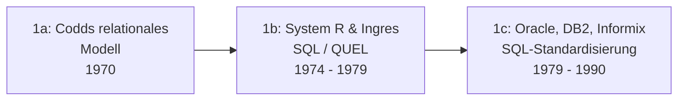

# Evolution und Architekturen digitaler relationaler Datenbanken

Relationale Datenbanken sind das älteste noch produktiv dominierende Software-Paradigma der Datenhaltung — seit über fünf Jahrzehnten das Standard-System of Record. Diese Zeitachse ordnet die wichtigsten Architektur-Generationen chronologisch ein: vom relationalen Modell und den ersten kommerziellen RDBMS über die Open-Source-LAMP-Ära und die MVCC-Reife bis zur NoSQL-Herausforderung, den verteilten NewSQL-Systemen und der heutigen Serverless- und Postgres-Plattform-Ära.

!!! note "Hinweis: Generationen überlappen sich"
    Die Zeiträume sind grobe Orientierung — PostgreSQL (Generation 2) wird bis heute aktiv weiterentwickelt und ist parallel zu jeder späteren Generation die meistgewählte Neuinstallation. Entscheidend ist die **Architektur** (Einzelknoten vs. verteilt, selbstbetrieben vs. serverless, Kern vs. Erweiterungs-Plattform), nicht allein das Erscheinungsjahr.

---

## Generation 1: Das relationale Modell & erste kommerzielle RDBMS, 1970 – 1990

- **Edgar F. Codd (1970):** „A Relational Model of Data for Large Shared Data Banks" — Daten als Mengen von Tupeln, Zugriff über eine deklarative Sprache statt über Zeiger und Navigation.
- **System R (IBM) & Ingres (UC Berkeley), 1974 – 1979:** die beiden ersten lauffähigen relationalen Prototypen — System R bringt **SQL** hervor, Ingres die Sprache QUEL und die Codebasis, aus der später PostgreSQL entsteht.
- **Oracle V2 (1979), DB2 (1983), Informix, Sybase:** die erste kommerzielle Welle; **SQL-86** und **SQL-92** standardisieren die Abfragesprache.
- **Gemeinsamkeit:** Einzelknoten-Architektur, ACID-Transaktionen, Sperren-basierte Nebenläufigkeit, proprietär und teuer.

---

## Generation 2: Open-Source-RDBMS & die LAMP-Ära, 1994 – 2005

Relationale Datenbanken werden kostenlos, quelloffen und zum Standard-Unterbau des Webs:

| System | Jahr | Herkunft & Lizenz |
|---|---|---|
| **MySQL** | 1995 | MySQL AB (Monty Widenius); GPL-2.0 + kommerziell — das „M" in LAMP |
| **PostgreSQL** | 1996 (Postgres95) | Fortführung des Berkeley-Ingres-Nachfolgers Postgres; permissive PostgreSQL-Lizenz |
| **SQLite** | 2000 | D. Richard Hipp; gemeinfrei — eine eingebettete Ein-Datei-Engine ohne Server |
| **Firebird** | 2000 | Quelloffene Abspaltung von Borland InterBase 6.0 |

Diese Generation etabliert das bis heute gültige Muster: eine relationale Datenbank ist eine Standardkomponente, keine Investitionsentscheidung.

---

## Generation 3: MVCC-Reife, Replikation & Enterprise-Scale, 2005 – 2012

Die Open-Source-Systeme schließen funktional zu den kommerziellen auf:

- **Multiversion Concurrency Control (MVCC):** Leser blockieren Schreiber nicht und umgekehrt — PostgreSQL und InnoDB (MySQL) machen es zum Standard.
- **Replikation:** PostgreSQL bekommt Streaming-Replikation (9.0, 2010), MySQL etabliert Primary-Replica-Setups breit.
- **SQL:2003 Window Functions**, Common Table Expressions, Tabellen-Partitionierung — analytische Abfragen ohne Zweitsystem.
- **MariaDB (2009):** Abspaltung von MySQL nach der Oracle-Übernahme, ab 2012 von der MariaDB Foundation getragen.

---

## Generation 4: Die NoSQL-Herausforderung & die relationale Antwort, 2009 – 2015

Dokument-, Key-Value- und Spaltendatenbanken (MongoDB, Cassandra, Redis) treten mit dem Versprechen horizontaler Skalierung und schemafreier Flexibilität an — „Polyglot Persistence" wird zum Schlagwort. Die relationale Welt antwortet, indem sie die Semi-Struktur **absorbiert**:

| Antwort | System | Jahr |
|---|---|---|
| **JSON-Datentyp** | PostgreSQL 9.2 | 2012 |
| **JSONB** (binär, indizierbar) | PostgreSQL 9.4 | 2014 |
| **JSON-Funktionen** | MySQL 5.7 | 2015 |
| **SQL:2016 JSON** | ISO-Standard | 2016 |

Das Ergebnis: Für die meisten Workloads erübrigt sich die separate Dokumentdatenbank — eine relationale Datenbank speichert strukturierte *und* halbstrukturierte Daten in derselben Transaktion.

---

## Generation 5: NewSQL & verteilte relationale Datenbanken, 2012 – 2020

Statt ACID für Skalierung aufzugeben, bauen diese Systeme **horizontale Skalierung in ein relationales, transaktionales Modell** ein — meist über einen verteilten Konsens-Algorithmus (Raft/Paxos) und automatisches Sharding:

| System | Jahr | Ansatz |
|---|---|---|
| **Google Spanner** (Paper) | 2012 | Global verteilte, extern konsistente Transaktionen über TrueTime — proprietär, GCP-only |
| **CockroachDB** | 2015 | Spanner-Idee als betreibbares System, PostgreSQL-Wire-kompatibel |
| **TiDB** (PingCAP) | 2016 | MySQL-kompatibel, getrennte SQL- (TiDB) und Speicherschicht (TiKV) plus Placement Driver |
| **YugabyteDB** | 2016 | PostgreSQL-kompatibel, DocDB-Speicherschicht auf RocksDB |
| **Vitess** | 2012 (Open Source) | MySQL-Sharding-Middleware — der Skalierungs-Unterbau von YouTube, später Slack und GitHub |

---

## Generation 6: Serverless, Cloud-native & die Postgres-Plattform-Ära, 2017 – 2026

Zwei parallele Entwicklungen prägen die Gegenwart:

**Trennung von Speicher und Rechenleistung:** Die Datenbank skaliert Compute unabhängig vom Storage, pausiert bei Inaktivität und rechnet nach Nutzung ab.

| System | Jahr | Basis |
|---|---|---|
| **Amazon Aurora** | 2014/2017 | verteilter Storage-Layer unter MySQL-/PostgreSQL-Kompatibilität — proprietär |
| **Neon** | 2021 (GA 2023) | serverloses PostgreSQL, Copy-on-Write-Branching; Apache-2.0 (2025 von Databricks übernommen) |
| **PlanetScale** | 2018 | serverloses MySQL auf Vitess, ab 2025 auch PostgreSQL — proprietärer Dienst |

**PostgreSQL wird zur Plattform:** Statt eine neue Datenbank zu bauen, erweitert man PostgreSQL — [pgvector](evolution-digitaler-vektordatenbanken.md) für Vektorsuche, TimescaleDB für Zeitreihen, PostGIS für Geodaten, Citus für Sharding. Parallel erlebt **SQLite** eine Renaissance im Server-Betrieb (Litestream, LiteFS, libSQL/Turso; SQLite als Standard in Rails 8).

!!! tip "Bezug zu diesem Repository"
    Die aktuelle Werkzeuglandschaft vergleicht [Beste relationale Datenbanken 2026 (Top 15)](relationale-datenbanken-2026-topliste.md), die konservativ gefilterte Fassung [Produktionsreife relationale Datenbanken nach Generation](produktionsreife-relationale-datenbanken-generationen-2026-topliste.md).

---

## Alternative Sortier- & Klassifikationskriterien

### 1. Betriebsarchitektur

- **Eingebettet / serverlos (In-Process)** — SQLite, DuckDB, libSQL.
- **Einzelknoten-Server** — PostgreSQL, MySQL, MariaDB, Firebird.
- **Verteilt (Shared-Nothing, Konsens-basiert)** — CockroachDB, TiDB, YugabyteDB, Spanner.
- **Storage-Compute-getrennt / serverless** — Aurora, Neon, PlanetScale.

### 2. Wire-Protokoll-Kompatibilität

- **PostgreSQL-kompatibel** — PostgreSQL, CockroachDB, YugabyteDB, Neon, Aurora PostgreSQL.
- **MySQL-kompatibel** — MySQL, MariaDB, TiDB, Vitess, Aurora MySQL, PlanetScale.
- **Eigenes Protokoll / eingebettet** — SQLite, DuckDB, Firebird.

### 3. Lizenzmodell

- **Permissiv / gemeinfrei** — PostgreSQL, SQLite.
- **Copyleft (GPL) mit kommerzieller Doppellizenz** — MySQL, MariaDB.
- **Source-available / nicht-OSI** — CockroachDB (seit 2019 BSL, seit 2024 CSL).
- **Proprietär / Managed-only** — Oracle, DB2, Spanner, Aurora, PlanetScale.

---

## 🔗 Verwandte Themen

- [Beste relationale Datenbanken 2026 (Top 15)](relationale-datenbanken-2026-topliste.md) — Momentaufnahme, die diese Chronologie in eine gerankte Topliste übersetzt
- [Produktionsreife relationale Datenbanken nach Generation (Top 4)](produktionsreife-relationale-datenbanken-generationen-2026-topliste.md) — dasselbe Generationenmodell durch das konservative Fünf-Filter-Sieb
- [Evolution und Architekturen digitaler Vektordatenbanken](evolution-digitaler-vektordatenbanken.md) — Generation 5 dort (pgvector) ist Generation 6 dieses Artikels aus Datenbanksicht
- [PostgreSQL + pgvector: Praktische Anleitung](pgvector-anleitung.md)
- [PostgreSQL DBA Praxis-Handbuch](../../../entwicklung/infrastruktur/postgresql-dba-praxis.md)
- [Datenbanken & Big Data: Übersicht für KI-Anwendungen](index.md)
