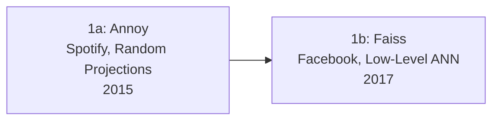
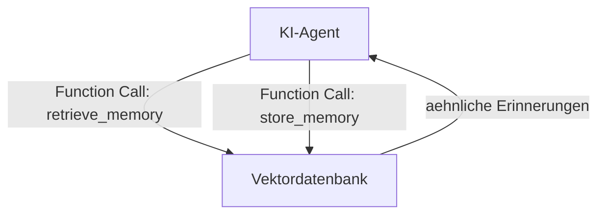

# Evolution und Architekturen digitaler Vektordatenbanken

Vektordatenbanken sind aus einer Nischen-Bibliothek für Ähnlichkeitssuche zur zentralen Infrastrukturkomponente für RAG-Systeme und KI-Agenten geworden. Diese Zeitachse ordnet die wichtigsten Architektur-Generationen chronologisch ein — von reinen In-Process-Bibliotheken über eigenständige Datenbank-Server bis zur Vektorsuche als Feature bestehender Systeme.

!!! note "Hinweis: Generationen überlappen sich"
    Die Zeiträume sind grobe Orientierung — Faiss (Generation 1) wird bis heute produktiv als Low-Level-Baustein eingesetzt, parallel zu vollwertigen Datenbanken der Generation 5. Entscheidend ist die **Architektur** (Bibliothek vs. Server, eigenständig vs. Erweiterung), nicht allein das Erscheinungsjahr.

---

## Generation 1: Reine ANN-Bibliotheken ohne Server, 2015 – 2017

- **Annoy (2015):** Von Spotify für Musikempfehlungen entwickelt, nutzt Random-Projection-Bäume für Approximate Nearest Neighbor (ANN) Suche — reine In-Process-Bibliothek ohne eigenen Server.
- **Faiss (2017):** Facebooks Low-Level-Bibliothek für Vektorsuche in großem Maßstab, unterstützt IVF-, LSH- und Product-Quantization-Indizes. Bis heute die technische Grundlage vieler späterer Datenbanken.
- **Gemeinsamkeit:** Beide bieten keine Persistenz, keine Netzwerk-API und kein Multi-Tenancy — die Integration erfolgt direkt im Anwendungsprozess.

---

## Generation 2: Erste eigenständige Vektordatenbank-Server, 2019

| System | Jahr | Besonderheit |
|---|---|---|
| **Milvus** | 2019 | Erste als CNCF-Projekt eingereichte, eigenständige Vektordatenbank mit Server-Architektur, REST/gRPC-API und verteilter Skalierung. |
| **Weaviate** | 2019 | Kombiniert Vektorsuche mit einem GraphQL-Interface und integrierten NLP-Modulen zur automatischen Embedding-Generierung. |

Beide Systeme übertragen das Datenbank-Konzept — Persistenz, Netzwerk-API, Multi-Tenancy — erstmals vollständig auf Vektorsuche, statt sie als Bibliothek einer Anwendung beizulegen.

---

## Generation 3: Managed Cloud-Vektorsuche, 2019 – 2022

**Pinecone** (2019 gegründet, breiter Durchbruch ab 2022 mit dem RAG-Boom) etabliert das Konzept der **vollständig verwalteten** Vektordatenbank: kein Server-Betrieb, keine Index-Konfiguration, Abrechnung nach Nutzung. Der Zeitpunkt fällt mit der Popularisierung von Retrieval-Augmented Generation (RAG) für LLMs zusammen — Pinecone wird zum Referenz-Backend zahlreicher früher RAG-Tutorials.

---

## Generation 4: Rust-basierte Performance-Welle, 2021

**Qdrant** (2021) tritt mit einer vollständig in Rust geschriebenen Engine an und positioniert sich über Laufzeit-Performance statt Funktionsumfang — 10–25 % schnellere Antwortzeiten als vergleichbare Systeme bei typischen Workloads, bei gleichzeitig großzügigem kostenlosem Kontingent im Vergleich zu Pinecone.

---

## Generation 5: Vektorsuche als Erweiterung bestehender Datenbanken, 2021 – 2023

Statt eine weitere eigenständige Datenbank zu betreiben, integrieren etablierte Systeme Vektorsuche als **zusätzlichen Datentyp**:

| Erweiterung | Basis-System | Jahr |
|---|---|---|
| **pgvector** | PostgreSQL | 2021 |
| **Redis Vector Search** | Redis | 2022 |
| **Elasticsearch/OpenSearch Vector Fields** | Elasticsearch/OpenSearch | 2022 |
| **MongoDB Atlas Vector Search** | MongoDB | 2023 |

!!! tip "Warum dieser Ansatz für viele Projekte gewinnt"
    Bei Workloads unter wenigen Millionen Vektoren gilt pgvector inzwischen als Standardwahl für RAG-Systeme: Embeddings, Dokumente und Metadaten liegen in derselben Datenbank und lassen sich mit gewöhnlichen SQL-Joins kombinieren — siehe die [praktische pgvector-Anleitung](pgvector-anleitung.md).

---

## Generation 6: Hybrid- und Multi-Vector-Suche, 2023 – 2025

Reine Vektor-Ähnlichkeit reicht für viele Suchanfragen nicht aus — diese Generation kombiniert sie mit klassischer Volltextsuche und mehreren Vektor-Repräsentationen pro Dokument:

- **Hybrid Search (Vektor + BM25):** Weaviate und andere Systeme kombinieren semantische Ähnlichkeit mit klassischem Keyword-Ranking.
- **Sparse Vectors (SPLADE):** Ergänzen dichte Embeddings um interpretierbare, spärlich besetzte Vektor-Repräsentationen.
- **Multi-Vector-Modelle (ColBERT):** Repräsentieren ein Dokument durch mehrere Vektoren statt eines einzigen, für präzisere Relevanzbewertung.

---

## Generation 7: Vektordatenbanken als Agenten-Gedächtnis, 2025 – 2026

Mit der Verbreitung autonomer KI-Agenten übernehmen Vektordatenbanken eine neue Rolle: als **persistentes Langzeitgedächtnis**, das Agenten über einzelne Sitzungen hinweg per Function-Calling abfragen und aktualisieren.

---

## Alternative Sortier- & Klassifikationskriterien

### 1. Betriebsmodell
- **Eigenständiger Server** — Milvus, Weaviate, Qdrant.
- **Vollständig verwaltet (Managed)** — Pinecone, Vertex AI Vector Search, Azure AI Search.
- **Erweiterung einer bestehenden Datenbank** — pgvector, Redis, MongoDB Atlas.

### 2. Index-Algorithmus
- **HNSW** — der heute am weitesten verbreitete Standard-Index über fast alle Systeme hinweg.
- **IVF/Product Quantization** — speicher-effizienter bei sehr großen Datenmengen, Kompromiss bei Genauigkeit.
- **Sparse/Multi-Vector** — SPLADE, ColBERT, für Hybrid-Suche der Generation 6.

---

## 🔗 Verwandte Themen

- [Beste Vektordatenbanken 2026 (Top 15)](vektordatenbanken-2026-topliste.md) — Momentaufnahme, die diese Chronologie in eine gerankte Topliste übersetzt
- [Produktionsreife Open-Source-Vektordatenbanken nach Generation (Top 5)](produktionsreife-vektordatenbanken-generationen-2026-topliste.md) — dasselbe Generationenmodell durch ein konservatives Fünf-Filter-Sieb; hier prüft der Speicherfilter den Pflicht-Unterbau des Systems selbst
- [Evolution und Architekturen digitaler relationaler Datenbanken](evolution-digitaler-relationale-datenbanken.md) — Generation 6 dort (Postgres als Erweiterungs-Plattform) ist der Kontext, in dem pgvector als Generation-5-Antwort entsteht
- [PostgreSQL + pgvector: Praktische Anleitung](pgvector-anleitung.md)
- [Datenbanken & Big Data: Übersicht für KI-Anwendungen](index.md)
- [Lokales RAG & LLM-Serving](../../../künstliche-intelligenz/coding/lokales-rag-ollama.md)
- [MCP-Server-Topliste](../../../künstliche-intelligenz/coding/mcp-server-topliste.md)
