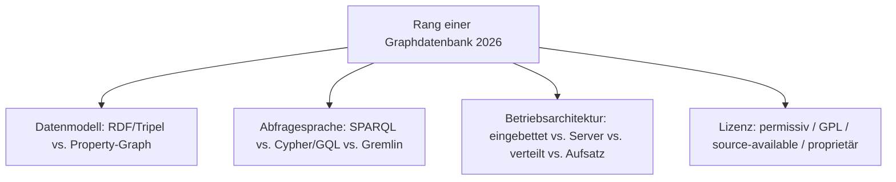
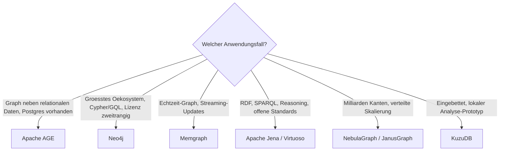

# Beste Graphdatenbanken 2026 — Top-15-Topliste

Die [Evolution und Architekturen digitaler Graphdatenbanken](evolution-digitaler-graphdatenbanken.md) ordnet diese Kategorie chronologisch — von RDF-Tripelspeichern über die Property-Graph-Pioniere und die verteilten Engines bis zur GQL-Standardisierung und dem Graph als Feature bestehender Systeme. Diese Seite übersetzt die Chronologie in eine **Momentaufnahme 2026**: 15 Systeme, mit denen Knoten-Kanten-Daten heute tatsächlich gespeichert und abgefragt werden.

---

## Bewertungskriterien

---

## Top 15 im Überblick

| Rang | System | Generation | Modell | Lizenz | Besondere Stärke |
|---|---|---|---|---|---|
| 1 | **Neo4j** | 2 (Property-Graph-Pioniere) | Property-Graph | GPL-3.0 (Community) / kommerziell | Marktführer, Referenz für Cypher/GQL, größtes Ökosystem und Tooling |
| 2 | **Apache AGE** | 6 (Graph als Feature) | Property-Graph | Apache-2.0 | openCypher als PostgreSQL-Erweiterung — Graph und relationale Daten in einer Transaktion |
| 3 | **Amazon Neptune** | 4 (Standardisierung & Multi-Model) | RDF + Property-Graph | proprietär (Managed) | Gremlin, SPARQL und openCypher auf einem verwalteten Kern; Neptune Analytics für Graph-Algorithmen |
| 4 | **Memgraph** | 5 (neue Engines) | Property-Graph | BSL (nicht OSI) | In-Memory, C++, Cypher-kompatibel — für Echtzeit-Graphen und Streaming |
| 5 | **ArangoDB** | 4 (Multi-Model) | Property-Graph + Dokument | BSL (nicht OSI) | Graph, Dokument und Key-Value in einer Engine mit einer Query-Sprache (AQL) |
| 6 | **TigerGraph** | 5 (Cloud-Managed) | Property-Graph | proprietär | Massiv paralleles Traversieren, eigene Sprache GSQL, tiefe Graph-Analytik |
| 7 | **JanusGraph** | 4 (Standardisierung) | Property-Graph (Gremlin) | Apache-2.0 | Verteilte Skalierung über Cassandra/HBase/ScyllaDB, Linux-Foundation-getragen |
| 8 | **NebulaGraph** | 5 (neue Engines) | Property-Graph | Apache-2.0 | Verteilte Shared-Nothing-Architektur, auf sehr große Graphen ausgelegt |
| 9 | **Dgraph** | 4 (Standardisierung) | Property-Graph (GraphQL) | Apache-2.0 | GraphQL-nativ, verteilt, in Go geschrieben |
| 10 | **Apache Jena** (TDB2 / Fuseki) | 1 (RDF-Tripelspeicher) | RDF / SPARQL | Apache-2.0 | Dateibasierter Tripelspeicher plus SPARQL-Server, Apache-Software-Foundation-getragen |
| 11 | **Ontotext GraphDB** | 1 (RDF), modernisiert | RDF / SPARQL | proprietär (Free-Edition) | Ausgereifter RDF-Speicher mit Reasoning, im Kultur- und Verlagswesen verbreitet |
| 12 | **Stardog** | 4 (Multi-Model) | RDF + Property-Graph | proprietär | Wissensgraph-Plattform mit virtueller Graph-Föderation über bestehende Datenquellen |
| 13 | **Virtuoso** (Open-Source-Edition) | 1 (RDF), langlebig | RDF + SQL | GPL-2.0 / kommerziell | Trägt den DBpedia-SPARQL-Endpunkt; RDF und relationale Daten in einem Server |
| 14 | **Azure Cosmos DB** (Gremlin-API) | 4 (Standardisierung) | Property-Graph (Gremlin) | proprietär (Managed) | Global verteilt, Graph als eine von mehreren APIs auf einem Kern |
| 15 | **KùzuDB** | 6 (Graph als Feature) | Property-Graph (Cypher) | MIT | Eingebettete, spaltenorientierte Graph-Engine — „das DuckDB für Graphen" |

---

## Highlights im Detail

### Rang 1–2: Marktführer und PostgreSQL-nativer Herausforderer
**Neo4j** ist seit [Generation 2](evolution-digitaler-graphdatenbanken.md#generation-2-property-graph-pioniere-native-engines-2007-2011) der Referenzpunkt der Kategorie — die Community Edition steht unter GPL-3.0, Clustering und Hot-Backup sind der Enterprise Edition vorbehalten. **Apache AGE** bringt openCypher direkt in PostgreSQL: für Projekte, die ohnehin Postgres betreiben und nur moderate Graph-Tiefe brauchen, entfällt damit ein ganzes Zweitsystem.

### Rang 4–5: die Lizenz-Zäsur der Kategorie
**Memgraph** (BSL) und **ArangoDB** (BSL seit 2023) haben ihre Community-Lizenzen auf ein source-available-Modell umgestellt — quelloffen einsehbar, aber ohne uneingeschränkten freien Produktionseinsatz. Für den strikten Open-Source-Bedarf bleiben in dieser Leistungsklasse vor allem Neo4j CE, NebulaGraph und Apache AGE.

### Rang 7: verteilte Skalierung um den Preis eines Pflicht-Backends
**JanusGraph** skaliert auf Milliarden Kanten — verlangt dafür aber Cassandra, HBase oder ScyllaDB als Speicher plus einen Suchindex (Elasticsearch/Solr). Dieselbe „mächtig, aber nie allein betreibbar"-Eigenschaft wie Milvus bei den Vektordatenbanken.

### Rang 10, 13: der RDF-Strang lebt
**Apache Jena** und **Virtuoso** tragen seit über zwei Jahrzehnten produktive SPARQL-Endpunkte (Virtuoso u. a. den von DBpedia) — der RDF-Strang ist die stabilste, aber am wenigsten beworbene Hälfte der Kategorie.

---

## Entscheidungshilfe nach Anwendungsfall

!!! tip "Bereits vertieft in diesem Wiki"
    Für den PostgreSQL-Betrieb — auch als Graph-Speicher über Apache AGE — existiert das [PostgreSQL DBA Praxis-Handbuch](../../../entwicklung/infrastruktur/postgresql-dba-praxis.md).

---

## 🔗 Verwandte Themen

- [Startseite](../../../index.md) — zurück zur Dokumentations-Zentrale
- [Evolution und Architekturen digitaler Graphdatenbanken](evolution-digitaler-graphdatenbanken.md) — chronologisches Generationenmodell, dessen aktuellen Stand diese Topliste zusammenfasst
- [Produktionsreife Graphdatenbanken nach Generation (Top 2)](produktionsreife-graphdatenbanken-generationen-2026-topliste.md) — dieselbe Chronologie durch das konservative Fünf-Filter-Sieb: Neo4j und Apache AGE
- [Beste relationale Datenbanken 2026 (Top 15)](relationale-datenbanken-2026-topliste.md) — PostgreSQL als Basis von Apache AGE
- [Beste Vektordatenbanken 2026 (Top 15)](vektordatenbanken-2026-topliste.md) · [Beste Dokumentdatenbanken 2026 (Top 15)](dokumentdatenbanken-2026-topliste.md) — Schwester-Toplisten im selben Datenbereich
- [Beste semantische & RAG-Wissenssysteme 2026 (Top 20)](../../dokumentation/semantische-rag-wissenssysteme-2026-topliste.md) — Graphdatenbanken als GraphRAG-Retrieval-Schicht
- [Datenbanken & Big Data: Übersicht für KI-Anwendungen](index.md)
