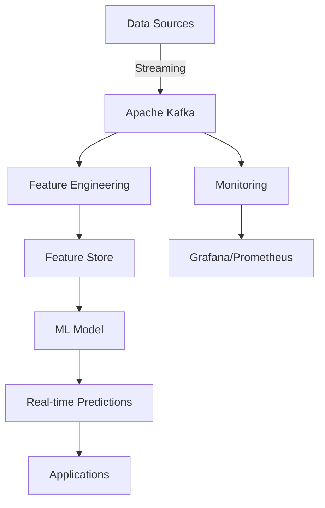

# Datenbanken & Big Data: Übersicht für KI-Anwendungen

Eine zentralisierte Übersicht über Datenbanken, Big-Data-Technologien und Datenpipelines speziell für künstliche Intelligenz, Machine Learning und datenintensive Anwendungen.

---

## 🗄️ Datenbank-Landschaft für KI

Moderne KI-Anwendungen benötigen spezielle Datenbanklösungen für verschiedene Anforderungen: von der Speicherung von Vektoren für semantische Suche bis hin zu Echtzeit-Datenpipelines für Training und Inference.

### Datenbank-Kategorien im Überblick

| Kategorie | Beschreibung | Typische Anwendungen | Beispiele |
|-----------|--------------|---------------------|-----------|
| **Vektordatenbanken** | Speicherung und Abfrage von Vektoren (Embeddings) | Semantische Suche, RAG, Ähnlichkeitsvergleich | Milvus, Weaviate, Qdrant, Pinecone |
| **Zeitreihendatenbanken** | Optimiert für zeitliche Daten | IoT, Monitoring, Vorhersagen | InfluxDB, TimescaleDB, Prometheus |
| **Graphdatenbanken** | Speicherung von Beziehungen und Netzwerken | Wissensgraphen, Empfehlungssysteme | Neo4j, Amazon Neptune, Dgraph |
| **Dokumentendatenbanken** | Flexible JSON-Speicherung | Unstrukturierte Daten, Content | MongoDB, Elasticsearch, CouchDB |
| **Relationale Datenbanken** | Tabellenbasierte Speicherung | Strukturierte Daten, Transaktionen | PostgreSQL, MySQL, SQLite |
| **Key-Value Stores** | Einfache Schlüssel-Wert-Speicherung | Caching, Session-Speicherung | Redis, DynamoDB, etcd |
| **Columnar Stores** | Spaltenorientierte Speicherung | Analytische Abfragen, Data Warehousing | ClickHouse, Apache Cassandra |
| **Data Lakes** | Speicherung großer Mengen roher Daten | Big Data, Data Science | MinIO, Ceph, Hadoop HDFS |

---

## 📚 Hauptthemen

### 1. Vektordatenbanken (Vector Databases)

**Speicherung und effiziente Abfrage von hochdimensionalen Vektoren (Embeddings) für KI-Anwendungen.**

* **Anwendungsbereiche**:
  - Semantische Suche in großen Dokumentenbeständen
  - Retrieval-Augmented Generation (RAG) für LLMs
  - Ähnlichkeitsvergleich (Nearest Neighbor Search)
  - Empfehlungssysteme basierend auf Vektorähnlichkeit
  - Clusteranalyse und Anomalie-Erkennung

* **Schlüsselkonzepte**:
  - **Embeddings**: Vektordarstellungen von Text, Bildern, Audio
  - **ANN (Approximate Nearest Neighbor)**: Effiziente Suche in hochdimensionalen Räumen
  - **Index-Typen**: HNSW, IVF, LSH, PQ
  - **Vektordimension**: Typischerweise 384-4096 Dimensionen

* **Vektordatenbanken im Vergleich**:

| Datenbank | Open Source | Cloud-Hosted | Besonderheiten | ANN-Algorithmen | Skalierbarkeit |
|-----------|-------------|--------------|----------------|----------------|--------------|
| **Milvus** | ✅ | ✅ (Zilliz Cloud) | CNCF-Projekt, beliebt | HNSW, IVF, LSH | ⭐⭐⭐⭐⭐ |
| **Weaviate** | ✅ | ✅ (Weaviate Cloud) | Integrierte NLP-Module | HNSW, LSH | ⭐⭐⭐⭐ |
| **Qdrant** | ✅ | ✅ | Rust-basiert, schnell | HNSW, Product Quantization | ⭐⭐⭐⭐ |
| **Pinecone** | ❌ | ✅ | Managed Service | HNSW | ⭐⭐⭐⭐ |
| **Chroma** | ✅ | ❌ | Python-zentriert, einfach | HNSW | ⭐⭐⭐ |
| **Faiss** | ✅ | ❌ | Facebook, Low-Level | IVF, LSH, PQ | ⭐⭐⭐⭐ |
| **Annoy** | ✅ | ❌ | Spotify, für Musik-Empfehlungen | Random Projections | ⭐⭐⭐ |

---

### 2. Zeitreihendatenbanken (Time Series Databases)

**Optimiert für die Speicherung, Abfrage und Analyse von zeitlichen Daten.**

* **Anwendungsbereiche**:
  - IoT-Daten (Sensoren, Geräte)
  - Monitoring und Metriken
  - Finanzdaten (Kurse, Transaktionen)
  - Vorhersage und Predictive Maintenance
  - Echtzeit-Analyse

* **Schlüsselkonzepte**:
  - **Retention Policies**: Automatisches Löschen alter Daten
  - **Downsampling**: Aggregation für verschiedene Zeitintervalle
  - **Continuous Queries**: Echtzeit-Aggregation
  - **Time Partitioning**: effiziente Speicherung nach Zeit

* **Zeitreihendatenbanken im Vergleich**:

| Datenbank | Open Source | Cloud-Hosted | Besonderheiten | Abfragesprache |
|-----------|-------------|--------------|----------------|---------------|
| **InfluxDB** | ✅ | ✅ (InfluxDB Cloud) | Hochperformant, Flux-Sprache | Flux, SQL |
| **TimescaleDB** | ✅ | ✅ | PostgreSQL-Erweiterung | SQL |
| **Prometheus** | ✅ | ❌ | Monitoring, Alerting | PromQL |
| ** VictoriaMetrics** | ✅ | ✅ | Kompatibel mit Prometheus | PromQL, MetricsQL |
| **QuestDB** | ✅ | ✅ | SQL + Zeitreihen | SQL, InfluxDB Line Protocol |
| **Apache Druid** | ✅ | ❌ | Echtzeit-Analytik | SQL |

---

### 3. Graphdatenbanken

**Speicherung und Abfrage von stark vernetzten Daten als Graphen.**

* **Anwendungsbereiche**:
  - Wissensgraphen für KI-Systeme
  - Empfehlungssysteme (Social Graphs)
  - Betrugserkennung (Transaktionsnetzwerke)
  - Netzwerkanalyse (Soziale Netzwerke, IT-Infrastruktur)
  - Biowissenschaften (Protein-Interaktionen, Gen-Netzwerke)

* **Schlüsselkonzepte**:
  - **Knoten (Nodes)**: Entitäten im Graphen
  - **Kanten (Edges)**: Beziehungen zwischen Knoten
  - **Eigenschaften (Properties)**: Attribute von Knoten und Kanten
  - **Graph-Algorithmen**: Pfadsuche, Community Detection, PageRank

* **Graphdatenbanken im Vergleich**:

| Datenbank | Open Source | Cloud-Hosted | Abfragesprache | Besonderheiten |
|-----------|-------------|--------------|---------------|----------------|
| **Neo4j** | ✅ | ✅ (AuraDB) | Cypher | Markführer, beliebte API |
| **Amazon Neptune** | ❌ | ✅ | Gremlin, SPARQL, openCypher | AWS-integriert |
| **ArangoDB** | ✅ | ✅ | AQL | Multi-Model (Dokumente + Graph) |
| **Dgraph** | ✅ | ✅ | GraphQL+- | Distribuiert, skalierbar |
| **JanusGraph** | ✅ | ❌ | Gremlin | Apache TinkerPop |
| **TigerGraph** | ❌ | ✅ | GSQL | Parallel Graph Computing |

---

### 4. Relationale Datenbanken für KI

**Traditionelle SQL-Datenbanken mit KI-spezifischen Erweiterungen.**

* **Anwendungsbereiche**:
  - Strukturierte Daten für KI-Anwendungen
  - Feature Stores für ML-Modelle
  - Metadaten-Verwaltung
  - Transaktionsdaten für Empfehlungssysteme

* **KI-spezifische Erweiterungen**:

| Datenbank | KI-Erweiterung | Beschreibung |
|-----------|----------------|--------------|
| **PostgreSQL** | pgvector | Vektorspeicherung und ANN-Suche |
| **PostgreSQL** | pg_embedding | Embeddings für PostgreSQL |
| **PostgreSQL** | PostGIS | Räumliche Daten für Geodaten-KI |
| **MySQL** | MySQL Vector | Vektorspeicherung |
| **SQLite** | sqlite-vss | Vector Search Extension |

---

### 5. NoSQL-Datenbanken

**Flexible, schemafreie Datenbanken für unstrukturierte Daten.**

* **Dokumentendatenbanken**:
  - **MongoDB**: JSON-Dokumente, flexible Schemas
  - **Elasticsearch**: Volltextsuche + Vektorsuche (ab 8.11)
  - **CouchDB**: Master-Master Replikation
  - **Firebase Firestore**: Serverless, Echtzeit-Updates

* **Key-Value Stores**:
  - **Redis**: In-Memory, extrem schnell, mit RediSearch für Volltextsuche
  - **DynamoDB**: AWS-managed, skalierbar
  - **etcd**: Verteilte Konfiguration

* **Columnar Stores**:
  - **ClickHouse**: Analytische Abfragen, extrem schnell
  - **Apache Cassandra**: Hochverfügbar, verteilt
  - **ScyllaDB**: Cassandra-kompatibel, C++-basiert

---

### 6. Data Lakes & Objektspeicher

**Speicherung großer Mengen roher Daten für Data Science und KI-Training.**

* **Anwendungsbereiche**:
  - Training großer Sprachmodelle
  - Speicherung von Bild-, Audio-, Video-Datensätzen
  - Data Warehousing für Analytik
  - Backup und Archivierung

* **Data-Lake-Lösungen**:

| Lösung | Typ | Open Source | Cloud-Hosted | Besonderheiten |
|--------|-----|-------------|--------------|----------------|
| **MinIO** | Objektspeicher | ✅ | ❌ (Self-hosted) | S3-kompatibel |
| **Ceph** | Distribuierter Speicher | ✅ | ❌ | Block, Object, File |
| **Hadoop HDFS** | Dateisystem | ✅ | ❌ | Big Data Standard |
| **AWS S3** | Objektspeicher | ❌ | ✅ | Markführer |
| **Google Cloud Storage** | Objektspeicher | ❌ | ✅ | Hochintegriert mit GCP |
| **Azure Blob Storage** | Objektspeicher | ❌ | ✅ | Microsoft Ökosystem |
| **Apache Iceberg** | Table Format | ✅ | ❌ | ACID für Data Lakes |
| **Apache Delta Lake** | Table Format | ✅ | ❌ | Transaktionsfähigkeit |

---

### 7. ETL-Tools & Datenpipelines

**Tools für Extraktion, Transformation und Laden von Daten für KI-Anwendungen.**

* **ETL-Tools**:

| Tool | Typ | Open Source | Besonderheiten |
|------|-----|-------------|----------------|
| **Apache Airflow** | Workflow-Orchestrierung | ✅ | DAG-basiert, sehr beliebt |
| **Dagster** | Workflow-Orchestrierung | ✅ | Modern, type-safe |
| **Prefect** | Workflow-Orchestrierung | ✅ | Python-zentriert |
| **Luigi** | Workflow-Orchestrierung | ✅ | Spotify, einfach |
| **Apache NiFi** | Data Flow | ✅ | GUI-basiert, Visualisierung |
| **dbt (data build tool)** | Transformation | ✅ | SQL-basiert |

* **Datenpipeline-Frameworks**:

| Framework | Typ | Open Source | Besonderheiten |
|-----------|-----|-------------|----------------|
| **Apache Kafka** | Streaming | ✅ | Echtzeit-Datenpipelines |
| **Apache Spark** | Batch + Streaming | ✅ | Verteilte Verarbeitung |
| **Apache Flink** | Streaming | ✅ | Stateful Stream Processing |
| **Apache Beam** | Batch + Streaming | ✅ | Unified Batch/Stream |
| **Ray** | Verteilte Berechnung | ✅ | Python-zentriert, KI-Fokus |
| **Dask** | Parallel Computing | ✅ | Python, Pandas-kompatibel |

---

### 8. Datenpipelines & Streaming für KI

**Echtzeit-Datenverarbeitung für KI-Anwendungen.**

* **Streaming-Architekturen**:
  - **Kafka + Kafka Streams**: Echtzeit-Datenverarbeitung
  - **Kafka + Flink**: Komplexe Streaming-Jobs
  - **Kafka + Spark Streaming**: Batch + Streaming kombiniert
  - **Pulsar**: Multi-Tenancy, georepliziert

* **Anwendungsfälle für KI**:
  - **Feature Store Updates**: Echtzeit-Aktualisierung von Features für ML-Modelle
  - **Model Serving**: Streaming-Inference für Echtzeit-Vorhersagen
  - **Datenaufbereitung**: Preprocessing-Pipelines für Training
  - **Monitoring**: Echtzeit-Metriken für KI-Systeme

* **Beispiel-Architektur**:



---

### 9. Big Data Frameworks

**Frameworks für die Verarbeitung großer Datenmengen.**

* **Batch-Verarbeitung**:
  - **Apache Hadoop**: HDFS + MapReduce
  - **Apache Spark**: In-Memory, 100x schneller als Hadoop
  - **Apache Hive**: SQL für Hadoop
  - **Presto/Trino**: Distribuierte SQL-Query Engine

* **Streaming-Verarbeitung**:
  - **Apache Kafka Streams**: Lightweight Streaming
  - **Apache Flink**: Low-Latency Stream Processing
  - **Apache Spark Streaming**: Micro-Batch Processing

* **Data Warehousing**:
  - **Snowflake**: Cloud-native Data Warehouse
  - **Google BigQuery**: Serverless Analytics
  - **Amazon Redshift**: Cloud Data Warehouse
  - **ClickHouse**: Open-Source OLAP

---

## 🛠️ Praxisbeispiele

### Beispiel 1: RAG-System mit Vektordatenbank

**Anforderungen:**
- Speicherung von Dokument-Embeddings
- Schnelle semantische Suche
- Integration mit LLM

**Lösung mit Qdrant:**
```python
from qdrant_client import QdrantClient
from sentence_transformers import SentenceTransformer

# 1. Qdrant-Client verbinden
client = QdrantClient(host="localhost", port=6333)

# 2. Collection erstellen
client.create_collection(
    collection_name="documents",
    vectors_config={"size": 384, "distance": "Cosine"}
)

# 3. Embeddings generieren
model = SentenceTransformer('all-MiniLM-L6-v2')
embeddings = model.encode(documents)

# 4. Dokumente in Qdrant speichern
client.upsert(
    collection_name="documents",
    points=[
        {"id": i, "vector": embeddings[i], "payload": {"text": doc}}
        for i, doc in enumerate(documents)
    ]
)

# 5. Semantische Suche
query_embedding = model.encode([query])
results = client.search(
    collection_name="documents",
    query_vector=query_embedding[0],
    limit=5
)
```

**Empfohlene Datenbanken:** Qdrant, Milvus, Weaviate, Chroma

---

### Beispiel 2: Echtzeit-Monitoring mit TimescaleDB

**Anforderungen:**
- Speicherung von Metriken
- Echtzeit-Abfragen
- Aggregation über Zeit

**Lösung:**
```sql
-- 1. Hypertable erstellen
SELECT create_hypertable('metrics', 'time');

-- 2. Daten einfügen
INSERT INTO metrics (time, metric_name, value)
VALUES (now(), 'cpu_usage', 0.85);

-- 3. Echtzeit-Aggregation
SELECT 
    time_bucket('1 hour', time) as hour,
    metric_name,
    avg(value) as avg_value
FROM metrics
WHERE time > now() - interval '24 hours'
GROUP BY hour, metric_name
ORDER BY hour;
```

**Empfohlene Datenbanken:** TimescaleDB, InfluxDB, Prometheus

---

### Beispiel 3: Wissensgraph mit Neo4j

**Anforderungen:**
- Speicherung von Entitäten und Beziehungen
- Komplexe Graph-Abfragen
- Empfehlungen basierend auf Beziehungen

**Lösung:**
```cypher
// 1. Knoten und Beziehungen erstellen
CREATE (alice:Person {name: 'Alice', age: 30})
CREATE (bob:Person {name: 'Bob', age: 25})
CREATE (alice)-[:FRIENDS_WITH]->(bob)
CREATE (alice)-[:WORKS_AT]->(company:Company {name: 'Acme'})

// 2. Freunden von Alice finden
MATCH (alice:Person {name: 'Alice'})-[:FRIENDS_WITH]->(friend)
RETURN friend.name

// 3. Kurzesten Pfad finden
MATCH path = shortestPath(
    (a:Person {name: 'Alice'})-[*]->(b:Person {name: 'Charlie'})
)
RETURN path
```

**Empfohlene Datenbanken:** Neo4j, Dgraph, ArangoDB

---

### Beispiel 4: Data Pipeline mit Apache Airflow

**Anforderungen:**
- Automatisierte Datenpipeline
- Abhängigkeitsmanagement
- Fehlertoleranz

**Lösung (DAG-Datei):**
```python
from airflow import DAG
from airflow.operators.python import PythonOperator
from datetime import datetime

# 1. DAG definieren
dag = DAG(
    'data_pipeline',
    start_date=datetime(2026, 1, 1),
    schedule_interval='@daily'
)

# 2. Tasks definieren
def extract_data():
    # Daten extrahieren
    pass

def transform_data():
    # Daten transformieren
    pass

def load_data():
    # Daten laden
    pass

# 3. Tasks zum DAG hinzufügen
extract_task = PythonOperator(
    task_id='extract',
    python_callable=extract_data,
    dag=dag
)

transform_task = PythonOperator(
    task_id='transform',
    python_callable=transform_data,
    dag=dag
)

load_task = PythonOperator(
    task_id='load',
    python_callable=load_data,
    dag=dag
)

# 4. Abhängigkeiten definieren
extract_task >> transform_task >> load_task
```

**Empfohlene Tools:** Apache Airflow, Dagster, Prefect

---

## 🤖 KI-Agenten-Tauglichkeit

Empfehlung, welche Datenbanken sich am besten für Automatisierung durch KI-Agenten eignen:

| Datenbank | Kategorie | Eignung | Grund |
|-----------|----------|---------|-------|
| **Qdrant** | Vektordatenbank | ⭐⭐⭐⭐⭐ | REST API, einfache Integration, gute Dokumentation |
| **Milvus** | Vektordatenbank | ⭐⭐⭐⭐⭐ | Python SDK, beliebt, gut dokumentiert |
| **Weaviate** | Vektordatenbank | ⭐⭐⭐⭐⭐ | GraphQL API, integrierte NLP-Module |
| **Chroma** | Vektordatenbank | ⭐⭐⭐⭐ | Python-zentriert, einfach zu bedienen |
| **PostgreSQL + pgvector** | Relational + Vektoren | ⭐⭐⭐⭐⭐ | SQL + Vektorsuche, vertraut |
| **SQLite + sqlite-vss** | Embedded + Vektoren | ⭐⭐⭐⭐⭐ | Single-File, einfach, offline-fähig |
| **Redis** | Key-Value | ⭐⭐⭐⭐⭐ | Einfache Befehle, extrem schnell |
| **TimescaleDB** | Zeitreihen | ⭐⭐⭐⭐ | SQL-basiert, gut dokumentiert |
| **Neo4j** | Graphdatenbank | ⭐⭐⭐⭐ | Cypher-Abfragen, logisch strukturiert |
| **InfluxDB** | Zeitreihen | ⭐⭐⭐⭐ | Flux/InfluxQL, für Metriken optimiert |
| **Apache Kafka** | Streaming | ⭐⭐⭐⭐ | CLI-Tools, gut für Pipelines |
| **Apache Airflow** | Workflow | ⭐⭐⭐⭐⭐ | DAG-Definition in Python, sehr beliebt |
| **MongoDB** | Dokumentendatenbank | ⭐⭐⭐⭐ | JSON-basiert, flexible Schemas |

---

## 🔗 Verwandte Themen

* [KI-Modelle & Frameworks](../../../künstliche-intelligenz/index.md) – Modelle für KI-Anwendungen
* [KI/ML-Infrastrukturen](../../../entwicklung/infrastruktur/ki-ml-infrastrukturen.md) – Infrastruktur für KI-Systeme
* [Server-Software](../../../entwicklung/infrastruktur/software.md) – Server- und Datenbank-Konfiguration
* [Tools & Hilfswerkzeuge](../../tools/index.md) – Entwicklungs- und Analyse-Tools
* [Lokale KI-Frontends](../../../entwicklung/ide/lokale-ki-frontends.md) – Web-UIs für lokale KI
* [Datenerfassung](../datenerfassung/index.md) – Datenerfassungstools

---

## 📖 Weiterführende Ressourcen

### Offizielle Dokumentationen
- [Milvus Documentation](https://milvus.io/docs) – Vektordatenbank
- [Weaviate Documentation](https://weaviate.io/developers/weaviate) – Vektordatenbank
- [Qdrant Documentation](https://qdrant.tech/documentation/) – Vektordatenbank
- [Neo4j Documentation](https://neo4j.com/docs/) – Graphdatenbank
- [TimescaleDB Documentation](https://www.timescale.com/docs) – Zeitreihendatenbank
- [InfluxDB Documentation](https://docs.influxdata.com/) – Zeitreihendatenbank
- [PostgreSQL Documentation](https://www.postgresql.org/docs/) – Relationale Datenbank
- [MongoDB Documentation](https://www.mongodb.com/docs/) – Dokumentendatenbank
- [Apache Airflow Documentation](https://airflow.apache.org/docs/) – Workflow-Orchestrierung
- [Apache Kafka Documentation](https://kafka.apache.org/documentation/) – Streaming-Plattform

### Cloud-Datenbanken
- [AWS Database Services](https://aws.amazon.com/products/databases/) – Managed Database Services
- [Google Cloud Databases](https://cloud.google.com/products/databases) – Cloud-Datenbanken
- [Azure Database Services](https://azure.microsoft.com/en-us/products/category/databases/) – Microsoft Cloud-Datenbanken
- [Supabase](https://supabase.com/) – Open-Source Firebase Alternative
- [Planetscale](https://planetscale.com/) – Serverless MySQL

### Big Data Frameworks
- [Apache Spark Documentation](https://spark.apache.org/docs/latest/) – Verteilte Datenverarbeitung
- [Apache Hadoop Documentation](https://hadoop.apache.org/docs/) – Big Data Framework
- [Apache Kafka Documentation](https://kafka.apache.org/documentation/) – Streaming-Plattform
- [ClickHouse Documentation](https://clickhouse.com/docs/) – OLAP-Datenbank
- [Apache Iceberg](https://iceberg.apache.org/docs/) – Table Format für Data Lakes

### Communities & Blogs
- [r/Database](https://www.reddit.com/r/database/) – Datenbank-Diskussionen
- [r/bigdata](https://www.reddit.com/r/bigdata/) – Big Data Themen
- [r/vectordb](https://www.reddit.com/r/vectordb/) – Vektordatenbanken
- [r/dataengineering](https://www.reddit.com/r/dataengineering/) – Datenengineering
- [The Analytics Engineering Roundup](https://roundup.getdbt.com/) – Daten-Newsletter
- [Data Council](https://www.datacouncil.ai/) – Daten-Community

---

*Letzte Aktualisierung: Juli 2026*
