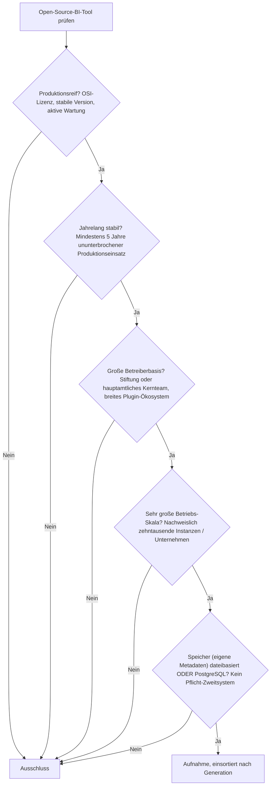
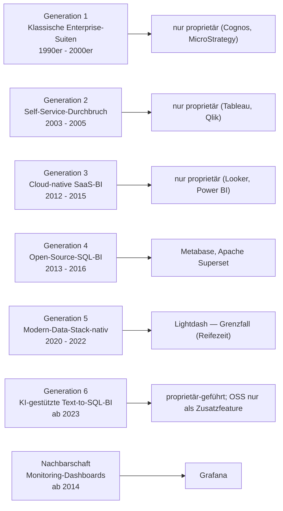

# Produktionsreife Open-Source-BI- & Analytics-Tools nach Generation — Reifegrad, Evaluation & Betriebs-Skala (Top 3)

Die [Evolution und Architekturen digitaler BI- & Analytics-Tools](evolution-digitaler-bi-analytics-tools.md) ordnet die Kategorie chronologisch in sechs Generationen — von IT-getriebenen Enterprise-Suiten über den Self-Service-Durchbruch, Cloud-native SaaS-BI, die Open-Source-SQL-Welle und Modern-Data-Stack-natives BI bis zu KI-gestützter Text-to-SQL-BI. Die [Topliste bester BI- & Analytics-Tools 2026](bi-analytics-tools-2026-topliste.md) rankt die gesamte Kategorie. Diese Seite kombiniert alle Achsen — parallel zur [Wissenssysteme-](../../dokumentation/produktionsreife-wissenssysteme-generationen-2026-topliste.md), [CMS-](../../dokumentation/produktionsreife-cms-generationen-2026-topliste.md) und [Static-Site-Generatoren-Schwesterseite](../../dokumentation/produktionsreife-static-site-generatoren-generationen-2026-topliste.md) — zu einem bewusst **konservativen** Fünf-Filter-Sieb: produktionsreif · jahrelang stabil · große Betreiberbasis · sehr große Betriebs-Skala · Speicher dateibasiert oder PostgreSQL. Sortiert nach Generation, nicht nach Rang.

!!! warning "Achtung: Nur drei Treffer — die Kategorie ist kommerziell dominiert"
    Genau drei Open-Source-Werkzeuge bestehen alle fünf Filter: **Metabase**, **Apache Superset** und **Grafana**. Fünf der sechs Generationen liefern **keinen einzigen** quelloffenen, reifen, breit betriebenen Vertreter — Tableau, Power BI, Looker, Qlik, ThoughtSpot und Domo sind sämtlich proprietär. Nur **Generation 4** (die bewusste „Open-Source-SQL-BI"-Welle) brachte Überlebende hervor, ergänzt um Grafana aus dem angrenzenden Monitoring-Bereich. Der Speicherfilter ist für alle drei ein sauberer Treffer — die Metadaten liegen in PostgreSQL oder SQLite ([Speicher-Fazit](#dateibasiert-oder-postgresql)). Die trennende Achse ist die **Lizenz**.

---

## Die fünf harten Filter

!!! note "Hinweis: Metadaten-Speicher, nicht Datenquelle"
    Bewertet wird, wo ein BI-Tool seinen **eigenen Zustand** ablegt (Dashboards, Fragen, Nutzer, Berechtigungen) — nicht, welche Data Warehouses es abfragt. Ein Cache wie Redis (Superset) zählt nicht als Speicher-Zweitsystem, solange die Wahrheit in PostgreSQL liegt und der Cache jederzeit verworfen werden kann. Reine SaaS-Produkte ohne selbst betreibbare Open-Source-Edition fallen an der Lizenz.

---

## Ergebnis: drei Werkzeuge über eine Generation (plus Monitoring-Nachbarschaft)

---

## Systeme nach Generation

### Generation 4 — Open-Source-SQL-BI (2013 – 2016)

| # | System | Sprache | Speicher (Metadaten) | Lizenz | Seit | Skala-Nachweis |
|---|---|---|---|---|---|---|
| 1 | **Metabase** | Clojure/React | **PostgreSQL** (auch MySQL; H2 nur zum Testen) | AGPL-3.0 (Open Core) | 2015 | Metabase Inc.; zehntausende Self-Hosting-Instanzen, „Question"-Interface ohne SQL |
| 2 | **Apache Superset** | Python/React | **PostgreSQL** (auch MySQL, SQLite); Redis nur als Cache/Queue | Apache-2.0 | 2016 | Apache-Software-Foundation (aus Airbnb); leistungsstärkste Open-Source-Option für große SQL-Workloads |

**Metabase** ist der sauberste Treffer: über zehn Jahre alt, breite Betreiberbasis, Metadaten in PostgreSQL, kein Pflicht-Zweitsystem. **Apache Superset** ist ASF-Top-Level-Projekt; seine Metadaten liegen ebenfalls in PostgreSQL — Redis dient nur als Cache und asynchrone Query-Queue und kann jederzeit verworfen werden, ohne Zustand zu verlieren. **Redash** aus derselben Generation fällt heraus: Nach der Databricks-Übernahme 2020 verlangsamte sich die Entwicklung deutlich, und Redis ist dort Pflicht-Queue statt bloßer Cache.

### Monitoring-Nachbarschaft — Dashboards als angrenzende Kategorie (ab 2014)

| # | System | Sprache | Speicher (Metadaten) | Lizenz | Seit | Skala-Nachweis |
|---|---|---|---|---|---|---|
| 3 | **Grafana** | Go/TypeScript | dateibasiert (**SQLite**) **oder** PostgreSQL | AGPL-3.0 | 2014 | Grafana Labs; mit Abstand am weitesten verbreitetes Open-Source-Dashboard-Werkzeug überhaupt |

**Grafana** ist streng genommen ein Echtzeit-Monitoring-Werkzeug, kein klassisches Reporting-BI — aber das mit Abstand produktionsgehärteste quelloffene Dashboard-System, mit dem klarsten Speicherfilter-Treffer der Seite (SQLite-Datei oder PostgreSQL, nichts sonst). Es wird zunehmend auch für allgemeine Analytik eingesetzt und gehört als Grenzfall in diese Liste.

### Generation 1, 2, 3 & 6 — warum hier nichts steht

- **Generation 1–3**: **Cognos**, **MicroStrategy**, **Business Objects**, **Tableau**, **QlikView/Qlik Sense**, **Looker**, **Power BI**, **Sisense**, **Domo** — allesamt proprietär. Es gab in diesen Generationen nie einen quelloffenen Vertreter mit nennenswerter Betriebs-Skala.
- **Generation 5**: **Lightdash** (dbt-natives BI, 2021) erreicht 2026 gerade fünf Jahre und hat eine noch schmale Betreiberbasis — Grenzfall. **Looker Studio** und **Mode** sind proprietär bzw. kostenlos-aber-geschlossen.
- **Generation 6**: KI-gestützte Text-to-SQL-BI wird von **ThoughtSpot**, **Power BI Copilot** und **Looker mit Gemini** angeführt — alle proprietär. Open-Source-Tools (Metabase KI-Fragen) ziehen nur als *Zusatzfeature* nach, nicht als eigenständiges Produkt.

---

## Dateibasiert oder PostgreSQL?

Anders als bei Compilern oder Editoren *hat* ein BI-Tool einen echten Zustandsspeicher — und hier greift der Filter sauber:

- **Metabase** und **Apache Superset** legen ihre Metadaten (Dashboards, Fragen, Nutzer, Berechtigungen) in **PostgreSQL** ab. Kein Pflicht-Zweitsystem; Supersets Redis ist ein verwerfbarer Cache.
- **Grafana** nutzt eine eingebettete **SQLite-Datei** oder wahlweise PostgreSQL — der denkbar disziplinierteste Betrieb.
- Die abgefragten **Datenquellen** (Snowflake, BigQuery, ein Data Warehouse) sind davon getrennt und für den Filter irrelevant — sie sind nicht der Zustandsspeicher des BI-Tools.

Fazit: Alle drei Treffer bestehen den Speicherfilter mühelos. Die Kategorie scheitert nicht am Speicher, sondern an der **Open-Source-Lizenz** — fünf von sechs Generationen sind vollständig kommerziell.

!!! warning "Achtung: Momentaufnahme, Stand August 2026"
    **Lightdash** überschreitet 2026/2027 die Fünf-Jahres-Marke und wäre dann der erste Generation-5-Nachrücker. Sollte ein KI-natives Open-Source-BI-Tool breite Adoption erreichen, füllt sich Generation 6. Metabase und Superset sind die stabilen Konstanten.

---

## Was bewusst nicht auf dieser Liste steht

| System | Erfüllt nicht | Anmerkung |
|---|---|---|
| **Tableau, Power BI, Looker, Qlik, ThoughtSpot, Sisense, Domo, MicroStrategy** | Open-Source-Lizenz | Vollständig proprietäre Suiten — kein selbst betreibbarer OSS-Kern |
| **Redash** | Aktive Wartung / Speicher | Nach Databricks-Übernahme 2020 verlangsamt; Redis als Pflicht-Queue |
| **Lightdash** | Reifezeit | dbt-natives BI, erreicht 2026 gerade fünf Jahre; schmale Betreiberbasis |
| **Looker Studio** | Open-Source-Lizenz | Kostenlos, aber proprietär (Google) |
| **Mode Analytics** | Open-Source-Lizenz | Proprietär (2023 von ThoughtSpot übernommen) |
| **Power BI Copilot, Looker + Gemini** | Open-Source-Lizenz / Kategorie | KI-Features proprietärer Suiten, kein eigenständiges OSS-Produkt |

---

## 🔗 Verwandte Themen

- [Evolution und Architekturen digitaler BI- & Analytics-Tools](evolution-digitaler-bi-analytics-tools.md) — das sechsstufige Generationenmodell, nach dem diese Liste sortiert ist
- [Beste BI- & Analytics-Tools 2026 (Top 15)](bi-analytics-tools-2026-topliste.md) — breiteste Basis-Topliste inklusive proprietärer Suiten
- [Beste Vektordatenbanken 2026 (Top 15)](vektordatenbanken-2026-topliste.md) — verwandte Datenbank-Vertiefung im selben Bereich
- [Produktionsreife Open-Source-Vektordatenbanken nach Generation (Top 5)](produktionsreife-vektordatenbanken-generationen-2026-topliste.md) — Schwesterseite mit demselben Fünf-Filter-Sieb
- [Produktionsreife relationale Datenbanken nach Generation (Top 4)](produktionsreife-relationale-datenbanken-generationen-2026-topliste.md) — PostgreSQL/SQLite bestehen dort das Sieb; sie sind das Metadaten-Backend von Metabase und Superset
- [Produktionsreife Open-Source-Dokumentdatenbanken nach Generation (Top 2)](produktionsreife-dokumentdatenbanken-generationen-2026-topliste.md) — Schwesterseite im selben Datenbereich; dieselbe Lizenz-Achse siebt
- [Produktionsreife Open-Source-Editoren nach Generation (Top 3)](../../../entwicklung/system/produktionsreife-editoren-generationen-2026-topliste.md) — dasselbe Muster: die Lizenz-Achse siebt, nicht der Speicher
- [Datenbanken & Big Data: Übersicht für KI-Anwendungen](index.md)
