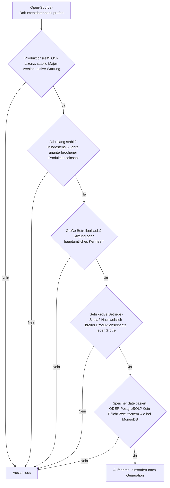
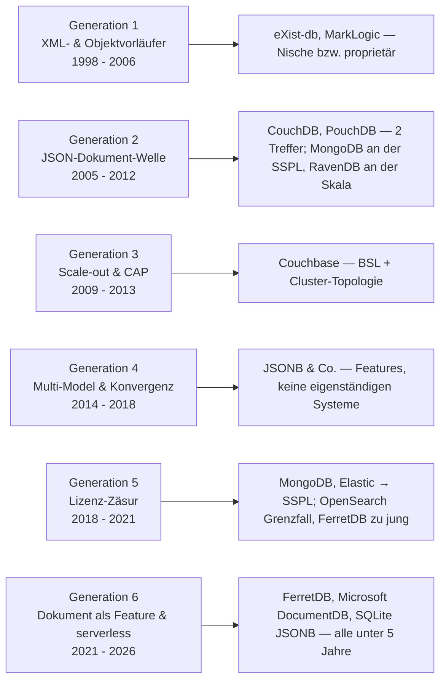
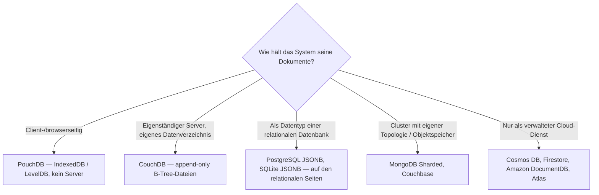

# Produktionsreife Open-Source-Dokumentdatenbanken nach Generation — Reifegrad, Lizenz & Betriebs-Skala (Top 2)

Die [Evolution und Architekturen digitaler Dokumentdatenbanken](evolution-digitaler-dokumentdatenbanken.md) ordnet die Kategorie chronologisch in sechs Generationen: XML- & objektorientierte Vorläufer (1), die JSON-Dokument-Welle (2), Scale-out & das CAP-Theorem in der Praxis (3), Multi-Model & Konvergenz (4), die große Lizenz-Zäsur (5), Dokument-Modell als Feature & serverless (6). Die [Topliste bester Dokumentdatenbanken 2026](dokumentdatenbanken-2026-topliste.md) rankt die gesamte Kategorie. Diese Seite legt das **konservative** Fünf-Filter-Sieb der Familie an — produktionsreif · jahrelang stabil · große Betreiberbasis · sehr große Betriebs-Skala · Speicher dateibasiert oder PostgreSQL ohne Pflicht-Zweitsystem — und sortiert nach Generation, nicht nach Rang.

!!! warning "Achtung: Zwei Treffer, beide aus Generation 2 — die Lizenz-Zäsur ist hier der schärfste Filter"
    Dokumentdatenbanken sind die Familien-Kategorie, in der der **Lizenzfilter** am meisten aussiebt: Der Marktführer **MongoDB** verließ 2018 mit der SSPL die Open-Source-Definition — er ist das wörtliche „wie MongoDB"-Gegenbeispiel, das dem fünften Filter seinen Namen gibt. **Couchbase** (BSL 2021) und **ArangoDB** (BSL 2023) folgten. Übrig bleiben **CouchDB** und **PouchDB** — beide Apache-2.0, beide aus der JSON-Dokument-Welle der Jahre 2005–2012, beide von der Apache Software Foundation bzw. ihrem Ökosystem getragen. Jede spätere Generation scheitert: Scale-out an der Lizenz, die Konvergenz-Generation liefert nur Features (PostgreSQL JSONB — siehe [Schwesterseite relationale Datenbanken](produktionsreife-relationale-datenbanken-generationen-2026-topliste.md)), die Serverless-Generation ist zu jung.

---

## Die fünf harten Filter

!!! note "Hinweis: OSI-Lizenz heißt von der Open Source Initiative anerkannt"
    Die **SSPL** (MongoDB, Elastic) und die **BSL** (Couchbase, ArangoDB) sind *source-available*, aber von der Open Source Initiative ausdrücklich **nicht** als Open-Source-Lizenzen anerkannt — sie beschränken den freien Produktionseinsatz. Der fünfte Filter fragt zusätzlich nach dem Betrieb: Legt die Datenbank ihre Dokumente in eigenen Dateien auf lokalem Datenträger ab (oder browser-/clientseitig), oder verlangt sie ein zwingend mitzubetreibendes zweites System?

---

## Ergebnis: zwei Systeme, beide aus Generation 2

---

## Systeme nach Generation

### Generation 2 — Die JSON-Dokument-Welle (2005 – 2012)

| # | System | Sprache | Speicher | Lizenz | Seit | Skala-Nachweis |
|---|---|---|---|---|---|---|
| 1 | **CouchDB** | Erlang | dateibasiert (append-only B-Tree, ein Datenverzeichnis) | Apache-2.0 | 2005 | Apache Software Foundation; offline-first-Referenz, Multi-Master-Replikation, breiter Einsatz in mobilen und dezentralen Systemen |
| 2 | **PouchDB** | JavaScript | client-/dateibasiert (IndexedDB im Browser, LevelDB in Node.js) | Apache-2.0 | 2012 | CouchDB-Ökosystem; eingebettet in unzählige offline-first-Anwendungen, synchronisiert per CouchDB-Replikationsprotokoll |

**CouchDB** besteht alle fünf Filter ohne Vorbehalt: Apache-2.0, von der Apache Software Foundation und nicht von einem einzelnen Unternehmen getragen, seit zwanzig Jahren im Produktionseinsatz, mit selbstenthaltendem, dateibasiertem Speicher — ein Prozess, ein Datenverzeichnis, kein Pflicht-Zweitsystem. Es ist die einzige große Dokumentdatenbank, die die Lizenz-Zäsur der [Generation 5](evolution-digitaler-dokumentdatenbanken.md#generation-5-die-lizenz-zasur-2018-2021) unberührt überstanden hat.

**PouchDB** ist die client-seitige Hälfte derselben Architektur: dieselbe Lizenz, dasselbe Replikationsprotokoll, dieselbe Konfliktauflösung, nur im Browser oder in Node.js statt auf dem Server. Die Entwicklungsgeschwindigkeit ist seit dem Rückzug des ursprünglichen Firmen-Sponsors ruhiger geworden, das Format und die API sind aber langjährig stabil und die Betreiberbasis über die offline-first-Community breit — vergleichbar mit der „ruhigen Pflege" von DokuWiki oder CLIPS in anderen Familienseiten.

**MongoDB** aus derselben Generation ist technisch überreif und in jeder Skala erprobt, wechselte aber im Oktober 2018 von AGPL auf die **SSPL** — nicht OSI-anerkannt, damit raus. **RavenDB** (2010) ist unter AGPL-3.0 quelloffen und reif genug, hat aber eine deutlich kleinere, auf das .NET-Ökosystem konzentrierte Betreiberbasis — Grenzfall an Filter 3 und 4.

### Generation 1, 3, 4, 5 & 6 — warum hier nichts steht

- **Generation 1 (XML- & Objektvorläufer)**: **eXist-db** (seit 2000, LGPL) ist quelloffen, eigenständig und langlebig, hat aber eine kleine, auf Digital-Humanities-Projekte konzentrierte Betreiberbasis — Skala-Grenzfall. **MarkLogic** ist proprietär. Die Objektdatenbanken (**db4o**, **Versant**) sind am Impedance-Mismatch gescheitert.
- **Generation 3 (Scale-out & CAP)**: **Couchbase** (2011) wechselte 2021 auf die **BSL** — kein freier Produktionseinsatz oberhalb definierter Grenzen — und verlangt in der Skalierungsstufe eine mehrknotige Cluster-Topologie. Doppelter Ausschluss (Lizenz + Betrieb), dieselbe Konstellation wie CockroachDB auf der [relationalen Schwesterseite](produktionsreife-relationale-datenbanken-generationen-2026-topliste.md).
- **Generation 4 (Multi-Model & Konvergenz)**: **PostgreSQL JSONB** (2014) besteht das Sieb mühelos — aber als Feature einer relationalen Datenbank, nicht als eigenständige Dokumentdatenbank; es ist auf der [relationalen Schwesterseite](produktionsreife-relationale-datenbanken-generationen-2026-topliste.md) geführt und für die meisten Dokument-Workloads die pragmatische Empfehlung. **ArangoDB** wechselte 2023 auf die BSL. **Azure Cosmos DB** ist proprietär und nur als Managed-Dienst verfügbar.
- **Generation 5 (Lizenz-Zäsur)**: der Namensgeber des Ausschlussgrundes — **MongoDB** und **Elasticsearch** unter SSPL. **OpenSearch** (Apache-2.0, seit 2024 unter der Linux Foundation) ist die quelloffene Gegenbewegung, erreicht als eigenständiger Fork 2021 aber erst 2026 die Fünf-Jahres-Marke und ist primär eine Such-Engine — Grenzfall, konsistent zur [Vektordatenbank-Seite](produktionsreife-vektordatenbanken-generationen-2026-topliste.md), wo OpenSearch k-NN als Generation-5-Treffer geführt wird. **FerretDB** (Apache-2.0) ist der aussichtsreichste künftige Kandidat, hatte sein 1.0 aber erst 2023.
- **Generation 6 (Dokument als Feature & serverless)**: **FerretDB**, **Microsoft DocumentDB** (2025) und **SQLite JSONB** (2024) sind alle unter fünf Jahre alt. Die Bewegung ist dieselbe wie bei den Vektordatenbanken — das Dokument-Modell kehrt als Datentyp von PostgreSQL und SQLite zurück, statt eine eigene Datenbank zu sein.

---

## Dateibasiert oder PostgreSQL?

- Die beiden Treffer sind entweder client-seitig (**PouchDB**) oder ein eigenständiger Server mit eigenem Datenverzeichnis (**CouchDB**) — kein externer Koordinator, kein separater Objektspeicher, kein Pflicht-Zweitsystem.
- Für Dokumente *neben* relationalen Daten ist **PostgreSQL JSONB** die Wahl mit der geringsten Betriebslast — ein System, ein Backup, ein Betriebswissen. Vertiefung: [PostgreSQL DBA Praxis-Handbuch](../../../entwicklung/infrastruktur/postgresql-dba-praxis.md).

!!! warning "Achtung: Momentaufnahme, Stand August 2026"
    **OpenSearch** überschreitet 2026 die Fünf-Jahres-Marke und rückt dann als Dokument-plus-Suche-Plattform nach. **FerretDB** wird nach seinem 1.0 (2023) etwa 2028 fünf Jahre stabil sein — es ist der aussichtsreichste künftige „MongoDB-API, aber quelloffen"-Kandidat. **CouchDB** ist die stabile Konstante — an seiner Position ändert sich absehbar nichts.

---

## Was bewusst nicht auf dieser Liste steht

| System | Erfüllt nicht | Anmerkung |
|---|---|---|
| **MongoDB** | Open-Source-Lizenz | Seit Oktober 2018 SSPL — nicht OSI; das wörtliche „wie MongoDB"-Beispiel des fünften Filters |
| **Couchbase** | Open-Source-Lizenz + Betrieb | BSL seit 2021; zusätzlich mehrknotige Cluster-Topologie in der Skalierungsstufe |
| **ArangoDB** | Open-Source-Lizenz | BSL seit 2023 |
| **Elasticsearch** | Open-Source-Lizenz | SSPL / Elastic License; AGPL-Option erst seit 2024 zurück — keine fünf Jahre |
| **OpenSearch** | Reifezeit | Apache-2.0, Linux Foundation — aber Fork erst 2021, primär Such-Engine; Generation-5-Grenzfall |
| **RavenDB** | Betreiberbasis / Skala | AGPL-3.0 und reif, aber kleine, .NET-zentrierte Basis |
| **FerretDB** | Reifezeit | Apache-2.0, MongoDB-Wire-Protokoll auf PostgreSQL — aber 1.0 erst 2023 |
| **PostgreSQL JSONB, SQLite JSONB** | Kategorie | Bestehen das Sieb — aber als Feature einer relationalen Datenbank, geführt auf den relationalen Seiten |
| **Azure Cosmos DB, Firestore, Amazon DocumentDB, MarkLogic** | Lizenz / Selbstbetrieb | Proprietäre bzw. Managed-only-Dienste |
| **eXist-db** | Betriebs-Skala | LGPL, eigenständig, langlebig — aber kleine, auf Digital Humanities konzentrierte Basis |
| **RethinkDB** | Aktive Wartung | Nach Firmen-Aus 2016 unter Apache-2.0 / Linux Foundation, aber im Ruhezustand |

---

## 🔗 Verwandte Themen

- [Evolution und Architekturen digitaler Dokumentdatenbanken](evolution-digitaler-dokumentdatenbanken.md) — das sechsstufige Generationenmodell, nach dem diese Liste sortiert ist
- [Beste Dokumentdatenbanken 2026 (Top 15)](dokumentdatenbanken-2026-topliste.md) — breiteste Basis-Topliste inklusive MongoDB, Managed-Dienste und Multi-Model-Systeme
- [Produktionsreife relationale Datenbanken nach Generation (Top 4)](produktionsreife-relationale-datenbanken-generationen-2026-topliste.md) — PostgreSQL JSONB als Dokumentspeicher besteht dort das Sieb
- [Produktionsreife Open-Source-Vektordatenbanken nach Generation (Top 5)](produktionsreife-vektordatenbanken-generationen-2026-topliste.md) — dieselbe „Feature statt eigene Kategorie"-Bewegung und dieselbe Lizenz-Achse
- [Produktionsreife Open-Source-Graphdatenbanken nach Generation (Top 2)](produktionsreife-graphdatenbanken-generationen-2026-topliste.md) — Schwesterseite; auch dort bleiben nur zwei Treffer (Neo4j CE, Apache AGE)
- [Produktionsreife Open-Source-BI- & Analytics-Tools nach Generation (Top 3)](produktionsreife-bi-analytics-tools-generationen-2026-topliste.md) — Schwesterseite im selben Datenbereich; auch dort siebt die Lizenz, nicht der Speicher
- [PostgreSQL DBA Praxis-Handbuch](../../../entwicklung/infrastruktur/postgresql-dba-praxis.md) · [PostgreSQL + pgvector](pgvector-anleitung.md)
- [Datenbanken & Big Data: Übersicht für KI-Anwendungen](index.md)
