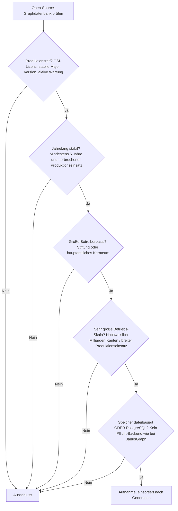
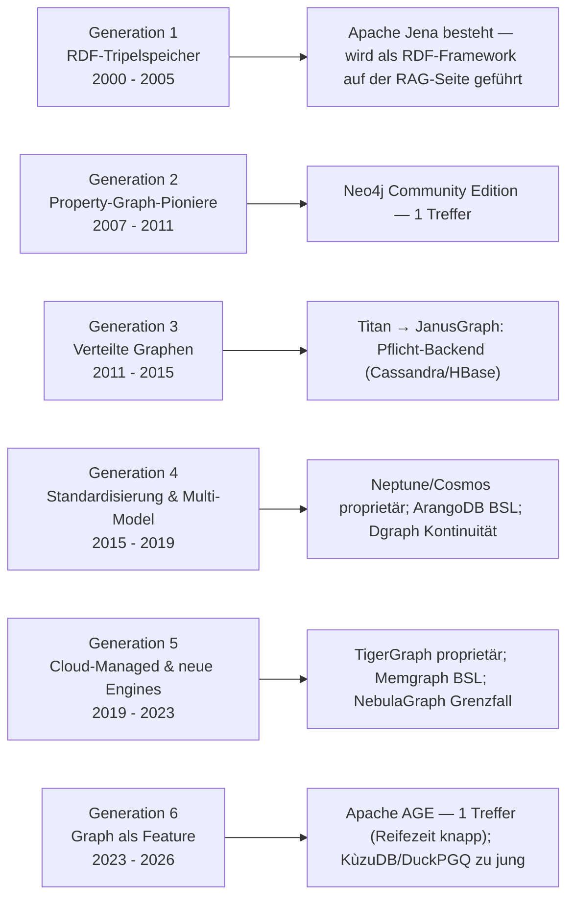
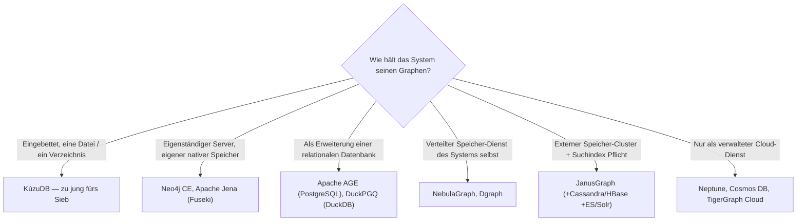

# Produktionsreife Open-Source-Graphdatenbanken nach Generation — Reifegrad, Lizenz & Betriebs-Skala (Top 2)

Die [Evolution und Architekturen digitaler Graphdatenbanken](evolution-digitaler-graphdatenbanken.md) ordnet die Kategorie chronologisch in sechs Generationen: navigierende Vorläufer & RDF-Tripelspeicher (1), Property-Graph-Pioniere & native Engines (2), verteilte Graphen & das Partitionierungsproblem (3), Traversierungs-Standardisierung & Multi-Model (4), Query-Sprachen-Konvergenz & Cloud-Managed (5), Graph als Feature & GraphRAG (6). Die [Topliste bester Graphdatenbanken 2026](graphdatenbanken-2026-topliste.md) rankt die gesamte Kategorie. Diese Seite legt das **konservative** Fünf-Filter-Sieb der Familie an — produktionsreif · jahrelang stabil · große Betreiberbasis · sehr große Betriebs-Skala · Speicher dateibasiert oder PostgreSQL ohne Pflicht-Zweitsystem — und sortiert nach Generation, nicht nach Rang.

!!! warning "Achtung: Zwei Treffer — und die Kategorie ist von Lizenzwechseln und Managed-only-Diensten geprägt"
    Graphdatenbanken sind die Familien-Kategorie mit der **dünnsten Open-Source-Mitte**: Die schnellen neuen Engines sind source-available (**Memgraph** BSL, **ArangoDB** BSL seit 2023), die skalierenden Klassiker verlangen ein Pflicht-Backend (**JanusGraph** braucht Cassandra/HBase + Suchindex), und der Rest ist proprietär bzw. Managed-only (**Neptune**, **TigerGraph**, **Cosmos DB**, **Stardog**). Übrig bleiben **Neo4j Community Edition** (GPL-3.0, seit 2007) und **Apache AGE** (Apache-2.0, openCypher in PostgreSQL). Nur Neo4j besteht ohne Vorbehalt; Apache AGE ist der PostgreSQL-native Nachrücker mit noch knapper Reifezeit.

---

## Die fünf harten Filter

!!! note "Hinweis: Der Speicherfilter prüft das Pflicht-Backend des Systems selbst"
    Bei einer Graphdatenbank *ist* das System die Datenhaltung — die Familien-Frage „dateibasiert oder PostgreSQL, kein Pflicht-Zweitsystem" wird deshalb umgedeutet (wie bei den [Vektordatenbanken](produktionsreife-vektordatenbanken-generationen-2026-topliste.md)): Läuft die Datenbank als eigenständiger Prozess bzw. eingebettet, oder verlangt sie einen externen Speicher-Cluster (Cassandra, HBase) und einen separaten Suchindex als Betriebsvoraussetzung?

---

## Ergebnis: zwei Treffer über zwei Generationen

---

## Systeme nach Generation

### Generation 2 — Property-Graph-Pioniere & native Engines (2007 – 2011)

| # | System | Speicher | Lizenz | Seit | Skala-Nachweis |
|---|---|---|---|---|---|
| 1 | **Neo4j Community Edition** | eigener nativer Graph-Speicher (Store-Dateien), keine externen Abhängigkeiten | GPL-3.0 | 2007 | Referenzsystem der Kategorie; Einzelinstanzen mit mehreren Milliarden Knoten und Kanten, sehr breiter Produktionseinsatz |

**Neo4j** besteht alle fünf Filter — mit einem Governance-Vorbehalt: Die **Community Edition** (GPL-3.0) enthält die vollständige Engine und Cypher/GQL, aber **Clustering, Hot-Backup und rollenbasierte Rechte sind der kommerziellen Enterprise Edition vorbehalten**. Für horizontale Hochverfügbarkeit ist die CE also nicht die richtige Wahl; die Engine selbst ist auf Einzelknoten-Ebene in jeder relevanten Skala erprobt, und Neo4j Inc. trägt sie mit einem großen hauptamtlichen Team. Dieselbe „offener Kern, kommerzielle Skalierung"-Konstellation wie bei MySQL (Oracle) auf der [relationalen Schwesterseite](produktionsreife-relationale-datenbanken-generationen-2026-topliste.md).

### Generation 6 — Graph als Feature & GraphRAG (2023 – 2026)

| # | System | Speicher | Lizenz | Seit | Skala-Nachweis |
|---|---|---|---|---|---|
| 2 | **Apache AGE** | **PostgreSQL** (Graph als Erweiterung) | Apache-2.0 | 2020 (Apache-Inkubator 2022) | Erbt die PostgreSQL-Betriebs- und Backup-Skala; von Managed-PostgreSQL-Anbietern zunehmend unterstützt |

**Apache AGE** ist der kanonische Speicherfilter-Treffer: openCypher-Abfragen laufen direkt in PostgreSQL, Graph- und Tabellendaten liegen in *einer* Datenbank, ein Backup deckt alles ab. Der Vorbehalt ist die **Reifezeit** — AGE begann 2020, wurde 2022 Apache-Inkubator-Projekt und erreicht 2026 gerade die Fünf-Jahres-Marke; tiefe Mehr-Hop-Traversierungen sind zudem langsamer als bei einer nativen Engine wie Neo4j. Konsistente Einordnung wie OpenSearch auf der [Vektordatenbank-Seite](produktionsreife-vektordatenbanken-generationen-2026-topliste.md): knapp aufgenommen, mit Nachrücker-Charakter.

### Generation 1, 3, 4 & 5 — warum hier (fast) nichts steht

- **Generation 1 (RDF-Tripelspeicher)**: **Apache Jena** (seit 2000, Apache-2.0, ASF) besteht das Sieb — dateibasierter TDB2-Speicher, langjährige SPARQL-Endpunkte im Millionen-Tripel-Bereich. Es wird aber als RDF-Framework auf der [Seite Semantische & RAG-Wissenssysteme](../../dokumentation/produktionsreife-semantische-rag-wissenssysteme-generationen-2026-topliste.md) geführt (dieselbe Aufteilung wie PostgreSQL JSONB, das auf der relationalen Seite steht). **Virtuoso** (GPL-2.0-Edition) trägt seit über 20 Jahren den DBpedia-SPARQL-Endpunkt, hat aber eine sehr kleine, faktisch auf OpenLink Software beschränkte Betreiberbasis — Grenzfall an Filter 3. **Ontotext GraphDB** ist proprietär.
- **Generation 3 (verteilte Graphen)**: **Titan** und sein Nachfolger **JanusGraph** (Apache-2.0, Linux Foundation, seit 2017) bestehen Reifezeit, Betreiberbasis und Skala — mandatieren aber **Cassandra, HBase oder ScyllaDB als Speicher-Backend plus einen Suchindex** (Elasticsearch/Solr). Doppelter Pflicht-Unterbau, damit Ausschluss an Filter 5 — dieselbe Frage wie bei Milvus auf der Vektordatenbank-Seite.
- **Generation 4 (Standardisierung & Multi-Model)**: **Amazon Neptune** und **Azure Cosmos DB** sind proprietär und nur als Managed-Dienst verfügbar. **ArangoDB** wechselte 2023 auf die **BSL**. **Dgraph** (Apache-2.0, seit 2016) ist quelloffen und verteilt, hat aber nach dem Übergang von Dgraph Labs zu Hypermode (2023) eine unklare Kontinuität — Grenzfall.
- **Generation 5 (Cloud-Managed & neue Engines)**: **TigerGraph** ist proprietär. **Memgraph** steht unter der **BSL** und hält seinen Zustand primär im RAM (Datenträger nur als Persistenz-Log). **NebulaGraph** (Apache-2.0, seit 2019) skaliert verteilt, hat aber eine im Wesentlichen auf ein Unternehmen (vesoft) konzentrierte Betreiberbasis und erreicht erst 2026 die Fünf-Jahres-Marke — Grenzfall an Filter 2 und 3.

---

## Dateibasiert oder PostgreSQL?

- Die beiden Treffer sind entweder ein eigenständiger Server mit eigenem nativem Speicher (**Neo4j CE**) oder eine Erweiterung von PostgreSQL (**Apache AGE**) — kein externer Speicher-Cluster, kein separater Suchindex, kein Pflicht-Zweitsystem.
- Die verteilten und die schnellen In-Memory-Systeme scheitern an Lizenz, Betreiberbasis oder Pflicht-Backend, nicht am Graph-Modell selbst.

Vertiefung: [PostgreSQL DBA Praxis-Handbuch](../../../entwicklung/infrastruktur/postgresql-dba-praxis.md).

!!! warning "Achtung: Momentaufnahme, Stand August 2026"
    **Apache AGE** festigt seine Position mit jedem PostgreSQL-Major-Release. **NebulaGraph** könnte bei anhaltendem Skalenwachstum und breiterer Betreiberbasis nachrücken. **KùzuDB** ist der aussichtsreichste eingebettete „dateibasiert"-Kandidat, aber erst 2022 gestartet. **Neo4j CE** ist die stabile Konstante — an seiner Position ändert sich absehbar nichts.

---

## Was bewusst nicht auf dieser Liste steht

| System | Erfüllt nicht | Anmerkung |
|---|---|---|
| **Memgraph** | Open-Source-Lizenz + Speicher | BSL (nicht OSI); Zustand primär im RAM |
| **ArangoDB** | Open-Source-Lizenz | BSL seit 2023 |
| **JanusGraph** | Pflicht-Backend | Apache-2.0, Linux Foundation, sehr skalierbar — aber Cassandra/HBase + Suchindex obligatorisch |
| **NebulaGraph** | Betreiberbasis / Reifezeit | Apache-2.0, verteilt — aber Einzelunternehmen-Basis, erst 2019 gestartet; Grenzfall |
| **Dgraph** | Kontinuität | Apache-2.0, ~9 Jahre — aber Eigentümerwechsel zu Hypermode 2023, unklare Roadmap |
| **OrientDB** | Aktive Wartung | Apache-2.0, aber Entwicklungsaktivität nach der SAP-Übernahme stark zurückgegangen |
| **Virtuoso** | Betreiberbasis | GPL-2.0-Edition, DBpedia-Skala — aber faktisch nur OpenLink Software als Träger |
| **Apache Jena** | Kategorie | Besteht das Sieb — wird als RDF-Framework auf der Seite Semantische & RAG-Wissenssysteme geführt |
| **KùzuDB** | Reifezeit | MIT, eingebettet, dateibasiert — aber erst 2022 gestartet |
| **Amazon Neptune, Azure Cosmos DB, TigerGraph, Stardog, Ontotext GraphDB, RDFox** | Lizenz / Selbstbetrieb | Proprietäre bzw. Managed-only-Dienste |
| **TypeDB** (ehem. Grakn) | Open-Source-Lizenz | 2023 von AGPL auf eine nicht OSI-anerkannte Lizenz gewechselt |

---

## 🔗 Verwandte Themen

- [Evolution und Architekturen digitaler Graphdatenbanken](evolution-digitaler-graphdatenbanken.md) — das sechsstufige Generationenmodell, nach dem diese Liste sortiert ist
- [Beste Graphdatenbanken 2026 (Top 15)](graphdatenbanken-2026-topliste.md) — breiteste Basis-Topliste inklusive RDF-Speicher, verteilter Engines und proprietärer Dienste
- [Produktionsreife relationale Datenbanken nach Generation (Top 4)](produktionsreife-relationale-datenbanken-generationen-2026-topliste.md) — PostgreSQL als Basis von Apache AGE; dieselbe Umdeutung des Speicherfilters
- [Produktionsreife Open-Source-Vektordatenbanken nach Generation (Top 5)](produktionsreife-vektordatenbanken-generationen-2026-topliste.md) · [Produktionsreife Open-Source-Dokumentdatenbanken nach Generation (Top 2)](produktionsreife-dokumentdatenbanken-generationen-2026-topliste.md) — Schwesterseiten mit demselben Fünf-Filter-Sieb; auch dort siebt die Lizenz-Achse
- [Produktionsreife Open-Source-semantische & RAG-Wissenssysteme nach Generation (Top 7)](../../dokumentation/produktionsreife-semantische-rag-wissenssysteme-generationen-2026-topliste.md) — führt Apache Jena als RDF-Treffer; GraphRAG-Kontext
- [PostgreSQL DBA Praxis-Handbuch](../../../entwicklung/infrastruktur/postgresql-dba-praxis.md) · [PostgreSQL + pgvector](pgvector-anleitung.md)
- [Datenbanken & Big Data: Übersicht für KI-Anwendungen](index.md)
