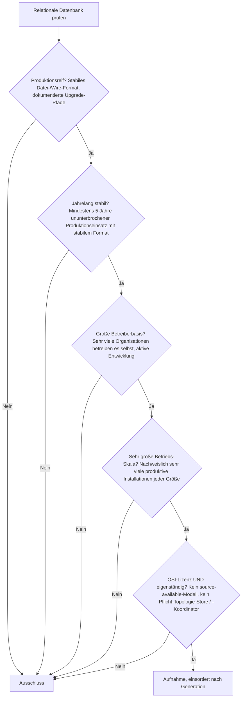
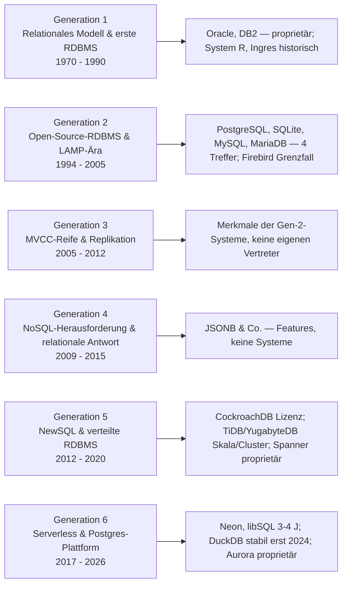
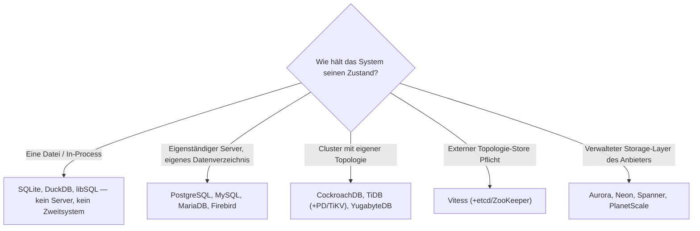

# Produktionsreife relationale Datenbanken nach Generation — Reifegrad, Lizenz & Betriebs-Skala (Top 4 — die überreifste Software-Kategorie überhaupt)

Die [Evolution und Architekturen digitaler relationaler Datenbanken](evolution-digitaler-relationale-datenbanken.md) ordnet die Kategorie chronologisch in sechs Generationen: das relationale Modell & erste kommerzielle RDBMS (1), Open-Source-RDBMS & die LAMP-Ära (2), MVCC-Reife, Replikation & Enterprise-Scale (3), die NoSQL-Herausforderung & die relationale Antwort (4), NewSQL & verteilte relationale Datenbanken (5), Serverless, Cloud-native & die Postgres-Plattform-Ära (6). Die [Topliste bester relationaler Datenbanken 2026](relationale-datenbanken-2026-topliste.md) rankt die gesamte Kategorie. Diese Seite legt das **konservative** Fünf-Filter-Sieb der Familie an — produktionsreif · jahrelang stabil · große Betreiberbasis · sehr große Betriebs-Skala · Speicher dateibasiert oder ohne Pflicht-Zweitsystem — und sortiert nach Generation.

!!! warning "Achtung: Vier Treffer, alle aus den 1990ern — und keine spätere Generation kommt hinzu"
    Relationale Datenbanken sind die **überreifste Software-Kategorie dieser gesamten Familie** — vergleichbar mit den [Interpreter-Werkzeugen](../../../entwicklung/system/produktionsreife-interpreter-werkzeuge-generationen-2026-topliste.md) und [Monolith-Frameworks](../../../entwicklung/webentwicklung/produktionsreife-monolith-frameworks-generationen-2026-topliste.md). Die vier Treffer — **PostgreSQL**, **SQLite**, **MySQL**, **MariaDB** — stammen alle aus **Generation 2** (1995–2000), sind zwischen 25 und 30 Jahre alt und in ihrer jeweiligen Nische ungeschlagen. Jede „Disruptions"-Welle danach ist entweder am Kern abgeprallt (die NoSQL-Antwort der Generation 4 machte relationale DBs *stärker*, nicht schwächer), zu jung (**Neon**, **libSQL** ~3–4 Jahre; **DuckDB** stabil erst seit 2024), oder trägt ein Lizenzproblem: **CockroachDB** wechselte 2019 auf BSL und 2024 auf eine nicht mehr OSI-anerkannte Lizenz — dieselbe „Lizenz-Drama"-Geschichte wie Redis, Terraform und MongoDB. Für relationale Datenbanken ist der Speicherfilter neu zu lesen: *Läuft das System eigenständig, oder mandatiert es einen Topologie-Store / Koordinator als Zweitsystem?*

---

## Die fünf harten Filter

!!! note "Hinweis: Der Speicherfilter prüft hier die Betriebsabhängigkeiten des Systems selbst"
    Bei einer relationalen Datenbank *ist* das System die Datenhaltung — die Familien-Frage „dateibasiert oder PostgreSQL, kein Pflicht-Zweitsystem" wird deshalb umgedeutet (wie bei den [Vektordatenbanken](produktionsreife-vektordatenbanken-generationen-2026-topliste.md)): Läuft die Datenbank als eigenständiger Prozess bzw. eingebettet, oder verlangt sie einen externen Koordinator (etcd, ZooKeeper), einen separaten Objektspeicher oder eine mehrteilige Cluster-Topologie als Betriebsvoraussetzung?

---

## Ergebnis: vier Treffer, alle in Generation 2

---

## Systeme nach Generation

### Generation 2 — Open-Source-RDBMS & die LAMP-Ära (1994 – 2005)

| # | System | Speicher | Lizenz | Seit | Skala-Nachweis |
|---|---|---|---|---|---|
| 1 | **PostgreSQL** | eigener Datenverzeichnis-Baum, keine externen Abhängigkeiten | PostgreSQL License (permissiv, OSI) | 1996 (Postgres95) | Standardwahl für Neuinstallationen; Instanzen mit zig Terabyte, Erweiterungs-Plattform (pgvector, PostGIS, TimescaleDB) |
| 2 | **SQLite** | eine einzige Datei | gemeinfrei | 2000 | Die meistverbreitete Datenbank der Welt — in jedem Smartphone, jedem großen Browser, unzähligen Desktop- und Embedded-Anwendungen; als Server-DB in Rails 8 Standard |
| 3 | **MySQL** | eigener Datenverzeichnis-Baum | GPL-2.0 + kommerziell | 1995 | Größte installierte Web-Datenbank-Basis, ausgereiftes Replikations- und Hosting-Ökosystem |
| 4 | **MariaDB** | eigener Datenverzeichnis-Baum | GPL-2.0 | 2009 (MySQL-Fork) | In vielen Linux-Distributionen die Standard-„MySQL"; von der MariaDB Foundation getragen |

**PostgreSQL** und **SQLite** bestehen alle fünf Filter mühelos und ohne Vorbehalt — permissiv bzw. gemeinfrei, eigenständig, überreif, in jeder denkbaren Skala. **MySQL** und **MariaDB** bestehen ebenfalls; der einzige Vorbehalt betrifft die Governance (**MySQL** wird seit 2010 von Oracle kontrolliert — dieselbe Herstellerbindung wie bei Kotlin/Swift auf der [Sprachen-Seite](../../../entwicklung/produktionsreife-programmiersprachen-generationen-2026-topliste.md); **MariaDB** ist die Antwort darauf). **Firebird** (seit 2000, aus InterBase) ist quelloffen, eigenständig und langlebig, hat aber eine deutlich kleinere Betreiberbasis — Grenzfall an der Skala.

### Generation 1, 3, 4, 5 & 6 — warum hier nichts steht

- **Generation 1 (frühe RDBMS)**: **Oracle Database** und **IBM DB2** sind die überreifsten Datenbanken überhaupt — aber proprietär und lizenzkostenpflichtig. **System R** und das ursprüngliche **Ingres** sind historisch; Ingres' Codebasis lebt in PostgreSQL weiter.
- **Generation 3 (MVCC & Replikation)**: MVCC, Streaming-Replikation, Window Functions und Partitionierung sind **Merkmale**, die die Generation-2-Systeme erwarben — keine eigenständigen Datenbanken.
- **Generation 4 (relationale Antwort auf NoSQL)**: **JSONB**, JSON-Pfad-Ausdrücke und der SQL:2016-JSON-Standard sind Features. Die Generation hat keinen eigenen System-Vertreter — ihr Ergebnis ist, dass die Generation-2-Treffer *mehr* können.
- **Generation 5 (NewSQL)**: **CockroachDB** (seit 2015, 1.0 2017) wäre reif genug — steht aber seit 2019 unter der BSL und seit November 2024 unter der CockroachDB Software License, die kostenlosen Produktionseinsatz oberhalb einer Umsatz-/Skalenschwelle untersagt: **nicht OSI-anerkannt**, exakt die Konstellation von Redis, Terraform und MongoDB. **TiDB** (Apache-2.0) und **YugabyteDB** (Apache-2.0) sind quelloffen und ~9 bzw. ~7 Jahre alt, aber ihre Betriebs-Skala außerhalb spezialisierter Deployments erreicht nicht die der Gen-2-Systeme, und beide verlangen eine mehrteilige Cluster-Topologie (TiDB: TiKV + Placement Driver). **Google Spanner** ist proprietär und GCP-only.
- **Generation 6 (Serverless & Plattform)**: **Amazon Aurora**, **PlanetScale** und **Google Cloud Spanner** sind verwaltete, proprietäre Dienste. **Neon** (Apache-2.0) und **libSQL/Turso** (MIT) sind quelloffen, aber ~3–4 Jahre alt. **DuckDB** (MIT) hat eine explosive Adoption, aber **1.0 erschien erst im Juni 2024** — das Dateiformat änderte sich davor zwischen Versionen, damit sind es keine fünf Jahre stabiler Produktionseinsatz (dieselbe Einordnung wie Ruff/uv auf der [Rust-Notebooks-Seite](../../dokumentation/produktionsreife-rust-notebooks-generationen-2026-topliste.md)). **Vitess** (Apache-2.0, CNCF, seit 2012) besteht Reifezeit und Skala, mandatiert aber einen Topologie-Store (etcd/ZooKeeper/Consul) als Zweitsystem — dieselbe Frage wie bei Milvus auf der [Vektordatenbank-Seite](produktionsreife-vektordatenbanken-generationen-2026-topliste.md); Grenzfall.

---

## Dateibasiert oder Pflicht-Zweitsystem?

- Die vier Treffer sind entweder eine einzelne Datei (**SQLite**) oder ein eigenständiger Server mit eigenem Datenverzeichnis (**PostgreSQL**, **MySQL**, **MariaDB**) — kein externer Koordinator, kein separater Objektspeicher, kein Pflicht-Zweitsystem.
- Die verteilten und serverlosen Systeme scheitern an Reifezeit, Lizenz oder Betriebsabhängigkeit, nicht am relationalen Modell selbst.

Vertiefung: [PostgreSQL DBA Praxis-Handbuch](../../../entwicklung/infrastruktur/postgresql-dba-praxis.md).

!!! warning "Achtung: Momentaufnahme, Stand August 2026"
    Realistische künftige Treffer: **YugabyteDB** könnte bei anhaltendem Skalenwachstum aufschließen, **Neon** und **libSQL** erreichen 2026/2027 die Fünf-Jahres-Marke, **DuckDB** wird nach 1.0 (2024) etwa 2029 fünf Jahre stabil sein. **PostgreSQL** und **SQLite** sind die stabilen Konstanten — an ihrer Position ändert sich absehbar nichts.

---

## Was bewusst nicht auf dieser Liste steht

| System | Erfüllt nicht | Anmerkung |
|---|---|---|
| **Oracle Database, IBM DB2, Microsoft SQL Server** | Lizenzfilter | Proprietär, lizenzkostenpflichtig — technisch überreif |
| **CockroachDB** | Lizenzfilter | Seit 2019 BSL, seit 2024 CockroachDB Software License — nicht OSI |
| **TiDB, YugabyteDB** | Betriebs-Skala / Cluster | Apache-2.0 und reif genug, aber kleinere Basis als die Gen-2-Systeme und mehrteilige Pflicht-Topologie |
| **Vitess** | Pflicht-Zweitsystem | Apache-2.0, CNCF, sehr reif — aber externer Topologie-Store (etcd) obligatorisch; Grenzfall |
| **Google Cloud Spanner, Amazon Aurora, PlanetScale** | Lizenz / Selbstbetrieb | Verwaltete, proprietäre Cloud-Dienste |
| **Neon, libSQL / Turso, Supabase** | Reifezeit | Apache-2.0 bzw. MIT, aber ~3–6 Jahre |
| **DuckDB** | Reifezeit / Stabilität | MIT, explosive Adoption — aber 1.0 erst Juni 2024, davor Format-Brüche |
| **Firebird** | Betriebs-Skala | Quelloffen, eigenständig, langlebig — aber kleine Betreiberbasis; Grenzfall |

---

## 🔗 Verwandte Themen

- [Evolution und Architekturen digitaler relationaler Datenbanken](evolution-digitaler-relationale-datenbanken.md) — das sechsstufige Generationenmodell, nach dem diese Liste sortiert ist
- [Beste relationale Datenbanken 2026 (Top 15)](relationale-datenbanken-2026-topliste.md) — breiteste Basis-Topliste inklusive NewSQL, Serverless und proprietärer Dienste
- [Produktionsreife Open-Source-Vektordatenbanken nach Generation (Top 5)](produktionsreife-vektordatenbanken-generationen-2026-topliste.md) — dieselbe Umdeutung des Speicherfilters (Pflicht-Unterbau des Systems selbst)
- [Produktionsreife Open-Source-BI- & Analytics-Tools nach Generation (Top 3)](produktionsreife-bi-analytics-tools-generationen-2026-topliste.md) — PostgreSQL/SQLite als deren Metadaten-Backend
- [Produktionsreife Open-Source-Dokumentdatenbanken nach Generation (Top 2)](produktionsreife-dokumentdatenbanken-generationen-2026-topliste.md) — PostgreSQL JSONB besteht dort das Sieb als Dokumentspeicher
- [Produktionsreife Open-Source-Graphdatenbanken nach Generation (Top 2)](produktionsreife-graphdatenbanken-generationen-2026-topliste.md) — Apache AGE bringt Property-Graphen als PostgreSQL-Erweiterung
- [Produktionsreife Server-Monolith-Frameworks nach Generation (Top 11)](../../../entwicklung/webentwicklung/produktionsreife-monolith-frameworks-generationen-2026-topliste.md) · [Produktionsreife Interpreter-Werkzeuge nach Generation (Top 8)](../../../entwicklung/system/produktionsreife-interpreter-werkzeuge-generationen-2026-topliste.md) — dieselbe „überreife Kategorie"-Struktur
- [PostgreSQL DBA Praxis-Handbuch](../../../entwicklung/infrastruktur/postgresql-dba-praxis.md) · [PostgreSQL + pgvector](pgvector-anleitung.md)
