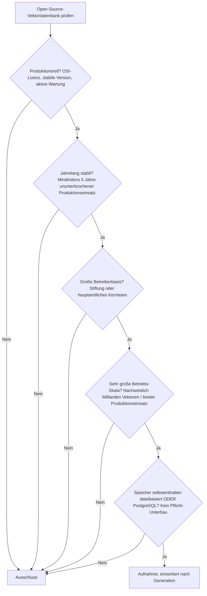
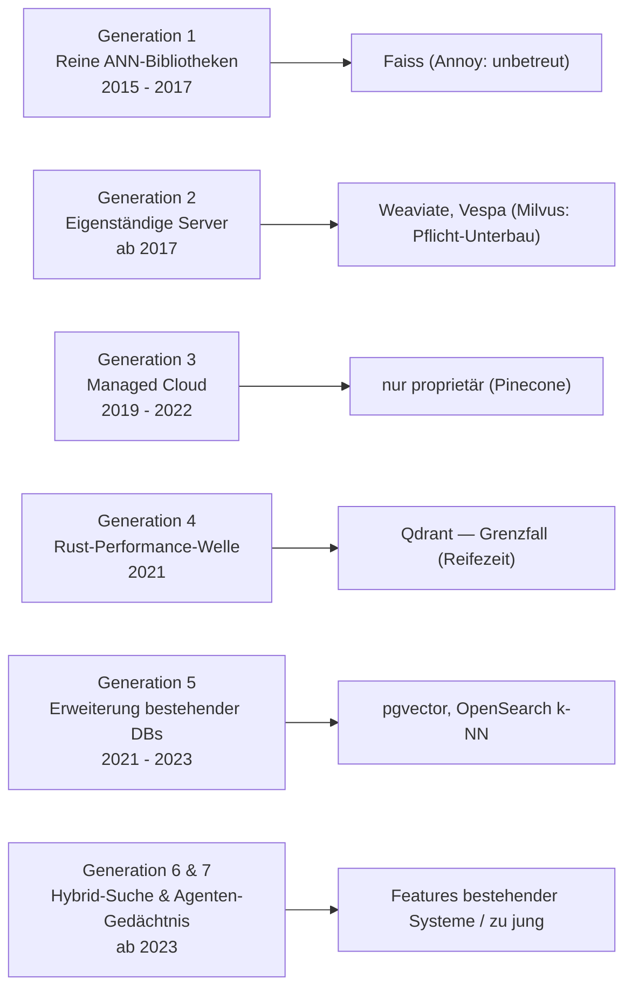

# Produktionsreife Open-Source-Vektordatenbanken nach Generation — Reifegrad, Evaluation & Betriebs-Skala (Top 5)

Die [Evolution und Architekturen digitaler Vektordatenbanken](evolution-digitaler-vektordatenbanken.md) ordnet die Kategorie chronologisch — von reinen ANN-Bibliotheken über eigenständige Datenbank-Server und Managed Cloud-Dienste bis zur Vektorsuche als Erweiterung bestehender Systeme, Hybrid-Suche und schließlich Vektordatenbanken als Agenten-Gedächtnis. Die [Topliste bester Vektordatenbanken 2026](vektordatenbanken-2026-topliste.md) rankt die gesamte Kategorie. Diese Seite kombiniert alle Achsen — parallel zur [BI-Analytics-](produktionsreife-bi-analytics-tools-generationen-2026-topliste.md), [Semantische-&-RAG-Wissenssysteme-](../../dokumentation/produktionsreife-semantische-rag-wissenssysteme-generationen-2026-topliste.md) und [RAG-Werkzeug-Anwendungen-Schwesterseite](../../../künstliche-intelligenz/produktionsreife-rag-werkzeug-anwendungen-generationen-2026-topliste.md) — zu einem bewusst **konservativen** Fünf-Filter-Sieb: produktionsreif · jahrelang stabil · große Betreiberbasis · sehr große Betriebs-Skala · Speicher dateibasiert oder PostgreSQL. Sortiert nach Generation, nicht nach Rang.

!!! warning "Achtung: Hier prüft der Speicherfilter das System selbst — nicht ob es ein Zweitsystem ist"
    Auf der [RAG-Werkzeug-Anwendungen-Seite](../../../künstliche-intelligenz/produktionsreife-rag-werkzeug-anwendungen-generationen-2026-topliste.md) galten dedizierte Vektor-DBs als **Pflicht-Zweitsystem** neben der Anwendung. Auf *dieser* Seite ist die Vektordatenbank das bewertete Hauptartefakt — die Filterfrage lautet daher: Braucht sie *ihrerseits* ein Pflicht-Zweitsystem unter sich? Fünf Systeme über drei Generationen bestehen alle fünf Filter: **Faiss**, **Weaviate**, **Vespa**, **pgvector** und **OpenSearch k-NN** — alle mit selbstenthaltendem, dateibasiertem Speicher oder direkt in PostgreSQL. **Milvus** fällt hier durch (etcd + Objektspeicher + Message-Queue als Pflicht-Unterbau), **Pinecone** an der Lizenz, **MongoDB Atlas Vector Search** an beidem ([Speicher-Fazit](#dateibasiert-oder-postgresql)).

---

## Die fünf harten Filter

!!! note "Hinweis: Der Filter zielt auf den Pflicht-Unterbau"
    „Speicher dateibasiert oder PostgreSQL" heißt hier: Die Datenbank legt ihre Vektoren, Indizes und Metadaten in eigenen Dateien auf lokalem Datenträger ab (Faiss, Weaviate, Vespa, OpenSearch) oder *ist* eine PostgreSQL-Erweiterung (pgvector) — ohne ein zwingend mitzubetreibendes zweites System wie etcd, MinIO/S3, Pulsar/Kafka oder MongoDB. Reine SaaS-Angebote ohne selbst betreibbare Open-Source-Edition fallen an der Lizenz.

---

## Ergebnis: fünf Systeme über drei Generationen

---

## Systeme nach Generation

### Generation 1 — Reine ANN-Bibliotheken ohne Server (2015 – 2017)

| # | System | Sprache | Speicher | Lizenz | Seit | Skala-Nachweis |
|---|---|---|---|---|---|---|
| 1 | **Faiss** | C++/Python | dateibasiert (Index-Dateien) | MIT | 2017 | Meta; technische Referenz-Bibliothek, in Weaviate, Milvus, OpenSearch u. v. m. als Unterbau |

**Faiss** ist die In-Process-Bibliothek, auf der ein Großteil aller späteren Systeme technisch aufbaut — kein Server, keine Netzwerk-API, Indizes als Dateien. Nach acht Jahren weiterhin sehr aktiv gepflegt. **Annoy** (Spotify, 2015) aus derselben Generation wird kaum noch weiterentwickelt.

### Generation 2 — Erste eigenständige Vektordatenbank-Server (ab 2017)

| # | System | Sprache | Speicher | Lizenz | Seit | Skala-Nachweis |
|---|---|---|---|---|---|---|
| 2 | **Weaviate** | Go | dateibasiert (eigener LSM-Speicher auf lokalem Datenträger) | BSD-3-Clause | 2019 | Weaviate B.V.; Hybrid-Suche (Vektor + BM25), breite RAG-Adoption, selbstenthaltender Einzelknoten |
| 3 | **Vespa** | Java/C++ | dateibasiert (eigene Storage-Engine „proton") | Apache-2.0 | 2017 (Open Source) | Vespa.ai (Yahoo-Ursprung); serviert bei Yahoo Milliarden Suchanfragen täglich, Hybrid-Ranking im Maßstab |

**Weaviate** und **Vespa** übertragen das Datenbank-Konzept — Persistenz, API, Multi-Tenancy — vollständig auf Vektorsuche und kommen dabei mit selbstenthaltendem, dateibasiertem Speicher aus. **Milvus** (2019, CNCF/LF AI & Data) ist technisch reif und skaliert auf Milliarden Vektoren, benötigt in der Vollausbaustufe aber etcd, einen Objektspeicher und eine Message-Queue als Pflicht-Unterbau — damit fällt es an Filter 5 (Milvus Lite ist die dateibasierte, aber kleinskalige Ausnahme).

### Generation 5 — Vektorsuche als Erweiterung bestehender Datenbanken (2021 – 2023)

| # | System | Sprache | Speicher | Lizenz | Seit | Skala-Nachweis |
|---|---|---|---|---|---|---|
| 4 | **pgvector** | C | **PostgreSQL** | PostgreSQL License | 2021 | Von allen großen Managed-PostgreSQL-Anbietern (AWS, Azure, GCP) unterstützt; Standardwahl für RAG unter wenigen Millionen Vektoren |
| 5 | **OpenSearch k-NN** | Java | dateibasiert (Lucene-Segmente; Faiss/Lucene/nmslib als Index-Engine) | Apache-2.0 | 2020 | OpenSearch Software Foundation (Linux Foundation, seit 2024); Volltext- und Vektorsuche in einer Plattform |

**pgvector** ist der kanonische Speicherfilter-Treffer der ganzen Familie: Embeddings, Dokumente und Metadaten in *einer* PostgreSQL-Datenbank, kombinierbar per SQL-Join — siehe die [praktische pgvector-Anleitung](pgvector-anleitung.md). **OpenSearch k-NN** bringt Vektorsuche in eine selbstenthaltende, Lucene-basierte Such-Engine, seit 2024 unter Linux-Foundation-Trägerschaft. **MongoDB Atlas Vector Search** aus derselben Generation fällt doppelt: SSPL (nicht OSI-konform) und ausschließlich als Managed-Dienst verfügbar — es ist das wörtliche „wie MongoDB"-Beispiel des Filters.

### Generation 3, 4, 6 & 7 — warum hier (fast) nichts steht

- **Generation 3** (Managed Cloud): **Pinecone**, **Vertex AI Vector Search** und **Azure AI Search** sind proprietär und nur als Dienst verfügbar — kein selbst betreibbarer OSS-Kern.
- **Generation 4** (Rust-Performance): **Qdrant** (2021) ist selbstenthalten und dateibasiert und erreicht 2026 gerade die Fünf-Jahres-Marke — die Schwester-Seite [Semantische & RAG-Wissenssysteme](../../dokumentation/produktionsreife-semantische-rag-wissenssysteme-generationen-2026-topliste.md) führt es konsistent als Grenzfall. Nachrücker 2027.
- **Generation 6** (Hybrid-/Multi-Vector-Suche): SPLADE, ColBERT und Hybrid-Ranking sind *Features* bestehender Systeme (Weaviate, Vespa, OpenSearch, Qdrant), keine eigenständigen Datenbanken.
- **Generation 7** (Agenten-Gedächtnis): 2025/2026 entstanden — ein Nutzungsmuster, kein neues System, und weit von fünf Jahren Reife entfernt.

---

## Dateibasiert oder PostgreSQL?

Diese Kategorie zeigt den Speicherfilter in seiner **schärfsten Form** — weil hier die Datenbank selbst geprüft wird:

- **Selbstenthalten, dateibasiert**: Faiss (Index-Dateien), Weaviate (LSM-Speicher), Vespa (proton), OpenSearch (Lucene-Segmente). Ein Prozess, ein Datenverzeichnis, kein weiteres System.
- **Direkt in PostgreSQL**: pgvector — die Vektoren sind Zeilen in einer Tabelle. Maximale Betriebsdisziplin, ein Backup deckt alles ab.
- **Pflicht-Unterbau, daher ausgeschlossen**: Milvus (etcd + Objektspeicher + Message-Queue) in der Vollausbaustufe; MongoDB Atlas (SSPL, Managed-only).

Fazit für die meisten Projekte: Unter wenigen Millionen Vektoren ist **pgvector** die Wahl mit der geringsten Betriebslast. Darüber hinaus liefern **Weaviate**, **Vespa** oder **OpenSearch** selbstenthaltene Skalierung, ohne dass ein zweites Datenbanksystem mitbetrieben werden muss.

!!! warning "Achtung: Momentaufnahme, Stand August 2026"
    **Qdrant** überschreitet 2026/2027 klar die Fünf-Jahres-Marke und rückt dann nach. **LanceDB** (dateibasiertes, spaltenorientiertes Format) ist der aussichtsreichste junge „dateibasiert"-Kandidat. Redis' Lizenz hat sich 2024/2025 mehrfach geändert (zuletzt AGPL-Option in Redis 8). pgvector und Faiss sind die stabilen Konstanten.

---

## Was bewusst nicht auf dieser Liste steht

| System | Erfüllt nicht | Anmerkung |
|---|---|---|
| **Pinecone** | Open-Source-Lizenz | Proprietär, nur als Managed-Dienst |
| **MongoDB Atlas Vector Search** | Open-Source-Lizenz + Speicher | SSPL und Managed-only — das „wie MongoDB"-Beispiel des Filters |
| **Milvus** | Speicher (Pflicht-Unterbau) | Vollausbau braucht etcd + Objektspeicher + Message-Queue; Milvus Lite dateibasiert, aber kleinskalig |
| **Qdrant** | Reifezeit | Selbstenthalten und dateibasiert, aber 2026 gerade fünf Jahre — Grenzfall, konsistent zur RAG-Wissenssysteme-Seite |
| **Chroma** | Reifezeit | 2022, Speicher-Engine-Wechsel; beste Developer Experience für Prototypen |
| **LanceDB** | Reifezeit | 2023; dateibasiertes Lance-Format — aussichtsreichster „dateibasiert"-Nachrücker |
| **Redis Vector Search** | Lizenz-Kontinuität | Mehrfacher Lizenzwechsel 2024/2025; zudem eigenes Datenbanksystem |
| **Elasticsearch Vector Fields** | Open-Source-Lizenz | SSPL/Elastic License; OpenSearch ist der Apache-2.0-Zweig |
| **Vertex AI Vector Search, Azure AI Search** | Open-Source-Lizenz | Proprietäre Managed-Dienste |
| **Annoy** | Aktive Wartung | Kaum noch Weiterentwicklung |
| **Vald** | Betreiberbasis / Reifezeit | Kubernetes-first, kleine Betreiberbasis |

---

## 🔗 Verwandte Themen

- [Evolution und Architekturen digitaler Vektordatenbanken](evolution-digitaler-vektordatenbanken.md) — das Generationenmodell, nach dem diese Liste sortiert ist
- [Beste Vektordatenbanken 2026 (Top 15)](vektordatenbanken-2026-topliste.md) — breiteste Basis-Topliste inklusive Managed-Dienste
- [Produktionsreife relationale Datenbanken nach Generation (Top 4)](produktionsreife-relationale-datenbanken-generationen-2026-topliste.md) — dieselbe Umdeutung des Speicherfilters (Pflicht-Unterbau des Systems selbst); pgvector besteht dort als Generation-6-Erweiterung von PostgreSQL
- [PostgreSQL + pgvector: Praktische Anleitung](pgvector-anleitung.md) — Installation und Beispiel-Queries für den Speicherfilter-Sieger
- [Produktionsreife Open-Source-semantische & RAG-Wissenssysteme nach Generation (Top 7)](../../dokumentation/produktionsreife-semantische-rag-wissenssysteme-generationen-2026-topliste.md) — Schwesterseite; Faiss, Weaviate und pgvector erscheinen dort ebenfalls
- [Produktionsreife Open-Source-RAG- & Werkzeug-Anwendungen nach Generation](../../../künstliche-intelligenz/produktionsreife-rag-werkzeug-anwendungen-generationen-2026-topliste.md) — die Anwendungsschicht, für die diese Datenbanken das Retrieval-Backend sind
- [Produktionsreife Open-Source-BI- & Analytics-Tools nach Generation (Top 3)](produktionsreife-bi-analytics-tools-generationen-2026-topliste.md) — Schwesterseite im selben Datenbereich
