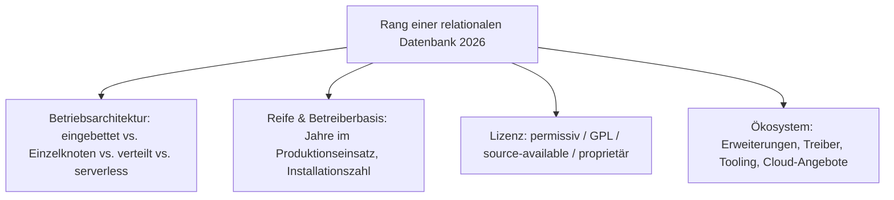
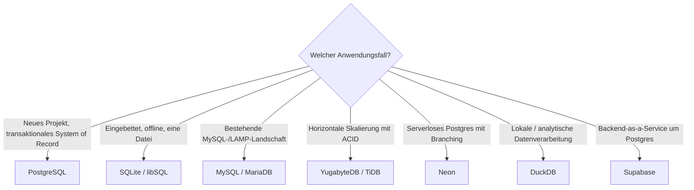

# Beste relationale Datenbanken 2026 — Top-15-Topliste

Die [Evolution und Architekturen digitaler relationaler Datenbanken](evolution-digitaler-relationale-datenbanken.md) ordnet diese Kategorie chronologisch — vom relationalen Modell über die Open-Source-LAMP-Ära und die MVCC-Reife bis zu NewSQL und der Serverless-/Postgres-Plattform-Ära. Diese Seite übersetzt die Chronologie in eine **Momentaufnahme 2026**: 15 Systeme, die heute tatsächlich als transaktionales System of Record betrieben werden.

---

## Bewertungskriterien

---

## Top 15 im Überblick

| Rang | System | Generation | Betriebsarchitektur | Besondere Stärke |
|---|---|---|---|---|
| 1 | **PostgreSQL** | 2 (Open-Source-LAMP-Ära) | Einzelknoten-Server | Reichstes Erweiterungs-Ökosystem, Standardwahl für Neuinstallationen, permissive Lizenz |
| 2 | **SQLite** | 2 (Open-Source-LAMP-Ära) | Eingebettet (Ein-Datei) | Meistverbreitete Datenbank der Welt — jedes Smartphone, jeder Browser, unzählige Apps |
| 3 | **MySQL** | 2 (Open-Source-LAMP-Ära) | Einzelknoten-Server | Größte installierte Web-Basis, ausgereiftes Replikations- und Hosting-Ökosystem |
| 4 | **MariaDB** | 2–3 (LAMP-Ära / MVCC-Reife) | Einzelknoten-Server | Community-geführte MySQL-Alternative, in vielen Linux-Distributionen Standard |
| 5 | **CockroachDB** | 5 (NewSQL & verteilte RDBMS) | Verteilt (Raft) | Spanner-artige globale Konsistenz, PostgreSQL-kompatibel — Lizenz seit 2024 nicht mehr OSI |
| 6 | **TiDB** | 5 (NewSQL & verteilte RDBMS) | Verteilt (SQL + TiKV + PD) | MySQL-kompatible horizontale Skalierung, sehr große Deployments in Asien |
| 7 | **YugabyteDB** | 5 (NewSQL & verteilte RDBMS) | Verteilt (Raft) | PostgreSQL-kompatibel, vollständig Apache-2.0 |
| 8 | **Vitess** | 5 (NewSQL & verteilte RDBMS) | MySQL-Sharding-Middleware | Skalierungs-Unterbau von YouTube, Slack, GitHub, Shopify; CNCF-Projekt |
| 9 | **Amazon Aurora** | 6 (Serverless & Cloud-native) | Storage-Compute-getrennt (AWS) | Verteilter Storage-Layer unter MySQL-/PostgreSQL-Kompatibilität |
| 10 | **Neon** | 6 (Serverless & Cloud-native) | Serverloses PostgreSQL | Copy-on-Write-Branching, Scale-to-Zero; Apache-2.0 |
| 11 | **Supabase** | 6 (Postgres-Plattform-Ära) | PostgreSQL + BaaS-Schicht | Auth, Realtime, Storage und REST/GraphQL-API um einen unveränderten Postgres-Kern |
| 12 | **DuckDB** | 6 (Postgres-Plattform-Ära / OLAP) | Eingebettet (In-Process) | Analytisches SQL im Prozess, De-facto-Standard für lokale Datenanalyse |
| 13 | **libSQL / Turso** | 6 (Serverless & Cloud-native) | Eingebettet + Edge-Replikation | Offene SQLite-Abspaltung mit eingebautem Replikations- und Sync-Protokoll |
| 14 | **Firebird** | 2 (Open-Source-LAMP-Ära) | Einzelknoten-Server | Langlebige InterBase-Nachfolge, geringe Betriebslast, kleine aber treue Basis |
| 15 | **Google Cloud Spanner** | 5 (NewSQL & verteilte RDBMS) | Global verteilt (GCP) | Extern konsistente Transaktionen über TrueTime — proprietär, GCP-only |

---

## Highlights im Detail

### Rang 1–4: die überreifen Open-Source-Klassiker
PostgreSQL, SQLite, MySQL und MariaDB decken 2026 die überwältigende Mehrheit aller produktiven relationalen Workloads ab — alle vier sind zwischen 20 und 30 Jahre alt, quelloffen und in ihrer Kategorie ungeschlagen, siehe [Generation 2](evolution-digitaler-relationale-datenbanken.md#generation-2-open-source-rdbms-die-lamp-ara-1994-2005).

### Rang 5–8: NewSQL — Skalierung mit ACID, aber mit Vorbehalten
CockroachDB, TiDB, YugabyteDB und Vitess lösen das Sharding-Problem relationaler Datenbanken — CockroachDB allerdings seit 2024 unter einer nicht mehr OSI-anerkannten Lizenz, Vitess und TiDB nur mit erheblicher Betriebskomplexität, siehe [Generation 5](evolution-digitaler-relationale-datenbanken.md#generation-5-newsql-verteilte-relationale-datenbanken-2012-2020).

### Rang 10–13: Serverless und die Postgres-Plattform
Neon, Supabase, DuckDB und libSQL stehen für die aktuelle Bewegung: entweder PostgreSQL/SQLite als serverlosen, verzweigbaren Dienst verpacken oder das eingebettete Modell für Analyse und Edge neu denken, siehe [Generation 6](evolution-digitaler-relationale-datenbanken.md#generation-6-serverless-cloud-native-die-postgres-plattform-ara-2017-2026).

---

## Entscheidungshilfe nach Anwendungsfall

!!! tip "Bereits vertieft in diesem Wiki"
    Für den PostgreSQL-Betrieb existieren eigene Praxis-Handbücher: [PostgreSQL DBA Praxis-Handbuch](../../../entwicklung/infrastruktur/postgresql-dba-praxis.md) und die [PostgreSQL + pgvector-Anleitung](pgvector-anleitung.md).

---

## 🔗 Verwandte Themen

- [Startseite](../../../index.md) — zurück zur Dokumentations-Zentrale
- [Evolution und Architekturen digitaler relationaler Datenbanken](evolution-digitaler-relationale-datenbanken.md) — chronologisches Generationenmodell, dessen aktuellen Stand diese Topliste zusammenfasst
- [Produktionsreife relationale Datenbanken nach Generation (Top 4)](produktionsreife-relationale-datenbanken-generationen-2026-topliste.md) — dieselbe Chronologie durch das konservative Fünf-Filter-Sieb: PostgreSQL, SQLite, MySQL, MariaDB
- [Evolution und Architekturen digitaler Vektordatenbanken](evolution-digitaler-vektordatenbanken.md) — Vektorsuche als Erweiterung relationaler Datenbanken (pgvector)
- [PostgreSQL DBA Praxis-Handbuch](../../../entwicklung/infrastruktur/postgresql-dba-praxis.md) · [PostgreSQL + pgvector](pgvector-anleitung.md)
- [Datenbanken & Big Data: Übersicht für KI-Anwendungen](index.md)
