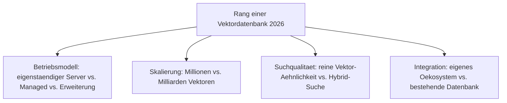
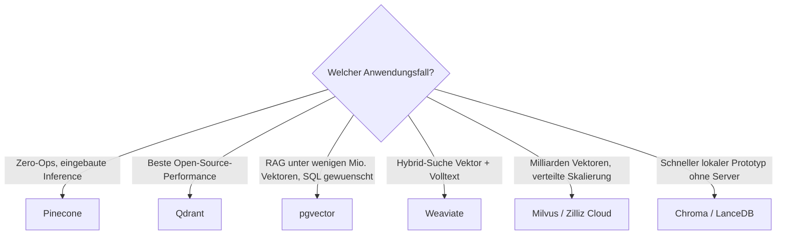

# Beste Vektordatenbanken 2026 — Top-15-Topliste

Die [Evolution und Architekturen digitaler Vektordatenbanken](evolution-digitaler-vektordatenbanken.md) ordnet diese Kategorie chronologisch — von reinen ANN-Bibliotheken über eigenständige Datenbank-Server bis zur Vektorsuche als Feature bestehender Systeme. Diese Seite übersetzt die Chronologie in eine **Momentaufnahme 2026**: 15 Lösungen, die heute tatsächlich für RAG-Systeme und KI-Agenten betrieben werden.

---

## Bewertungskriterien

---

## Top 15 im Überblick

| Rang | System | Generation | Betriebsmodell | Besondere Stärke |
|---|---|---|---|---|
| 1 | **Pinecone** | 3 (Managed Cloud-Vektorsuche) | Vollständig verwaltet | Zero-Ops, eingebaute Inference (Embeddings + Reranking), Hybrid-Suche |
| 2 | **Qdrant** | 4 (Rust-basierte Performance-Welle) | Eigenständiger Server | 10–25 % schneller als vergleichbare Open-Source-Systeme, großzügiges Free-Tier |
| 3 | **pgvector** | 5 (Erweiterung bestehender Datenbanken) | PostgreSQL-Erweiterung | Embeddings, Dokumente und Metadaten in einer Datenbank, SQL-Joins |
| 4 | **Weaviate** | 2 (erste eigenständige Server) | Eigenständiger Server | Hybrid-Suche (Vektor + BM25), GraphQL-API, integrierte NLP-Module |
| 5 | **Milvus / Zilliz Cloud** | 2 (erste eigenständige Server) | Eigenständiger Server / Managed | Skaliert auf Milliarden Vektoren, CNCF-Projekt |
| 6 | **Chroma** | 2–3 (Ergänzung 2026) | Eigenständig, Python-zentriert | Beste Developer Experience für schnelle Prototypen |
| 7 | **Redis Vector Search** | 5 (Erweiterung bestehender Datenbanken) | Redis-Erweiterung | Extrem niedrige Latenz, kombinierbar mit Caching im selben System |
| 8 | **Elasticsearch/OpenSearch Vector Fields** | 5 (Erweiterung bestehender Datenbanken) | Erweiterung | Volltextsuche und Vektorsuche in derselben Plattform |
| 9 | **MongoDB Atlas Vector Search** | 5 (Erweiterung bestehender Datenbanken) | Managed Erweiterung | Nahtlos für bestehende MongoDB-Dokumentenmodelle |
| 10 | **Vertex AI Vector Search** | 3 (Managed Cloud-Vektorsuche) | Vollständig verwaltet (GCP) | Tiefe Integration mit Google-Cloud-KI-Diensten |
| 11 | **Azure AI Search** | 3 (Managed Cloud-Vektorsuche) | Vollständig verwaltet (Azure) | Hybrid-Suche, tiefe Microsoft-365-Integration |
| 12 | **Vespa** | 2 (erste eigenständige Server) | Eigenständiger Server | Große Skalierung mit Hybrid-Ranking, Yahoo-Ursprung |
| 13 | **LanceDB** | Ergänzung 2026 | Eingebettet, dateibasiert | Serverloses, spaltenorientiertes Format für lokale RAG-Prototypen |
| 14 | **Faiss** | 1 (reine ANN-Bibliotheken) | In-Process-Bibliothek | Technische Referenz-Bibliothek, in vielen Systemen als Unterbau genutzt |
| 15 | **Vald** | Ergänzung 2026 | Cloud-native, Kubernetes-first | Auf Kubernetes-Betrieb spezialisierte, hochverfügbare Vektorsuche |

---

## Highlights im Detail

### Rang 1–2: Managed-Marktführer vs. Open-Source-Performance-Leader
Pinecone und Qdrant repräsentieren die beiden dominanten Philosophien 2026: vollständig verwaltete Bequemlichkeit gegen kompromisslose Open-Source-Performance, siehe [Generation 3 und 4](evolution-digitaler-vektordatenbanken.md#generation-3-managed-cloud-vektorsuche-2019-2022).

### Rang 3, 7–9: Vektorsuche als Feature statt eigene Kategorie
pgvector, Redis, Elasticsearch/OpenSearch und MongoDB Atlas zeigen den Trend der [Generation 5](evolution-digitaler-vektordatenbanken.md#generation-5-vektorsuche-als-erweiterung-bestehender-datenbanken-2021-2023): Statt eine weitere Datenbank zu betreiben, wird Vektorsuche zum Datentyp einer bereits vorhandenen Plattform.

### Rang 13: Der Lokal-first-Gegentrend
LanceDB steht für einen wachsenden Gegentrend zu Cloud-Managed-Diensten: eine serverlose, dateibasierte Vektorsuche für lokale Entwicklung und kleine RAG-Prototypen ganz ohne Serverbetrieb.

---

## Entscheidungshilfe nach Anwendungsfall

!!! tip "Bereits vertieft in diesem Wiki"
    Für pgvector existiert bereits eine eigene [praktische Anleitung](pgvector-anleitung.md) mit Installationsschritten und Beispiel-Queries.

---

## 🔗 Verwandte Themen

- [Startseite](../../../index.md) — zurück zur Dokumentations-Zentrale
- [Evolution und Architekturen digitaler Vektordatenbanken](evolution-digitaler-vektordatenbanken.md) — chronologisches Generationenmodell, dessen aktuellen Stand diese Topliste zusammenfasst
- [PostgreSQL + pgvector: Praktische Anleitung](pgvector-anleitung.md)
- [Datenbanken & Big Data: Übersicht für KI-Anwendungen](index.md)
- [Lokales RAG & LLM-Serving](../../../künstliche-intelligenz/coding/lokales-rag-ollama.md)
