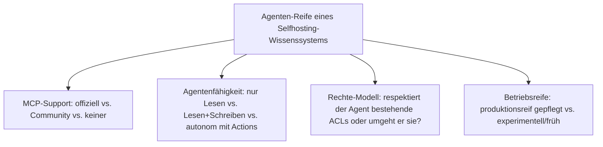
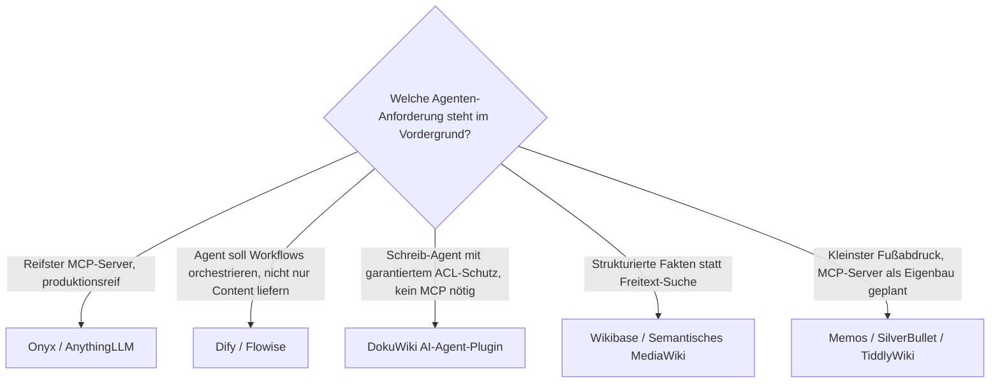

# KI-Agenten-Integration in Selfhosting-Wissenssysteme — Top-20-Topliste

Die [Migrationswege-Topliste](migrationswege-wissenssysteme-topliste.md), die [Backup-Strategien-Topliste](backup-strategien-wissenssysteme-topliste.md) und die [Selfhosting-Topliste](wissenssysteme-selfhosting-server-topliste.md) übernehmen konsequent dieselbe Rangfolge und vertiefen je einen Aspekt desselben 20-System-Satzes. Dieses Kapitel schließt die Reihe mit dem Aspekt, der 2026 über den praktischen Nutzwert einer Selfhosting-Installation mitentscheidet: **Wie reif ist die MCP-/Agenten-Anbindung, und wie viel darf ein Agent tatsächlich tun?**

!!! note "Hinweis: Abgrenzung zur bestehenden MCP-Topliste"
    Die [Top-20-Topliste mit MCP-Server](wissensmanagement-mcp-server-topliste.md) rankt eine eigene, nach MCP-Reife sortierte Auswahl an Wissensmanagement-Systemen. Diese Seite hält bewusst die **feste Rangfolge der Selfhosting-Reihe** bei — auch wenn das MCP-Ranking hier eine andere Reihenfolge nahelegen würde —, damit sich Selfhosting-Aufwand, Backup, Migration und Agenten-Reife für dasselbe System direkt über alle vier Kapitel hinweg vergleichen lassen.

---

## Bewertungskriterien

!!! warning "Achtung: MCP-Support wird derzeit im Wochentakt ausgebaut"
    Wie in der [MCP-Gesamtübersicht](open-source-llm-agent-mcp-systeme.md) angemerkt, ändert sich der Funktionsumfang bei vielen dieser Projekte laufend. Die Angaben hier sind eine **Momentaufnahme (Stand: August 2026)** — vor produktivem Agenten-Einsatz die aktuelle Dokumentation des jeweiligen Projekts prüfen.

---

## Top 20 im Überblick

| Rang | System | MCP-Support | Agentenfähigkeit | Besonderheit |
|---|---|---|---|---|
| 1 | **Memos** | Community (früh, einfache REST-API als Basis) | Lesen+Schreiben | Kleinste Angriffsfläche dieser Liste — Eigenbau-MCP-Server ist ein Wochenendprojekt |
| 2 | **DokuWiki** | kein MCP-Server, offizielle **AIChat**-/**AI-Agent**-Plugins | Lesen+Schreiben, respektiert ACL vollständig | Einziges System dieser Liste mit offiziell ACL-respektierendem KI-Agent ohne MCP-Umweg |
| 3 | **TiddlyWiki** | Community (experimentell, Node.js-Server-API als Basis) | Lesen+Schreiben | Node.js-Server-Modus erleichtert Eigenbau, aber kein etabliertes MCP-Projekt bekannt |
| 4 | **SilverBullet** | Community (Plug-System als natürlicher Anknüpfungspunkt) | Lesen+Schreiben | Eingebautes Plug-System senkt die Hürde für einen MCP-Server als Plug erheblich |
| 5 | **[Wiki.js](klassische-wiki-systeme-llm-integration.md)** | Community (GraphQL-basiert) | Lesen+Schreiben (CRUD, Seiten verschieben) | Moderne GraphQL-API erleichtert MCP-Server-Eigenbau gegenüber REST-only-Systemen |
| 6 | **[MediaWiki](mediawiki/mediawiki-ki-agent.md)** | Eigenbau (kein Standard-Server im Ökosystem) | Lesen+Schreiben, Human-in-the-Loop-Entwürfe, siehe [MediaWiki KI-Agent](mediawiki/mediawiki-ki-agent.md) | Größtes Extension-Ökosystem erleichtert MCP-Eigenbau trotz fehlendem Standard-Server |
| 7 | **BookStack** | Community (REST-basiert) | Lesen+Schreiben | Klare Bücher/Kapitel/Seiten-Hierarchie erleichtert Agenten-Navigation |
| 8 | **Joplin Server** | Community (über eingebaute REST-API) | Lesen+Schreiben | Eingebaute REST-API vereinfacht MCP-Server-Eigenbau erheblich |
| 9 | **Trilium Notes** | Community | Lesen+Schreiben | Eingebaute Skripting-Unterstützung erlaubt Agenten-nahe Automatisierung auch ohne MCP |
| 10 | **Docmost** | Community | Lesen+Schreiben | Wachsende API-/MCP-Anbindung, aktive Entwicklung senkt Eigenbau-Aufwand kontinuierlich |
| 11 | **[Khoj](khoj-ki-zweites-gehirn.md)** | Community (nativ agentenorientiert) | Lesen+Schreiben, Suche über mehrere Notiz-Quellen hinweg | Von Grund auf für LLM-gestützte Wissenssuche konzipiert, nicht nachgerüstet |
| 12 | **[AnythingLLM](anythingllm-rag-plattform.md)** | **offiziell** (natives MCP seit 2025) | Lesen+Schreiben über Agent Skills | Reifster MCP-Support im gesamten „ein Prozess"-Deployment-Segment dieser Liste |
| 13 | **[XWiki](xwiki/installieren.md)** | kein MCP-Server, offizielle LLM-Extension mit RAG-Chatbot | Lesen (Chat-Antworten), On-Premise-fähig | On-Premise-fähige RAG-Integration ohne Cloud-Zwang, aber keine Schreibrechte für Agenten |
| 14 | **AFFiNE** | Community (früh, experimentell) | Lesen+Schreiben | Kombiniert Dokumente, Whiteboards und Datenbanken — Agenten-Zugriff bislang nur auf Dokumentenebene ausgereift |
| 15 | **Wikibase** (Wikidata-Basis) | Community (SPARQL-/API-basiert) | Lesen (strukturierte Abfragen), Schreiben über Bot-Konten | Ideal für Agenten, die strukturierte Fakten statt Freitext benötigen |
| 16 | **Semantisches MediaWiki** | erbt MediaWiki-Eigenbau (Rang 6), zusätzlich SPARQL-Endpoint | Lesen (strukturierte Inline-Queries/SPARQL), Schreiben wie MediaWiki | Agenten können strukturierte Fakten per SPARQL abfragen statt Freitext zu parsen |
| 17 | **Logseq** | Community | Lesen+Schreiben | Blockbasierte, verknüpfte Notizen ideal für Agent-gestützte Wissensgraphen |
| 18 | **[Dify](dify-agenten-workflow-plattform.md)** | **offiziell** (nutzt MCP als Tool-Quelle für eigene Workflows) | autonom (Multi-Step-Agenten-Workflows) | Kehrt die Rolle um — Dify ist selbst Agenten-Orchestrator, der externe MCP-Server als Werkzeuge einbindet |
| 19 | **[Flowise](flowise-visueller-flow-builder.md)** | offiziell/Community (MCP-Tool-Knoten im Flow-Editor) | autonom (visuell definierte Agenten-Flows) | MCP-Anbindung als No-Code-Knoten statt Code-Integration |
| 20 | **[Onyx](onyx-danswer-rag-plattform.md)** (ehem. Danswer) | **offiziell** (`onyx-mcp-server`) | Lesen+Schreiben, native Agents mit Actions | Reifster MCP-Server dieser gesamten Liste — übernimmt sogar bestehende Zugriffsrechte aus Quellsystemen |

---

## Highlights im Detail

### Rang 12, 18–20: die einzigen vier mit offiziellem MCP-Support
Nur [AnythingLLM](anythingllm-rag-plattform.md), [Dify](dify-agenten-workflow-plattform.md), [Flowise](flowise-visueller-flow-builder.md) und [Onyx](onyx-danswer-rag-plattform.md) pflegen MCP-Anbindung **im Kernprojekt** statt in der Community. Bemerkenswert: Dify und Flowise drehen die übliche Rolle um — sie sind nicht das System, das einen MCP-Server *anbietet*, sondern der Agenten-Orchestrator, der fremde MCP-Server als Werkzeuge *konsumiert*.

### Rang 2: einziges System mit offiziell ACL-respektierendem Agenten ohne MCP-Umweg
DokuWikis **AI-Agent**-Plugin ist in dieser Liste der einzige Fall, in dem der Kernprojekt-Hersteller selbst einen Schreib-Agenten anbietet, der garantiert das bestehende Rechtesystem respektiert — ohne dass dafür überhaupt ein MCP-Server im Spiel ist.

### Rang 15–16: strukturierte Fakten statt Freitext
Wikibase und Semantisches MediaWiki unterscheiden sich fundamental vom Rest dieser Liste: Agenten fragen hier über SPARQL **strukturierte Aussagen** ab statt Freitext zu durchsuchen — ein deutlich robusteres Abrufmuster für Agenten, die auf exakte Fakten statt semantischer Ähnlichkeit angewiesen sind.

---

## Entscheidungshilfe nach Agenten-Anforderung

!!! tip "Tipp: Eigenbau-MCP-Server bei Community-Rang leicht möglich"
    Für alle Systeme mit „Community"-MCP-Support (Rang 1, 3–5, 7–11, 14–15, 17) gilt: Eine moderne REST- oder GraphQL-API senkt den Aufwand für einen schlanken Eigenbau-MCP-Server erheblich — das [MediaWiki-KI-Agent-Beispiel](mediawiki/mediawiki-ki-agent.md#2-mcp-server-mediawiki-als-werkzeug-fur-allgemeine-agenten) zeigt das Grundmuster auch für Systeme ohne Standard-Server im Ökosystem.

---

## 🔗 Verwandte Themen

- [Startseite](../../index.md) — zurück zur Dokumentations-Zentrale
- [Beste Open-Source-Wissenssysteme für den eigenen Selfhosting-Server (Top 20)](wissenssysteme-selfhosting-server-topliste.md) — Ausgangs-Topliste, deren Rangfolge diese Seite für die Agenten-Perspektive übernimmt
- [Backup-Strategien für Wissenssysteme (Top 20)](backup-strategien-wissenssysteme-topliste.md) — Schwester-Topliste, dieselbe Rangfolge nach Backup vertieft
- [Migrationswege zwischen Wissenssystemen (Top 20)](migrationswege-wissenssysteme-topliste.md) — Schwester-Topliste, dieselbe Rangfolge nach Migration vertieft
- [Beste Wissensmanagement-Systeme (Open Source) mit MCP-Server (Top 20)](wissensmanagement-mcp-server-topliste.md) — eigenständig sortierte MCP-Topliste mit anderer Systemauswahl/-reihenfolge
- [Open-Source Systeme mit vollständiger LLM-, Agenten- & MCP-Unterstützung](open-source-llm-agent-mcp-systeme.md) — Gesamtübersicht inkl. CMS-Kategorie
- [MediaWiki KI-Agent](mediawiki/mediawiki-ki-agent.md) — vertiefend zu Rang 6
- [Onyx (ehem. Danswer): RAG-Plattform](onyx-danswer-rag-plattform.md) — vertiefend zu Rang 20
- [AnythingLLM: All-in-One Desktop- & Docker-RAG-Plattform](anythingllm-rag-plattform.md) — vertiefend zu Rang 12
- [Dify: Visuelle Agenten- & Workflow-Plattform](dify-agenten-workflow-plattform.md) — vertiefend zu Rang 18
- [Flowise: Visueller Flow-Builder für LangChain](flowise-visueller-flow-builder.md) — vertiefend zu Rang 19
