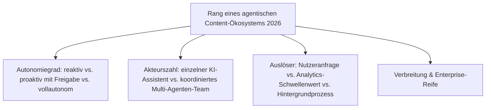
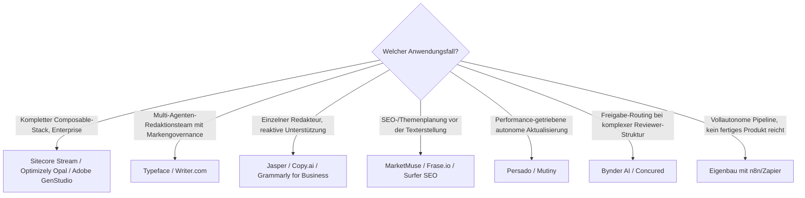

# Beste agentische Content-Ökosysteme 2026 — Top-20-Topliste

Die [Evolution und Architekturen digitaler Agentischer Content-Ökosysteme](evolution-digitaler-agentische-content-oekosysteme.md) beschreibt die jüngste, noch unreife CMS-Generation — vom reaktiven KI-Textvorschlag bis zur vollautonomen Content-Pipeline. Diese Seite übersetzt die Chronologie in eine **Momentaufnahme 2026**: 20 real am Markt verfügbare Plattformen, die mindestens einen agentischen Baustein dieser Zeitachse umsetzen.

!!! warning "Achtung: Reifegrad variiert stark zwischen den Rängen dieser Liste"
    Anders als bei den übrigen Toplisten dieser Reihe merkt die zugrunde liegende Evolution-Chronologie selbst an, dass für diese Generation „noch wenige vollständig ausgereifte, breit dokumentierte Referenzsysteme" existieren. Rang 1–8 setzen bereits mehrstufige, koordinierte Agenten-Workflows produktiv um; Rang 9–17 bieten überwiegend **reaktive** KI-Unterstützung mit einzelnen agentischen Erweiterungen; Rang 18–20 markieren Kategorien, in denen 2026 noch kein einzelnes ausgereiftes Produkt dominiert. **Stand: August 2026 — Funktionsumfang ändert sich in diesem Marktsegment im Wochentakt.**

!!! note "Hinweis: Marketing-/Content-Plattformen statt reiner Redaktions-Frameworks"
    Anders als [Beste Multi-Agenten-Wissensökosysteme 2026](multiagenten-wissensoekosysteme-2026-topliste.md) (Orchestrierungs-Frameworks für Wissenspflege) rankt diese Seite fertige, kommerzielle Marketing-/Content-Plattformen — die zugrunde liegenden Orchestrierungsmuster überschneiden sich, die Zielgruppe (Marketing-/Redaktionsteams statt Entwickler) unterscheidet sich deutlich.

---

## Bewertungskriterien

---

## Top 20 im Überblick

| Rang | System | Generation | Autonomiegrad | Besondere Stärke |
|---|---|---|---|---|
| 1 | **Sitecore Stream** | 3 (KI-orchestrierte Composable Stacks) | proaktiv, Freigabe-pflichtig | Steuert Content-, Personalisierungs- und Commerce-Bausteine als ein orchestrierter Workflow |
| 2 | **Optimizely Opal** | 3 (KI-orchestrierte Composable Stacks) | proaktiv, Freigabe-pflichtig | Agenten-Ebene über den gesamten Optimizely-Composable-Stack hinweg |
| 3 | **Adobe GenStudio** (+ Firefly Services) | 3 (KI-orchestrierte Composable Stacks) | proaktiv, Freigabe-pflichtig | Generative Content-Pipeline tief in die Adobe-Experience-Cloud integriert |
| 4 | **[Contentful](headless-cms-2026-topliste.md)** (Composable Stack Hub) | 3 (KI-orchestrierte Composable Stacks) | proaktiv, Freigabe-pflichtig | Koordiniert Content-, Such- und Personalisierungs-Microservices als KI-Steuerungsebene |
| 5 | **Salesforce Agentforce** (für Content/Marketing) | 6 (Vollautonome Ökosysteme, Ausblick) | am weitesten in Richtung vollautonom | Herstellerseitig ambitionierteste Positionierung Richtung Generation 6 dieser Zeitachse |
| 6 | **Typeface** | 2 (Multi-Agenten-Redaktionsteams) | proaktiv, Freigabe-pflichtig | Rollenbasierte Content-Agenten mit eingebauter Markengovernance |
| 7 | **Writer.com** | 1c/2 (Agent-PR-Workflows/Multi-Agenten) | proaktiv, Freigabe-pflichtig | Workflow-Builder für rollenbasierte, mehrstufige Content-Erstellung |
| 8 | **HubSpot Breeze** (Content Agent) | 1c (Agent-Pull-Request-Workflows) | proaktiv, Freigabe-pflichtig | Agent erstellt vollständigen Entwurf zur menschlichen Freigabe statt Einzelvorschlägen |
| 9 | **Jasper** | 1a (Reaktive KI-Textvorschläge) | reaktiv | Größte reine Marketing-Content-Plattform, Ausgangspunkt vieler Agenten-Erweiterungen |
| 10 | **Copy.ai** (GTM AI Platform) | 1c (Agent-Pull-Request-Workflows) | proaktiv, Freigabe-pflichtig | Verkettete Workflows statt Einzel-Prompts, früher Vorreiter der Kategorie |
| 11 | **MarketMuse** | 1b (KI-gestützte Redaktionsplanung) | reaktiv | Themenrecherche und Redaktionsplan-Vorschläge statt reiner Textgenerierung |
| 12 | **Frase.io** | 1b (KI-gestützte Redaktionsplanung) | reaktiv | Recherche- und Optimierungs-Agent für einzelne Artikel |
| 13 | **Surfer SEO** | 1b (KI-gestützte Redaktionsplanung) | reaktiv | Redaktionelle Optimierungsvorschläge direkt gegen Suchmaschinen-Rankingfaktoren |
| 14 | **Semrush ContentShake AI / Copilot** | 1b/4 (Planung + Performance-getrieben) | reaktiv bis proaktiv | Kombiniert Redaktionsplanung mit performance-getriebenen Aktualisierungsvorschlägen |
| 15 | **Persado** | 4 (Performance-getriebene Aktualisierung) | proaktiv, Freigabe-pflichtig | Autonome, performance-getriebene Optimierung von Marketing-Sprache |
| 16 | **Mutiny** | 4 (Performance-getriebene Aktualisierung) | proaktiv, Freigabe-pflichtig | Passt Landingpage-Content eigenständig anhand von Conversion-Daten an |
| 17 | **Grammarly for Business** | 1a (Reaktive KI-Textvorschläge) | reaktiv, mit Team-Workflow-Erweiterung | Reaktive Basis mit wachsenden Agenten-Workflow-Funktionen für Content-Teams |
| 18 | **Bynder AI** | 5 (Human-in-the-Loop-Freigabe-Routing) | proaktiv, Freigabe-Routing | Ordnet Content-Änderungen automatisiert dem fachlich zuständigen Reviewer zu |
| 19 | **Concured** | 5 (Human-in-the-Loop-Freigabe-Routing) | proaktiv, Freigabe-Routing | Content-Intelligence mit automatisierter Priorisierung statt starrem Freigabepfad |
| 20 | **Eigenbau-Pipelines** (n8n/Zapier + KI-Agenten) | 6 (Vollautonome Ökosysteme, Ausblick) | variabel, je nach Konfiguration | Kein einzelnes ausgereiftes Produkt dominiert Generation 6 — Teams bauen sich den Workflow selbst |

---

## Highlights im Detail

### Rang 1–4: die vier Composable-Stack-Orchestratoren
Sitecore Stream, Optimizely Opal, Adobe GenStudio und Contentful zeigen 2026 denselben Architekturschritt aus unterschiedlichen Ausgangspositionen: Alle vier heben KI von einzelnen Editor-Funktionen auf die **Steuerungsebene des gesamten Composable Stacks** — direkte Fortsetzung von [Generation 6 der Composable-CMS-Zeitachse](evolution-digitaler-composable-cms.md#generation-6-ki-orchestrierung-des-gesamten-composable-stacks-ab-2023).

### Rang 9–13, 17: der „reaktive Kern" bleibt die breiteste Basis
Jasper, Copy.ai, MarketMuse, Frase.io, Surfer SEO und Grammarly for Business bilden zusammen die größte installierte Nutzerbasis dieser Liste — trotz geringerem Autonomiegrad als die Composable-Stack-Orchestratoren, weil sie die niedrigste Einstiegshürde für einzelne Redakteure bieten, nicht ganze Content-Organisationen voraussetzen.

### Rang 15–16: performance-getriebene Autonomie als eigenständige Nische
Persado und Mutiny lösen ein spezifisches Problem aus [Generation 4 dieser Zeitachse](evolution-digitaler-agentische-content-oekosysteme.md): Ein Agent überwacht Analytics-Kennzahlen kontinuierlich und schlägt Content-Änderungen vor, sobald Performance-Schwellenwerte unterschritten werden — ausgelöst durch Daten statt durch eine manuelle Redaktionsentscheidung.

### Rang 20: die ehrlichste Antwort auf eine unreife Kategorie
Kein einzelnes Produkt deckt 2026 Generation 6 (vollautonome Content-Pipeline mit nur noch strategischer menschlicher Kontrolle) vollständig ab — Teams, die diesen Grad an Autonomie wollen, verketten heute typischerweise mehrere Werkzeuge dieser Liste selbst über Automatisierungsplattformen wie n8n oder Zapier.

---

## Entscheidungshilfe nach Anwendungsfall

---

## 🔗 Verwandte Themen

- [Startseite](../../index.md) — zurück zur Dokumentations-Zentrale
- [Evolution und Architekturen digitaler Agentischer Content-Ökosysteme](evolution-digitaler-agentische-content-oekosysteme.md) — chronologisches Generationenmodell, dessen aktuellen Stand diese Topliste zusammenfasst
- [Produktionsreife agentische Content-Ökosysteme nach Generation (kein Treffer)](produktionsreife-agentische-content-oekosysteme-generationen-2026-topliste.md) — dieselbe Kategorie durch das konservative Fünf-Filter-Sieb; der klarste „kein Treffer" der CMS-Linie, Architektur erst seit 2023
- [Beste Composable-CMS & MACH-Systeme 2026 (Top 20)](composable-cms-2026-topliste.md) — technische Grundlage für Rang 1–4 dieser Liste
- [Beste Multi-Agenten-Wissensökosysteme 2026 (Top 20)](multiagenten-wissensoekosysteme-2026-topliste.md) — analoges Orchestrierungsprinzip für Wissenspflege statt Content-Produktion
- [Beste Headless-CMS 2026 (Top 20)](headless-cms-2026-topliste.md) — vertiefend zu Rang 4 (Contentful)
- [LLM-Wiki-Pattern (Karpathy-Muster)](llm-wiki-pattern-karpathy.md) — verwandtes Prinzip, das dieses Repository selbst nutzt
