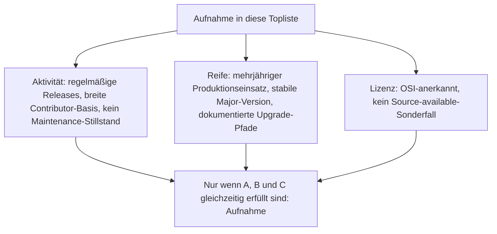
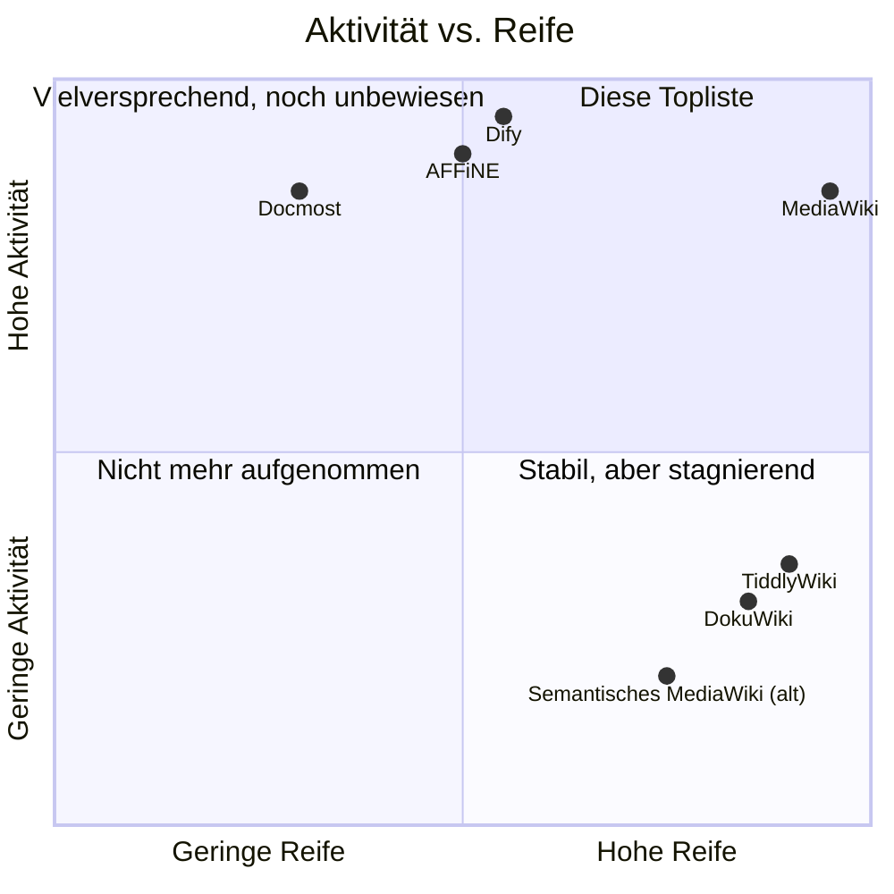
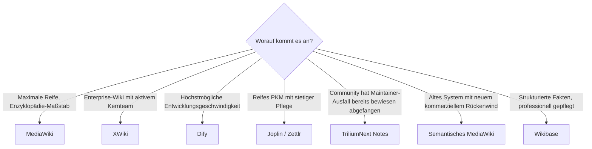

# Open-Source-Wissenssysteme mit aktiver Weiterentwicklung & hoher Reife — Top-20-Topliste

Die [Top-20-Topliste der führenden Open-Source-Wissenssysteme 2026](fuehrende-opensource-wissenssysteme-2026-topliste.md) rankt nach Verbreitung, die [Selfhosting-Topliste](wissenssysteme-selfhosting-server-topliste.md) nach Betriebstauglichkeit auf dem eigenen Server. Diese Seite legt ein drittes, strengeres Sieb an: Aufgenommen wird nur, was **beide** Kriterien gleichzeitig erfüllt — ein aktueller, nachweislich lebendiger Entwicklungsprozess (Commit-Frequenz, Release-Kadenz, Contributor-Basis) **und** ein hoher Reifegrad (mehrjähriger Produktionseinsatz, stabile Releases, kein Beta-Status). Reine Popularität oder reines Alter reichen nicht — ein System, das seit Jahren kaum noch Releases sieht, fällt ebenso heraus wie ein junges Projekt ohne belastbare Produktionshistorie.

!!! note "Hinweis: Nur OSI-anerkannte Lizenzen"
    Wie in der [Gesamtübersicht](open-source-llm-agent-mcp-systeme.md) zählen hier ausschließlich Systeme unter einer OSI-anerkannten Open-Source-Lizenz (MIT, GPL, LGPL, AGPL, BSD, Apache-2.0). Source-available-Sonderfälle wie Outline (BSL) oder Open WebUI (eigene Lizenz mit Branding-Pflicht) fallen unabhängig von Aktivität und Reife heraus — konsistent mit der Handhabung in der [MCP-Topliste](wissensmanagement-mcp-server-topliste.md#lizenz-sonderfall).

---

## Bewertungskriterien

!!! warning "Achtung: Momentaufnahme, Stand August 2026"
    Release-Kadenz und Contributor-Zahlen sind Momentaufnahmen und können sich innerhalb weniger Monate deutlich verschieben — insbesondere bei den jüngeren RAG-/Agenten-Plattformen (Rang 4, 7–10) und bei Projekten, die kürzlich einen Maintainer-Wechsel durchlaufen haben (Rang 14). Vor einer strategischen Entscheidung aktuelle Commit-Historie und Roadmap direkt im Repository prüfen.

---

## Top 20 im Überblick

| Rang | System | Kategorie | Lizenz | Seit | Aktivitäts-Nachweis |
|---|---|---|---|---|---|
| 1 | **[MediaWiki](mediawiki/evolution-digitaler-mediawiki.md)** | Wiki | GPL-2.0 | 2002 | Von der Wikimedia Foundation hauptamtlich weiterentwickelt, mehrere Releases/Jahr seit 24 Jahren ohne Unterbrechung |
| 2 | **XWiki** | Wiki | LGPL-2.1 | 2003 | Monatliche Minor-Releases, kommerziell gestütztes Kernteam (XWiki SAS) |
| 3 | **[Wiki.js](klassische-wiki-systeme-llm-integration.md)** | Wiki | AGPL-3.0 | 2016 | Aktiver Rewrite auf Wiki.js 3.0, sehr reaktionsschnelle Community |
| 4 | **[Dify](dify-agenten-workflow-plattform.md)** | Agenten-Workflow-Plattform | Apache-2.0 | 2023 | Höchste Commit-Frequenz dieser Liste, sehr große Contributor-Basis |
| 5 | **BookStack** | Wiki/Doku | MIT | 2015 | Reguläre Feature-Releases, seit über 10 Jahren durchgängig ein Kern-Maintainer plus aktive Community |
| 6 | **Joplin** | PKM/Notizen | MIT | 2016 | Sehr regelmäßige Releases über alle Plattformen (Desktop, Mobile, CLI) hinweg |
| 7 | **AFFiNE** | Wissensmanagement/Whiteboard | MIT | 2022 | Wöchentliche Canary-Builds, gut finanziertes Kernteam |
| 8 | **[Flowise](flowise-visueller-flow-builder.md)** | Agenten-Workflow-Plattform | Apache-2.0 | 2023 | Entwicklungstempo eng an LangChain-Ökosystem gekoppelt, hohe Release-Kadenz |
| 9 | **[Onyx](onyx-danswer-rag-plattform.md)** (ehem. Danswer) | RAG/Wissensmanagement | MIT (Community Edition) | 2023 | Wachsendes Connector-Ökosystem, häufige Minor-Releases |
| 10 | **[AnythingLLM](anythingllm-rag-plattform.md)** | RAG/Wissensmanagement | MIT | 2023 | Aktive Discord-getriebene Entwicklung, häufige Releases |
| 11 | **Wikibase** (Wikidata-Basis) | Strukturiertes Wissensmanagement | GPL-2.0 | 2012 | Professionell von Wikimedia Deutschland weiterentwickelt, stabile Release-Zyklen |
| 12 | **Logseq** | PKM/Outliner | AGPL-3.0 | 2020 | Aktive Migration auf die neue Datenbank-Engine (Logseq DB), kontinuierliche Weiterentwicklung |
| 13 | **[Khoj](khoj-ki-zweites-gehirn.md)** | PKM/KI-natives „zweites Gehirn" | AGPL-3.0 | 2021 | Sehr schnelle Integration neuer LLM-Fähigkeiten, aktives Kernteam |
| 14 | **TriliumNext Notes** (Community-Fork von Trilium Notes) | PKM/hierarchische Notizen | AGPL-3.0 | 2017 (Fork aktiv seit 2024) | Nach Maintainer-Pause des Originals von der Community als Fork übernommen und seither wieder sehr aktiv |
| 15 | **Docmost** | Wissensmanagement (Confluence-Alternative) | AGPL-3.0 | 2024 | Jung, aber ungewöhnlich hohe Commit-Frequenz für sein Alter, schnell wachsende Produktionsreife |
| 16 | **Standard Notes** | PKM/Notizen (Ende-zu-Ende verschlüsselt) | AGPL-3.0 | 2017 | Regelmäßige Releases, laufende externe Sicherheitsaudits als Reife-Nachweis |
| 17 | **Memos** | Leichtgewichtige Notizen | MIT | 2022 | Schlanker Scope, aber durchgängig aktiv gepflegt mit regelmäßigen Releases |
| 18 | **SilverBullet** | PKM/Markdown-Wiki | MIT | 2022 | Aktiv wachsendes Plug-System, regelmäßige Releases |
| 19 | **Zettlr** | PKM/Zettelkasten-Editor | GPL-3.0 | 2017 | Kontinuierliche Releases, breite akademische Nutzerbasis als Reife-Indikator |
| 20 | **Semantisches MediaWiki** | Wiki-Erweiterung (Semantik) | GPL-2.0+ | 2005 | Seit kommerziellem Sponsoring durch professional.wiki (ab 2023) wieder deutlich höhere Release-Kadenz, siehe [Installation](semantische-mediawiki/installieren.md) |

---

## Highlights im Detail

### TriliumNext Notes: wie ein Community-Fork Reife rettet
Der Fall Rang 14 zeigt exemplarisch, warum „Reife" allein nicht ausreicht: Das ursprüngliche Trilium Notes hatte 2024 eine längere Maintainer-Pause — technisch weiterhin reif (seit 2017 produktiv im Einsatz), aber ohne aktive Weiterentwicklung wäre es aus dieser Liste herausgefallen. Die Community-Fortführung als **TriliumNext Notes** übernahm Maintainerschaft und Release-Prozess und stellt seither beide Kriterien wieder her — ein Muster, das bei Open-Source-Projekten mit Bus-Faktor 1 immer wieder auftritt und beim Bewerten von „Aktivität" explizit mitgeprüft werden sollte.

### Semantisches MediaWiki: Reife trifft auf reaktivierte Aktivität
Semantisches MediaWiki ist mit 21 Jahren das älteste System dieser Liste und war lange Zeit eher reif als aktiv — Rang 20 markiert bewusst die Schwelle. Erst das kommerzielle Sponsoring durch professional.wiki hat die Release-Kadenz seit 2023 wieder spürbar erhöht. Ohne diese Reaktivierung wäre die Erweiterung in der reinen Reife-Betrachtung geblieben, aber aus dem strengeren Aktivitäts-Kriterium dieser Liste herausgefallen.

### Dify: maximale Aktivität bei noch wachsender Reife
Dify (Rang 4) zeigt das Gegenstück: die höchste Commit-Frequenz dieser gesamten Liste, aber mit gut drei Jahren Produktionshistorie (seit 2023) noch nicht auf dem Reifeniveau von MediaWiki oder XWiki. Die Aufnahme in die Top 5 ist ausschließlich der außergewöhnlichen Entwicklungsgeschwindigkeit und der bereits breiten Produktionsnutzung geschuldet — ein Beleg dafür, dass sehr hohe Aktivität eine noch junge Reife teilweise kompensieren kann, sofern die Produktionsnutzung real und nicht nur experimentell ist.

---

## Was bewusst nicht in dieser Liste steht

!!! warning "Achtung: Ausschluss trotz Open Source und trotz Reife"
    Drei Kategorien von Systemen fallen aus dieser strengeren Topliste heraus, obwohl sie in der [breiteren Verbreitungs-Topliste](fuehrende-opensource-wissenssysteme-2026-topliste.md) enthalten sind:

    - **Zu geringe Aktivität trotz hoher Reife**: DokuWiki (seit 2004, sehr stabil, aber deutlich seltenere Release-Zyklen als die übrigen Wiki-Systeme dieser Liste) und TiddlyWiki (seit 2004, extrem reif und portabel, aber langsamere Weiterentwicklungsgeschwindigkeit als die Top 20).
    - **Zu geringe Reife trotz hoher Aktivität**: einzelne sehr junge RAG-/Agenten-Projekte mit wöchentlichen Breaking Changes und noch fehlender mehrjähriger Produktionshistorie — bewusst nicht aufgenommen, bis sich die API-Oberfläche stabilisiert hat.
    - **Lizenzausschluss unabhängig von Aktivität/Reife**: Outline (BSL) und [Open WebUI](open-webui-rag-agenten-plattform.md) (eigene Lizenz mit Branding-Pflicht) — beide technisch stark und aktiv weiterentwickelt, aber nicht OSI-Open-Source. Details siehe [Lizenz-Sonderfälle in der MCP-Topliste](wissensmanagement-mcp-server-topliste.md#lizenz-sonderfall).

---

## Entscheidungshilfe nach Anwendungsfall

---

## 🔗 Verwandte Themen

- [Startseite](../../index.md) — zurück zur Dokumentations-Zentrale
- [Die führenden Open-Source-Wissenssysteme 2026 (Top 20)](fuehrende-opensource-wissenssysteme-2026-topliste.md) — breitere Schwester-Topliste nach Verbreitung statt strikt nach Aktivität/Reife
- [Beste Open-Source-Wissenssysteme für den eigenen Selfhosting-Server (Top 20)](wissenssysteme-selfhosting-server-topliste.md) — dieselbe Systemklasse, gerankt nach Betriebstauglichkeit
- [Open-Source-Wissenssysteme mit PostgreSQL- oder Dateiformat-Speicherung (Top 20)](postgresql-dateiformat-wissenssysteme-2026-topliste.md) — dieselben Kriterien plus zusätzlichem Filter auf einfaches Speicherbackend (PostgreSQL oder Datei, kein Pflicht-Zweitsystem)
- [Programmiersprachen für Wissenssysteme: Lizenz, Aktivität & Reife (Top 10)](programmiersprachen-wissenssysteme-aktive-reife-topliste.md) — dieselben Kriterien für Sprachen statt fertige Produkte
- [Open-Source-Wissenssysteme mit echter Echtzeit-Kollaboration (Top 15)](echtzeit-kollaboration-opensource-wissenssysteme-2026-topliste.md) — dieselben Kriterien plus zusätzlichem Filter auf natives CRDT-/OT-basiertes Multi-Cursor-Editing
- [Evolution und Architekturen digitaler Wissenssysteme](evolution-digitaler-wissenssysteme.md) — chronologisches Generationenmodell als Hintergrund
- [Beste Wissensmanagement-Systeme (Open Source) mit MCP-Server (Top 20)](wissensmanagement-mcp-server-topliste.md) — enger gefasste Schwester-Topliste mit MCP-Support als Kernkriterium
- [Migrationswege zwischen Wissenssystemen (Top 20)](migrationswege-wissenssysteme-topliste.md) — relevant, sobald ein Wechsel von einem stagnierenden zu einem aktiv gepflegten System ansteht
- [Dify: Visuelle Agenten- & Workflow-Plattform](dify-agenten-workflow-plattform.md) — vertiefend zu Rang 4
- [Khoj: KI-„Zweites Gehirn" für persönliche Wissenssuche](khoj-ki-zweites-gehirn.md) — vertiefend zu Rang 13
- [Onyx (ehem. Danswer): RAG-Plattform](onyx-danswer-rag-plattform.md) — vertiefend zu Rang 9
- [AnythingLLM: All-in-One Desktop- & Docker-RAG-Plattform](anythingllm-rag-plattform.md) — vertiefend zu Rang 10
- [Flowise: Visueller Flow-Builder für LangChain](flowise-visueller-flow-builder.md) — vertiefend zu Rang 8
