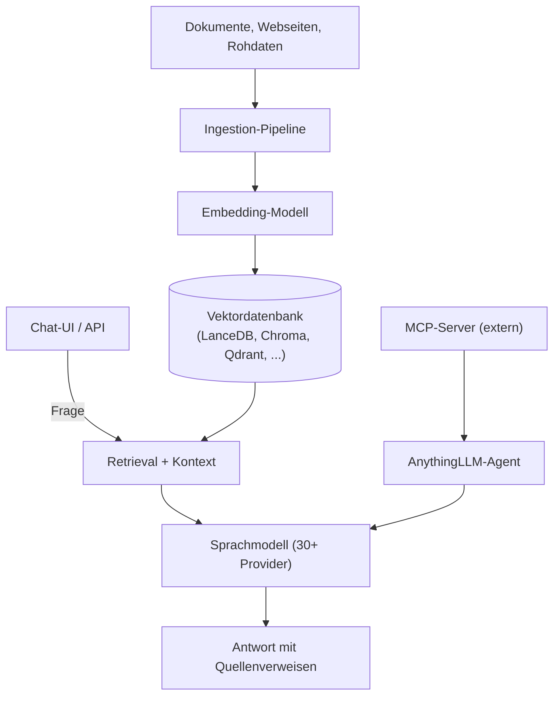

# AnythingLLM: All-in-One Desktop- & Docker-RAG-Plattform

**AnythingLLM** (Mintplex Labs) ist eine Open-Source-Anwendung, die Dokumente, Webseiten und andere Inhalte in private, durchsuchbare Chat-Kontexte verwandelt — wahlweise als lokale Desktop-App (macOS, Windows, Linux) oder als selbst gehosteter Docker-Server für mehrere Nutzer. Anders als eine reine RAG-Bibliothek liefert AnythingLLM eine vollständige Chat-Oberfläche, Rechteverwaltung, Agenten und MCP-Anbindung „out of the box" — ohne dass dafür ein separates Backend zusammengebaut werden muss.

!!! note "Hinweis: MIT-lizenziert"
    AnythingLLM ist vollständig Open Source unter der **MIT-Lizenz**: [github.com/Mintplex-Labs/anything-llm](https://github.com/Mintplex-Labs/anything-llm).

---

## Übersicht



!!! tip "Tipp: Zwei Betriebsmodi"
    **Desktop** eignet sich für den persönlichen Einsatz — alle Daten und die Vektordatenbank bleiben standardmäßig lokal auf dem Gerät. **Docker** ist der Weg für Multi-User-Betrieb mit Rechteverwaltung auf einem eigenen Server oder in der Cloud.

---

## Architektur-Bausteine

| Baustein | Funktion |
|---|---|
| **Ingestion-Pipeline** | Verarbeitet Dokumente, Webseiten und weitere Quellen zu durchsuchbarem Text |
| **Vektordatenbank** | Standardmäßig eingebettetes **LanceDB** (keine externe Infrastruktur nötig); alternativ PGVector, Pinecone, Chroma, Weaviate, Qdrant, Milvus, Zilliz |
| **LLM-Anbindung** | 30+ Provider (siehe unten), frei austauschbar pro Workspace |
| **Agents** | No-Code Agent Builder, Web-Browsing-Agenten, MCP-Werkzeuganbindung |
| **Multi-User-Layer** | Nutzerverwaltung mit Rechten pro Workspace (nur im Docker-Modus relevant) |

---

## Installation

=== "Docker (Multi-User-Server)"
    ```bash
    docker pull mintplexlabs/anythingllm

    docker run -d -p 3001:3001 \
      --cap-add SYS_ADMIN \
      -v ${PWD}/anythingllm-storage:/app/server/storage \
      -e STORAGE_DIR="/app/server/storage" \
      mintplexlabs/anythingllm
    ```
    Alternativ per `docker-compose up -d` mit dem im Repository mitgelieferten `docker-compose.yml`.

=== "Desktop (macOS / Windows / Linux)"
    Installer von [anythingllm.com](https://anythingllm.com/) laden. Läuft vollständig lokal, Vektordatenbank und Dokumente verlassen standardmäßig nie das Gerät.

!!! warning "Achtung: Ressourcenbedarf lokaler Modelle"
    Wird ein lokales Modell über Ollama oder llama.cpp eingebunden, bestimmt dessen Größe den RAM-/VRAM-Bedarf — die AnythingLLM-Anwendung selbst ist schlank, das Sprachmodell ist der eigentliche Ressourcenfaktor (siehe [Lokales RAG & LLM-Serving](../../künstliche-intelligenz/coding/lokales-rag-ollama.md)).

---

## Unterstützte LLM-Provider & Vektordatenbanken

=== "LLM-Provider (Auswahl)"
    | Kategorie | Provider |
    |---|---|
    | Cloud-APIs | OpenAI, Anthropic, Google Gemini, AWS Bedrock, Groq, Mistral, DeepSeek, Perplexity |
    | Lokal / Self-Hosted | Ollama, LM Studio, llama.cpp-kompatible Modelle |

    Details und Preise der jeweiligen Cloud-Anbieter siehe [Multi-LLM- & Sprachmodell-Anbieter im Vergleich](../../künstliche-intelligenz/coding/llm-anbieter-vergleich.md).

=== "Vektordatenbanken"
    | Typ | Optionen |
    |---|---|
    | Eingebettet (Standard) | **LanceDB** — keine externe Infrastruktur nötig |
    | Selbst gehostet | PGVector (siehe [PostgreSQL + pgvector](../daten/datenbanken/pgvector-anleitung.md)), Chroma, Weaviate, Qdrant, Milvus |
    | Managed / Cloud | Pinecone, Zilliz |

---

## Agenten & MCP-Kompatibilität

### No-Code Agent Builder
Agenten lassen sich ohne Code über eine visuelle Oberfläche zusammenstellen — inklusive Web-Browsing-Fähigkeiten für Agenten, die aktuelle Informationen außerhalb der eigenen Wissensbasis nachschlagen müssen.

### MCP-Anbindung
AnythingLLM unterstützt das **Model Context Protocol (MCP)** nativ. MCP-Server werden über eine Konfigurationsdatei eingebunden:

| Modus | Speicherort der Konfiguration |
|---|---|
| Desktop | `anythingllm_mcp_servers.json` im Plugins-Verzeichnis |
| Docker | dieselbe Datei im Storage-Bereich des Containers |

```json
{
  "mcpServers": {
    "example-server": {
      "command": "npx",
      "args": ["-y", "@example/mcp-server"],
      "anythingllm": { "autoStart": true }
    }
  }
}
```

Neben dem StdIO-Transport (`command`/`args`) unterstützt die Konfiguration auch HTTP-basierte Server über `type`/`url`/`headers` (SSE bzw. Streamable HTTP). Über die **Agent-Skills**-Seite in der Oberfläche lassen sich eingebundene MCP-Server ohne Neustart der Anwendung neu laden (Refresh) oder gezielt starten/stoppen.

!!! tip "Tipp: Intelligente Skill-Auswahl statt Voll-Kontext"
    Agents wählen die relevanten MCP-Werkzeuge situativ aus, statt bei jeder Anfrage alle verfügbaren Tool-Definitionen in den Prompt zu laden — das hält den Kontextverbrauch auch bei vielen eingebundenen MCP-Servern niedrig. Dasselbe Grundprinzip (Referenzen statt Volltext) nutzt auch [OpenWiki](openwiki-repo-dokumentation-agent.md) für seine Wiki-Seiten.

---

## Multi-User-Betrieb & Rechteverwaltung

Im Docker-Modus unterstützt AnythingLLM mehrere Nutzer mit Zugriffskontrolle pro **Workspace** — jeder Workspace hat eigene Dokumente, eigene Vektordatenbank-Kollektion und eigene Modell-Konfiguration. Das eignet sich für Teams, die getrennte, gegenseitig nicht einsehbare Wissensbereiche benötigen, ohne mehrere AnythingLLM-Instanzen betreiben zu müssen.

---

## Deployment-Optionen

Neben dem lokalen Docker-Host unterstützt AnythingLLM Deployment bei **AWS, GCP, DigitalOcean, Render.com, Railway, Elestio und Northflank** — jeweils über vorgefertigte Templates oder Docker-Images, ohne eigene Infrastruktur-Automatisierung aufsetzen zu müssen.

---

## Einordnung gegenüber verwandten Tools

| Kriterium | AnythingLLM | [Onyx](onyx-danswer-rag-plattform.md) | [OpenWiki](openwiki-repo-dokumentation-agent.md) |
|---|---|---|---|
| Kernfokus | Lokale/private Dokumenten-Chats, Desktop-first | Enterprise-Suche über viele laufend synchronisierte Datenquellen | Automatisch generierte Repo-Dokumentation für Coding-Agenten |
| Lizenz | MIT | MIT (Community Edition) | MIT |
| MCP-Support | offiziell, nativ | offiziell (`onyx-mcp-server`) | Sonderfall: Referenzen in `AGENTS.md`/`CLAUDE.md` statt MCP |
| Vektordatenbank | LanceDB (Standard) + 6 weitere wählbar | Hybrid-Index (Vektor + Keyword), fest integriert | kein Vektorindex — generiertes Markdown |
| Typischer Einsatz | Einzelperson oder kleines Team, schneller Einstieg | Unternehmen mit vielen Connectoren (Slack, Drive, Confluence, …) | Software-Repositories mit KI-Coding-Agenten |

!!! tip "Tipp: Auswahl nach Anwendungsfall"
    - **Schneller lokaler Einstieg ohne Server-Infrastruktur** → AnythingLLM Desktop.
    - **Team-Wissensbasis mit vielen externen Datenquellen und Enterprise-Features (RBAC, SSO)** → [Onyx](onyx-danswer-rag-plattform.md).
    - **Dokumentation eines Code-Repositories automatisch aktuell halten** → [OpenWiki](openwiki-repo-dokumentation-agent.md).

---

## Verwandte Themen

- [Startseite](../../index.md) — zurück zur Dokumentations-Zentrale
- [Dokumentenerstellung, Wikis & Notebooks](index.md) — Gesamtübersicht aller Dokumentations-Systeme
- [Onyx (ehem. Danswer): RAG-Plattform](onyx-danswer-rag-plattform.md) — Enterprise-Alternative mit breiterer Connector-Anbindung
- [OpenWiki: Repo-Dokumentations-Agent (LangChain)](openwiki-repo-dokumentation-agent.md) — verwandtes, aber anders fokussiertes Tool
- [Lokales RAG & LLM-Serving](../../künstliche-intelligenz/coding/lokales-rag-ollama.md) — Grundlagen zum lokalen Modellbetrieb via Ollama
- [Multi-LLM- & Sprachmodell-Anbieter im Vergleich](../../künstliche-intelligenz/coding/llm-anbieter-vergleich.md) — Preise der von AnythingLLM unterstützten Cloud-Provider
