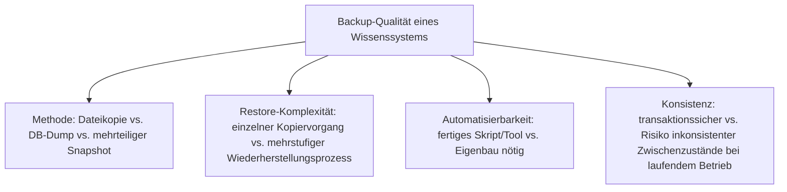
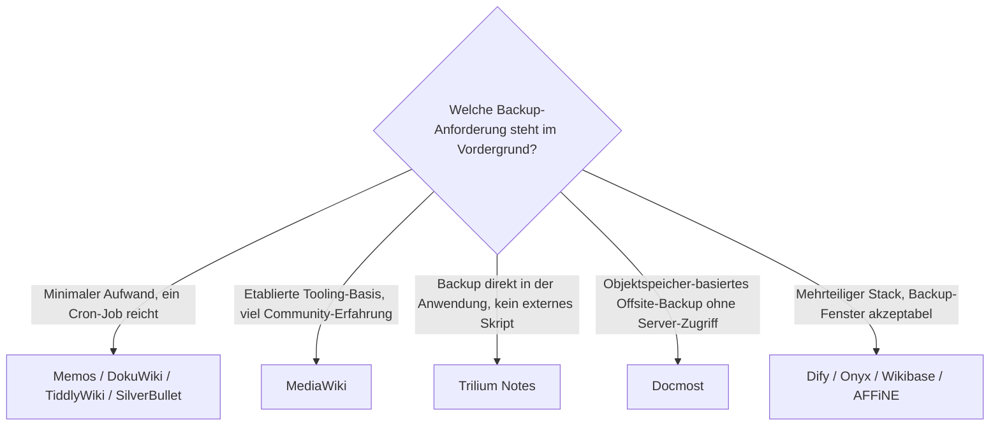

# Backup-Strategien für Wissenssysteme — Top-20-Topliste

Die [Top-20-Topliste für den eigenen Selfhosting-Server](wissenssysteme-selfhosting-server-topliste.md) rankt Wissenssysteme nach Deployment-Aufwand, erwähnt die Backup-Story dabei aber nur als eines von mehreren Kriterien. Dieses Kapitel vertieft genau diesen einen Aspekt: Für dieselben 20 Systeme — in identischer Rangfolge, damit beide Listen sich direkt gegenüberstellen lassen — wird hier die konkrete **Backup-Methode, Restore-Komplexität und Automatisierbarkeit** betrachtet.

!!! note "Hinweis: Backup-Aufwand korreliert stark mit dem Deployment-Modell aus der Selfhosting-Topliste"
    Die „ein Prozess, eine Datei"-Systeme (Rang 1–4) haben fast immer die einfachste Backup-Story — wenig überraschend, da ein einzelnes Datenverzeichnis ohne separaten Datenbankdienst auch weniger Angriffsfläche für inkonsistente Backups bietet. Details zum Deployment selbst siehe [Selfhosting-Topliste](wissenssysteme-selfhosting-server-topliste.md).

---

## Bewertungskriterien

!!! warning "Achtung: Datenbank-Dump ≠ vollständiges Backup"
    Bei allen Systemen mit separater Datenbank (Rang 5, 7–15, 18, 20) sichert ein reiner `pg_dump`/`mysqldump` **nicht** hochgeladene Dateien, Konfigurationsdateien oder (bei Vektor-DBs) Embedding-Indizes. Vollständige Backup-Strategien in dieser Liste kombinieren daher immer DB-Dump **und** Datei-/Volume-Sicherung — siehe [PostgreSQL Backup, WAL-Archivierung & Recovery](../../entwicklung/infrastruktur/postgresql-backup-restore.md) als Referenz für die Datenbankschicht.

---

## Top 20 im Überblick

| Rang | System | Backup-Methode | Restore-Komplexität | Automatisierung | Besonderheit |
|---|---|---|---|---|---|
| 1 | **Memos** | Kopie der SQLite-Datei (+ Upload-Verzeichnis) | sehr gering — eine Datei zurückkopieren | einfaches `cron` + `rsync` ausreichend | Kein DB-Server-Stopp nötig bei SQLite im WAL-Modus |
| 2 | **DokuWiki** | Kopie des `data/`-Verzeichnisses (Seiten, Medien, Metadaten als Textdateien) | sehr gering — Verzeichnis zurückkopieren | `cron` + `tar`/`rsync`, offizielles `backup`-Plugin verfügbar | Backup ist menschenlesbar prüfbar, kein Binärformat |
| 3 | **TiddlyWiki** (Node.js-Server) | Kopie der einzelnen HTML-Datei bzw. `.tid`-Verzeichnisses | minimal — ein Dateikopiervorgang | trivial per `cron` scriptbar | Versionierung via Git statt dediziertem Backup-Tool möglich |
| 4 | **SilverBullet** | Kopie des Space-Verzeichnisses (Markdown-Dateien + SQLite-Index) | gering — Index wird beim nächsten Start neu aufgebaut | `cron` + `rsync`, Index-Neuaufbau automatisch | Verlust des Index unkritisch — Markdown-Dateien bleiben Quelle der Wahrheit |
| 5 | **Wiki.js** | `pg_dump` der PostgreSQL-DB + Kopie des Upload-Verzeichnisses | mittel — DB-Restore und Datei-Restore getrennt einspielen | offizielles Docker-Compose-Beispiel mit Backup-Sidecar-Container | Git-Sync-Modul als zusätzliche, DB-unabhängige Versionierungsebene |
| 6 | **[MediaWiki](mediawiki/backup.md)** | XML-Dump (`dumpBackup.php`) + DB-Dump + Kopie von `images/` | mittel–hoch — mehrstufiger Restore-Prozess, siehe [Wiederherstellen](mediawiki/wiederherstellen.md) | ausgereiftes Eigenbau-Skript etabliert, siehe [MediaWiki Backup & Restore Scripts](mediawiki/mediawiki-backup-skripte.md) | Größte Backup-Tooling-Reife dieser Liste durch jahrzehntelange Praxis (Wikipedia-Dumps als Vorbild) |
| 7 | **BookStack** | `mysqldump` + Kopie des `storage/uploads`-Verzeichnisses | mittel | offizielles Backup-Skript im Projekt-Wiki dokumentiert | Klare Trennung von Content-DB und Datei-Uploads erleichtert selektiven Restore |
| 8 | **Joplin Server** | `pg_dump` der Sync-Server-DB | gering — Clients synchronisieren Inhalte ohnehin lokal | `cron` + `pg_dump`, Standard-PostgreSQL-Tooling | Server-Backup ist Zusatzsicherung — jeder Client hält bereits eine vollständige Kopie |
| 9 | **Trilium Notes** (`trilium-server`) | Kopie der eingebauten Datenbankdatei (Backup-Funktion im UI integriert) | gering — eingebauter „Backup jetzt"-Knopf im Web-UI | UI-eigener Zeitplan (täglich/wöchentlich/monatlich) ohne externes Tooling | Einzige Lösung dieser Liste mit Backup-Scheduling direkt in der Anwendungs-UI |
| 10 | **Docmost** | `pg_dump` + Kopie des Objektspeichers (lokal oder S3-kompatibel) | mittel | offizielle Docker-Compose-Backup-Doku vorhanden | S3-kompatibler Objektspeicher erlaubt Backup ohne Datei-Zugriff auf den Server selbst |
| 11 | **Khoj** | `pg_dump` + Kopie des Embedding-Index-Verzeichnisses | mittel–hoch — Embedding-Index-Neuaufbau bei Verlust zeitintensiv | `cron` + Skript-Eigenbau nötig, kein offizielles Tool | Embedding-Index ist rekonstruierbar, aber bei großem Dokumentenbestand teuer — Backup lohnt sich hier besonders |
| 12 | **AnythingLLM** | Kopie des Storage-Verzeichnisses (eingebaute Vektor-DB + SQLite/Postgres) | mittel | Community-Skripte, kein offizielles Backup-Tool | Ein-Container-Deployment vereinfacht Backup auf einen einzelnen Volume-Snapshot |
| 13 | **[XWiki](xwiki/installieren.md)** | `pg_dump`/`mysqldump` + Kopie des `data/`-Verzeichnisses (Attachments, Index) | mittel–hoch | Standard-DB-Tooling, kein XWiki-eigenes Backup-Skript im Kern | Enterprise-Erweiterungen (LDAP-Konfiguration etc.) separat sichern nicht vergessen |
| 14 | **AFFiNE** (Self-Host-Variante) | `pg_dump` + Kopie mehrerer Docker-Volumes (Dokumente, Blobs) | hoch — mehrere Volumes müssen konsistent zueinander gesichert werden | Docker-Compose-Backup-Beispiel in der Community, kein offizielles Kern-Tool | Mehrteiligster Stack im „einfachen" Cluster dieser Liste — Snapshot aller Volumes gleichzeitig empfohlen |
| 15 | **Wikibase** (Wikidata-Basis) | MediaWiki-XML-Dump + Blazegraph-Journal-Kopie | hoch — zwei unabhängige Speichersysteme (MediaWiki-DB + Triple-Store) müssen synchron gesichert werden | offizielles `wikibase-docker`-Compose bringt Volume-Struktur mit, Backup-Logik selbst zu ergänzen | Triple-Store-Restore erfordert Neuindizierung — zeitintensivster Restore-Fall dieser Liste |
| 16 | **Semantisches MediaWiki** | wie Rang 6 (MediaWiki-Backup) + zusätzlich `rebuildData.php` nach Restore | wie Rang 6, plus ein zusätzlicher Schritt | erbt MediaWiki-Tooling vollständig | Semantische Daten müssen nach jedem Restore explizit neu aufgebaut werden — leicht zu vergessen |
| 17 | **Logseq** (Sync-Server-Variante) | Kopie des lokalen Graph-Verzeichnisses (Markdown/EDN-Dateien) | minimal | Git-Versionierung des Graph-Verzeichnisses als De-facto-Standard in der Community | Lokal-first-Architektur macht den „Server" für Backups fast irrelevant — die eigentliche Quelle bleibt lokal |
| 18 | **Dify** | `pg_dump` + Vektor-DB-Snapshot + Kopie mehrerer Docker-Volumes | hoch — API-, Worker- und Vektor-DB-Zustand müssen konsistent zueinander sein | offizielle Backup-Hinweise im Deployment-Guide, Automatisierung liegt beim Betreiber | Mehrteiligster Compose-Stack dieser Liste — Backup-Fenster mit kurzem Stopp aller Container empfohlen |
| 19 | **Flowise** | Kopie des Storage-Verzeichnisses + optionaler DB-Dump (bei externer DB) | gering–mittel | `cron` + einfaches Skript ausreichend | Deutlich einfacherer Restore als Dify bei ähnlichem Funktionsumfang, da nur ein Container betroffen |
| 20 | **[Onyx](onyx-danswer-rag-plattform.md)** (ehem. Danswer) | `pg_dump` + Vespa/Elasticsearch-Snapshot + Redis-Zustand (meist verzichtbar, da Cache) | sehr hoch — mehrere unabhängige Datenspeicher, Suchindex-Neuaufbau bei Snapshot-Verlust zeitintensiv | offizielle Backup-Dokumentation für Enterprise-Betrieb vorhanden | Aufwendigste Backup-Strategie dieser Liste — korrespondiert mit dem höchsten Ressourcenbedarf aus der Selfhosting-Topliste |

---

## Highlights im Detail

### Rang 1–4 & 17: Backup als Nebeneffekt der Architektur
Bei Memos, DokuWiki, TiddlyWiki, SilverBullet und der lokal-first arbeitenden Logseq-Variante ist eine solide Backup-Story kein zusätzliches Feature, sondern eine direkte Folge des Datenmodells: **Klartext- oder Einzeldateiformate ohne separaten Datenbankdienst** lassen sich mit `rsync` oder sogar Git versionieren, ohne dass ein Konsistenzproblem zwischen mehreren Speichersystemen entstehen kann.

### Rang 6: die mit Abstand ausgereifteste Tooling-Basis
[MediaWiki](mediawiki/backup.md) profitiert von Wikipedias eigenen, seit über 20 Jahren öffentlich dokumentierten Dump-Prozessen. Das in diesem Repository etablierte [Backup- & Restore-Skript](mediawiki/mediawiki-backup-skripte.md) sowie der dokumentierte [Wiederherstellungsprozess](mediawiki/wiederherstellen.md) sind direkt ableitbar aus dieser jahrzehntelangen Praxis — kein anderes System dieser Liste bietet eine vergleichbar breite Erfahrungsbasis.

### Rang 14–15, 18, 20: der „mehrere Speicher gleichzeitig"-Cluster
AFFiNE, Wikibase, Dify und Onyx teilen ein gemeinsames Risiko: Ihr Zustand verteilt sich auf **mehrere unabhängige Speichersysteme** (relationale DB, Objektspeicher, Vektor-/Such-Index, Triple-Store), die zum gleichen Zeitpunkt konsistent gesichert werden müssen. Ein Backup nur der Datenbank ohne den zugehörigen Such-/Vektor-Index-Snapshot führt hier zu einem technisch wiederherstellbaren, aber inhaltlich unvollständigen System — der Index muss dann kostenintensiv neu aufgebaut werden.

---

## Entscheidungshilfe nach Backup-Anforderung

!!! tip "Tipp: Backup-Test ist Teil der Backup-Strategie"
    Ein Backup ohne getesteten Restore ist keine Backup-Strategie — besonders bei den Systemen aus Rang 14–15, 18, 20 mit mehreren Speicherschichten lohnt sich ein regelmäßiger Restore-Test auf einer separaten Testinstanz. Für die Datenbankschicht liefert [PostgreSQL Backup, WAL-Archivierung & Recovery](../../entwicklung/infrastruktur/postgresql-backup-restore.md) das Grundmuster, das sich auf die meisten Systeme dieser Liste übertragen lässt.

---

## 🔗 Verwandte Themen

- [Startseite](../../index.md) — zurück zur Dokumentations-Zentrale
- [Beste Open-Source-Wissenssysteme für den eigenen Selfhosting-Server (Top 20)](wissenssysteme-selfhosting-server-topliste.md) — Ausgangs-Topliste, deren Rangfolge diese Seite für die Backup-Perspektive übernimmt
- [Die führenden Open-Source-Wissenssysteme 2026 (Top 20)](fuehrende-opensource-wissenssysteme-2026-topliste.md) — Schwester-Topliste nach Verbreitung/Reife
- [PostgreSQL Backup, WAL-Archivierung & Recovery](../../entwicklung/infrastruktur/postgresql-backup-restore.md) — vertiefend zur Datenbankschicht hinter Rang 5, 7–15, 18, 20
- [MediaWiki Backup erstellen](mediawiki/backup.md) — vertiefend zu Rang 6
- [MediaWiki-Dump wiederherstellen](mediawiki/wiederherstellen.md) — vertiefend zu Rang 6
- [Praxis-Guide: MediaWiki Backup & Automated Restore Scripts](mediawiki/mediawiki-backup-skripte.md) — vertiefend zu Rang 6
- [Onyx (ehem. Danswer): RAG-Plattform](onyx-danswer-rag-plattform.md) — vertiefend zu Rang 20
- [KVM-Server mieten](../../entwicklung/infrastruktur/kvm-server-mieten.md) — Offsite-Backup-Zielserver als Ergänzung zu dieser Liste
