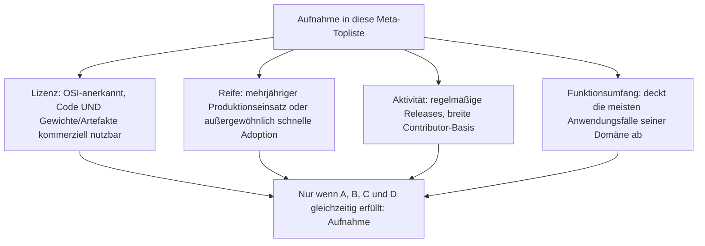
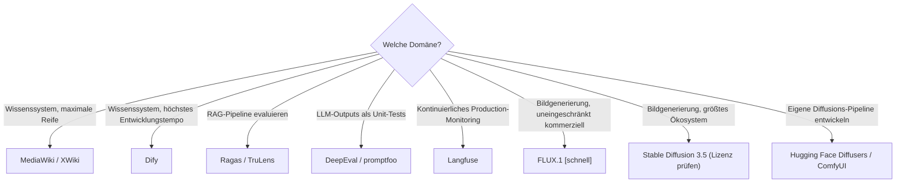

# Beste Software 2026: Wissenssysteme, Evaluation & Generatoren — Top-20-Meta-Topliste

Drei eigenständige Toplisten decken diese Kategorien bereits einzeln ab: die [führenden Open-Source-Wissenssysteme](fuehrende-opensource-wissenssysteme-2026-topliste.md) bzw. die nach [Aktivität und Reife gefilterte Variante](aktive-reife-opensource-wissenssysteme-2026-topliste.md), die [besten KI-Evaluationswerkzeuge](../../künstliche-intelligenz/ki-evaluation-2026-topliste.md) und die [besten KI-Modell-Generatoren](../../künstliche-intelligenz/ki-modell-generatoren-2026-topliste.md). Diese Seite führt alle drei Kategorien **domänenübergreifend nach denselben Kriterien** zusammen: höchster Reifegrad, sehr aktive Entwicklergemeinschaft, Open Source **und** zugleich uneingeschränkt kommerziell nutzbar, sowie größter Funktionsumfang. Aufgenommen wird nur, was in seiner jeweiligen Einzel-Topliste zur Spitzengruppe zählt — diese Seite ist also eine gerankte Auswahl, keine neue Primärbewertung.

!!! note "Hinweis: strengeres Lizenzkriterium als in den Einzel-Toplisten"
    Bei KI-Modell-Generatoren wird zwischen **Code-Lizenz** (meist Apache-2.0/MIT, unkritisch) und **Gewichts-Lizenz** (bei Bild-/Videomodellen häufig eingeschränkt auf Nicht-Enterprise-Nutzung) unterschieden — siehe [Lizenzhinweis unten](#lizenzhinweis-code-lizenz-ist-nicht-gewichts-lizenz). Nur Einträge, bei denen **beide** Ebenen uneingeschränkt kommerziell nutzbar sind, erhalten „Ja, uneingeschränkt".

---

## Bewertungskriterien

---

## Top 20 im Überblick

| Rang | Domäne | System | Lizenz | Kommerziell nutzbar | Seit | Besondere Stärke |
|---|---|---|---|---|---|---|
| 1 | Wissenssystem | **[MediaWiki](../dokumentation/mediawiki/evolution-digitaler-mediawiki.md)** | GPL-2.0 | Ja, uneingeschränkt | 2002 | Größte installierte Basis, 24 Jahre ununterbrochene hauptamtliche Weiterentwicklung |
| 2 | Evaluation | **Ragas** | Apache-2.0 | Ja, uneingeschränkt | 2023 | De-facto-Standard für RAG-Metriken (Faithfulness, Context Precision/Recall) |
| 3 | Wissenssystem | **XWiki** | LGPL-2.1 | Ja, uneingeschränkt | 2003 | Monatliche Releases, kommerziell gestütztes Kernteam, tiefe Enterprise-Integration |
| 4 | Generator | **Hugging Face Diffusers** | Apache-2.0 | Ja, uneingeschränkt | 2022 | Standard-Bibliothek für praktisch alle offenen Diffusionsmodelle, sehr große Contributor-Basis |
| 5 | Wissenssystem | **[Dify](dify-agenten-workflow-plattform.md)** | Apache-2.0 | Ja, uneingeschränkt | 2023 | Höchste Commit-Frequenz aller Wissenssysteme, visueller Agenten-/RAG-Workflow-Builder |
| 6 | Evaluation | **DeepEval** | Apache-2.0 | Ja, uneingeschränkt | 2023 | Pytest-artige Unit-Tests für LLM-Outputs, sehr breite Metrik-Bibliothek |
| 7 | Wissenssystem | **BookStack** | MIT | Ja, uneingeschränkt | 2015 | Über 10 Jahre durchgängig aktiv, sehr niedrige Einstiegshürde |
| 8 | Generator | **FLUX.1 [schnell]** (Black Forest Labs) | Apache-2.0 (Code & Gewichte) | Ja, uneingeschränkt | 2024 | Einziges Spitzenmodell dieser Liste mit vollständig kommerziell freier Gewichts-Lizenz |
| 9 | Evaluation | **promptfoo** | MIT | Ja, uneingeschränkt | 2023 | CLI-first Eval direkt in CI/CD, eingebautes Red-Teaming |
| 10 | Wissenssystem | **Joplin** | MIT | Ja, uneingeschränkt | 2016 | Sehr regelmäßige Releases über alle Plattformen hinweg |
| 11 | Generator | **ComfyUI** | GPL-3.0 | Ja (Copyleft bei Weitergabe) | 2023 | Node-basierte Referenzoberfläche für komplexe Diffusions-Pipelines |
| 12 | Wissenssystem | **AFFiNE** | MIT | Ja, uneingeschränkt | 2022 | Wöchentliche Canary-Builds, gut finanziertes Kernteam |
| 13 | Evaluation | **Langfuse** | MIT (Self-Host-Kern) | Ja, uneingeschränkt (Self-Host) | 2022 | Größte Community dieser Domäne, Observability plus Continuous Eval kombiniert |
| 14 | Wissenssystem | **[Onyx](onyx-danswer-rag-plattform.md)** (ehem. Danswer) | MIT (Community Edition) | Ja, uneingeschränkt | 2023 | 50+ Connectoren, übernimmt Zugriffsrechte aus Quellsystemen |
| 15 | Generator | **ControlNet** | Apache-2.0 (Code) | Ja, uneingeschränkt (Code) | 2023 | Strukturelle Steuerung (Pose, Kanten, Tiefe) bestehender Diffusionsmodelle |
| 16 | Evaluation | **TruLens** | MIT | Ja, uneingeschränkt | 2023 | RAG-Triade (Groundedness, Context Relevance, Answer Relevance) |
| 17 | Wissenssystem | **Wikibase** (Wikidata-Basis) | GPL-2.0 | Ja, uneingeschränkt | 2012 | Professionell von Wikimedia Deutschland weiterentwickelt, strukturierte Fakten |
| 18 | Evaluation | **Giskard** | Apache-2.0 | Ja, uneingeschränkt | 2021 | Testing plus automatisierte Vulnerability-Scans für ML- und LLM-Modelle |
| 19 | Wissenssystem | **Logseq** | AGPL-3.0 | Ja (Copyleft bei SaaS-Weitergabe) | 2020 | Blockbasierter Wissensgraph, aktive Migration auf neue Datenbank-Engine |
| 20 | Generator | **Stable Diffusion 3.5** | Stability AI Community License | Eingeschränkt, siehe unten | 2024 | Größtes Community-Ökosystem aller Diffusionsmodelle — Enterprise-Schwelle beachten |

---

## Highlights im Detail

### Domäne Wissenssystem: Reife und Aktivität schlagen reine Popularität
MediaWiki, XWiki, BookStack und Joplin zeigen, dass mehrjährige Produktionshistorie mit kontinuierlicher Aktivität kombinierbar bleibt — Details zur Methodik in der [Aktivitäts-/Reife-Topliste](aktive-reife-opensource-wissenssysteme-2026-topliste.md).

### Domäne Evaluation: die jüngste, am schnellsten wachsende Kategorie
Alle sechs aufgenommenen Evaluationswerkzeuge sind seit 2021 oder jünger und ausnahmslos permissiv lizenziert (MIT/Apache-2.0) — ein Muster, das sich deutlich von der älteren Wissenssysteme-Domäne mit ihrem GPL-/AGPL-Anteil unterscheidet, siehe [Evolution digitaler KI-Evaluationswerkzeuge](../../künstliche-intelligenz/evolution-digitaler-ki-evaluation.md).

### Domäne Generator: Code offen heißt nicht automatisch Gewichte frei
Nur FLUX.1 [schnell], ComfyUI und ControlNet erreichen in dieser Domäne „uneingeschränkt kommerziell nutzbar" auf beiden Ebenen (Code und Modellgewichte) — Stable Diffusion 3.5 bleibt trotz größtem Ökosystem wegen der Enterprise-Schwelle seiner Community License nur eingeschränkt einsetzbar, siehe Lizenzhinweis unten.

---

## Lizenzhinweis: Code-Lizenz ist nicht Gewichts-Lizenz

!!! warning "Achtung: bei KI-Modell-Generatoren zwei Lizenzebenen getrennt prüfen"
    Anders als bei klassischer Software fallen bei generativen Bild-/Videomodellen zwei Lizenzen auseinander:

    - **Code-Lizenz** (Trainings-/Inferenz-Bibliothek, z. B. Diffusers, ComfyUI, ControlNet-Repository) — hier ist die Lage meist eindeutig OSI-konform (Apache-2.0, GPL-3.0).
    - **Gewichts-Lizenz** (die trainierten Modell-Checkpoints selbst) — hier reicht die Spanne von vollständig offen (FLUX.1 [schnell], Apache-2.0) bis zu umsatzabhängig eingeschränkt (**Stable Diffusion 3.5**, Stability AI Community License: kostenlos nur unterhalb einer Jahresumsatz-Schwelle, darüber ist eine kostenpflichtige Enterprise-Lizenz nötig).

    Vor kommerziellem Einsatz **beide Ebenen einzeln** im jeweiligen Repository bzw. auf der Modellkarte prüfen — eine offene Code-Lizenz sagt nichts über die Nutzbarkeit der mitgelieferten Gewichte aus.

---

## Was bewusst nicht in dieser Liste steht

!!! warning "Achtung: Ausschluss trotz technischer Stärke"
    - **Geschlossene Modelle ohne Selbsthosting**: Midjourney, DALL-E 3, Sora — technisch führend, aber weder Open Source noch selbst betreibbar, daher kein Bestandteil einer Open-Source-Meta-Topliste.
    - **Lizenz-Sonderfälle**: Arize Phoenix (Elastic License 2.0) und Outline/Open WebUI fallen unabhängig von Reife und Aktivität heraus — Details siehe [Lizenz-Sonderfall in der Evaluationstopliste](../../künstliche-intelligenz/ki-evaluation-2026-topliste.md#lizenz-sonderfall-arize-phoenix) bzw. [in der Wissenssysteme-Topliste](fuehrende-opensource-wissenssysteme-2026-topliste.md#lizenz-sonderfalle-technisch-stark-aber-nicht-osi-open-source).
    - **Zu geringe Aktivität trotz hoher Reife**: DokuWiki und TiddlyWiki — Details siehe [Aktivitäts-/Reife-Topliste](aktive-reife-opensource-wissenssysteme-2026-topliste.md#was-bewusst-nicht-in-dieser-liste-steht).

---

## Entscheidungshilfe nach Anwendungsfall

---

## 🔗 Verwandte Themen

- [Startseite](../../index.md) — zurück zur Dokumentations-Zentrale
- [Die führenden Open-Source-Wissenssysteme 2026 (Top 20)](fuehrende-opensource-wissenssysteme-2026-topliste.md) — vollständige Einzel-Topliste der Domäne Wissenssystem
- [Open-Source-Wissenssysteme mit aktiver Weiterentwicklung & hoher Reife (Top 20)](aktive-reife-opensource-wissenssysteme-2026-topliste.md) — strenger gefilterte Schwester-Topliste, methodische Grundlage dieser Meta-Topliste
- [Beste KI-Evaluationswerkzeuge 2026 (Top 15)](../../künstliche-intelligenz/ki-evaluation-2026-topliste.md) — vollständige Einzel-Topliste der Domäne Evaluation
- [Evolution und Architekturen digitaler KI-Evaluationswerkzeuge](../../künstliche-intelligenz/evolution-digitaler-ki-evaluation.md) — chronologisches Generationenmodell der Evaluationswerkzeuge
- [Beste KI-Modell-Generatoren 2026 (Top 15)](../../künstliche-intelligenz/ki-modell-generatoren-2026-topliste.md) — vollständige Einzel-Topliste der Domäne Generator
- [Evolution und Architekturen digitaler KI-Modell-Generatoren](../../künstliche-intelligenz/evolution-digitaler-ki-modell-generatoren.md) — chronologisches Generationenmodell der Generatoren
- [Evolution und Architekturen digitaler Wissenssysteme](evolution-digitaler-wissenssysteme.md) — chronologisches Generationenmodell der Wissenssysteme
- [Open-Source-Wissenssysteme mit PostgreSQL- oder Dateiformat-Speicherung (Top 22)](postgresql-dateiformat-wissenssysteme-2026-topliste.md) — dieselbe Wissenssysteme-Domäne, zusätzlich gefiltert auf einfaches Speicherbackend
