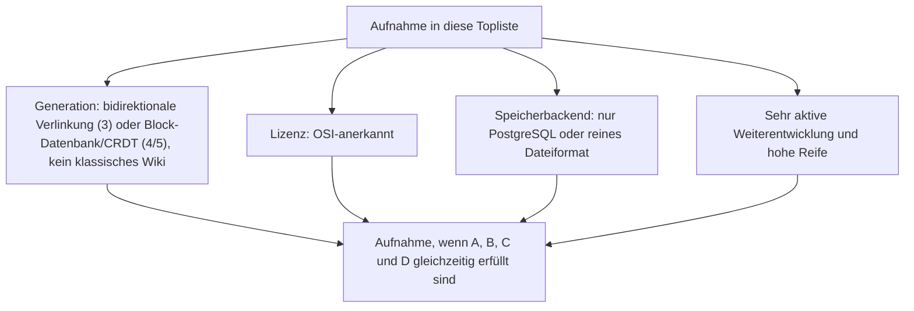
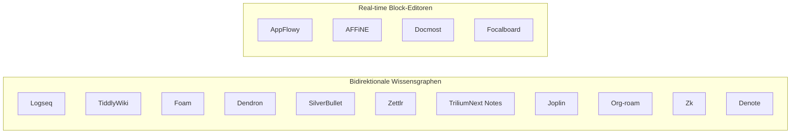
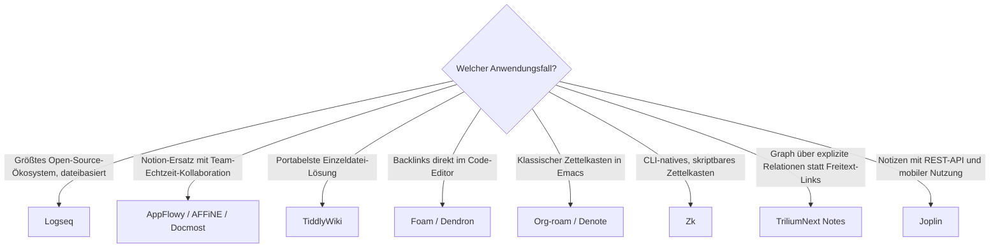

# Bidirektionale Wissensgraphen & Real-time Block-Editoren (PKM): Open Source mit PostgreSQL-/Dateiformat-Speicherung — Top-15-Topliste

Die [Beste PKM-Wissensgraphen & Block-Editoren 2026 (Top 20)](pkm-wissensgraphen-2026-topliste.md) rankt die gesamte Kategorie unabhängig von Lizenz — proprietäre Marktführer wie Obsidian, Notion, Roam Research und Tana stehen dort gleichberechtigt neben Open-Source-Alternativen. Diese Seite wendet auf genau zwei Architektur-Generationen dieser Kategorie — **Generation 3 (bidirektionale Verlinkung)** und **Generation 4/5 (Block-Datenbanken & CRDT-Echtzeit-Editing)** — die inzwischen etablierten strengeren Kriterien an: nur OSI-Open-Source, Content-Persistenz ausschließlich in PostgreSQL oder reinem Dateiformat, sehr aktive Weiterentwicklung, hohe Reife.

!!! note "Hinweis: Nur OSI-anerkannte Lizenzen"
    Wie in der [Gesamtübersicht](open-source-llm-agent-mcp-systeme.md) zählen hier ausschließlich Systeme unter einer OSI-anerkannten Open-Source-Lizenz (MIT, GPL, LGPL, AGPL, BSD, Apache-2.0). Das kostet dieser Liste die beiden bekanntesten Vertreter der Basis-Topliste: **Obsidian** (proprietäre Freeware, kein offener Quellcode) und **Anytype** (eigenes CRDT-Protokoll „any-sync", Lizenzstatus 2026 nicht durchgängig OSI-konform).

!!! tip "Tipp: Abgrenzung zu bereits bestehenden Toplisten"
    Klassische Wiki-Engines mit „Was verweist hierher"-Funktion (MediaWiki, XWiki, DokuWiki …) sind hier bewusst ausgeklammert — sie stehen bereits in [Beste Wiki-Engines 2026](wiki-engines-2026-topliste.md) und [Wiki-Engines mit PostgreSQL-/Dateiformat-Speicherung](wiki-engines-postgresql-dateiformat-2026-topliste.md). Die frühen Zettelkasten-Pioniere (Generation 2: The Archive, TheBrain, Tinderbox) und die räumlichen/KI-nativen Werkzeuge (Generation 6: Heptabase, Reflect Notes, Capacities) sind ebenfalls proprietär und fallen deshalb ohnehin heraus — Details siehe [Basis-Topliste](pkm-wissensgraphen-2026-topliste.md).

---

## Bewertungskriterien

!!! warning "Achtung: Momentaufnahme, Stand August 2026 — bewusst kürzer als 20"
    Von den 20 Systemen der [Basis-Topliste](pkm-wissensgraphen-2026-topliste.md) sind 14 proprietär (Notion, Roam Research, Tana, Craft, Coda, Heptabase, Reflect Notes, Mem, Capacities, The Archive, TheBrain, Tinderbox, Letta, Obsidian) und fallen allein deshalb heraus. Um die verbleibende Systemklasse trotzdem aussagekräftig zu füllen, ergänzt diese Seite fünf Open-Source-Werkzeuge aus dem Emacs-/CLI-Umfeld (Org-roam, Zk, Denote) sowie zwei Real-time-Block-Editoren (Docmost, Focalboard), die in der Basis-Topliste keinen Platz hatten. Auch damit reicht es ehrlich nur zu 15 statt 20 Rängen.

---

## Top 15 im Überblick

| Rang | System | Architektur | Lizenz | Speicherbackend | Aktivität/Reife |
|---|---|---|---|---|---|
| 1 | **[Logseq](evolution-digitaler-wissenssystem-programmiersprachen.md#generation-5-javascripttypescript-clojure-vollstack-und-funktionale-sprachen-moderner-pkm-web-apps-ab-2012)** | Bidirektionale Verlinkung (Outliner) | AGPL-3.0 | Markdown-/Org-Dateien (optional SQLite bei Logseq DB) | Datalog-Wissensgraph-Kern, aktive Migration auf neue DB-Engine |
| 2 | **AppFlowy** | Block-Datenbank/CRDT | AGPL-3.0 | PostgreSQL (über AppFlowy Cloud) | Reifste Open-Source-Notion-Alternative, aktive Rust-CRDT-Engine |
| 3 | **AFFiNE** | Block-Datenbank/CRDT | MIT | PostgreSQL (Selfhosting) | Blocks und Whiteboard in einer Engine, wöchentliche Canary-Builds |
| 4 | **Docmost** | Block-Datenbank/CRDT | AGPL-3.0 | PostgreSQL | Notion-artige Blocks, jung aber sehr hohe Commit-Frequenz |
| 5 | **TiddlyWiki** | Bidirektionale Verlinkung (nicht-linear) | BSD-3-Clause | Einzeldatei (HTML) | Ununterbrochen gepflegt seit 2004 |
| 6 | **Foam** | Bidirektionale Verlinkung | MIT | Markdown-Dateien | VS-Code-natives Backlink-System |
| 7 | **Dendron** | Bidirektionale Verlinkung | MIT/Apache-2.0 | Markdown-Dateien | Hierarchisches Namensschema kombiniert mit Backlinks, VS-Code-nativ |
| 8 | **SilverBullet** | Bidirektionale Verlinkung | MIT | Markdown-Dateien | Aktiv wachsendes Plug-System |
| 9 | **Zettlr** | Bidirektionale Verlinkung | GPL-3.0 | Markdown-Dateien | Backlink-Panel, breite akademische Nutzerbasis |
| 10 | **TriliumNext Notes** (Community-Fork von Trilium Notes) | Bidirektionale Verlinkung (Relationen/Attribute) | AGPL-3.0 | Einzelne SQLite-Datei | Relationen als Graph-Kanten, seit 2024 als Fork wieder sehr aktiv |
| 11 | **Joplin** | Bidirektionale Verlinkung | MIT | Lokal SQLite/Markdown, Sync-Server optional PostgreSQL | Note-Linking mit Backlinks-Panel, sehr regelmäßige Releases |
| 12 | **Focalboard** | Block-Datenbank | MIT | SQLite, PostgreSQL oder MySQL wählbar | Datenbank-Views als Blocks, seit 2023 Teil von Mattermost |
| 13 | **Org-roam** | Bidirektionale Verlinkung | GPL-3.0 | Org-Mode-Dateien + SQLite-Cache | Roam-Prinzip nativ in Emacs, kontinuierlich gepflegt |
| 14 | **Zk** | Bidirektionale Verlinkung (CLI) | MIT | Markdown-Dateien + SQLite-Index | Schlankes CLI-natives Zettelkasten-Werkzeug |
| 15 | **Denote** | Bidirektionale Verlinkung (Dateinamen-Schema) | GPL-3.0 | Markdown-/Org-Dateien, ID-basierte Dateinamen | Minimalistisches Emacs-Zettelkasten-Schema, aktiv gepflegt |

---

## Highlights im Detail

### Logseq vs. AppFlowy/AFFiNE/Docmost: die zwei Architektur-Pole dieser Liste
Wie schon in der Basis-Topliste stehen sich zwei Philosophien gegenüber — nur diesmal beide Open Source: Logseqs Outliner-plus-Backlink-Prinzip auf reinen Textdateien gegen die PostgreSQL-gestützten Block-Datenbanken von AppFlowy, AFFiNE und Docmost, die Notions Datenmodell nachbilden, aber selbst gehostet und quelloffen bleiben.

### Org-roam, Zk & Denote: die Emacs-/CLI-Linie des Zettelkastens
Diese drei Werkzeuge setzen dieselbe Grundidee wie Roam Research (Rang 3 der Basis-Topliste) um — automatische, ID-basierte bidirektionale Verlinkung —, aber vollständig dateibasiert und ohne jede zentrale Datenbank oder Cloud-Komponente. Sie richten sich an eine kleinere, technisch versiertere Zielgruppe als Logseq oder Obsidian, erfüllen die Aktivitäts- und Reifekriterien dieser Liste aber genauso zuverlässig.

### TriliumNext Notes: Relationen statt klassischer Wikilinks
Trilium/TriliumNext modelliert Verknüpfungen nicht über `[[Wikilinks]]` im Text, sondern über explizite Relationen und Attribute zwischen Notizen — technisch ein Graph im engeren Sinn, nicht nur eine Sammlung verlinkter Textdateien. Der Community-Fork seit der Maintainer-Pause 2024 zeigt, wie schnell eine aktive Community fehlende Kernentwicklung ersetzen kann.

---

## Was bewusst nicht in dieser Liste steht

!!! warning "Achtung: Ausschluss trotz Reife oder Architektur-Einfluss"
    - **Proprietär, aus der Basis-Topliste**: Obsidian, Notion, Roam Research, Tana, Craft, Coda, Heptabase, Reflect Notes, Mem, Capacities, The Archive, TheBrain, Tinderbox, Letta.
    - **Unklarer Lizenzstatus**: Anytype (eigenes CRDT-Protokoll, Lizenzstatus 2026 uneinheitlich).
    - **Eingestellte Weiterentwicklung**: Athens Research, der bekannteste frühere Open-Source-Roam-Klon (Clojure/ClojureScript, EPL-Lizenz), ist seit dem Auslaufen der Finanzierung 2022/2023 nicht mehr aktiv gepflegt — erfüllt damit die Aktivitätsschwelle dieser Liste nicht mehr.
    - **Bereits in dedizierten Toplisten abgedeckt**: Klassische Wiki-Engines siehe [Wiki-Engines mit PostgreSQL-/Dateiformat-Speicherung](wiki-engines-postgresql-dateiformat-2026-topliste.md); reine Groupware-/Office-Kollaboration siehe [Workspace-, Kollaborations- & Docs-as-Code-Plattformen](workspace-kollaboration-docs-as-code-2026-topliste.md).

---

## Entscheidungshilfe nach Anwendungsfall

---

## 🔗 Verwandte Themen

- [Startseite](../../index.md) — zurück zur Dokumentations-Zentrale
- [Beste PKM-Wissensgraphen & Block-Editoren 2026 (Top 20)](pkm-wissensgraphen-2026-topliste.md) — Basis-Topliste ohne Lizenz-/Speicherbackend-/Aktivitätsfilter
- [Produktionsreife Open-Source-PKM-Wissensgraphen & Block-Editoren nach Generation (Top 3)](produktionsreife-pkm-wissensgraphen-generationen-2026-topliste.md) — dieselben Kriterien plus Skala-Filter, sortiert nach Generation statt nach Rang
- [Evolution und Architekturen digitaler PKM-Wissensgraphen & Block-Editoren](evolution-digitaler-pkm-wissensgraphen.md) — chronologisches Generationenmodell als Hintergrund
- [Open-Source-Wissenssysteme mit PostgreSQL- oder Dateiformat-Speicherung (Top 22)](postgresql-dateiformat-wissenssysteme-2026-topliste.md) — dieselben Speicherkriterien für die breitere Wissenssysteme-Klasse
- [Open-Source-Wissenssysteme mit echter Echtzeit-Kollaboration (Top 15)](echtzeit-kollaboration-opensource-wissenssysteme-2026-topliste.md) — Schwester-Topliste mit CRDT/OT-Fokus, große Überschneidung mit dem Block-Editor-Cluster dieser Liste (AppFlowy, AFFiNE, Docmost)
- [Wiki-Engines mit PostgreSQL- oder Dateiformat-Speicherung (Top 15)](wiki-engines-postgresql-dateiformat-2026-topliste.md) — dieselben Speicherkriterien, enger gefasst auf klassische Wiki-Engines
- [Personal Knowledge Management (PKM) & Second Brain: Methoden](pkm-second-brain-methoden.md) — methodischer Hintergrund unabhängig vom konkreten Werkzeug
- [Khoj: KI-„Zweites Gehirn" für persönliche Wissenssuche](khoj-ki-zweites-gehirn.md) — semantische Such-/RAG-Ergänzung statt reiner Verlinkungsarchitektur
