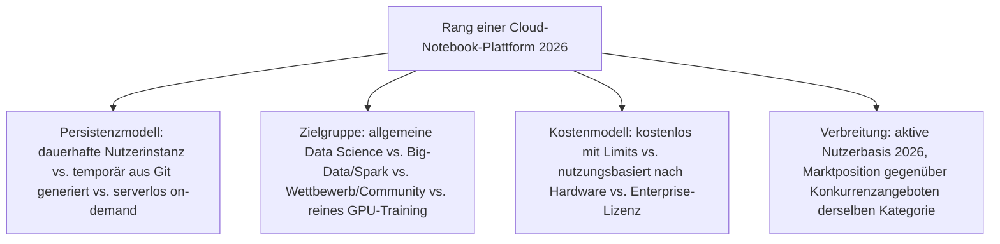
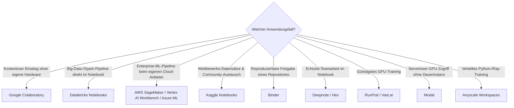

# Beste Cloud-Notebook-Plattformen 2026 — Top-20-Topliste

Die [Evolution und Architekturen digitaler Cloud-Notebooks](evolution-digitaler-cloud-notebooks.md) ordnet diese Kategorie chronologisch nach Architektur-Generation — von den ersten generischen Cloud-Notebook-Diensten über Binders reproduzierbare Ad-hoc-Umgebungen und wettbewerbsgebundene Kaggle-Kernels bis zu Enterprise-ML-Plattformen und spezialisierten GPU-Cloud-Anbietern. Diese Seite übersetzt die Chronologie in eine **Momentaufnahme 2026**: 20 gehostete Notebook-Plattformen, die heute tatsächlich genutzt werden — ergänzt um zehn aktuelle Marktteilnehmer, die in der historischen Chronologie selbst nicht einzeln benannt sind.

!!! note "Hinweis: Abgrenzung zur Gesamtmarkt-Topliste"
    [Beste Notebook-Systeme 2026](notebook-systeme-2026-topliste.md) rankt bereits fünf Cloud-Plattformen (Colaboratory, Databricks, SageMaker, Kaggle, Binder) innerhalb einer 20 Einträge breiten, generationenübergreifenden Liste. Diese Seite bleibt strikt auf die **Cloud-Notebook-Kategorie aus [Generation 3 der übergeordneten Zeitachse](evolution-digitaler-notebook-systeme.md#generation-3-cloud-gehostete-notebook-plattformen-2013-2017)** beschränkt und geht dort in die Tiefe, wo die Gesamtliste nur Platz für die fünf größten Namen hatte.

---

## Bewertungskriterien

!!! warning "Achtung: Marktabdeckung ≠ technische Überlegenheit"
    Google Colaboratory führt diese Liste wegen kostenlosem Massenzugang, nicht wegen überlegener Rechenleistung — spezialisierte GPU-Cloud-Anbieter wie RunPod oder Vast.ai bieten pro investiertem Euro deutlich mehr Rohleistung, aber ohne Colabs Null-Einstiegshürde. **Stand: August 2026.**

---

## Top 20 im Überblick

| Rang | Plattform | Anbieter | Generation | Besondere Stärke |
|---|---|---|---|---|
| 1 | **Google Colaboratory** | Google | 4 (Google Colaboratory) | Kostenloser GPU-/TPU-Zugriff direkt im Browser, größte Nutzerbasis aller Cloud-Notebook-Dienste |
| 2 | **Databricks Notebooks** | Databricks | 1b (Frühe generische Cloud-Notebook-Dienste) | Tiefste Integration in Big-Data-/Spark-Pipelines, führende Lakehouse-Plattform |
| 3 | **AWS SageMaker Studio Notebooks** | Amazon | 5 (Enterprise-ML-Plattformen) | Direkte Anbindung an die größte Cloud-ML-Infrastruktur überhaupt |
| 4 | **Kaggle Notebooks** | Google | 3 (Kaggle Kernels) | Direkter Zugriff auf Wettbewerbs-Datensätze, größte Data-Science-Community-Plattform |
| 5 | **Binder** (mybinder.org) | Project Jupyter | 2 (Binder) | Reproduzierbare Umgebung aus einem Git-Repository ohne jede Registrierung |
| 6 | **Google Vertex AI Workbench** | Google | 5 (Ergänzung 2026) | Google-Pendant zu SageMaker, nahtlose Anbindung an die Vertex-AI-Modell-Pipeline |
| 7 | **Azure Machine Learning Notebooks** | Microsoft | 5 (Enterprise-ML-Plattformen) | Tiefste Integration in bestehende Microsoft-/Azure-Enterprise-Landschaften |
| 8 | **Deepnote** | Deepnote | Ergänzung 2026 | Modernes Echtzeit-Kollaborations-Notebook nach Google-Docs-Vorbild, populär bei Startups |
| 9 | **Hex** | Hex | Ergänzung 2026 | Hybrid aus Notebook und BI-Dashboard, verbreitet in Data-Team-Workflows jenseits reiner Exploration |
| 10 | **Domino Data Lab** | Domino Data Lab | 1c (Frühe generische Cloud-Notebook-Dienste) | Kombiniert Notebooks mit Modell-Versionierung und Deployment-Pipeline in einer Enterprise-Plattform |
| 11 | **IBM Watson Studio** | IBM | 5 (Ergänzung 2026) | Dritter großer Enterprise-Cloud-Anbieter neben AWS/Azure mit eigenem ML-Notebook-Baustein |
| 12 | **Paperspace Gradient** | DigitalOcean | 6 (Spezialisierte GPU-Cloud-Anbieter) | GPU-Cloud-Notebooks mit nutzungsbasierter Abrechnung nach Hardware-Klasse |
| 13 | **RunPod** | RunPod | 6 (Ergänzung 2026) | Günstiger GPU-Marktplatz mit Jupyter-Vorlagen, starke Adoption in der aktuellen KI-Trainings-Welle |
| 14 | **Lightning.ai Studios** | Lightning AI | 6 (Spezialisierte GPU-Cloud-Anbieter) | Direkter Übergang von Notebook-Exploration zu produktivem Modelltraining und -Deployment |
| 15 | **Vast.ai** | Vast.ai | 6 (Ergänzung 2026) | Dezentraler GPU-Marktplatz mit den niedrigsten Stundenpreisen dieser Liste |
| 16 | **JetBrains Datalore** | JetBrains | Ergänzung 2026 | Cloud-Notebook mit JetBrains-typischer Code-Intelligenz, direkte PyCharm-Anbindung |
| 17 | **CoCalc** | SageMath | Ergänzung 2026 | Kollaborative Cloud-Umgebung mit Jupyter-, Sage- und LaTeX-Unterstützung, akademischer Ursprung |
| 18 | **Saturn Cloud** | Saturn Cloud | Ergänzung 2026 | Auf Dask-natives verteiltes Rechnen spezialisierte Cloud-Notebook-Plattform |
| 19 | **Modal** | Modal Labs | 6 (Ergänzung 2026) | Serverloser On-Demand-GPU-Zugriff aus Code heraus statt dauerhafter Instanz — jüngste Weiterentwicklung des GPU-Cloud-Prinzips |
| 20 | **Anyscale Workspaces** | Anyscale | 5 (Ergänzung 2026) | Ray-natives Pendant zu Databricks' Spark-Fokus, für verteiltes Python-Training konzipiert |

---

## Highlights im Detail

### Rang 1–4: die vier meistgenutzten Cloud-Notebook-Dienste insgesamt
Colaboratory, Databricks, SageMaker und Kaggle decken zusammen die vier unterschiedlichen Grundmotive ab, warum überhaupt in der Cloud statt lokal gearbeitet wird: kostenloser Massenzugang, Big-Data-Integration, Enterprise-ML-Pipeline und Wettbewerbs-/Community-Bindung — siehe die jeweiligen Generationen in [Evolution digitaler Cloud-Notebooks](evolution-digitaler-cloud-notebooks.md).

### Rang 6–7, 11, 20: jeder große Cloud-Anbieter mit eigener Enterprise-Variante
Vertex AI Workbench, Azure ML Notebooks, Watson Studio und Anyscale Workspaces zeigen, dass praktisch jeder große Cloud-/Compute-Anbieter mittlerweile eine eigene Enterprise-Notebook-Variante führt — die Chronologie selbst benennt nur AWS SageMaker und Azure ML explizit als Vertreter von [Generation 5](evolution-digitaler-cloud-notebooks.md#generation-5-enterprise-ml-plattformen-mit-integrierten-notebooks-ab-2017).

### Rang 8–9, 16–18: die kollaborative Notebook-Startup-Welle
Deepnote, Hex, Datalore und CoCalc tauchen in der historischen Chronologie nicht auf, weil sie **keine** neue Architektur-Generation begründen, sondern dieselbe Cloud-Notebook-Idee mit modernerer Kollaborations-UX (Echtzeit-Coauthoring, BI-Integration) neu verpacken.

### Rang 13, 15, 19: die aktuelle GPU-Cloud-Generation nach Paperspace/Lightning
RunPod, Vast.ai und Modal setzen das Prinzip aus [Generation 6](evolution-digitaler-cloud-notebooks.md#generation-6-spezialisierte-gpu-cloud-anbieter-ab-2018) fort — mit noch niedrigeren Einstiegspreisen (Vast.ai), starker Adoption in der aktuellen KI-Trainings-Welle (RunPod) und einem Schritt weg von der dauerhaften Instanz hin zu serverlosem On-Demand-Zugriff (Modal).

---

## Entscheidungshilfe nach Anwendungsfall

!!! tip "Tipp: lokale und Rust-Perspektive separat prüfen"
    Wer stattdessen lokal mit voller Kontrolle arbeiten will, findet die passenderen Kandidaten in [Beste IPython- & Jupyter-Systeme 2026](ipython-jupyter-2026-topliste.md); die Rust-Bausteine hinter mehreren dieser Plattformen (Polars, DataFusion, uv) behandelt [Beste Rust-Bausteine für Notebooks 2026](rust-notebooks-2026-topliste.md).

---

## 🔗 Verwandte Themen

- [Startseite](../../index.md) — zurück zur Dokumentations-Zentrale
- [Evolution und Architekturen digitaler Cloud-Notebooks](evolution-digitaler-cloud-notebooks.md) — chronologisches Generationenmodell, dessen aktuellen Stand diese Topliste zusammenfasst
- [Beste Notebook-Systeme 2026 (Top 20)](notebook-systeme-2026-topliste.md) — Gesamtmarkt-Topliste über alle Generationen hinweg
- [Beste IPython- & Jupyter-Systeme 2026 (Top 20)](ipython-jupyter-2026-topliste.md) — vorausgehende Generation, lokale Kernel-Frontend-Architektur als Gegenstück
- [Beste Rust-Bausteine für Notebooks 2026 (Top 10)](rust-notebooks-2026-topliste.md) — Polars/uv als geteilte Bausteine hinter mehreren dieser Plattformen
- [Evolution und Architekturen digitaler Cloud-KI-APIs](../../künstliche-intelligenz/evolution-digitaler-cloud-ki-apis.md) — direkte Schnittmenge bei Enterprise-ML-Plattformen
