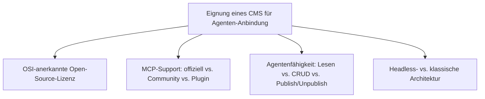
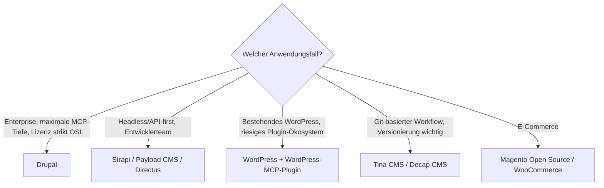

# Beste CMS-Systeme (Open Source) mit MCP-Server — Top-20-Topliste

Die [Übersicht der Open-Source-Systeme mit vollständiger LLM-, Agenten- & MCP-Unterstützung](open-source-llm-agent-mcp-systeme.md) nennt Drupal, Strapi und Payload CMS als führende CMS-Kandidaten. Diese Seite vertieft ausschließlich die **CMS-Kategorie** — klassische, headless und flat-file Content-Management-Systeme — als vollständige Top-20-Topliste.

!!! note "Hinweis: Nur OSI-anerkannte Lizenzen in der Haupttabelle"
    Systeme mit „Source available"-Modellen statt echter OSI-Lizenz (z. B. Statamic mit kostenpflichtiger Kernlizenz) stehen separat unter „Lizenz-Sonderfälle" — konsistent mit der Handhabung in der [Gesamtübersicht](open-source-llm-agent-mcp-systeme.md#lizenz-sonderfalle-technisch-fuhrend-aber-nicht-osi-open-source).

---

## Bewertungskriterien

!!! warning "Achtung: MCP-Reife zwischen Headless- und klassischen CMS sehr unterschiedlich"
    Headless-CMS (Strapi, Payload, Directus) haben MCP meist deutlich schneller und tiefer integriert als klassische, monolithische CMS (Joomla, TYPO3, Concrete CMS), wo MCP-Support überwiegend über Community-Plugins läuft. **Stand: Juli 2026.**

---

## Top 20 im Überblick

| Rang | CMS | Architektur | Lizenz | MCP-Support | Agentenfähigkeit | Besondere Stärke |
|---|---|---|---|---|---|---|
| 1 | **Drupal** | Klassisch/Headless-fähig | GPL-2.0+ | **offiziell** (Module `mcp`, `mcp_server`, `mcp_client`; STDIO + HTTP) | autonom (Hintergrund-Agenten, No-Code „MCP Studio") | Sauberste Drei-Module-Architektur, offizielles PHP-SDK (Kooperation PHP Foundation & Symfony) |
| 2 | **Strapi** | Headless | MIT (Community Edition) | **offiziell**, seit Version 5 im Core (Streamable HTTP) | Lesen+Schreiben+Publish/Unpublish | MCP direkt im Core statt als Plugin, sehr breite Provider-Anbindung |
| 3 | **Payload CMS** | Headless | MIT | offiziell/Community-Server | Lesen+Schreiben (CRUD auf Collections) | Sehr entwicklerfreundliches TypeScript-natives Datenmodell |
| 4 | **WordPress** (Core + „WordPress MCP"-Plugin) | Klassisch | GPL-2.0 | Offiziell unterstütztes Plugin (Automattic) | Lesen+Schreiben (Beiträge, Seiten, Medien) | Mit Abstand größtes CMS-Ökosystem, MCP-Plugin profitiert von riesiger Plugin-Basis |
| 5 | **Directus** | Headless (Daten-first) | GPL-3.0 (Community Edition) | Community | Lesen+Schreiben (CRUD über Datenmodell statt fester Content-Types) | Setzt auf bestehende SQL-Datenbanken statt eigenem Schema, sehr flexibel |
| 6 | **Ghost** | Klassisch (Blogging-fokussiert) | MIT | Community (über Admin-API) | Lesen+Schreiben+Publish | Sehr saubere Admin-API erleichtert MCP-Server-Eigenbau erheblich |
| 7 | **KeystoneJS** | Headless | MIT | Community | Lesen+Schreiben | GraphQL-API von Grund auf erleichtert typsichere Agenten-Anbindung |
| 8 | **TYPO3** | Klassisch (Enterprise) | GPL-2.0+ | Community | Lesen+Schreiben | Sehr granulares Rechtemodell, gut geeignet für Enterprise-Compliance-Anforderungen |
| 9 | **Umbraco** | Klassisch (.NET) | MIT | Community | Lesen+Schreiben | Gute Fit für bestehende .NET-/Enterprise-Landschaften |
| 10 | **Joomla** | Klassisch | GPL-2.0+ | Community (Plugin-basiert) | Lesen+Schreiben | Drittgrößtes CMS-Ökosystem, langjährig etablierte Erweiterungsstruktur |
| 11 | **Grav** | Flat-File (kein Datenbank-CMS) | MIT | Community | Lesen+Schreiben | Kein Datenbank-Overhead, Inhalte direkt als Dateien für Agenten zugänglich |
| 12 | **Plone** | Klassisch (Python) | GPL-2.0 | Community | Lesen+Schreiben | Sehr ausgereiftes Rechte-/Workflow-System für komplexe Freigabeprozesse |
| 13 | **ProcessWire** | Klassisch (PHP) | MIT | Community | Lesen+Schreiben | Sehr flexibles Feld-/API-Modell erleichtert individuelle MCP-Tool-Definitionen |
| 14 | **Concrete CMS** | Klassisch | MIT | Community | Lesen+Schreiben | Inline-Editing-Philosophie überträgt sich gut auf Agent-gestützte Content-Pflege |
| 15 | **Contao** | Klassisch (PHP) | LGPL-3.0 | Community | Lesen+Schreiben | Starke DSGVO-/Barrierefreiheits-Ausrichtung, relevant für EU-Compliance-Projekte |
| 16 | **Backdrop CMS** (Drupal-7-Fork) | Klassisch | GPL-2.0+ | Community (angelehnt an Drupal-Module) | Lesen+Schreiben | Leichtgewichtige Alternative für Teams, die kein volles Drupal 10/11 brauchen |
| 17 | **Tina CMS** | Headless (Git-basiert) | Apache-2.0 | Community | Lesen+Schreiben (Commits statt Datenbank-Writes) | Inhalte landen als Git-Commits — Agent-Änderungen automatisch versioniert |
| 18 | **Decap CMS** (ehem. Netlify CMS) | Headless (Git-basiert) | MIT | Community | Lesen+Schreiben (Commits statt Datenbank-Writes) | Reines Frontend ohne eigenes Backend, minimaler Infrastrukturaufwand |
| 19 | **Magento Open Source** | E-Commerce-CMS | OSL-3.0 | Community | Lesen+Schreiben (Produkte, Kategorien, Bestellungen) | Größtes Open-Source-E-Commerce-Ökosystem für produktbezogene Agent-Aufgaben |
| 20 | **WooCommerce** (WordPress-Plugin) | E-Commerce-CMS-Erweiterung | GPL-2.0+ (Kernplugin) | Community (über WordPress-MCP-Ökosystem, siehe Rang 4) | Lesen+Schreiben (Produkte, Bestellungen) | Profitiert direkt vom WordPress-MCP-Ökosystem statt eigener Insellösung |

---

## Lizenz-Sonderfall

!!! warning "Achtung: Quellcode einsehbar ≠ Open Source"
    **Statamic** bietet zwar einsehbaren Quellcode und eine wachsende MCP-/KI-Integration, die Kernlizenz ist jedoch kostenpflichtig für kommerzielle Projekte und nicht OSI-anerkannt als klassisches Open Source. Wer strikt OSI-Open-Source benötigt, greift stattdessen zu Rang 1–3 (Drupal, Strapi, Payload CMS) als derzeit ausgereifteste Kombination aus Lizenz und MCP-Tiefe.

---

## Entscheidungshilfe nach Anwendungsfall

---

## 🔗 Verwandte Themen

- [Startseite](../../index.md) — zurück zur Dokumentations-Zentrale
- [Open-Source Systeme mit vollständiger LLM-, Agenten- & MCP-Unterstützung](open-source-llm-agent-mcp-systeme.md) — Gesamtübersicht über Wiki, Wissensmanagement & CMS
- [Beste Wissensmanagement-Systeme (Open Source) mit MCP-Server (Top 20)](wissensmanagement-mcp-server-topliste.md) — Gegenstück für Wiki-/Wissensmanagement-Systeme
- [Beste Open-Source-Software mit MCP-Server (Top 20)](../../künstliche-intelligenz/coding/mcp-server-opensource-software-topliste.md) — MCP-Server jenseits von Wissensmanagement/CMS
- [Klassische Wissensmanagement-, KB- & CMS-Systeme mit LLM-Integration](klassische-wissensmanagement-cms-llm-integration.md) — LLM-Integration unabhängig von MCP
- [Beste MCP-Server (Top 20)](../../künstliche-intelligenz/coding/mcp-server-topliste.md) — protokollnahe Referenzserver
