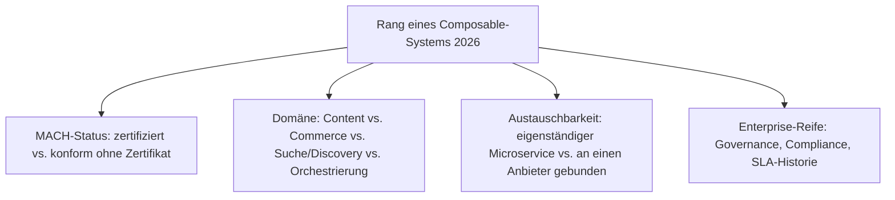
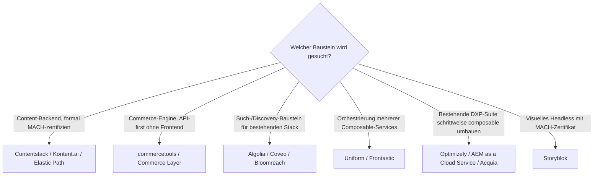

# Beste Composable-CMS & MACH-Systeme 2026 — Top-20-Topliste

Die [Evolution und Architekturen digitaler Composable-CMS](evolution-digitaler-composable-cms.md) ordnet diese Kategorie chronologisch nach MACH-Prinzipien-Genese. Diese Seite übersetzt die Chronologie in eine **Momentaufnahme 2026** — und rankt bewusst über die reine Content-Domäne hinaus: Ein Composable Stack besteht typischerweise aus mehreren austauschbaren Microservices (Content, Commerce, Suche/Discovery, Orchestrierung), nicht aus einem einzelnen CMS.

!!! note "Hinweis: Abgrenzung zur Headless-CMS-Topliste"
    Die [Headless-CMS-Topliste 2026](headless-cms-2026-topliste.md) rankt reine Content-APIs. Diese Seite ist breiter: Sie folgt der [Domänen-Einteilung der Evolution-Chronologie](evolution-digitaler-composable-cms.md#3-domane) über **Content, Commerce, Suche/Discovery und Orchestrierung** hinweg — mehrere Systeme (Contentstack, Kontent.ai, Contentful, Sanity, Hygraph, Storyblok) erscheinen daher in beiden Listen, hier aber nach MACH-Konformität statt reiner Marktführerschaft sortiert.

---

## Bewertungskriterien

!!! warning "Achtung: MACH-Zertifikat ≠ automatisch beste technische Wahl"
    Das MACH-Zertifikat bestätigt architektonische Prinzipien (Microservices, API-first, Cloud-native, Headless), keine Produktqualität. Mehrere hier gerankte Systeme ohne formales Zertifikat (Contentful, Sanity) gelten am Markt trotzdem als technisch führend. **Stand: August 2026.**

---

## Top 20 im Überblick

| Rang | System | Domäne | MACH-Status | Besondere Stärke |
|---|---|---|---|---|
| 1 | **[Contentstack](headless-cms-2026-topliste.md)** | Content | **zertifiziert**, Gründungsmitglied | Reifste formale MACH-Zertifizierung, starker Enterprise-Governance-Fokus |
| 2 | **commercetools** | Commerce | **zertifiziert**, Gründungsmitglied | Führende API-first-Commerce-Engine ohne eigenes Frontend |
| 3 | **[Kontent.ai](headless-cms-2026-topliste.md)** | Content | zertifiziert | Ausgeprägte Workflow-/Freigabe-Engine für regulierte Branchen |
| 4 | **Bloomreach** | Suche/Discovery + Content | MACH-Mitglied | Kombiniert KI-gestützte Produktsuche mit Headless-Content in einem Stack |
| 5 | **[Contentful](headless-cms-2026-topliste.md)** | Content (Orchestrierung) | konform, „Composable Stack Hub" | Größtes Partner-Ökosystem, KI-Steuerungsebene über den gesamten Stack |
| 6 | **[Sanity](headless-cms-2026-topliste.md)** | Content | konform ohne Zertifikat | Höchste Entwickler-Mindshare unter den Content-Bausteinen dieser Liste |
| 7 | **[Hygraph](headless-cms-2026-topliste.md)** (ehem. GraphCMS) | Content | MACH-Mitglied | GraphQL-native Content-Federation über mehrere Quellen hinweg |
| 8 | **Algolia** | Suche/Discovery | MACH-Mitglied | Meistgenutzter Such-Baustein in bestehenden Composable Stacks |
| 9 | **Coveo** | Suche/Discovery | konform | KI-gestützte Enterprise-Suche mit starkem Personalisierungs-Fokus |
| 10 | **Elastic Path** | Commerce | **zertifiziert**, Gründungsmitglied | Reiner Composable-Commerce-Spezialist ohne DXP-Altlast |
| 11 | **Amplience** | Content + DAM | MACH-Mitglied | Kombiniert Content-API mit Digital-Asset-Management im selben Baustein |
| 12 | **Commerce Layer** | Commerce | MACH-Mitglied | „Commerce OS"-Ansatz — reine API ohne jede Frontend-Vorgabe |
| 13 | **Uniform** | Orchestrierung | MACH-Mitglied | Orchestriert mehrere Composable-Services zu einer einheitlichen Experience-Schicht |
| 14 | **BigCommerce** (Catalyst/Headless) | Commerce | konform | Breite Enterprise-Commerce-Basis mit headless-fähigem Frontend-Framework |
| 15 | **Shopify Hydrogen** | Commerce (Frontend) | konform | React-basiertes Framework für Headless-Storefronts auf Shopify-Basis |
| 16 | **[Storyblok](headless-cms-2026-topliste.md)** | Content | MACH-Mitglied (seit 2023 zertifiziert) | Visuelles Headless mit Live-Vorschau, seltene Kombination aus MACH-Konformität und Marketer-Zugänglichkeit |
| 17 | **Optimizely** (ehem. Episerver) | Content + Experimentierung | migriert, konform | Composable-Module für Content, A/B-Testing und Commerce einzeln kombinierbar |
| 18 | **Adobe Experience Manager as a Cloud Service** | Content (Enterprise-DXP) | migriert, teilkonform | Cloud-native Neuausrichtung einer der größten On-Premise-JCR-Suiten |
| 19 | **Acquia** (Drupal-Cloud-Plattform) | Content (Enterprise-DXP) | migriert, teilkonform | Composable-Erweiterung des größten Open-Source-CMS-Ökosystems (Drupal) |
| 20 | **Frontastic** (commercetools-Frontend-Layer) | Orchestrierung (Commerce-Frontend) | MACH-Mitglied | Spezialisierte Frontend-Orchestrierungsschicht speziell für Composable-Commerce-Stacks |

---

## Highlights im Detail

### Rang 1–2: die beiden MACH-Gründungsmitglieder an der Spitze
Contentstack und commercetools führen diese Liste nicht zufällig an — beide gehörten 2020 zu den vier Gründungsmitgliedern der MACH Alliance und haben ihre formale Zertifizierung seither konsequent verteidigt, während viele spätere Marktteilnehmer nur MACH-konform sind, ohne das Zertifikat aktiv zu führen.

### Rang 4, 8–9: Suche/Discovery als eigenständiger, unterschätzter MACH-Baustein
Bloomreach, Algolia und Coveo zeigen, dass „Composable CMS" 2026 längst nicht mehr nur Content bedeutet — Suche und Personalisierung sind in den meisten produktiven MACH-Stacks ein austauschbarer Microservice neben, nicht innerhalb des Content-Backends.

### Rang 17–19: die migrierten DXP-Suiten bleiben strukturell im Nachteil
Optimizely, Adobe Experience Manager as a Cloud Service und Acquia haben ihre monolithischen Wurzeln erfolgreich Richtung Composable umgebaut, tragen aber architektonisches Erbe (engere Kopplung zwischen Modulen, geringere freie Austauschbarkeit einzelner Komponenten) gegenüber den „von Grund auf Composable" Systemen aus Rang 1–3 weiter mit sich.

### Rang 13, 20: Orchestrierung als eigene, wachsende Teildisziplin
Uniform und Frontastic besetzen eine Nische, die es vor 2022 kaum gab: eine eigene Schicht, die mehrere MACH-Microservices zu einer kohärenten Experience zusammenführt — eine direkte Antwort auf die Komplexität, die durch „Best-of-Breed statt Suite" zwangsläufig entsteht.

---

## Entscheidungshilfe nach Anwendungsfall

!!! tip "Tipp: Composable-Stack statt Einzelsystem bewerten"
    Anders als bei einem klassischen CMS lohnt sich bei Composable/MACH selten die Frage „welches System", sondern „welche Kombination" — ein typischer produktiver Stack 2026 kombiniert je einen Baustein aus Content (Rang 1, 3, 5–7), Commerce (Rang 2, 10, 12, 14–15) und ggf. Suche (Rang 8–9), orchestriert über eine Schicht wie Rang 13 oder 20.

---

## 🔗 Verwandte Themen

- [Startseite](../../index.md) — zurück zur Dokumentations-Zentrale
- [Evolution und Architekturen digitaler Composable-CMS](evolution-digitaler-composable-cms.md) — chronologisches Generationenmodell, dessen aktuellen Stand diese Topliste zusammenfasst
- [Produktionsreife Composable-CMS & MACH-Systeme nach Generation (kein Treffer)](produktionsreife-composable-cms-generationen-2026-topliste.md) — dieselbe Kategorie durch das konservative Fünf-Filter-Sieb; kein selbst betreibbarer, quelloffener Treffer — MACH bleibt eine Zertifizierungs-Ebene über proprietärem SaaS
- [Beste Headless-CMS 2026 (Top 20)](headless-cms-2026-topliste.md) — enger gefasste Schwester-Topliste, reine Content-Domäne statt vollständiger MACH-Stack
- [Beste CMS-Systeme (Open Source) mit MCP-Server (Top 20)](cms-mcp-server-topliste.md) — Gegenstück nach MCP-/Agenten-Reife statt MACH-Konformität
- [Evolution und Architekturen digitaler Content-Management-Systeme](evolution-digitaler-cms.md) — übergeordnetes Generationenmodell
- [Evolution und Architekturen digitaler klassischer CMS](evolution-digitaler-klassische-cms.md) — Ursprung der migrierenden DXP-Anbieter aus Rang 17–19
- [Evolution und Architekturen digitaler KI-Content-Erstellung](evolution-digitaler-ki-content-erstellung.md) — nachfolgende Generation, KI-Steuerungsebene über dem Composable Stack
