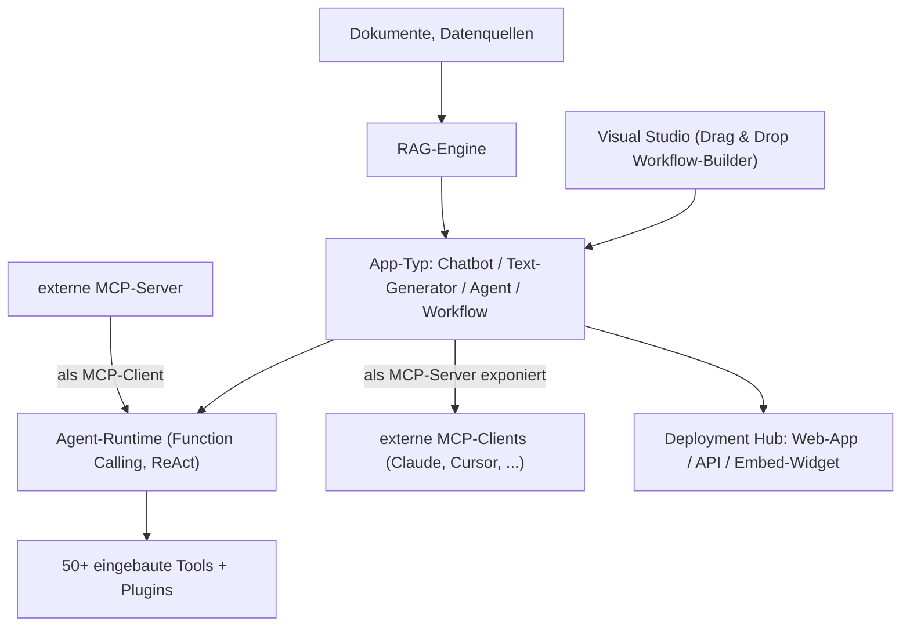

# Dify: Visuelle Agenten- & Workflow-Plattform mit RAG und MCP

**Dify** (LangGenius) ist eine Open-Source-Plattform, die einen visuellen Drag-&-Drop-Workflow-Builder, eine RAG-Engine, ein Agenten-Framework und LLMOps in einem selbst hostbaren Paket vereint. Anders als [AnythingLLM](anythingllm-rag-plattform.md), [Onyx](onyx-danswer-rag-plattform.md) oder [Open WebUI](open-webui-rag-agenten-plattform.md) — die primär von einer Chat-Oberfläche mit RAG ausgehen — ist Dify von Grund auf als **Werkzeug zum Bauen und Deployen kompletter KI-Anwendungen** konzipiert, ohne dass dafür zwingend eigener Code nötig ist.

!!! warning "Achtung: Apache-2.0 mit zwei Zusatzklauseln (Dify Open Source License)"
    Dify liegt unter der **Dify Open Source License** — Apache-2.0 plus zwei Einschränkungen: (1) Der Quellcode darf ohne kommerzielle Lizenz **nicht** für einen Multi-Tenant-SaaS-Betrieb genutzt werden (ein Tenant = ein Workspace mit getrennten Daten/Konfiguration); Self-Hosting für die eigene Organisation ist davon nicht betroffen. (2) Logo und Copyright-Hinweise im Frontend (`web/`-Verzeichnis bzw. `web`-Docker-Image) dürfen nicht entfernt/verändert werden — diese Klausel gilt nicht, wenn nur Backend/API genutzt werden. Kommerzielle Nutzung als Backend eigener Anwendungen oder als internes Firmen-Tool ist ausdrücklich erlaubt. Siehe auch die Einordnung in [Beste KI-Agent-Fernsteuerung auf einem Self-Hosting-Server per Android (Top 20)](../../künstliche-intelligenz/automatisierung/android-ki-agent-fernsteuerung-server-topliste.md).

---

## Übersicht



---

## Die vier App-Typen

| App-Typ | Einsatzzweck |
|---|---|
| **Chatbot** | Klassischer Konversations-Assistent mit RAG-Anbindung |
| **Text-Generator** | Einmalige, formularbasierte Textgenerierung ohne Konversationsverlauf |
| **Agent** | Autonomer Agent mit Function-Calling/ReAct-Strategie und Tool-Zugriff |
| **Workflow** | Visuell orchestrierte, mehrstufige Pipeline (LLM-Aufrufe, Bedingungen, Schleifen, RAG-Retrieval, Human-in-the-Loop) |

---

## Architektur-Bausteine

| Baustein | Funktion |
|---|---|
| **Visual Studio** | Drag-&-Drop-Oberfläche zum Entwerfen von Prompts, Agenten und Workflows |
| **RAG-Engine** | Dokumenten-Ingestion, Chunking, Retrieval — direkt in Chatbot/Agent/Workflow einbindbar |
| **Agent-Runtime** | Function Calling und ReAct-Strategien, Zugriff auf eingebaute und benutzerdefinierte Tools |
| **Workflow-Engine** | Node-basierte Orchestrierung: LLM-Knoten, Bedingungen, Schleifen, Retrieval-Schritte, Human-Input-Knoten |
| **Deployment Hub** | Ein-Klick-Veröffentlichung als Web-App, REST-API oder Embed-Widget |

---

## Installation

=== "Docker Compose (Standard)"
    ```bash
    git clone https://github.com/langgenius/dify.git
    cd dify/docker
    cp .env.example .env
    docker compose up -d
    ```
    Laut Projekt-Dokumentation in wenigen Minuten einsatzbereit.

=== "Kubernetes"
    Offizielle Helm-Charts für produktionsnahe Multi-Node-Deployments — sinnvoll ab einer gewissen Nutzerzahl oder bei bestehender Cluster-Infrastruktur.

!!! note "Hinweis: Dify Cloud als Alternative"
    Neben Self-Hosting bietet Dify auch einen verwalteten Cloud-Dienst mit kostenlosem Sandbox-Tarif und kostenpflichtigen Professional-/Team-/Enterprise-Stufen — für einen ersten Test ohne eigene Infrastruktur eine schnelle Option, bevor man sich für Self-Hosting entscheidet.

---

## Workflow-Engine im Detail

Die Workflow-Engine ist das zentrale Unterscheidungsmerkmal gegenüber reinen Chat-RAG-Plattformen:

- **Node-Typen**: LLM-Aufrufe, bedingte Verzweigungen, Schleifen, Retrieval-Schritte, Code-Ausführung
- **Human-Input-Knoten**: pausiert einen laufenden Workflow für eine menschliche Prüfung, mit konfigurierbaren Freigabe-Buttons und Timeouts — dasselbe Human-in-the-Loop-Prinzip, das auch bei den [Wiki-Agenten-Pipelines](mediawiki/mediawiki-ki-agent.md) in diesem Repository für Freigaben genutzt wird
- **Multi-Agent-Orchestrierung**: mehrere Agenten-Knoten lassen sich innerhalb eines Workflows kombinieren, statt nur einen einzelnen Agenten laufen zu lassen

!!! tip "Tipp: Workflow statt Agent bei vorhersehbaren Abläufen"
    Für Aufgaben mit klar definierter Schrittfolge (z. B. „Dokument einlesen → zusammenfassen → gegen Wissensbasis prüfen → Freigabe einholen → veröffentlichen") liefert der **Workflow**-App-Typ deterministischere, leichter debugbare Ergebnisse als ein frei entscheidender **Agent** — Letzterer eignet sich eher für offene, explorative Aufgaben.

---

## MCP-Integration: bidirektional

Im Gegensatz zu AnythingLLM, Onyx und Open WebUI, die MCP jeweils nur als **Client** nutzen, unterstützt Dify das Model Context Protocol **in beide Richtungen**:

| Richtung | Funktion |
|---|---|
| **Als MCP-Client** | Agenten innerhalb von Dify rufen externe MCP-Server direkt auf (z. B. Linear, Notion, Zapier) — konsolidiert mehrere Punkt-Integrationen in einen einheitlichen Mechanismus |
| **Als MCP-Server** | Ein Dify-Workflow lässt sich selbst als MCP-Server exponieren — Dify generiert eine Standard-MCP-Server-URL, über die externe MCP-Clients (Claude, Cursor, …) den Workflow als Werkzeug aufrufen können |

!!! tip "Tipp: Visuell bauen, programmatisch konsumieren"
    Die MCP-Server-Rolle ist besonders wertvoll für Teams, die einen Workflow **visuell** entwerfen, ihn danach aber **programmatisch** aus einem Coding-Agenten heraus aufrufen wollen — der Workflow wird so zu einem wiederverwendbaren MCP-Tool, ohne dass der Coding-Agent Kenntnis vom internen Aufbau der Pipeline braucht.

---

## Tools & Plugin-Ökosystem

Dify liefert **50+ eingebaute Tools** (Websuche, Code-Ausführung, Bildgenerierung u. a.) sowie ein wachsendes Plugin-System für benutzerdefinierte Tool-Definitionen — Agenten und Workflows greifen darauf zu, ohne dass die Integration jeweils neu programmiert werden muss.

---

## Einordnung gegenüber verwandten Tools

| Kriterium | Dify | [AnythingLLM](anythingllm-rag-plattform.md) | [Open WebUI](open-webui-rag-agenten-plattform.md) | [Onyx](onyx-danswer-rag-plattform.md) |
|---|---|---|---|---|
| Lizenz | Apache-2.0 + Zusatzklauseln (kein Multi-Tenant-SaaS, Branding-Pflicht) | MIT | „Open WebUI License" (BSD-3-Basis + Branding-Pflicht) | MIT (Community Edition) |
| Kernfokus | Visueller Workflow-/Agenten-Builder für komplette KI-Anwendungen | Lokale/private Dokumenten-Chats | Chat-Oberfläche mit RAG + Agenten-Erweiterungen | Enterprise-Suche über viele Datenquellen |
| MCP-Support | **bidirektional** (Client und Server) | offiziell, nativ (Client) | offiziell, nativ (Client) | offiziell (Client, `onyx-mcp-server`) |
| Deployment-Ausgabe | Web-App, REST-API, Embed-Widget | Chat-UI | Chat-UI | Chat-UI |
| Typischer Einsatz | Mehrstufige, deterministische Automatisierung mit Freigabe-Schritten | Einzelperson/kleines Team ohne Server-Infrastruktur | Größte Community, primär Ollama-Nutzer | Unternehmen mit vielen Connectoren |

!!! tip "Tipp: Auswahl nach Anwendungsfall"
    - **Mehrstufige Automatisierung mit klar definierten Schritten und Freigaben** → Dify (Workflow-App-Typ).
    - **Schneller lokaler Chat mit eigenen Dokumenten, kein Workflow-Bau nötig** → AnythingLLM oder Open WebUI.
    - **Enterprise-Suche über viele externe Datenquellen** → Onyx.

---

## Verwandte Themen

- [Startseite](../../index.md) — zurück zur Dokumentations-Zentrale
- [Dokumentenerstellung, Wikis & Notebooks](index.md) — Gesamtübersicht aller Dokumentations-Systeme
- [AnythingLLM: All-in-One Desktop- & Docker-RAG-Plattform](anythingllm-rag-plattform.md) — leichtgewichtigere Alternative ohne Workflow-Builder
- [Open WebUI: All-in-One RAG-System mit Agenten-Funktion](open-webui-rag-agenten-plattform.md) — Chat-zentrierte Alternative mit größter Community
- [Onyx (ehem. Danswer): RAG-Plattform](onyx-danswer-rag-plattform.md) — Enterprise-Alternative mit breiterer Connector-Anbindung
- [Beste MCP-Server (Top 20)](../../künstliche-intelligenz/coding/mcp-server-topliste.md) — Einordnung von Difys MCP-Server-Rolle im Vergleich
- [Multi-LLM- & Sprachmodell-Anbieter im Vergleich](../../künstliche-intelligenz/coding/llm-anbieter-vergleich.md) — Preise der von Dify unterstützten Modell-Provider
