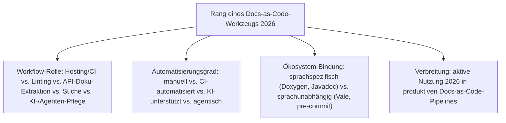
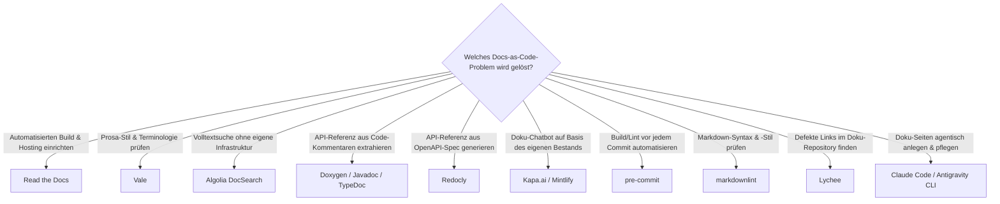

# Beste Docs-as-Code-Werkzeuge 2026 — Top-15-Topliste

Die [Evolution und Architekturen digitaler Docs-as-Code](evolution-digitaler-docs-as-code.md) ordnet diese Praxis chronologisch nach Architektur-Generation — von früher Markup-basierter Technikdokumentation über die Geburt des eigentlichen Docs-as-Code-Workflows mit Sphinx/Read the Docs, Markdown-native YAML-Frameworks und komponentenbasierte Docs-Frameworks bis zu KI-gestützter und schließlich agentischer Dokumentationspflege. Diese Seite übersetzt die Chronologie in eine **Momentaufnahme 2026**: 15 Werkzeuge aus der **Workflow-Ebene** — Linting, API-Doku-Extraktion, Hosting/CI-Automatisierung, Suche und KI-/Agenten-Pflege —, nicht die Rendering-Engines selbst.

!!! note "Hinweis: Abgrenzung zur Static-Site-Generatoren-Topliste"
    [Beste Static-Site- & Docs-Generatoren 2026](static-site-generatoren-2026-topliste.md) rankt bereits die Rendering-Engines dieser Kategorie (Sphinx, MkDocs/Zensical, Docusaurus, Jekyll u. a.) gemeinsam mit allgemeinen Blog-/Marketing-Generatoren. Diese Seite bleibt bewusst auf die **Werkzeuge rund um den Docs-as-Code-Workflow** beschränkt — was ein Notebook nicht selbst rendert, sondern prüft, durchsucht, hostet oder pflegt.

---

## Bewertungskriterien

!!! warning "Achtung: Momentaufnahme, Stand August 2026"
    Die KI-/Agenten-Ebene (Rang 6–8, 15) ist die am schnellsten sich wandelnde Kategorie dieser Liste — anders als bei Vale oder Doxygen ist hier in den kommenden Jahren am ehesten mit neuen Marktführern zu rechnen.

---

## Top 15 im Überblick

| Rang | Werkzeug | Generation | Rolle | Besondere Stärke |
|---|---|---|---|---|
| 1 | **Read the Docs** | 2 (Sphinx & die Geburt des eigentlichen Docs-as-Code-Workflows) | Hosting/CI | Automatisiert Build und Hosting direkt aus dem Git-Repository — jeder Push löst einen neuen Doku-Build aus, der historische Auslöser der gesamten Docs-as-Code-Bewegung |
| 2 | **Vale** | 5 (KI-gestützte Docs-as-Code) | Linting | Regelbasierter Prosa-Linter für Terminologie und Stil-Guides, Standardwerkzeug in praktisch jeder modernen Docs-as-Code-CI-Pipeline |
| 3 | **Algolia DocSearch** | 4 (Komponentenbasierte & interaktive Docs-Frameworks) | Suche | Kostenloser, gecrawlter Suchindex für Open-Source-Docs-as-Code-Projekte, ersetzt lokale Lunr-/FlexSearch-Indizes bei großen Projekten |
| 4 | **Doxygen** | 1c (Inline-Code-Dokumentation & Doc-Generatoren) | API-Doku-Extraktion | Extrahiert API-Referenzdokumentation direkt aus strukturierten C/C++/Java-Kommentaren, bis heute Standard für Systemsoftware-Projekte |
| 5 | **Javadoc** | 1c (Inline-Code-Dokumentation & Doc-Generatoren) | API-Doku-Extraktion | Ursprüngliches Inline-Doku-Format, nach wie vor der offizielle Standard für Java-API-Referenzen |
| 6 | **Claude Code / Antigravity CLI** | 6 (Agentische Docs-as-Code) | KI-/Agenten-Pflege | Agentische Coding-Werkzeuge, die Doku-Seiten direkt im Repository anlegen, verlinken und pflegen — auch der Stack hinter diesem Repository |
| 7 | **Mintlify** | 4/5 (Ergänzung 2026) | Hosting/KI-Pflege | Gehostete Docs-as-Code-Plattform mit eingebauter Docstring-zu-Seite-Generierung und RAG-Chat-Widget in einem Produkt |
| 8 | **Kapa.ai** | 5 (KI-gestützte Docs-as-Code) | KI-Suche/Chat | In Doku-Seiten eingebetteter RAG-Chatbot, beantwortet Nutzerfragen direkt aus dem indizierten Doku-Bestand statt auf Volltextsuche zu verweisen |
| 9 | **pre-commit** (Framework) | 6 (Ergänzung 2026) | CI-Automatisierung | Meistgenutztes Werkzeug für automatisierte Build-/Lint-Prüfung vor jedem Commit, konkrete Umsetzung des generischen Pre-Commit-Hook-Bausteins |
| 10 | **markdownlint** (`-cli`) | Ergänzung 2026 | Linting | Meistgenutzter Markdown-Stil- und Syntax-Linter in Docs-as-Code-CI-Pipelines |
| 11 | **TypeDoc** | Ergänzung 2026 | API-Doku-Extraktion | Extrahiert API-Referenzdokumentation aus TypeScript-Kommentaren, moderner Nachfolger von Javadoc/Doxygen für die JS/TS-Welt |
| 12 | **Lychee** | Ergänzung 2026 | Linting | Rust-basierter Link-Checker, prüft interne und externe Links in großen Doku-Repositories in Sekunden statt Minuten |
| 13 | **Redocly** | Ergänzung 2026 | API-Doku-Extraktion | Generiert interaktive API-Referenzseiten direkt aus OpenAPI-Spezifikationsdateien, eigener Docs-as-Code-Zweig für API-Dokumentation |
| 14 | **DocBook & LaTeX** | 1b (DocBook & LaTeX — strukturiertes XML-/Markup-Publishing) | Markup-Fundament | Trennen erstmals konsequent Inhalt von Layout, Single-Source-Publishing in mehrere Ausgabeformate — Ursprung eines zentralen Docs-as-Code-Prinzips |
| 15 | **Swimm** | Ergänzung 2026 | KI-/Agenten-Pflege | KI-natives Werkzeug, das Code-Dokumentation per CI-Check automatisch mit dem tatsächlichen Quellcode synchron hält |

---

## Highlights im Detail

### Rang 1–2: die zwei am tiefsten verankerten Workflow-Bausteine
Read the Docs und Vale sind die einzigen zwei Werkzeuge dieser Liste, die in praktisch jedem größeren Open-Source-Docs-as-Code-Projekt vorkommen — Read the Docs als historischer Auslöser des CI-Build-Automatisierungsprinzips aus [Generation 2](evolution-digitaler-docs-as-code.md#generation-2-sphinx-die-geburt-des-eigentlichen-docs-as-code-workflows-2008-2014), Vale als heutiger Standard-Linter.

### Rang 4–5, 11: drei Generationen API-Doku-Extraktion
Doxygen, Javadoc und TypeDoc setzen dasselbe Grundprinzip aus [Generation 1c](evolution-digitaler-docs-as-code.md#generation-1-vorlaufer-strukturierte-textauszeichnung-inline-code-dokumentation-1971-2008) für drei unterschiedliche Sprachökosysteme um — Dokumentation als strukturierte Kommentare direkt im Code, ein Generator extrahiert daraus eine separate Referenzseite, unverändert seit 1995.

### Rang 6–8, 15: die KI-/Agenten-Ebene ist noch in Bewegung
Claude Code/Antigravity CLI, Mintlify, Kapa.ai und Swimm zeigen vier unterschiedliche Ansätze, wie LLMs in den Docs-as-Code-Workflow eingreifen — von vollständig agentischer Pflege über gehostetes RAG-Chat-Widget bis zu automatisiertem Code-Doku-Sync, siehe [Generation 5 und 6](evolution-digitaler-docs-as-code.md#generation-6-agentische-docs-as-code-autonome-pflege-durch-ki-agenten-ab-ca-2025).

---

## Entscheidungshilfe nach Baustellen-Typ

!!! tip "Tipp: Rendering-Engine separat wählen"
    Diese Liste ersetzt keine Generator-Wahl — Sphinx, MkDocs/Zensical, Docusaurus & Co. rankt [Beste Static-Site- & Docs-Generatoren 2026](static-site-generatoren-2026-topliste.md). Die meisten Werkzeuge dieser Seite (Vale, Algolia DocSearch, pre-commit, markdownlint, Lychee) lassen sich mit jeder beliebigen Rendering-Engine kombinieren.

---

## 🔗 Verwandte Themen

- [Startseite](../../index.md) — zurück zur Dokumentations-Zentrale
- [Evolution und Architekturen digitaler Docs-as-Code](evolution-digitaler-docs-as-code.md) — chronologisches Generationenmodell, dessen aktuellen Stand diese Topliste zusammenfasst
- [Beste Open-Source-Docs-as-Code-Werkzeuge 2026 (Top 20)](docs-as-code-open-source-2026-topliste.md) — dieselbe Werkzeug-Ebene, gefiltert auf 20 Werkzeuge unter OSI-anerkannter Lizenz
- [Beste Docs-as-Code-Analytics-Werkzeuge 2026 (Top 15)](docs-as-code-analytics-2026-topliste.md) — Auswertungs-Ebene: misst, ob die mit diesen Werkzeugen gebaute Doku überhaupt gelesen wird
- [Beste Static-Site- & Docs-Generatoren 2026 (Top 20)](static-site-generatoren-2026-topliste.md) — Gegenstück auf Ebene der Rendering-Engines statt der Workflow-Werkzeuge
- [Workspace-, Kollaborations- & Docs-as-Code-Plattformen (Top 20)](workspace-kollaboration-docs-as-code-2026-topliste.md) — Plattform-Ebene (Hosting, Team-Workspace, Groupware) statt Workflow-Werkzeuge, gefiltert nach Lizenz, Speicherbackend und Aktivität
- [Evolution und Architekturen digitaler Static-Site-Generatoren](evolution-digitaler-static-site-generatoren.md) — Schwester-Chronologie nach Rendering-Architektur statt Anwendungsfall/Kollaborationsmodell
- [LLM-Wiki-Pattern (Karpathy-Muster)](llm-wiki-pattern-karpathy.md) — agentisches Pflegeprinzip hinter Rang 6, das dieses Repository selbst nutzt
- [AI Agents – Das Praxis-Handbuch & Architektur-Leitfaden](../../künstliche-intelligenz/coding/ai-agents-praxis.md) — Vertiefung zu Rang 6
- [Praxis-Guide: Lokales RAG & LLM-Serving mit Ollama & ChromaDB](../../künstliche-intelligenz/coding/lokales-rag-ollama.md) — Vertiefung zur RAG-Architektur hinter Rang 7–8
- [Evolution und Architekturen digitaler Frameworks & Bibliotheken für Wissenssysteme](evolution-digitaler-wissenssystem-frameworks.md) — Pandoc als universeller Dokumentkonverter, oft im Hintergrund mehrerer dieser Werkzeuge eingesetzt
