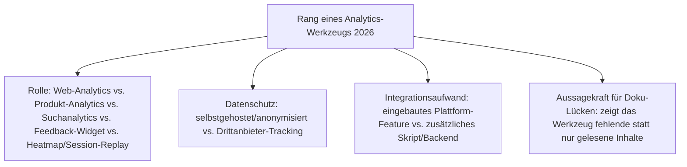
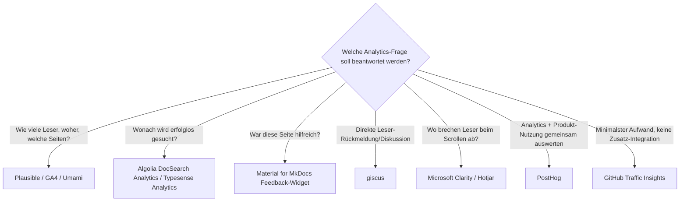

# Beste Docs-as-Code-Analytics-Werkzeuge 2026 — Top-15-Topliste

[Beste Docs-as-Code-Werkzeuge 2026](docs-as-code-2026-topliste.md) rankt Werkzeuge, die Doku-Seiten prüfen, extrahieren, hosten oder pflegen — aber keines davon beantwortet die Frage, **ob die fertige Doku überhaupt gelesen wird**. Diese Seite schließt genau diese Lücke: 15 Werkzeuge, mit denen Docs-as-Code-Teams 2026 messen, welche Seiten aufgerufen werden, wonach Leser erfolglos suchen, wo sie abbrechen und ob eine Seite überhaupt als hilfreich empfunden wird.

!!! note "Hinweis: Abgrenzung zu den bestehenden Docs-as-Code-Toplisten"
    [Beste Docs-as-Code-Werkzeuge 2026](docs-as-code-2026-topliste.md) und die [Open-Source-Variante](docs-as-code-open-source-2026-topliste.md) ranken die Werkzeug-Ebene rund um Erstellung und Qualitätssicherung. Diese Seite bleibt bewusst auf die **Auswertungs-Ebene** beschränkt — was nach der Veröffentlichung misst, statt vorher zu prüfen oder zu bauen.

---

## Bewertungskriterien

!!! warning "Achtung: Momentaufnahme, Stand August 2026"
    Die Feedback- und Suchanalytics-Ebene (Rang 5, 8–9, 15) verändert sich am schnellsten — KI-Chat-Interaktionen (Rang 6) sind 2026 eine noch junge Metrik-Kategorie ohne etablierten Standard.

---

## Top 15 im Überblick

| Rang | Werkzeug | Rolle | Lizenz/Modell | Besondere Stärke |
|---|---|---|---|---|
| 1 | **Plausible Analytics** | Web-Analytics | Open Source (AGPL-3.0), self-hostbar | Meistgenutzte quelloffene DSGVO-Alternative zu GA4 für Docs-Sites, ein Skript-Tag ohne Cookie-Banner-Pflicht |
| 2 | **Google Analytics 4 (GA4)** | Web-Analytics | Proprietär, kostenlos | Nach wie vor größte Marktdurchdringung, tiefste Integration mit Search Console für Suchbegriff-Herkunft |
| 3 | **PostHog** | Produkt-Analytics | Open Source (MIT-Kern), self-hostbar | Kombiniert Pageviews, Session Replay und Feature Flags in einem Tool — sinnvoll, wenn Docs und Produkt dieselbe Analytics-Basis teilen |
| 4 | **Umami** | Web-Analytics | Open Source (MIT), self-hostbar | Sehr ressourcenschonend, eigene PostgreSQL-/MySQL-Anbindung, beliebte Docker-Compose-Ergänzung zu Docs-as-Code-Deployments |
| 5 | **Algolia DocSearch Analytics** | Suchanalytics | Bestandteil von Algolia DocSearch (proprietär) | Zeigt Suchanfragen ohne Treffer — der direkteste Indikator für fehlende oder schlecht auffindbare Doku-Inhalte |
| 6 | **Mintlify Analytics** | Produkt-Analytics (Plattform-eingebaut) | Proprietär, Bestandteil von Mintlify | Vereint Pageviews, Suchanfragen und KI-Chat-Interaktionen in einem gehosteten Dashboard ohne Zusatz-Setup |
| 7 | **Read the Docs Traffic Analytics** | Web-Analytics (Plattform-eingebaut) | Bestandteil von Read the Docs | Seitenaufruf-Dashboard direkt in der Hosting-Plattform integriert, keine zusätzliche Skript-Einbindung nötig |
| 8 | **Material for MkDocs Feedback-Widget** | Feedback-Widget | Bestandteil von Material for MkDocs/Zensical (MIT) | Eingebauter „War diese Seite hilfreich?“-Daumen-Baustein — direkt im Stack dieses Repositories nutzbar |
| 9 | **giscus** | Feedback-Widget | Open Source (MIT) | GitHub-Discussions-basierte Kommentarfunktion für statische Docs-Seiten, keine eigene Kommentar-Infrastruktur nötig |
| 10 | **Microsoft Clarity** | Heatmap/Session-Replay | Proprietär, kostenlos | Zeigt Scroll-Tiefe und Klickmuster ohne Kostenpflicht, verbreitete Budget-Alternative zu Hotjar |
| 11 | **Hotjar** | Heatmap/Session-Replay | Proprietär (Free-Tier + kostenpflichtig) | Etabliertester Anbieter für Heatmaps und Session-Aufzeichnungen, oft auf Marketing-nahen Docs-Landingpages |
| 12 | **GoatCounter** | Web-Analytics | Open Source (EUPL), self-hostbar oder gehostet | Extrem leichtgewichtig, beliebt für kleinere Docs-/Blog-Projekte ohne Analytics-Overhead |
| 13 | **Fathom Analytics** | Web-Analytics | Proprietär, SaaS | Datenschutzfreundliche Cookie-lose Analytics mit EU-Hosting-Option, beliebte Bezahl-Alternative zu GA4 |
| 14 | **GitHub Traffic Insights** | Repo-Signale | Bestandteil von GitHub (kostenlos) | Native Klon-/Aufruf-Statistik direkt im Repository — einziges Werkzeug dieser Liste ohne jede Zusatz-Integration |
| 15 | **Typesense Analytics** | Suchanalytics | Bestandteil von Typesense (GPL-3.0), self-hostbar | Quelloffenes Pendant zu Algolia DocSearch Analytics für Teams mit selbstgehosteter Suche |

---

## Highlights im Detail

### Rang 1, 4, 12: die drei selbstgehosteten Web-Analytics-Alternativen
Plausible, Umami und GoatCounter zeigen drei Abstufungen desselben Prinzips — Web-Analytics ohne Drittanbieter-Cookie und ohne Datenabfluss an einen externen Konzern, von der ausgereiftesten (Plausible) bis zur schlankesten Lösung (GoatCounter).

### Rang 5, 9, 15: Suchanalytics und Feedback als direktester Lückenindikator
Anders als reine Pageview-Zahlen zeigen Algolia DocSearch Analytics, giscus-Kommentare und Typesense Analytics nicht nur *was* gelesen wird, sondern *was fehlt* — erfolglose Suchanfragen und Leser-Kommentare sind der kürzeste Weg von Analytics-Daten zu einer konkreten neuen Doku-Seite.

### Rang 6, 8: zwei gegensätzliche Integrationsphilosophien
Mintlify Analytics bündelt alles in einem proprietären Hosting-Produkt, das Material-for-MkDocs-Feedback-Widget liefert dieselbe Grundfunktion (Nutzer-Signal pro Seite) als schlanker, quelloffener Baustein direkt im Stack dieses Repositories — ohne Plattformwechsel.

---

## Entscheidungshilfe nach Baustellen-Typ

!!! tip "Tipp: Erst Suchanalytics, dann Web-Analytics"
    Pageview-Zahlen zeigen nur, was bereits funktioniert. Erfolglose Suchanfragen (Rang 5, 15) und Feedback-Signale (Rang 8–9) zeigen dagegen direkt, welche Seite als Nächstes geschrieben werden sollte — für ein einzelnes Docs-as-Code-Repository oft der höhere Hebel als ein vollständiges Web-Analytics-Setup.

---

## 🔗 Verwandte Themen

- [Startseite](../../index.md) — zurück zur Dokumentations-Zentrale
- [Beste Docs-as-Code-Werkzeuge 2026 (Top 15)](docs-as-code-2026-topliste.md) — Werkzeug-Ebene (Linting, API-Doku-Extraktion, Hosting/CI), die diese Analytics-Ebene ergänzt
- [Beste Open-Source-Docs-as-Code-Werkzeuge 2026 (Top 20)](docs-as-code-open-source-2026-topliste.md) — dieselbe Werkzeug-Ebene, gefiltert auf OSI-anerkannte Lizenzen
- [Evolution und Architekturen digitaler Docs-as-Code](evolution-digitaler-docs-as-code.md) — chronologisches Generationenmodell, dessen KI-/Agenten-Generation (6) die Analytics-Auswertung zunehmend mit einbezieht
- [Workspace-, Kollaborations- & Docs-as-Code-Plattformen (Top 20)](workspace-kollaboration-docs-as-code-2026-topliste.md) — Plattform-Ebene, auf der mehrere dieser Analytics-Werkzeuge eingebettet mitgeliefert werden (Rang 6–7)
- [LLM-Wiki-Pattern (Karpathy-Muster)](llm-wiki-pattern-karpathy.md) — agentisches Pflegeprinzip, das Analytics-Signale künftig direkt in automatisierte Doku-Ergänzung überführen kann
