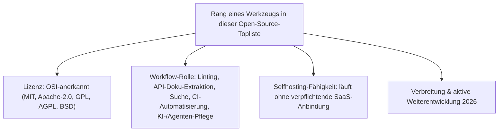
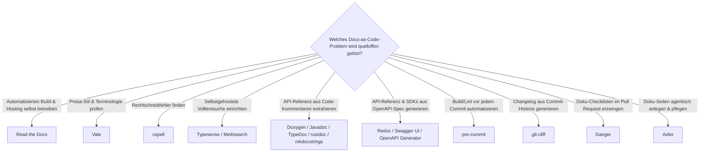

# Beste Open-Source-Docs-as-Code-Werkzeuge 2026 — Top-20-Topliste

[Beste Docs-as-Code-Werkzeuge 2026 (Top 15)](docs-as-code-2026-topliste.md) rankt Workflow-Werkzeuge unabhängig von der Lizenz — darunter auch proprietäre SaaS-Produkte wie Mintlify oder Kapa.ai. Diese Seite filtert dieselbe Werkzeug-Ebene (Linting, API-Doku-Extraktion, Suche, CI-Automatisierung, KI-/Agenten-Pflege) auf **20 Werkzeuge unter einer OSI-anerkannten Open-Source-Lizenz** und erweitert sie um selbstgehostete Alternativen, die in der lizenzoffenen Basisliste keinen Platz hatten.

!!! note "Hinweis: Nur OSI-anerkannte Lizenzen"
    Wie in der [Gesamtübersicht Open-Source-Wissenssysteme](fuehrende-opensource-wissenssysteme-2026-topliste.md) zählen hier nur Werkzeuge unter einer OSI-anerkannten Lizenz (MIT, Apache-2.0, GPL, AGPL, BSD). Deshalb fehlen gegenüber der Basisliste **Algolia DocSearch** (proprietärer Crawler/Index), **Mintlify** und **Kapa.ai** (gehostete SaaS-Produkte), **Claude Code / Antigravity CLI** (proprietäre Agenten-CLIs) sowie **Swimm** (Closed-Source mit Free-Tier) — an ihrer Stelle stehen unten selbstgehostete bzw. quelloffene Alternativen mit vergleichbarer Rolle.

---

## Bewertungskriterien

!!! warning "Achtung: Momentaufnahme, Stand August 2026"
    Die Such- und KI-/Agenten-Ebene (Rang 15–16, 20) verändert sich am schnellsten — anders als bei Doxygen oder Javadoc ist hier in den kommenden Jahren am ehesten mit neuen quelloffenen Alternativen zu rechnen.

---

## Top 20 im Überblick

| Rang | Werkzeug | Rolle | Lizenz | Seit | Besondere Stärke |
|---|---|---|---|---|---|
| 1 | **Read the Docs** | Hosting/CI | MIT | 2010 | Kern-Plattform selbst quelloffen und selbsthostbar, automatisiert Build und Hosting direkt aus dem Git-Repository |
| 2 | **Vale** | Linting | MIT | 2017 | Regelbasierter Prosa-Linter für Terminologie und Stil-Guides, Standardwerkzeug in praktisch jeder Open-Source-Docs-as-Code-Pipeline |
| 3 | **Doxygen** | API-Doku-Extraktion | GPL-2.0 | 1997 | Extrahiert API-Referenzdokumentation direkt aus strukturierten C/C++/Java-Kommentaren, bis heute Standard für Systemsoftware |
| 4 | **Javadoc** | API-Doku-Extraktion | GPL-2.0 (Classpath Exception) | 1995 | Fester Bestandteil des offenen OpenJDK, nach wie vor offizieller Standard für Java-API-Referenzen |
| 5 | **mkdocstrings** | API-Doku-Extraktion | MIT | 2019 | Bettet Python-Docstrings direkt in MkDocs/Zensical-Seiten ein — derselbe Stack, mit dem dieses Repository gebaut wird |
| 6 | **pre-commit** (Framework) | CI-Automatisierung | MIT | 2014 | Meistgenutztes quelloffenes Werkzeug für automatisierte Build-/Lint-Prüfung vor jedem Commit |
| 7 | **markdownlint-cli** | Linting | MIT | 2016 | Meistgenutzter Markdown-Stil- und Syntax-Linter in Open-Source-Docs-as-Code-Pipelines |
| 8 | **TypeDoc** | API-Doku-Extraktion | Apache-2.0 | 2015 | Extrahiert API-Referenzdokumentation aus TypeScript-Kommentaren, moderner Nachfolger von Javadoc/Doxygen für die JS/TS-Welt |
| 9 | **Lychee** | Linting | MIT/Apache-2.0 | 2016 | Rust-basierter Link-Checker, prüft interne und externe Links in großen Doku-Repositories in Sekunden statt Minuten |
| 10 | **Redoc** (Redocly-Kern) | API-Doku-Extraktion | MIT | 2015 | Generiert interaktive API-Referenzseiten direkt aus OpenAPI-Spezifikationsdateien, Kern-Renderer quelloffen |
| 11 | **Swagger UI** | API-Doku-Extraktion | Apache-2.0 | 2011 | Interaktive „Try it out"-Konsole direkt aus der OpenAPI-Spezifikation, meistgenutztes quelloffenes API-Doku-Frontend überhaupt |
| 12 | **OpenAPI Generator** | API-Doku-Extraktion | Apache-2.0 | 2018 | Generiert Referenzdokumentation und Client-SDKs aus derselben OpenAPI-Spezifikationsdatei |
| 13 | **rustdoc** | API-Doku-Extraktion | MIT/Apache-2.0 | 2011 | Fest im Rust-Toolchain integrierter Doc-Generator, extrahiert API-Referenzen direkt aus Doc-Kommentaren im Quellcode |
| 14 | **DocBook & LaTeX** | Markup-Fundament | Offener Standard / LPPL | 1991 / 1984 | Trennen erstmals konsequent Inhalt von Layout, Single-Source-Publishing in mehrere Ausgabeformate |
| 15 | **Typesense** | Suche | GPL-3.0 | 2016 | Selbstgehosteter Volltextsuch-Server, meistgenutzte quelloffene Alternative zu Algolia DocSearch |
| 16 | **Meilisearch** | Suche | MIT | 2018 | Zweite etablierte selbstgehostete Suchmaschine für Docs-as-Code-Sites, sehr niedrige Einstiegshürde |
| 17 | **cspell** | Linting | MIT | 2018 | Quellcode- und prosafähiger Rechtschreib-Checker, ergänzt Vale/markdownlint um reine Tippfehler-Erkennung |
| 18 | **git-cliff** | CI-Automatisierung | MIT/Apache-2.0 | 2021 | Generiert Changelogs automatisiert aus Conventional-Commit-Historie, Rust-basiert und CI-nativ |
| 19 | **Danger** (danger/danger-js) | CI-Automatisierung | MIT | 2015 | Automatisiert Doku-Checklisten als Pull-Request-Kommentare, ergänzt pre-commit um Review-Zeit-Prüfungen |
| 20 | **Aider** | KI-/Agenten-Pflege | Apache-2.0 | 2023 | Quelloffene agentische Coding-CLI, pflegt Doku-Seiten direkt im Git-Repository — offene Alternative zu proprietären Agenten-CLIs |

---

## Highlights im Detail

### Rang 1–4: die vier am tiefsten verankerten Open-Source-Bausteine
Read the Docs, Vale, Doxygen und Javadoc sind die einzigen vier Werkzeuge dieser Liste, die in praktisch jedem größeren Open-Source-Projekt vorkommen — alle vier seit über einem Jahrzehnt quelloffen, ohne dass ein SaaS-Zwang bestünde.

### Rang 5: mkdocstrings als direkter Bezug zu diesem Repository
[Dieses Repository](../../index.md) wird mit Zensical (Nachfolger von MkDocs + Material) gebaut — mkdocstrings ist die naheliegende quelloffene Ergänzung, um künftig Python-Docstrings statt nur handgeschriebener Markdown-Seiten einzubinden.

### Rang 10–13: das quelloffene OpenAPI-Ökosystem
Redoc, Swagger UI, OpenAPI Generator und rustdoc zeigen, dass API-Doku-Extraktion 2026 kein proprietäres Terrain ist — dieselbe OpenAPI-Spezifikationsdatei lässt sich mit rein quelloffenen Werkzeugen sowohl in eine statische Referenzseite (Redoc) als auch in eine interaktive Testkonsole (Swagger UI) oder in Client-SDKs (OpenAPI Generator) übersetzen.

### Rang 15–16: zwei selbstgehostete Alternativen zu Algolia DocSearch
Typesense und Meilisearch ersetzen den in der Basisliste geführten proprietären Algolia-Suchindex durch selbstgehostete Infrastruktur — Verzicht auf Bequemlichkeit gegen volle Kontrolle über Daten und Betrieb.

### Rang 20: Aider als offene Antwort auf proprietäre Agenten-CLIs
Wo die [Basisliste](docs-as-code-2026-topliste.md) mit Claude Code/Antigravity CLI eine proprietäre Agenten-CLI führt, übernimmt Aider dieselbe Rolle — agentische Pflege von Doku-Seiten direkt im Repository — unter einer vollständig quelloffenen Lizenz, siehe auch [AI Agents – Das Praxis-Handbuch](../../künstliche-intelligenz/coding/ai-agents-praxis.md).

---

## Was bewusst nicht in dieser Liste steht

!!! warning "Achtung: Ausschluss trotz Verbreitung oder technischer Stärke"
    - **Bereits in dedizierten Toplisten abgedeckt**: Rendering-Engines (Sphinx, MkDocs/Zensical, Docusaurus, Hugo, Astro Starlight …) stehen in [Beste Static-Site- & Docs-Generatoren 2026](static-site-generatoren-2026-topliste.md), Hosting-/Groupware-Plattformen in [Workspace-, Kollaborations- & Docs-as-Code-Plattformen](workspace-kollaboration-docs-as-code-2026-topliste.md) — diese Seite bleibt auf reine Workflow-Werkzeuge (Linting, API-Doku-Extraktion, Suche, CI-Automatisierung, KI-/Agenten-Pflege) beschränkt.
    - **Vollständig proprietär, kein Open-Core**: GitBook (heute reine SaaS-Plattform ohne quelloffenen Kern) und ReadMe.io (proprietäre API-Doku-as-a-Service-Plattform) — beide technisch ausgereift, aber ohne selbsthostbare Open-Source-Variante.
    - **Lizenz-Sonderfall Elasticsearch/Kibana**: häufig als selbstgehostete Docs-Suche eingesetzt, wechselte 2021 von Apache-2.0 zu SSPL/Elastic License und damit aus dem OSI-Kreis heraus; die 2024 erfolgte Rücklizenzierung auf AGPL-3.0 macht den Kern zwar wieder OSI-konform, doch Typesense und Meilisearch haben sich in der Docs-as-Code-Nische seither als die schlankeren, von Anfang an durchgängig offenen Alternativen etabliert.
    - **Unklarer Erhaltungszustand**: write-good und einige ältere Prosa-Linter-Alternativen zu Vale werden 2026 deutlich seltener aktiv weiterentwickelt.

---

## Entscheidungshilfe nach Baustellen-Typ

!!! tip "Tipp: Rendering-Engine separat wählen"
    Diese Liste ersetzt keine Generator-Wahl — Sphinx, MkDocs/Zensical, Docusaurus & Co. rankt [Beste Static-Site- & Docs-Generatoren 2026](static-site-generatoren-2026-topliste.md). Die meisten Werkzeuge dieser Seite lassen sich mit jeder beliebigen quelloffenen Rendering-Engine kombinieren.

---

## 🔗 Verwandte Themen

- [Startseite](../../index.md) — zurück zur Dokumentations-Zentrale
- [Beste Docs-as-Code-Werkzeuge 2026 (Top 15)](docs-as-code-2026-topliste.md) — lizenzoffene Basisliste, aus der diese Seite die 20 quelloffenen Werkzeuge filtert und ergänzt
- [Produktionsreife Open-Source-Docs-as-Code-Werkzeuge nach Generation (Top 10)](produktionsreife-docs-as-code-generationen-2026-topliste.md) — dieselben Kriterien plus Skala-Filter, sortiert nach Generation statt nach Rang
- [Evolution und Architekturen digitaler Docs-as-Code](evolution-digitaler-docs-as-code.md) — chronologisches Generationenmodell hinter beiden Toplisten
- [Beste Static-Site- & Docs-Generatoren 2026 (Top 20)](static-site-generatoren-2026-topliste.md) — Gegenstück auf Ebene der Rendering-Engines statt der Workflow-Werkzeuge
- [Workspace-, Kollaborations- & Docs-as-Code-Plattformen (Top 20)](workspace-kollaboration-docs-as-code-2026-topliste.md) — Plattform-Ebene (Hosting, Team-Workspace, Groupware) statt Workflow-Werkzeuge
- [Die führenden Open-Source-Wissenssysteme 2026 (Top 20)](fuehrende-opensource-wissenssysteme-2026-topliste.md) — analoge OSI-Lizenzfilterung für die breitere Kategorie Wissenssysteme
- [LLM-Wiki-Pattern (Karpathy-Muster)](llm-wiki-pattern-karpathy.md) — agentisches Pflegeprinzip hinter Rang 20, das dieses Repository selbst nutzt
- [AI Agents – Das Praxis-Handbuch & Architektur-Leitfaden](../../künstliche-intelligenz/coding/ai-agents-praxis.md) — Vertiefung zu Rang 20
- [Evolution und Architekturen digitaler Frameworks & Bibliotheken für Wissenssysteme](evolution-digitaler-wissenssystem-frameworks.md) — Pandoc als universeller Dokumentkonverter, oft im Hintergrund mehrerer dieser Werkzeuge eingesetzt
