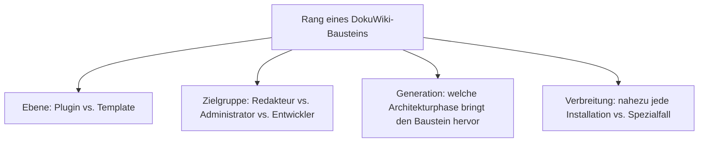
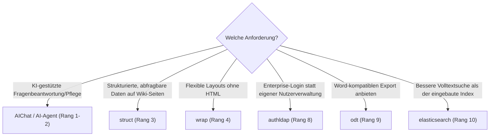

# Beste DokuWiki-Plugins & Templates 2026 — Top-15-Topliste

Die [Evolution und Architekturen von DokuWiki](evolution-digitaler-dokuwiki.md) ordnet die Produktgeschichte chronologisch nach sechs Generationen — von der dateibasierten Grundarchitektur über das ACL-Rechtesystem und die getrennte Plugin-/Template-Architektur bis zu strukturierten Daten per Plugin und der aktuellen, ACL-respektierenden KI-Ära. Da DokuWiki selbst kein Kategorie-Vergleich, sondern ein Einzelprodukt ist, übersetzt diese Seite die Chronologie stattdessen in eine **nach 2026-Relevanz gerankte Top-15-Liste konkreter Plugins und Templates**, mit denen dieses eine Produkt tatsächlich betrieben wird.

!!! note "Hinweis: praktisch der gesamte Funktionsumfang läuft über Plugins"
    Anders als bei MediaWiki, Drupal oder Moodle gibt es bei DokuWiki kaum eine eigene „Core-Feature"-Ebene zum Ranken — der bewusst schlanke Kern aus [Generation 1](evolution-digitaler-dokuwiki.md#generation-1-projektstart-dateibasierte-grundarchitektur-2004) delegiert praktisch jede Erweiterung an das Plugin-System aus [Generation 3](evolution-digitaler-dokuwiki.md#generation-3-plugin-template-architektur-ab-20052006). Diese Liste ist entsprechend fast vollständig eine Plugin-/Template-Liste.

---

## Bewertungskriterien

---

## Top 15 im Überblick

| Rang | Baustein | Ebene | Generation | Bedeutung |
|---|---|---|---|---|
| 1 | **AI-Agent** (CosmoCode) | Plugin | 6 (KI-Ära) | Autonomer Schreib-Agent, respektiert das ACL-System aus Generation 2 vollständig |
| 2 | **AIChat** (CosmoCode) | Plugin | 6 (KI-Ära) | RAG-Chatbot, beantwortet Fragen direkt auf Basis der Wiki-Inhalte |
| 3 | **struct** | Plugin | 4 (Strukturierte Daten per Plugin) | Typisierte, abfragbare Metadatenfelder — Gegenstück zu XWikis XObjects, hier als Plugin statt Core-Feature |
| 4 | **wrap** | Plugin | 3 (Plugin- & Template-Architektur) | Layout-Boxen und Mehrspalten-Layouts direkt in der Wikisyntax, meistgenutztes Utility-Plugin überhaupt |
| 5 | **indexmenu** | Plugin | 3 (Plugin- & Template-Architektur) | Konfigurierbare Baum-/Sidebar-Navigation über Namespaces hinweg |
| 6 | **bureaucracy** | Plugin | 4 (Strukturierte Daten per Plugin) | Formulargestützte Seitenerstellung aus Vorlagen, baut auf demselben strukturierten Datengedanken wie struct |
| 7 | **combo** | Plugin | 5 (Modulare Renderer & Release-Rhythmus) | Komponentenbasiertes, moderneres Theming/Layout auf Basis der Renderer-Pipeline |
| 8 | **authldap** | Plugin | 2 (ACL-Rechtesystem) | Bindet LDAP-/Active-Directory-Verzeichnisse als Authentifizierungsquelle in das ACL-System ein |
| 9 | **odt** (OpenDocument-Export) | Plugin | 5 (Modulare Renderer & Release-Rhythmus) | Nutzt die Renderer-Pipeline für Word-kompatiblen Dokumentexport |
| 10 | **elasticsearch** | Plugin | 5 (Modulare Renderer & Release-Rhythmus) | Ersetzt den eingebauten Suchindex durch Volltextsuche mit Relevanz-Ranking |
| 11 | **sqlite** | Plugin | 4 (Strukturierte Daten per Plugin) | Optionale lokale SQLite-Datenbank als Backend für datenintensive Plugins, ohne die Flat-File-Philosophie des Cores zu verletzen |
| 12 | **discussion** | Plugin | 3 (Plugin- & Template-Architektur) | Kommentar-/Diskussionsfäden direkt auf Wiki-Seiten |
| 13 | **tag** | Plugin | 3 (Plugin- & Template-Architektur) | Verschlagwortung von Seiten mit automatisch generierten Tag-Übersichtsseiten |
| 14 | **captcha** | Plugin | 2 (ACL-Rechtesystem, Ergänzung) | Spam-/Bot-Schutz bei offenen Registrierungen, ergänzt das ACL-System um eine Abwehrebene |
| 15 | **Bootstrap3** (Template) | Template | 3 (Plugin- & Template-Architektur) | Populäre, responsive Design-Alternative zum Standard-Template |

---

## Highlights im Detail

### Rang 1–2: die aktuelle KI-Generation
AI-Agent und AIChat zeigen, wie konsequent DokuWiki KI-Funktionen über den Plugin-Mechanismus nachrüstet, statt den Core zu erweitern — und bleiben dabei strikt an das ACL-Rechtesystem aus Generation 2 gebunden, siehe [Generation 6](evolution-digitaler-dokuwiki.md#generation-6-ki-ara-aichat-ai-agent-plugin-ab-2024).

### Rang 3, 6, 11: strukturierte Daten ohne Core-Datenmodell
struct, bureaucracy und sqlite zeigen gemeinsam, wie DokuWiki denselben Anwendungsfall wie XWikis native XObjects erreicht — als optionale Plugin-Schicht statt fest verdrahtetem Core-Feature, siehe [Generation 4](evolution-digitaler-dokuwiki.md#generation-4-strukturierte-daten-per-plugin-ca-2008-2015).

### Rang 4–5, 12–13, 15: das Plugin-/Template-Fundament
wrap, indexmenu, discussion, tag und das Bootstrap3-Template zeigen die Breite des seit Generation 3 etablierten Erweiterungssystems — von reiner Layout-Kontrolle bis zu Community-Funktionen, siehe [Generation 3](evolution-digitaler-dokuwiki.md#generation-3-plugin-template-architektur-ab-20052006).

---

## Wegweiser: von Anforderung zu passendem Baustein

!!! tip "Tipp: die Produkt-Chronologie separat prüfen"
    Diese Liste übersetzt alle sechs Generationen der Quell-Chronologie in eine gemeinsame 2026-Momentaufnahme — für die vollständige Versionsgeschichte siehe [Evolution und Architekturen von DokuWiki](evolution-digitaler-dokuwiki.md).

---

## Verwandte Themen

- [Evolution und Architekturen von DokuWiki](evolution-digitaler-dokuwiki.md) — chronologisches Generationenmodell, dessen aktuellen Stand diese Topliste zusammenfasst
- [Klassische Wiki-Systeme mit LLM-Integration](../klassische-wiki-systeme-llm-integration.md#dokuwiki-aichat-ai-agent-plugin) — Vertiefung zu Rang 1–2
- [Beste Agenten-Integrationen für Wissenssysteme](../agenten-integration-wissenssysteme-topliste.md) — Einordnung von Rang 1 im Systemvergleich
- [Beste Wiki-Engines 2026 (Top 20)](../wiki-engines-2026-topliste.md) — DokuWiki im Vergleich zu MediaWiki, XWiki, Wiki.js & Co.
- [Wiki-Engines mit PostgreSQL-/Dateiformat-Speicherung 2026](../wiki-engines-postgresql-dateiformat-2026-topliste.md) — Vertiefung zum dateibasierten Grundprinzip
- [Dokumentationsübersicht](../index.md)
