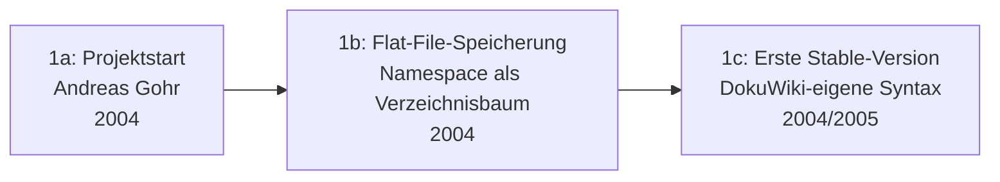

# Evolution und Architekturen von DokuWiki

DokuWiki bildet Generation 1b der [Evolution digitaler Wiki-Engines](../evolution-digitaler-wiki-engines.md#1b-relationale-datenbanken-enzyklopadischer-mastab-2001-2008) — dort explizit als **dateibasierte Ausnahme** dieser sonst relational geprägten Generation geführt —, die ihrerseits Generation 1 der übergeordneten [Evolution digitaler Wissenssysteme](../evolution-digitaler-wissenssysteme.md) bildet. Diese eigenständige Zeitachse zoomt — analog zu den Produkt-Spezialartikeln [Evolution und Architekturen von MediaWiki](../mediawiki/evolution-digitaler-mediawiki.md), [Evolution und Architekturen von XWiki](../xwiki/evolution-digitaler-xwiki.md) und [Evolution und Architekturen von Moodle](../moodle/evolution-digitaler-moodle.md) — in genau DokuWikis eigene Architekturlinie hinein: von der bewusst datenbankfreien Flat-File-Grundarchitektur über das ACL-Rechtesystem und die getrennte Plugin-/Template-Architektur bis zu strukturierten Daten per Plugin und der aktuellen, offiziell ACL-respektierenden KI-Ära.

!!! note "Hinweis: kein eigener Installationsabschnitt in diesem Repository"
    Anders als MediaWiki, XWiki, Drupal und Moodle hat DokuWiki bislang keine eigene Installationsanleitung in diesem Repository — es taucht bisher nur vergleichend in Toplisten auf, siehe [Beste Wiki-Engines 2026](../wiki-engines-2026-topliste.md) und [Wiki-Engines mit PostgreSQL-/Dateiformat-Speicherung](../wiki-engines-postgresql-dateiformat-2026-topliste.md). Diese Seite und die zugehörige Topliste stehen unabhängig davon.

!!! note "Hinweis: Generationen überlappen sich"
    Die Zeiträume sind grobe Orientierung, keine scharfen Grenzen — die ursprüngliche Flat-File-Architektur aus Generation 1 trägt bis heute jede DokuWiki-Installation, parallel zur KI-gestützten Generation 6. Entscheidend ist die **Architektur** (Speicherform, Rechtesystem, Erweiterungsmechanismus), nicht allein das Versionsjahr.

---

## Generation 1: Projektstart & dateibasierte Grundarchitektur, 2004

Die Gründergeneration eint drei Prinzipien: **kein Datenbankserver** — Seiten liegen als reine Textdateien im Dateisystem —, eine **Namespace-Struktur als Verzeichnisbaum** statt flacher Seitentitel und eine **eigene, absichtlich einfache Wikisyntax**. Sie lässt sich in drei technologische Entwicklungsstufen unterteilen:

### 1a. Projektstart, 2004

- **Hintergrund:** Andreas Gohr entwickelt DokuWiki ursprünglich für die interne Dokumentation eines kleinen Unternehmens — der Name verbindet „Dokumentation" und „Wiki" direkt im Produktnamen.
- **Bedeutung:** die Zielsetzung „einfach zu betreiben, kein Administrationsaufwand" prägt jede spätere Architekturentscheidung des Projekts.

### 1b. Flat-File-Speicherung — Namespace als Verzeichnisbaum, 2004

- **Architektur:** jede Seite ist eine einzelne Textdatei im Dateisystem, **Namespaces** entsprechen direkt Verzeichnissen statt einer Datenbanktabelle — dieselbe Grundidee wie bei den Flat-File-Pionieren aus [Generation 1a der Wiki-Engines-Zeitachse](../evolution-digitaler-wiki-engines.md#1a-die-pioniere-flat-file-radikale-einfachheit-1995-2001), hier jedoch bewusst als spätere, ausgereiftere Ausnahme innerhalb der sonst datenbankgestützten Generation 1b.
- **Bedeutung:** Backup und Migration reduzieren sich auf das Kopieren eines Verzeichnisses — kein Datenbank-Dump, keine Schema-Migration.

### 1c. Erste Stable-Version — DokuWiki-eigene Syntax, 2004/2005

- **Architektur:** eine eigene, bewusst einfach gehaltene Wikisyntax (unterscheidet sich von MediaWikis Syntax), zeilenbasierter Parser.
- **Bedeutung:** Grundstein der bis heute weiterentwickelten Codebasis — derselbe zeilenbasierte Parser-Ansatz bleibt bis heute produktiv im Einsatz, siehe [Generation 1 der Wissenssystem-Frameworks-Zeitachse](../evolution-digitaler-wissenssystem-frameworks.md).

---

## Generation 2: ACL-Rechtesystem, ab 2005

Statt Rechte an eine Datenbanktabelle zu binden, verwaltet DokuWiki Zugriffsrechte über eine einzige, konfigurationsdatei-basierte Access-Control-Liste.

**Architektur:** eine zentrale ACL-Datei definiert Lese-/Schreibrechte pro **Namespace** und optional pro **Einzelseite**, ausgewertet gegen Nutzer und Gruppen — feingranular, aber ohne eigene Rechte-Datenbanktabelle.

!!! tip "Bedeutung für spätere Generationen"
    Dieses strikte, konsequent respektierte ACL-System wird später zum entscheidenden Kriterium für DokuWikis offizielles KI-Agent-Plugin in Generation 6 — siehe [Beste Agenten-Integrationen für Wissenssysteme](../agenten-integration-wissenssysteme-topliste.md).

---

## Generation 3: Plugin- & Template-Architektur, ab 2005/2006

Kernfunktionalität bleibt bewusst schlank — Erweiterungen und Design werden strikt in zwei getrennte, austauschbare Ebenen ausgelagert.

| Baustein | Rolle |
|---|---|
| **Plugin-System** | Erweitert Syntax, Aktionen und Admin-Funktionen, ohne den Core zu verändern — offizielles Plugin-Repository wächst auf tausende Erweiterungen. |
| **Template-System** | Trennt visuelles Design vollständig von Inhalt und Logik, austauschbar ohne Datenmigration. |

---

## Generation 4: Strukturierte Daten per Plugin, ca. 2008 – 2015

Wo [XWiki](../xwiki/evolution-digitaler-xwiki.md#generation-1-projektstart-xobjects-datenmodell-2003-2006) strukturierte Daten (XObjects) direkt im Core verankert, erreicht DokuWiki dasselbe Ziel bewusst als optionale Erweiterung auf Basis der Plugin-Architektur aus Generation 3.

**Architektur:** das **data**-/**struct**-Plugin ergänzt Wiki-Seiten um typisierte, abfragbare Metadatenfelder — Formulare, Tabellen und Filter auf Basis dieser Felder, ohne dass die Kernarchitektur ein eigenes Datenmodell benötigt.

---

## Generation 5: Modulare Renderer & codenamed Release-Rhythmus

Aus derselben Wikisyntax-Quelle lassen sich über austauschbare Renderer mehrere Ausgabeformate erzeugen, während sich der Release-Prozess selbst zu einem eigenen, wiedererkennbaren Muster verfestigt.

**Architektur:** eine modulare **Renderer-Pipeline** trennt Parsing von Ausgabeerzeugung — XHTML als Standardausgabe, weitere Formate (u. a. ODT-/PDF-Export) über Renderer-Plugins auf derselben Quelle. Releases tragen seither eigene Codenamen statt reiner Versionsnummern und erscheinen in bewusst stetigem, nicht rasantem Rhythmus.

!!! note "Bezug zur Aktivitäts-Bewertung dieses Repositories"
    Dieser gemächlichere, aber ununterbrochene Release-Rhythmus wird in den vergleichenden Toplisten dieses Repositories explizit als **Reife statt Stillstand** eingeordnet, siehe [Aktive & reife Open-Source-Wissenssysteme 2026](../aktive-reife-opensource-wissenssysteme-2026-topliste.md).

---

## Generation 6: KI-Ära — AIChat- & AI-Agent-Plugin, ab 2024

Die aktuelle Generation rüstet LLM-Funktionen konsequent über die Plugin-Architektur aus Generation 3 nach, statt den Core zu erweitern — und bleibt dabei strikt an das ACL-System aus Generation 2 gebunden.

| Baustein | Rolle |
|---|---|
| **AIChat-Plugin** (CosmoCode) | Chatbot, der Fragen anhand der Wiki-Inhalte beantwortet. |
| **AI-Agent-Plugin** (CosmoCode) | Erweitert AIChat um selbstständiges Durchsuchen, Lesen und — mit Berechtigung — Bearbeiten von Seiten. |

!!! tip "Einziges System mit vollständig ACL-respektierendem Herstelleragenten"
    Beide Plugins respektieren DokuWikis ACL-System vollständig — die KI sieht und bearbeitet ausschließlich, wozu der jeweilige Nutzer ohnehin berechtigt ist. Details siehe [Klassische Wiki-Systeme mit LLM-Integration](../klassische-wiki-systeme-llm-integration.md#dokuwiki-aichat-ai-agent-plugin) und [Beste Agenten-Integrationen für Wissenssysteme](../agenten-integration-wissenssysteme-topliste.md).

---

## Alternative Sortier- & Klassifikationskriterien für DokuWiki

### 1. Speicherform

- **Datenbankgestützt** — MediaWiki, XWiki (zum Vergleich).
- **Flat-File** — DokuWiki, ohne Datenbankserver seit Generation 1.

### 2. Erweiterungsweg

- **Core-Feature** — bei DokuWiki bewusst minimal gehalten (ACL, Renderer-Pipeline).
- **Plugin** — Standardweg für nahezu jede Funktionserweiterung seit Generation 3, inklusive strukturierter Daten (Generation 4) und KI-Funktionen (Generation 6).

### 3. Rechtemodell

- **Datenbankgestützte Rechtetabelle** — bei anderen Wiki-Engines üblich.
- **Konfigurationsdatei-basierte ACL** — DokuWikis Ansatz seit Generation 2, Grundlage für den ACL-respektierenden KI-Agenten aus Generation 6.

---

## Verwandte Themen

- [Beste Wiki-Engines 2026 (Top 20)](../wiki-engines-2026-topliste.md) — DokuWiki im Vergleich zu MediaWiki, XWiki, Wiki.js & Co.
- [Wiki-Engines mit PostgreSQL-/Dateiformat-Speicherung 2026](../wiki-engines-postgresql-dateiformat-2026-topliste.md) — Vertiefung zum Flat-File-Speicherprinzip aus Generation 1
- [Klassische Wiki-Systeme mit LLM-Integration](../klassische-wiki-systeme-llm-integration.md#dokuwiki-aichat-ai-agent-plugin) — Vertiefung zu Generation 6
- [Beste Agenten-Integrationen für Wissenssysteme](../agenten-integration-wissenssysteme-topliste.md) — Einordnung des AI-Agent-Plugins im Systemvergleich
- [Evolution und Architekturen digitaler Wiki-Engines](../evolution-digitaler-wiki-engines.md) — übergeordnetes Generationenmodell, in dem DokuWiki Generation 1b bildet
- [Evolution und Architekturen von MediaWiki](../mediawiki/evolution-digitaler-mediawiki.md) — analoger Produkt-Spezialartikel für MediaWiki
- [Evolution und Architekturen von XWiki](../xwiki/evolution-digitaler-xwiki.md) — analoger Produkt-Spezialartikel für XWiki, Gegenmodell mit Core-Datenmodell statt Plugin
- [Dokumentationsübersicht](../index.md)
