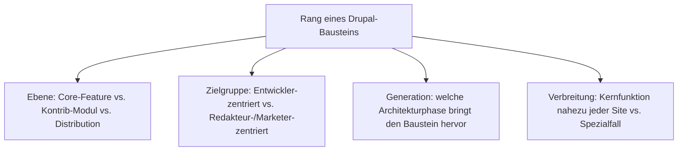
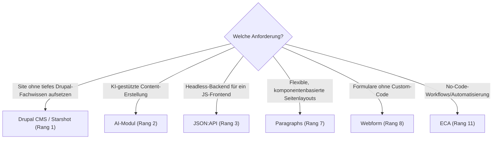

# Beste Drupal-Module & -Distributionen 2026 — Top-15-Topliste

Die [Evolution und Architekturen von Drupal](evolution-digitaler-drupal.md) ordnet die Produktgeschichte chronologisch nach fünf Generationen — vom prozeduralen PHP-Kern über den Symfony-Rewrite und API-First-Reife bis zur KI-nativen, Recipe-basierten Gegenwart. Da Drupal selbst kein Kategorie-Vergleich, sondern ein Einzelprodukt ist, übersetzt diese Seite die Chronologie stattdessen in eine **nach 2026-Relevanz gerankte Top-15-Liste konkreter Module, Core-Features und Distributionen**, mit denen dieses eine Produkt tatsächlich betrieben wird.

!!! note "Hinweis: Core-Feature, Kontrib-Modul und Distribution gemeinsam gerankt"
    Diese Liste mischt bewusst drei Ebenen — heute im Core enthaltene Features (JSON:API, CKEditor 5), weiterhin unverzichtbare Kontrib-Module (Views, Paragraphs, Webform) und vorkonfigurierte Distributionen (Drupal CMS) — weil alle drei gemeinsam bestimmen, wie eine Drupal-Site 2026 tatsächlich aufgebaut wird.

---

## Bewertungskriterien

---

## Top 15 im Überblick

| Rang | Baustein | Ebene | Generation | Bedeutung |
|---|---|---|---|---|
| 1 | **Drupal CMS** (Projekt „Starshot") | Distribution | 5 (KI-natives Drupal & Recipe-Distributionen) | Vorkonfigurierte Recipe-Distribution, senkt die Einstiegshürde für Nicht-Entwickler drastisch |
| 2 | **AI-Modul** (Core-Contrib, auf Symfony AI) | Modul | 5 (KI-natives Drupal & Recipe-Distributionen) | Bindet über 48 Modell-Provider an, Content-Erstellung und semantische Suche direkt im Kern |
| 3 | **JSON:API** | Core-Feature | 4 (API-First & Headless-Reife) | Stabilisierte Core-API, macht Drupal zum vollwertigen Headless-Backend für JS-Frontends |
| 4 | **CKEditor 5** | Core-Feature | 4 (API-First & Headless-Reife) | Standard-Rich-Text-Editor seit Drupal 10, ersetzt CKEditor 4 |
| 5 | **Views** | Core-Feature (ex-Kontrib) | 1b (Konsolidierung & CCK/Views-Ökosystem) | Ursprünglich Kontrib-Modul zur Abfrage/Darstellung strukturierter Inhalte, seit Drupal 8 im Core |
| 6 | **Search API** (+ KI-Erweiterungen für Vektorsuche) | Modul | 5 (KI-natives Drupal & Recipe-Distributionen) | Abstrahiert Backends wie Solr/Elasticsearch, zunehmend um semantische/Vektorsuche erweitert |
| 7 | **Paragraphs** | Modul | 2/3 (Symfony-Ära & kontinuierliche Modernisierung) | Komponentenbasierte Content-Modellierung, De-facto-Standard für flexible Seitenlayouts |
| 8 | **Webform** | Modul | 1 (Frühes Drupal) | Meistgenutztes Formular-Baukasten-Modul über nahezu alle Drupal-Generationen hinweg |
| 9 | **Single Directory Components (SDC)** | Core-Feature | 5 (KI-natives Drupal & Recipe-Distributionen) | Bündelt Theme-Komponenten (Twig, CSS, JS, Metadaten) in einem Verzeichnis statt verteilter Dateien |
| 10 | **Pathauto** | Modul | 1 (Frühes Drupal) | Automatisierte, lesbare URL-Aliasse statt technischer Node-IDs in der URL |
| 11 | **ECA** (Event-Condition-Action) | Modul | 5 (KI-natives Drupal & Recipe-Distributionen) | No-Code-Workflow-Automatisierung, zunehmend als Andockpunkt für KI-Agenten genutzt |
| 12 | **Admin Toolbar** | Modul | 2 (Symfony-Ära & objektorientierte Neuausrichtung) | Ersetzt die Standard-Verwaltungsleiste durch eine performantere Dropdown-Navigation |
| 13 | **Metatag** | Modul | 2 (Symfony-Ära & objektorientierte Neuausrichtung) | Standard-Modul für SEO-relevante Meta-, Open-Graph- und Twitter-Card-Tags |
| 14 | **Devel** | Modul | 1 (Frühes Drupal) | Entwickler-Werkzeugkasten (Variablen-Dump, Query-Log, Mail-Abfangen) über alle Generationen hinweg |
| 15 | **Group** | Modul | 3 (Kontinuierliche Modernisierung im Symfony-Takt) | Multi-Tenancy-/Community-Modul für Sites mit mehreren abgegrenzten Nutzergruppen |

---

## Highlights im Detail

### Rang 1–2, 6, 9, 11: die aktuelle KI- und Recipe-Generation
Drupal CMS, das AI-Modul, Search-API-KI-Erweiterungen, Single Directory Components und ECA zeigen gemeinsam, wie Generation 5 die Zielgruppe von reinen Entwicklern zu Marketern und Redakteuren verschiebt, ohne die API-First-Tiefe aus Generation 4 aufzugeben, siehe [Generation 5](evolution-digitaler-drupal.md#generation-5-ki-natives-drupal-recipe-basierte-distributionen-ab-2024).

### Rang 3–4: der Headless-Durchbruch
JSON:API und CKEditor 5 markieren gemeinsam den Punkt, an dem Drupal als vollwertiges Content-Backend hinter Next.js-, Gatsby- oder Astro-Frontends produktionsreif wird, siehe [Generation 4](evolution-digitaler-drupal.md#generation-4-api-first-headless-reife-2022-2024).

### Rang 5, 8, 10, 14: Kontrib-Module, die zu Kernfunktionen wurden
Views, Webform, Pathauto und Devel zeigen, wie stark das Kontrib-Ökosystem der frühen Generationen den heutigen Core mitgeprägt hat — Views wanderte sogar vollständig in den Core, siehe [Generation 1](evolution-digitaler-drupal.md#generation-1-fruhes-drupal-prozeduraler-php-kern-ohne-entity-system-2001-2015).

---

## Wegweiser: von Anforderung zu passendem Baustein

!!! tip "Tipp: die Produkt-Chronologie separat prüfen"
    Diese Liste übersetzt alle fünf Generationen der Quell-Chronologie in eine gemeinsame 2026-Momentaufnahme — für die vollständige Versionsgeschichte siehe [Evolution und Architekturen von Drupal](evolution-digitaler-drupal.md).

---

## 🔗 Verwandte Themen

- [Evolution und Architekturen von Drupal](evolution-digitaler-drupal.md) — chronologisches Generationenmodell, dessen aktuellen Stand diese Topliste zusammenfasst
- [Drupal installieren: Composer, PostgreSQL und Nginx](installieren.md) — Installationsanleitung für Drupal 10.x/11.x
- [Evolution und Architekturen digitaler Content-Management-Systeme](../evolution-digitaler-cms.md) — übergeordnetes Generationenmodell für CMS im Allgemeinen
- [Klassische Wissensmanagement-, KB- & CMS-Systeme mit LLM-Integration](../klassische-wissensmanagement-cms-llm-integration.md) — aktuelle KI-Integration in Drupal (2026)
- [Dokumentationsübersicht](../index.md)
