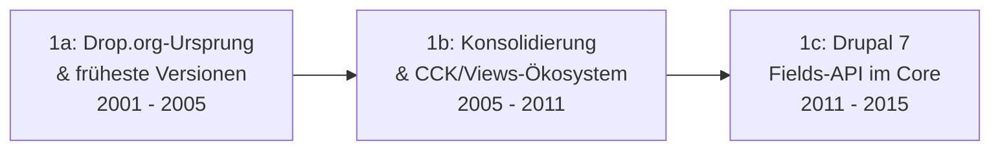

# Evolution und Architekturen von Drupal

Drupal lässt sich — analog zu den Generationenmodellen für [CMS im Allgemeinen](../evolution-digitaler-cms.md) und andere Systemklassen dieses Repositories — nach **technologischen Generationen** ordnen: von der Community-Plattform Drop.org über den prozeduralen PHP-Kern bis 8.x, den vollständigen Rewrite auf Symfony-Komponenten und schließlich die KI- und Recipe-getriebene Gegenwart mit Drupal 11 und Drupal CMS. Die praktische Installation behandelt [Drupal installieren: Composer, PostgreSQL und Nginx](installieren.md), die aktuelle KI-Integration [Klassische Wissensmanagement-, KB- & CMS-Systeme mit LLM-Integration](../klassische-wissensmanagement-cms-llm-integration.md#3-klassische-headless-cms).

!!! note "Hinweis: Generationen überlappen sich"
    Die Zeiträume sind grobe Orientierung, keine scharfen Grenzen — Drupal 7 (Generation 1c) blieb durch mehrfach verlängerten Support bis Januar 2025 produktiv im Einsatz, weit über den Marktstart von Drupal 9 und 10 hinaus. Entscheidend ist die **Architektur** (prozedural vs. objektorientiert, Core- vs. Kontrib-Funktionsumfang), nicht allein das Versionsjahr.

---

## Generation 1: Frühes Drupal — prozeduraler PHP-Kern ohne Entity-System, 2001 – 2015

Die erste Generation eint drei Prinzipien: ein **prozeduraler PHP-Kern** mit Hook-System statt objektorientierter Architektur, ein von Anfang an **node-basiertes Content-Modell** und ein wachsendes **Kontrib-Modul-Ökosystem**, das fehlende Kern-Features kompensiert. Sie lässt sich in drei technologische Entwicklungsstufen unterteilen:

### 1a. Drop.org-Ursprung & früheste Versionen, 2001 – 2005

- **Architektur:** einfache PHP-Skripte mit Modul-Hook-System, node-basiertes Content-Modell von Beginn an, noch ohne dediziertes Theming-System.
- **Fokus:** aus der internen Community-/Diskussionsplattform **Drop.org** (Dries Buytaert) hervorgegangen, ab Januar 2001 als Open Source veröffentlicht.
- **Vertreter:** **Drupal 1** (Januar 2001), **Drupal 4.1** (2005, erste Taxonomie-Unterstützung im Core).

### 1b. Konsolidierung & CCK/Views-Ökosystem, 2005 – 2011

- **Architektur:** jQuery-Integration ab **Drupal 5** (2007), überarbeitetes PHPTemplate-Theme-System; strukturierte Inhalte und Abfragen laufen fast ausschließlich über die Kontrib-Module **CCK** (Content Construction Kit) und **Views**, da der Core dafür keine eigene Lösung bietet.
- **Fokus:** starkes Modul-Ökosystem kompensiert fehlende Core-Features, deutliche Mehrsprachigkeits-Verbesserungen in **Drupal 6** (2008).
- **Vertreter:** Drupal 5 (2007), Drupal 6 (2008 — durch seine lange Lebensdauer noch heute in Migrationsprojekten anzutreffen).

### 1c. Drupal 7 — Fields-API im Core, 2011 – 2015

- **Architektur:** die CCK-Funktionalität wandert als **Fields API** in den Core, eine PDO-basierte Datenbankabstraktionsschicht (DBTNG) ersetzt die alte Query-API — weiterhin jedoch prozedurales PHP ohne objektorientierten Kern.
- **Fokus:** Massentauglichkeit und außergewöhnlich lange Lebensdauer (End-of-Life mehrfach verlängert, zuletzt Januar 2025), größtes Kontrib-Modul-Ökosystem der gesamten Drupal-Geschichte.
- **Vertreter:** **Drupal 7** (Januar 2011).

---

## Generation 2: Symfony-Ära & objektorientierte Neuausrichtung, 2015 – 2020

Mit Drupal 8 vollzieht das Projekt einen kompletten Rewrite — nicht evolutionär wie zuvor, sondern als fundamentaler Architekturbruch, der einen direkten Versions-Upgrade-Pfad unmöglich macht und stattdessen eine echte Migration erfordert.

**Architektur:** Aufbau auf **Symfony-Komponenten** (Routing, Dependency Injection, HTTP Kernel), durchgängig objektorientiertes PHP, **Twig** ersetzt PHPTemplate, **Configuration Management API** (Config-Sync zwischen Umgebungen) und eine **REST API** direkt im Core statt als Kontrib-Modul.

| Merkmal | Vorher (Drupal 7) | Nachher (Drupal 8) |
|---|---|---|
| Programmierparadigma | prozedural, Hook-basiert | objektorientiert, Symfony-Komponenten |
| Theming | PHPTemplate | Twig |
| Konfiguration | in der Datenbank, schwer versionierbar | Config-Sync als YAML-Dateien, Git-fähig |
| API-Zugriff | Kontrib-Modul „Services" | REST API im Core |

**Vertreter:** **Drupal 8** (2015) — Enterprise-reif, aber mit steiler Lernkurve und dem in der Community meistdiskutierten Upgrade-Bruch der Projektgeschichte.

---

## Generation 3: Kontinuierliche Modernisierung im Symfony-Takt, 2020 – 2022

Drupal 9 ist im Kern architektonisch identisch zu Drupal 8 — der Sprung dient primär der Bereinigung veralteten Codes und dem Umstieg auf eine neuere Symfony-Version, nicht einem erneuten Rewrite.

**Architektur:** Symfony 4/5 statt Symfony 3, Entfernung von als veraltet markiertem Code (Deprecations) aus Drupal 8.

**Fokus:** Etablierung eines **kontinuierlichen Release-Zyklus** — Drupal-Updates werden ab dieser Generation planbar wie bei anderer moderner Software, statt eines erneuten Big-Bang-Rewrites wie beim Sprung von 7 auf 8.

**Vertreter:** **Drupal 9** (Juni 2020).

---

## Generation 4: API-First & Headless-Reife, 2022 – 2024

Drupal etabliert sich als vollwertiges **Headless-CMS-Backend** für JavaScript-Frontends — eine direkte Schnittmenge zur [Composable/MACH-Generation der CMS-Übersicht](../evolution-digitaler-cms.md#generation-3-composable-mach-architektur-digital-experience-platforms-dxp-ab-ca-2020).

**Architektur:** Symfony 6, **CKEditor 5** als Standard-Editor, moderne Standard-Themes (**Olivero** im Frontend, **Claro** im Backend), stabilisierte **JSON:API** im Core.

**Fokus:** Drupal als Content-Backend hinter Next.js-, Gatsby- oder Astro-Frontends statt ausschließlich klassisch server-gerendertem Theming.

**Vertreter:** **Drupal 10** (Dezember 2022) — die in der [Installationsanleitung](installieren.md) und den [Migrations-](migration-wikisysteme.md)/[Export-Artikeln](export-nach-mkdocs.md) dieses Repositories referenzierte Version.

---

## Generation 5: KI-natives Drupal & Recipe-basierte Distributionen, ab 2024

Zwei parallele Entwicklungen prägen die aktuelle Generation: ein **offizielles KI-Modul im Core** und die Senkung der Einstiegshürde für Nicht-Entwickler durch vorkonfigurierte **Recipes** statt manueller Modul-Konfiguration.

**Architektur:** Symfony 7, PHP 8.3+, **Single Directory Components (SDC)** für gebündelte Theme-Komponenten; das **AI-Modul** (Core-Contrib, auf **Symfony AI** aufbauend) bindet über 48 Modell-Provider an, siehe [Drupal AI-Modul in der CMS-LLM-Integration](../klassische-wissensmanagement-cms-llm-integration.md#3-klassische-headless-cms).

| Baustein | Rolle |
|---|---|
| **Drupal 11** (2024/2025) | Aktuelle Hauptversion, technische Basis für alle Weiterentwicklungen dieser Generation. |
| **Drupal CMS** (Projekt „Starshot") | Vorkonfigurierte Distribution mit **Recipes** — fertigen Baukästen für gängige Website-Typen, installierbar ohne tiefes Drupal-Fachwissen. |
| **AI-Modul im Core** | Content-Erstellung, semantische Suche, automatischer Alt-Text und Hintergrund-Agenten direkt im Kern statt als externes Plugin. |

**Fokus:** Verschiebung der Zielgruppe von reinen Entwicklern hin zu Marketern und Redakteuren, ohne die entwicklerorientierte API-First-Tiefe aus Generation 4 aufzugeben.

!!! tip "Bezug zu diesem Repository"
    Die in diesem Repository dokumentierte [Drupal-Installation](installieren.md) und die [KI-gestützten Export-Pipelines](ki-export-multi-ziel.md) setzen auf Drupal 10.x/11.x auf — technisch bereits in Generation 4/5 dieser Zeitachse.

---

## Alternative Sortier- & Klassifikationskriterien für Drupal-Versionen

Neben dem chronologischen/technologischen Generationenmodell lassen sich Drupal-Versionen nach folgenden Dimensionen einordnen:

### 1. Rendering-/Frontend-Architektur

- **Klassisches Theming** — server-seitiges Rendering über PHPTemplate (bis Drupal 7) bzw. Twig (ab Drupal 8).
- **Headless/Decoupled** — Drupal liefert Inhalte ausschließlich über JSON:API/REST an ein getrenntes JS-Frontend (ab Drupal 8, ausgereift ab Drupal 10).
- **Hybrid** — klassisches Theming für Teile der Seite, entkoppelte Komponenten (z. B. via Next.js) für interaktive Bereiche.

### 2. Content-Modellierung

- **Node + CCK-Kontrib** — strukturierte Felder ausschließlich über das Kontrib-Modul CCK (Drupal 5/6).
- **Fields API im Core** — strukturierte Felder als Kernfunktion (ab Drupal 7).
- **Config-Management-Sync** — die gesamte Site-Konfiguration inklusive Feldern als versionierbare YAML-Dateien (ab Drupal 8).

### 3. Ökosystem-Reife

- **Kontrib kompensiert Core-Lücken** — zentrale Funktionen (Views, CCK) existieren nur als Community-Module (Drupal 5–7).
- **Core deckt Kernfälle ab** — grundlegende Funktionen sind im Core enthalten, Kontrib bleibt für Nischenanforderungen (ab Drupal 8, verstärkt ab Drupal 10/11).

### 4. Primäre Zielgruppe

- **Entwickler-zentriert** — klassisches Drupal mit manueller Modul-/Theme-Konfiguration (Generation 1–4).
- **Redakteur-/Marketer-zentriert** — Drupal CMS/Starshot mit vorkonfigurierten Recipes statt technischer Einrichtung (Generation 5).

---

## Verwandte Themen

- [Beste Drupal-Module & -Distributionen 2026 (Top 15)](drupal-module-distributionen-2026-topliste.md) — Momentaufnahme 2026, die diese Chronologie in eine gerankte Topliste übersetzt
- [Drupal installieren: Composer, PostgreSQL und Nginx](installieren.md) — Installationsanleitung für Drupal 10.x/11.x
- [Migration: MediaWiki, XWiki, Wiki.js, mkdocs/Zensical](migration-wikisysteme.md) — Umzug bestehender Inhalte nach Drupal
- [Drupal-Inhalte nach mkdocs/Zensical exportieren](export-nach-mkdocs.md) — die umgekehrte Richtung
- [KI-gestützter Export: mkdocs, XWiki, MediaWiki, Wiki.js](ki-export-multi-ziel.md) — LLM-gestützte Export-Pipeline
- [Evolution und Architekturen digitaler Content-Management-Systeme](../evolution-digitaler-cms.md) — übergeordnetes Generationenmodell für CMS im Allgemeinen
- [Klassische Wissensmanagement-, KB- & CMS-Systeme mit LLM-Integration](../klassische-wissensmanagement-cms-llm-integration.md) — aktuelle KI-Integration in Drupal (2026)
- [Dokumentationsübersicht](../index.md)
