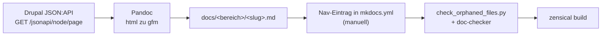

# Drupal-Inhalte nach mkdocs/Zensical exportieren

Der umgekehrte Weg zu [Migration nach Drupal](migration-wikisysteme.md#4-mkdocszensical-drupal): Inhalte aus einer bestehenden **Drupal**-Instanz über die JSON:API extrahieren und als Markdown-Dateien in ein mkdocs/Zensical-Doku-Repo (wie dieses hier) überführen.

!!! note "Hinweis: allgemeine Technik, keine Ankündigung"
    Wie beim Hin-Weg beschreibt diese Seite die technische Machbarkeit anhand einer beliebigen Drupal-Instanz — sie ist keine Ankündigung, dass Inhalte aus einem konkreten Drupal-System in dieses Repository übernommen werden.

---

## Ablauf



!!! warning "Achtung: Nur Text-Inhalte, Struktur bleibt Handarbeit"
    Die JSON:API liefert flache Knoten ohne mkdocs-`nav:`-Hierarchie. Welchem `<bereich>` (`künstliche-intelligenz`, `entwicklung`, `kreativ`, `wissen`, `rechtliches`) eine importierte Seite zugeordnet wird und wo sie in der Navigation einsortiert gehört, muss ein Mensch entscheiden — das Skript unten schlägt dafür nur einen Ziel-Dateipfad vor, trägt aber nichts automatisch in `mkdocs.yml` ein.

---

## Voraussetzungen

Auf der Drupal-Seite muss die JSON:API bereits aktiv sein (siehe [Voraussetzungen in der Migrations-Anleitung](migration-wikisysteme.md#voraussetzungen-in-drupal)):

```bash
cd /var/www/drupal-projekt
sudo -u www-data vendor/bin/drush en jsonapi basic_auth -y
```

Ein Lesezugriff reicht für den Export — anders als beim Import (`migration_bot`) genügt hier ein Konto/Token mit ausschließlich Leseberechtigung, ein Schreibzugriff ist nicht nötig.

```bash
pip install requests
```

---

## Export-Skript

```python
import pathlib
import re
import subprocess
import requests
from requests.auth import HTTPBasicAuth

DRUPAL_JSONAPI_URL = "https://drupal.wissen-ahrensburg.de/jsonapi/node/page"
AUTH = HTTPBasicAuth("export_reader", "READONLY_PASSWORT")
HEADERS = {"Accept": "application/vnd.api+json"}

# Zielverzeichnis: welcher <bereich> passt, entscheidet ein Mensch beim Sichten
ZIEL_BEREICH = pathlib.Path("docs/wissen/dokumentation/importiert")


def slugify(title):
    slug = title.strip().lower()
    slug = re.sub(r"[^a-z0-9äöüß]+", "-", slug)
    return slug.strip("-")


def html_to_markdown(html_body):
    result = subprocess.run(
        ["pandoc", "-f", "html", "-t", "gfm"],
        input=html_body, capture_output=True, text=True,
    )
    return result.stdout


def fetch_all_pages():
    pages, url = [], DRUPAL_JSONAPI_URL
    while url:
        r = requests.get(url, auth=AUTH, headers=HEADERS)
        payload = r.json()
        pages += payload["data"]
        url = payload.get("links", {}).get("next", {}).get("href")
    return pages


ZIEL_BEREICH.mkdir(parents=True, exist_ok=True)

for node in fetch_all_pages():
    title = node["attributes"]["title"]
    html_body = node["attributes"]["body"]["value"] if node["attributes"].get("body") else ""
    markdown_body = html_to_markdown(html_body)

    ziel_datei = ZIEL_BEREICH / f"{slugify(title)}.md"
    ziel_datei.write_text(f"# {title}\n\n{markdown_body}\n", encoding="utf-8")
    print(f"✅ {node['attributes']['drupal_internal__nid']} -> {ziel_datei}")
```

!!! tip "Tipp: nur veröffentlichte Seiten exportieren"
    Standardmäßig liefert die JSON:API nur Knoten, auf die das genutzte Konto Leserechte hat — ein unprivilegiertes `export_reader`-Konto sieht damit ohnehin nur `status: true`-Seiten. Soll gezielt zwischen veröffentlicht/unveröffentlicht gefiltert werden, lässt sich zusätzlich der Query-Parameter `?filter[status]=1` an `DRUPAL_JSONAPI_URL` anhängen.

---

## Nachbereitung (nicht automatisierbar)

1. **Bereich zuordnen**: Jede Datei aus `docs/wissen/dokumentation/importiert/` in den passenden `<bereich>`-Ordner verschieben (`künstliche-intelligenz`, `entwicklung`, `kreativ`, `wissen` oder `rechtliches` — siehe Struktur in `CLAUDE.md`).
2. **Nav-Eintrag ergänzen**: Für jede Seite einen Eintrag unter `nav:` in `mkdocs.yml` anlegen — sonst gilt sie als verwaist (Checkliste „Neue Seite anlegen" im `zensical-docs`-Skill).
3. **Interne Links umschreiben**: Drupal-interne Links (`/node/123`, Pfad-Aliase) zeigen nicht auf die neuen `.md`-Pfade — vor der Veröffentlichung durch relative Markdown-Links ersetzen (`[Text](../ordner/seite.md)`).
4. **Zensical-spezifische Syntax nachziehen**: Pandoc erzeugt reines GFM — Admonitions (`!!! note`), Tabs (`=== "Titel"`) und Mermaid-Diagramme kennt Pandoc nicht und muss von Hand ergänzt werden, wo sinnvoll.
5. **Bilder/Anhänge**: Drupal-Medien liegen unter `sites/default/files/` und werden von der `body`-HTML nur referenziert, nicht mitexportiert — separat kopieren und Pfade im Markdown anpassen.
6. **Prüfen**: `.venv/bin/zensical build` und `python3 .gemini/scripts/check_orphaned_files.py` laufen lassen, bei größerem Umfang den `doc-checker`-Subagenten.

---

## Verwandte Themen

- [Migration nach Drupal: MediaWiki, XWiki, Wiki.js, mkdocs/Zensical](migration-wikisysteme.md) — der Hin-Weg
- [Drupal installieren: Composer, PostgreSQL und Nginx](installieren.md)
- [Pandoc](../../tools/pandoc.md) — Grundlagen der Formatkonvertierung
- [KI strukturiert das Wiki autonom & Selfhosting-Migration](../ki-autonome-wiki-strukturierung-selfhosting-migration.md) — verwandtes Muster für Markdown-Wiki ↔ Selfhosting-System
- [Dokumentationsübersicht](../index.md)
