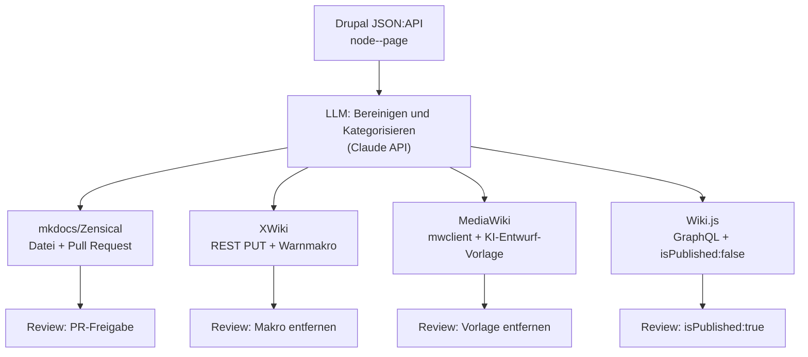

# KI-gestützter Export: Drupal → mkdocs/Zensical, XWiki, MediaWiki und Wiki.js

Der [reine Export nach mkdocs/Zensical](export-nach-mkdocs.md) konvertiert Drupal-Inhalte 1:1 per Pandoc. Dieses Kapitel erweitert den Ansatz um zwei Dinge: eine **LLM-Schicht**, die den oft unaufgeräumten Drupal-HTML-Body bereinigt und automatisch kategorisiert, und einen **Fan-out** derselben aufbereiteten Inhalte in vier Zielsysteme gleichzeitig — [mkdocs/Zensical](export-nach-mkdocs.md), [XWiki](../xwiki/xwiki-ki-agent.md), [MediaWiki](../mediawiki/mediawiki-ki-agent.md) und [Wiki.js](../wikijs-ki-agent.md). Es baut damit auf denselben KI-Agenten-Mustern auf, die dieses Repository bereits für jedes der drei Wiki-Systeme einzeln dokumentiert, sowie auf der [autonomen Wiki-Strukturierung](../ki-autonome-wiki-strukturierung-selfhosting-migration.md).

!!! note "Hinweis: allgemeine Technik, keine Ankündigung"
    Wie bei den anderen Drupal-Seiten dieses Kapitels beschreibt dieser Guide die technische Machbarkeit anhand einer beliebigen Drupal-Instanz — keine Ankündigung, dass ein konkretes System so migriert wird.

!!! warning "Achtung: Kein automatischer Direct-Write in eines der vier Zielsysteme"
    Genau wie bei den einzelnen KI-Agenten-Seiten gilt: Ein Sprachmodell kann beim Bereinigen/Kategorisieren halluzinieren. Jeder der vier Exporte landet deshalb als **markierter Entwurf**, nie als direkt sichtbare, fertige Seite.

---

## Ablauf



---

## Warum hier eine LLM-Schicht zusätzlichen Wert bietet

Reines Pandoc-Konvertieren (wie im [Basis-Export](export-nach-mkdocs.md)) überträgt Drupal-HTML strukturerhaltend — inklusive Editor-Altlasten wie verschachtelten `<div>`-Wrappern, Inline-Styles oder Drupal-spezifischen CSS-Klassen, die im Zielformat nur Rauschen sind. Ein LLM übernimmt zusätzlich drei Aufgaben, die reine Formatkonvertierung nicht leisten kann:

1. **Bereinigen**: Editor-Markup entfernen, ohne den inhaltlichen Text zu verändern.
2. **Kategorisieren**: Für welchen Themenbereich/welche Kategorie eignet sich die Seite — dieselbe Entscheidung, die die [autonome Wiki-Strukturierung](../ki-autonome-wiki-strukturierung-selfhosting-migration.md#konzept-autonome-strukturierung-vs-reine-content-generierung) für neu generierte Inhalte beschreibt, hier angewendet auf bereits bestehende Drupal-Seiten.
3. **Eine Kategorisierung, vier Ziele**: Die Kategorie-Entscheidung wird **einmal** getroffen und für alle vier Exporte wiederverwendet — Bereich in `mkdocs.yml`, Space in XWiki, Kategorie in MediaWiki, Tag in Wiki.js —, statt bei jedem Zielsystem erneut (und potenziell uneinheitlich) zu entscheiden.

---

## 1. Gemeinsame Extraktion und LLM-Aufbereitung

Baut auf `fetch_all_pages()` aus dem [Basis-Export](export-nach-mkdocs.md#export-skript) auf:

```bash
pip install requests anthropic
```

```python
import json
import anthropic

client = anthropic.Anthropic()  # nutzt ANTHROPIC_API_KEY aus der Umgebung

def aufbereiten_mit_llm(title, html_body):
    response = client.messages.create(
        model="claude-sonnet-5",
        max_tokens=2000,
        messages=[{
            "role": "user",
            "content": (
                "Du bereitest eine Drupal-Wiki-Seite für den Export in vier "
                "verschiedene Wiki-Systeme vor. Aufgaben:\n"
                "1. Entferne Editor-Markup (verschachtelte div-Wrapper, "
                "Inline-Styles, Drupal-CSS-Klassen), behalte den Inhalt.\n"
                "2. Schlage EINE Kategorie aus dieser Liste vor: "
                "künstliche-intelligenz, entwicklung, kreativ, wissen, rechtliches.\n"
                "Antworte NUR mit folgendem JSON, ohne weiteren Text:\n"
                '{"kategorie": "...", "clean_html": "..."}\n\n'
                f"Titel: {title}\n\nHTML:\n{html_body}"
            )
        }]
    )
    return json.loads(response.content[0].text)
```

!!! tip "Tipp: Batch-Läufe rate-limiten"
    Bei vielen Seiten die Aufrufe drosseln (z. B. `time.sleep()` zwischen den Läufen) und Zwischenergebnisse cachen (`kategorie`/`clean_html` pro Node-ID lokal speichern) — ein Abbruch mitten im Lauf soll nicht bedeuten, bereits bereinigte Seiten erneut ans LLM zu schicken.

---

## 2. Fan-out zu den vier Zielsystemen

Jeder Zweig markiert seinen Entwurf nach demselben Muster, das die jeweilige KI-Agenten-Seite dieses Repositories bereits etabliert.

### mkdocs/Zensical — Datei + Pull Request

```python
import subprocess
import pathlib

def export_zu_mkdocs(title, kategorie, clean_html, ziel_repo="."):
    md_body = subprocess.run(
        ["pandoc", "-f", "html", "-t", "gfm"],
        input=clean_html, capture_output=True, text=True,
    ).stdout
    slug = title.strip().lower().replace(" ", "-")
    ziel = pathlib.Path(ziel_repo) / "docs" / kategorie / f"{slug}.md"
    ziel.parent.mkdir(parents=True, exist_ok=True)
    ziel.write_text(f"# {title}\n\n{md_body}\n", encoding="utf-8")
    return ziel
```

Review-Mechanismus: Datei landet auf einem Feature-Branch, geht als **Pull Request** raus (wie bei jeder Content-Änderung in diesem Repo) — kein separates Entwurfs-Flag nötig, da der PR selbst die Freigabeinstanz ist. Nav-Eintrag in `mkdocs.yml` bleibt wie beim Basis-Export manuelle Nacharbeit.

### XWiki — REST PUT mit Warnmakro

Reuse aus [XWiki Agenten-Pipeline](../xwiki/xwiki-ki-agent.md):

```python
def export_zu_xwiki(title, clean_html, space="Main"):
    xwiki_syntax = subprocess.run(
        ["pandoc", "-f", "html", "-t", "xwiki"],
        input=clean_html, capture_output=True, text=True,
    ).stdout
    entwurf = f"{{{{warning}}}}KI-Entwurf aus Drupal-Export, ungeprüft{{{{/warning}}}}\n{xwiki_syntax}"
    return save_draft(space=space, page_title=title.replace(" ", ""), content=entwurf)
```

### MediaWiki — mwclient mit `{{KI-Entwurf}}`

Reuse aus [MediaWiki KI-Agent](../mediawiki/mediawiki-ki-agent.md):

```python
def export_zu_mediawiki(site, title, clean_html):
    wikitext = subprocess.run(
        ["pandoc", "-f", "html", "-t", "mediawiki"],
        input=clean_html, capture_output=True, text=True,
    ).stdout
    entwurf = f"{{{{KI-Entwurf|Bot=Drupal-Export}}}}\n{wikitext}"
    page = site.pages[title]
    page.save(entwurf, summary="KI-Entwurf: Import aus Drupal (Review ausstehend)")
```

### Wiki.js — GraphQL mit `isPublished:false`

Reuse der `CREATE_DRAFT_MUTATION` aus [Wiki.js Agenten-Pipeline](../wikijs-ki-agent.md):

```python
def export_zu_wikijs(title, clean_html, path):
    markdown = subprocess.run(
        ["pandoc", "-f", "html", "-t", "gfm"],
        input=clean_html, capture_output=True, text=True,
    ).stdout
    variables = {
        "content": markdown, "description": "KI-Entwurf aus Drupal-Export",
        "editor": "markdown", "isPublished": False, "isPrivate": False,
        "locale": "de", "path": path, "tags": ["ki-entwurf", "drupal-import"],
        "title": title,
    }
    # r = requests.post(WIKIJS_URL, json={"query": CREATE_DRAFT_MUTATION, "variables": variables}, headers=WIKIJS_HEADERS)
```

### Alles zusammen

```python
for node in fetch_all_pages():
    title = node["attributes"]["title"]
    html_body = node["attributes"]["body"]["value"] if node["attributes"].get("body") else ""
    if not html_body:
        continue

    aufbereitet = aufbereiten_mit_llm(title, html_body)
    kategorie, clean_html = aufbereitet["kategorie"], aufbereitet["clean_html"]

    export_zu_mkdocs(title, kategorie, clean_html)
    export_zu_xwiki(title, clean_html)
    # export_zu_mediawiki(site, title, clean_html)  # site = mwclient.Site(...)
    export_zu_wikijs(title, clean_html, path=f"{kategorie}/{title}")
```

---

## Governance & Sicherheitsleitplanken

| Zielsystem | Entwurfs-Markierung | Freigabe-Schritt |
|---|---|---|
| **mkdocs/Zensical** | Feature-Branch, kein Merge in `main` | Pull-Request-Review + `doc-checker`-Subagent |
| **XWiki** | `{{warning}}`-Makro im Seiteninhalt | Makro entfernen nach Prüfung |
| **MediaWiki** | `{{KI-Entwurf}}`-Vorlage | Vorlage entfernen nach Prüfung |
| **Wiki.js** | `isPublished: false` | Separate `pages.update`-Mutation auf `isPublished: true` |

Zusätzlich, systemübergreifend:

| Maßnahme | Zweck |
|---|---|
| **Dedizierte Bot-/Lesekonten** pro System, nie Admin-Zugänge | Klare Abgrenzung KI-generierter Änderungen im Versionsverlauf |
| **Kategorisierungs-Vorschlag ist ein Vorschlag** | Ein Mensch prüft die vom LLM gewählte Kategorie vor Freigabe — falsche Einordnung ist ein häufigerer Fehler als falscher Text |
| **Erst gegen Testinstanzen aller vier Systeme laufen lassen** | Neue Prompt-Versionen vor Produktiveinsatz an einer Kopie validieren |
| **Sperrliste für sensible Drupal-Seiten** (z. B. Impressum, rechtliche Seiten) | Diese Node-IDs von vornherein aus `fetch_all_pages()` ausschließen |

---

## Verwandte Themen

- [Drupal-Inhalte nach mkdocs/Zensical exportieren](export-nach-mkdocs.md) — Basis-Export ohne LLM-Schicht
- [Migration nach Drupal](migration-wikisysteme.md) — die umgekehrte Richtung
- [MediaWiki KI-Agent](../mediawiki/mediawiki-ki-agent.md)
- [XWiki Agenten-Pipeline](../xwiki/xwiki-ki-agent.md)
- [Wiki.js Agenten-Pipeline](../wikijs-ki-agent.md)
- [KI strukturiert das Wiki autonom & Selfhosting-Migration](../ki-autonome-wiki-strukturierung-selfhosting-migration.md)
- [Pandoc](../../tools/pandoc.md)
- [Dokumentationsübersicht](../index.md)
