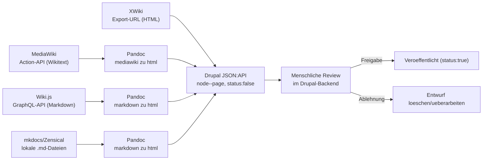
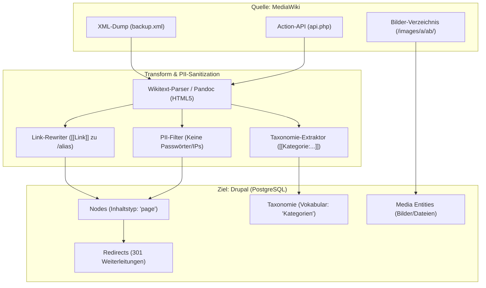

# Migration nach Drupal: MediaWiki, XWiki, Wiki.js und mkdocs/Zensical importieren

Praxis-Guide zum Extrahieren von Inhalten aus [MediaWiki](../mediawiki/index.md), [XWiki](../xwiki/installieren.md), [Wiki.js](../wikijs-linux-installation.md) sowie aus einer **statischen mkdocs/Zensical-Dokumentation** (wie diesem Repository selbst) und zum Import in ein neu aufgesetztes [Drupal](installieren.md) über dessen **JSON:API**.

!!! note "Hinweis: allgemeine Technik, keine Ankündigung"
    Der mkdocs/Zensical-Abschnitt beschreibt die technische Machbarkeit anhand eines beliebigen mkdocs-basierten Doku-Repos — er ist kein Hinweis darauf, dass **Wissen Ahrensburg** selbst von Zensical auf Drupal wechselt. Laut `CLAUDE.md` bleibt dieses Repository ein reines, mit Zensical gebautes Content-Repo.

!!! note "Hinweis: Zwei mögliche Wege"
    Für große, wiederholbare Migrationen bietet Drupal Core die **Migrate API** (erweitert um die Contrib-Module `migrate_plus`/`migrate_tools`) — sie bildet Quell-, Prozess- und Zielschritte deklarativ in YAML ab und ist der von Drupal empfohlene Weg für dauerhaft gepflegte Migrationspfade. Für eine **einmalige Übernahme** ist der unten beschriebene, direkte Weg über kleine Python-Skripte gegen die JSON:API oft schneller aufgesetzt und passt zum Stil der übrigen API-Skripte in diesem Wiki (siehe [XWiki REST API & Python](../xwiki/xwiki-rest-api.md), [Wiki.js Agenten-Pipeline](../wikijs-ki-agent.md)).

---

## Ablauf



!!! warning "Achtung: Nur Text-Inhalte"
    Diese Skripte migrieren reinen Seiteninhalt (Titel + HTML-Body). Bilder, Dateianhänge und Kategorien/Tags müssen separat migriert werden — z. B. Dateien direkt per `rsync` in `sites/default/files/` kopieren und anschließend als Drupal-Medien registrieren.

!!! tip "Human-in-the-Loop wie bei den KI-Agenten-Pipelines"
    Alle importierten Seiten werden mit `"status": false` (unveröffentlicht) angelegt — nach demselben Prinzip wie bei den [KI-Agenten-Pipelines](../wikijs-ki-agent.md#governance-sicherheitsleitplanken) in diesem Wiki: Erst nach manueller Prüfung im Drupal-Backend wird eine Seite veröffentlicht. So verhindert ein fehlerhafter Konvertierungslauf nicht, dass kaputte Seiten live gehen.

---

## Voraussetzungen in Drupal

```bash
cd /var/www/drupal-projekt
sudo -u www-data vendor/bin/drush en jsonapi basic_auth -y
```

Danach im Backend unter **Konfiguration → Personen → Rollen** eine eigene Rolle `migration_bot` mit ausschließlich der Berechtigung „Neue Inhalte vom Typ *Seite* erstellen" anlegen und einem eigenen Systemkonto zuweisen — kein Admin-Konto für den Import wiederverwenden. `basic_auth` erlaubt es diesem Konto, sich per HTTP-Basic-Auth gegen die JSON:API zu authentifizieren.

```bash
pip install requests
```

---

## Gemeinsame Funktion: Seite in Drupal anlegen

```python
import requests
from requests.auth import HTTPBasicAuth

DRUPAL_JSONAPI_URL = "https://drupal.wissen-ahrensburg.de/jsonapi/node/page"
AUTH = HTTPBasicAuth("migration_bot", "BOT_PASSWORT")
HEADERS = {
    "Content-Type": "application/vnd.api+json",
    "Accept": "application/vnd.api+json",
}

def create_drupal_page(title, html_body):
    payload = {
        "data": {
            "type": "node--page",
            "attributes": {
                "title": title,
                "body": {"value": html_body, "format": "full_html"},
                "status": False,  # unveroeffentlicht -> menschliche Review noetig
            },
        }
    }
    r = requests.post(DRUPAL_JSONAPI_URL, json=payload, auth=AUTH, headers=HEADERS)
    if r.status_code == 201:
        print(f"✅ '{title}' als Entwurf angelegt")
    else:
        print(f"❌ Fehler bei '{title}': {r.status_code} - {r.text}")
```

---

## 1. MediaWiki → Drupal: Vollständiger Migrations-Leitfaden

Die Migration von [MediaWiki](../mediawiki/index.md) nach [Drupal](installieren.md) ist eine der häufigsten Transformationen in Unternehmen, wenn kollaboratives Wiki-Wissen in ein **strukturiertes Enterprise-CMS mit fein granularem Rechtesystem, Taxonomie-Katalogen und modernem Redaktions-Workflow** überführt werden soll.



---

### Die 5 Kern-Herausforderungen bei MediaWiki → Drupal

1. **Wikitext- & Vorlagen-Konvertierung (Templates):**
   - MediaWiki nutzt Wikitext mit Vorlagen (`{{Infobox...}}`), Parser-Funktionen (`#if`, `#switch`) und spezieller Tabellensyntax (`{| ... |}`).
   - *Lösung:* Pandoc (`pandoc -f mediawiki -t html`) konvertiert Formatierungen, Überschriften und Tabellen sauber in semantisches HTML5. Komplexe Infoboxen sollten vorab in strukturierte Drupal-Paragraphs oder Custom Fields zerlegt werden.
2. **Interne Wiki-Links (`[[Artikelname|Label]]`):**
   - MediaWiki-Links sind case-insensitive und nutzen Unterstriche (`[[Haupt_Seite]]`).
   - *Lösung:* Links werden auf lesbare Drupal-URL-Aliase (`/haupt-seite`) umgeschrieben. Für alte Links wird das Contrib-Modul `redirect` aktiviert, um 301-Weiterleitungen einzurichten.
3. **Medien- & Bild-Verzeichnisstruktur (`/images/`):**
   - MediaWiki speichert Dateien in zweistufigen MD5-Hash-Verzeichnissen (z. B. `images/3/3a/Architektur.png`).
   - *Lösung:* Ein Migrations-Skript liest die Dateipfade über die API (`action=query&prop=imageinfo`) aus, kopiert die Originale nach `sites/default/files/` und registriert sie als Drupals native `media--image`-Entitäten.
4. **Kategorien zu Drupal-Taxonomien:**
   - MediaWiki-Kategorien (`[[Kategorie:Sicherheit]]`) werden extrahiert und automatisch mit dem Drupal-Taxonomie-Vokabular `kategorien` verknüpft.
5. **DSGVO & PII-Schutz (Keine Benutzer-Passwörter übernehmen):**
   - MediaWiki-Passwort-Hashes (`user_password`) und private Bearbeiter-IPs dürfen niemals in die Drupal-Benutzerdatenbank übernommen werden. Autoren werden als einfaches Text-Metadatenfeld („Ursprünglicher Autor") auf der Node referenziert; die Node selbst gehört dem lokalen `migration_bot`.

---

### Weg A: Deklarative Enterprise-Migration via Drupal Migrate API

Für große Bestände (>10.000 Seiten) ist das Drupal Core-Modul **Migrate** in Kombination mit `migrate_plus` und `migrate_tools` der empfohlene Industriestandard:

```yaml
# config/sync/migrate_plus.migration.mediawiki_nodes.yml
id: mediawiki_nodes
label: 'MediaWiki zu Drupal Node Migration'
migration_group: mediawiki
source:
  plugin: url
  data_fetcher_plugin: http
  data_parser_plugin: json
  urls: 'https://mediawiki.example.com/api.php?action=query&list=allpages&aplimit=500&format=json'
  item_selector: query/allpages
  fields:
    - name: pageid
      label: 'Page ID'
      selector: pageid
    - name: title
      label: 'Seitentitel'
      selector: title
  ids:
    pageid:
      type: integer

process:
  title: title
  'body/value':
    plugin: custom_wikitext_to_html
    source: title
  'body/format':
    plugin: default_value
    default_value: full_html
  status:
    plugin: default_value
    default_value: 0 # Unveröffentlicht für Review

destination:
  plugin: 'entity:node'
  default_bundle: page
```

**Steuerung über Drush im Terminal:**
```bash
# Status der Migration prüfen
drush migrate:status mediawiki_nodes

# Migration ausführen (inklusive Feedback-Fortschrittsbalken)
drush migrate:import mediawiki_nodes

# Bei Bedarf: Rollback aller importierten Nodes ohne Datenverlust im Zielsystem
drush migrate:rollback mediawiki_nodes
```

---

### Weg B: PII-bereinigte Python-ETL-Pipeline (REST & Pandoc)

Für flexible Ad-hoc-Migrationen zieht dieses Skript alle Seiten über die Action-API, bereinigt sensible E-Mails, konvertiert Wikitext via Pandoc und legt Entwürfe über Drupals **JSON:API** an:

```python
import subprocess
import re
import requests
from requests.auth import HTTPBasicAuth

MEDIAWIKI_API = "https://mediawiki.wissen-ahrensburg.de/api.php"
DRUPAL_JSONAPI_URL = "https://drupal.wissen-ahrensburg.de/jsonapi/node/page"
DRUPAL_AUTH = HTTPBasicAuth("migration_bot", "BOT_SECURE_TOKEN")
HEADERS = {"Content-Type": "application/vnd.api+json", "Accept": "application/vnd.api+json"}

EMAIL_REGEX = r'\b[A-Za-z0-9._%+-]+@[A-Za-z0-9.-]+\.[A-Z|a-z]{2,7}\b'

def get_all_mediawiki_titles():
    titles = []
    apcontinue = None
    while True:
        params = {"action": "query", "list": "allpages", "aplimit": "max", "format": "json"}
        if apcontinue:
            params["apcontinue"] = apcontinue
        r = requests.get(MEDIAWIKI_API, params=params).json()
        titles += [p["title"] for p in r.get("query", {}).get("allpages", [])]
        apcontinue = r.get("continue", {}).get("apcontinue")
        if not apcontinue:
            break
    return titles

def fetch_and_convert_page(title):
    # 1. Rohen Wikitext abrufen
    params = {"action": "parse", "page": title, "prop": "wikitext|categories", "format": "json"}
    res = requests.get(MEDIAWIKI_API, params=params).json()
    wikitext = res.get("parse", {}).get("wikitext", {}).get("*", "")
    
    # 2. PII-Sanitization: E-Mails und private Daten maskieren
    clean_wikitext = re.sub(EMAIL_REGEX, "[redacted@example.com]", wikitext)
    
    # 3. Wikitext zu sauberem HTML5 via Pandoc konvertieren
    p = subprocess.run(
        ["pandoc", "-f", "mediawiki", "-t", "html"],
        input=clean_wikitext, capture_output=True, text=True
    )
    return p.stdout

def create_drupal_node(title, html_body):
    payload = {
        "data": {
            "type": "node--page",
            "attributes": {
                "title": title,
                "body": {"value": html_body, "format": "full_html"},
                "status": False,  # Unveröffentlicht -> Human Review
            }
        }
    }
    r = requests.post(DRUPAL_JSONAPI_URL, json=payload, auth=DRUPAL_AUTH, headers=HEADERS)
    if r.status_code == 201:
        print(f"✅ '{title}' erfolgreich als Drupal-Entwurf angelegt.")
    else:
        print(f"❌ Fehler bei '{title}': {r.status_code} - {r.text}")

if __name__ == "__main__":
    all_pages = get_all_mediawiki_titles()
    print(f"Starte Migration von {len(all_pages)} MediaWiki-Seiten...")
    for title in all_pages:
        html = fetch_and_convert_page(title)
        create_drupal_node(title, html)
```

---

### Nachbereitung & Verifikation

1. **Broken Links prüfen:** Nach dem Import mit dem Drupal-Modul `linkchecker` alle internen Links auf 404-Fehler scannen.
2. **Kategoriensynchronisation:** Extrahierte Kategorien über das Vokabular in Drupal filtern und Menüs zuordnen.
3. **Massen-Freigabe:** Nach redaktioneller Sichtung die Entwürfe über die Drupal-Inhaltsübersicht auf `status: true` (veröffentlicht) setzen.

---

## 2. XWiki → Drupal

Die Seitenliste kommt über die [XWiki REST API](../xwiki/xwiki-rest-api.md), der gerenderte HTML-Inhalt einfacher über XWikis klassische Export-URL (`/bin/export/{Space}/{Page}?format=html`) statt über die REST-API selbst, die standardmäßig nur XWiki-Syntax liefert:

```python
XWIKI_REST_URL = "https://xwiki.wissen-ahrensburg.de/rest"
XWIKI_EXPORT_URL = "https://xwiki.wissen-ahrensburg.de/bin/export/{space}/{page}?format=html"
XWIKI_AUTH = HTTPBasicAuth("admin", "admin_password")

def get_space_pages(wiki="xwiki", space="Main"):
    url = f"{XWIKI_REST_URL}/wikis/{wiki}/spaces/{space}/pages"
    r = requests.get(url, auth=XWIKI_AUTH, headers={"Accept": "application/json"})
    return r.json().get("pageSummaries", []) if r.status_code == 200 else []

def get_xwiki_html(space, page):
    url = XWIKI_EXPORT_URL.format(space=space, page=page)
    r = requests.get(url, auth=XWIKI_AUTH)
    return r.text

for summary in get_space_pages():
    html = get_xwiki_html("Main", summary["name"])
    create_drupal_page(summary["title"], html)
```

---

## 3. Wiki.js → Drupal

Wiki.js liefert den Seiteninhalt als Markdown über GraphQL (siehe [Wiki.js Agenten-Pipeline](../wikijs-ki-agent.md)); Pandoc konvertiert erneut nach HTML.

```python
WIKIJS_URL = "https://wiki.wissen-ahrensburg.de/graphql"
WIKIJS_HEADERS = {"Authorization": "Bearer <API_TOKEN>", "Content-Type": "application/json"}

LIST_QUERY = "query { pages { list { id path title } } }"
SINGLE_QUERY = """
query ($id: Int!) {
  pages { single(id: $id) { title content } }
}
"""

def get_wikijs_pages():
    r = requests.post(WIKIJS_URL, json={"query": LIST_QUERY}, headers=WIKIJS_HEADERS)
    return r.json()["data"]["pages"]["list"]

def get_wikijs_content(page_id):
    r = requests.post(WIKIJS_URL, json={"query": SINGLE_QUERY, "variables": {"id": page_id}}, headers=WIKIJS_HEADERS)
    return r.json()["data"]["pages"]["single"]

def markdown_to_html(markdown_text):
    result = subprocess.run(
        ["pandoc", "-f", "markdown", "-t", "html"],
        input=markdown_text, capture_output=True, text=True,
    )
    return result.stdout

for summary in get_wikijs_pages():
    detail = get_wikijs_content(summary["id"])
    html = markdown_to_html(detail["content"])
    create_drupal_page(detail["title"], html)
```

---

## 4. mkdocs/Zensical → Drupal

Der einfachste der vier Fälle: Eine mkdocs/Zensical-Doku liegt bereits als lokale Markdown-Dateien vor — es ist **kein API-Aufruf, kein Auth-Token und kein Netzwerkzugriff** nötig, sondern nur ein Verzeichnis-Scan. Der Titel jeder Seite wird aus der ersten `# Überschrift` der Datei gelesen; existiert keine, dient der Dateiname als Fallback.

```python
import pathlib
import re

DOCS_DIR = pathlib.Path("/pfad/zum/mkdocs-repo/docs")  # nur docs/, nicht raw/ oder site/

def extract_title(markdown_text, fallback):
    match = re.search(r"^#\s+(.+)$", markdown_text, re.MULTILINE)
    return match.group(1).strip() if match else fallback

for md_file in sorted(DOCS_DIR.rglob("*.md")):
    text = md_file.read_text(encoding="utf-8")
    title = extract_title(text, fallback=md_file.stem)
    html = markdown_to_html(text)  # dieselbe pandoc-Funktion wie im Wiki.js-Abschnitt
    create_drupal_page(title, html)
```

!!! warning "Achtung: relative Links und Bildpfade"
    Interne Links (`[Text](../ordner/seite.md)`) und Bildpfade sind relativ zur Datei im Dateisystem aufgelöst — nach dem Import als Drupal-Node existieren diese Pfade nicht mehr. Für eine saubere Migration vorher eine Zuordnungstabelle `alter Markdown-Pfad → neuer Drupal-Pfad (Alias)` aufbauen und Links/Bilder in einem zweiten Durchlauf per Suchen-und-Ersetzen auf die neuen Alias-Pfade umschreiben, bevor die Seiten veröffentlicht werden. Der `nav:`-Baum in `mkdocs.yml` liefert dafür die kanonische Liste aller gültigen Seiten samt Titeln.

---

## Übersicht der Quellformate

| Quelle | API | Rohformat | Konvertierung |
|---|---|---|---|
| MediaWiki | Action-API (`action=parse`) | Wikitext | `pandoc -f mediawiki -t html` |
| XWiki | REST-API (Liste) + Export-URL (Inhalt) | HTML (direkt) | keine nötig |
| Wiki.js | GraphQL-API | Markdown | `pandoc -f markdown -t html` |
| mkdocs/Zensical | keine (lokaler Dateizugriff) | Markdown | `pandoc -f markdown -t html` |

---

## Nach dem Import

1. In Drupal unter **Inhalt** die neu angelegten, unveröffentlichten Seiten filtern und stichprobenartig gegen die Quelle prüfen.
2. Interne Links (in allen drei Quellsystemen jeweils anders aufgebaut) manuell oder über eine Mapping-Tabelle plus das Contrib-Modul **Redirect** auf die neuen Drupal-Pfade umbiegen.
3. Erst nach Freigabe einzeln oder per Bulk-Aktion auf `status: true` setzen.
4. Quellsysteme (MediaWiki/XWiki/Wiki.js) nicht sofort abschalten — parallel weiterlaufen lassen, bis die Migration vollständig verifiziert ist.

---

## Verwandte Themen

- [Drupal installieren: Composer, PostgreSQL und Nginx](installieren.md)
- [XWiki REST API & Python](../xwiki/xwiki-rest-api.md)
- [Wiki.js Agenten-Pipeline](../wikijs-ki-agent.md)
- [MediaWiki Python Bot Automatisierung](../mediawiki/mediawiki-python-bot.md)
- [Pandoc](../../tools/pandoc.md)
- [Dokumentationsübersicht](../index.md)
