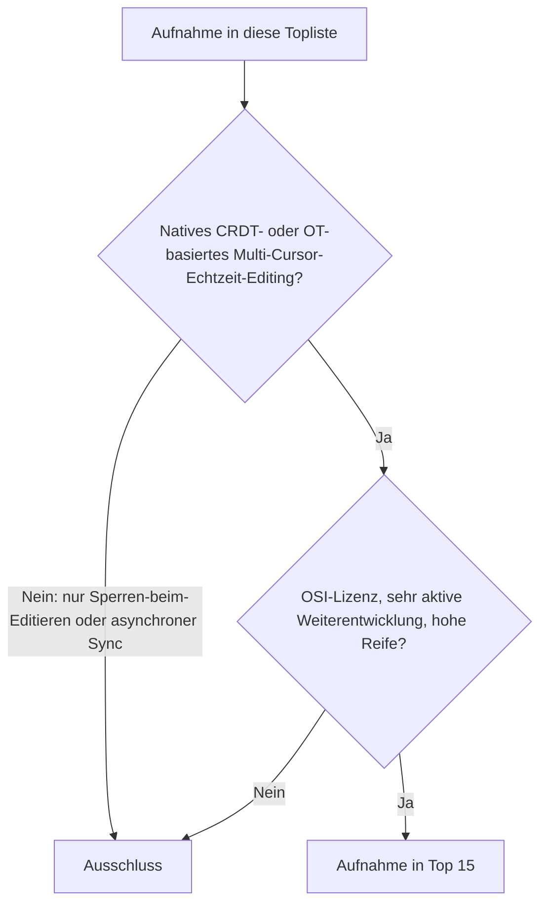
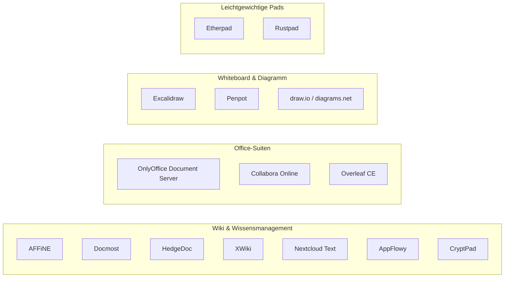
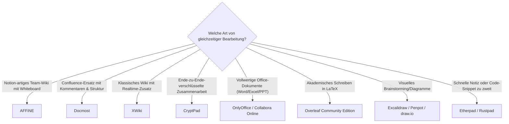

# Open-Source-Wissenssysteme mit echter Echtzeit-Kollaboration (CRDT/OT) — Top-15-Topliste

Die [Topliste aktiver & reifer Open-Source-Wissenssysteme](aktive-reife-opensource-wissenssysteme-2026-topliste.md) und die [Topliste nach Speicherbackend](postgresql-dateiformat-wissenssysteme-2026-topliste.md) filtern nach Entwicklungstempo, Reife und Datenhaltung. Diese Seite legt ein fünftes, sehr technisches Kriterium an: **echtes gleichzeitiges Mehrbenutzer-Editieren auf Zeichenebene**, umgesetzt über CRDT (Conflict-free Replicated Data Type, z. B. Yjs) oder klassisches Operational Transform (OT, z. B. Etherpads Easysync) — mehrere Cursor in einem Dokument gleichzeitig, ohne Sperren und ohne Merge-Konflikt beim Speichern. Das ist eine deutlich seltenere Fähigkeit als „aktiv" oder „reif" für sich genommen: Die meisten Wiki- und PKM-Systeme aus den vorherigen Toplisten lösen Mehrbenutzerbetrieb über Sperren-beim-Editieren oder asynchrone Synchronisation, nicht über echte Zeichen-für-Zeichen-Gleichzeitigkeit.

!!! note "Hinweis: Nur OSI-anerkannte Lizenzen"
    Wie in der [Gesamtübersicht](open-source-llm-agent-mcp-systeme.md) zählen hier ausschließlich Systeme unter einer OSI-anerkannten Open-Source-Lizenz (MIT, GPL, LGPL, AGPL, BSD, Apache-2.0, MPL-2.0). Das kostet in dieser Kategorie zwei prominente Kandidaten: Outline (hervorragendes Yjs-basiertes Realtime-Editing, aber BSL) und Anytype (eigenes CRDT-Protokoll „any-sync", aber Lizenzstatus 2026 nicht durchgängig OSI-konform) — Details siehe Ausschluss-Abschnitt unten.

!!! tip "Tipp: Warum diese Liste kürzer als 20 ist"
    Anders als die vorherigen Toplisten dieser Reihe kommt diese Seite bewusst nur auf 15 statt 20 Einträge. Echte CRDT-/OT-Kollaboration ist unter reifen, aktiv gepflegten Open-Source-Projekten schlicht seltener, als die vorherigen, breiter gefassten Kriterien es waren — eine künstliche Auffüllung auf 20 würde die Qualitätsschwelle der übrigen Toplisten dieser Dokumentation aufweichen.

---

## Bewertungskriterien

!!! warning "Achtung: Momentaufnahme, Stand August 2026"
    Realtime-Kollaboration ist ein Feature-Bereich mit hoher Entwicklungsdynamik — mehrere hier ausgeschlossene Systeme (u. a. Wiki.js, MediaWiki) haben entsprechende Feature-Requests offen. Vor einer Entscheidung die aktuelle Roadmap des jeweiligen Projekts prüfen.

---

## Top 15 im Überblick

| Rang | System | Kategorie | Lizenz | Kollaborations-Technik |
|---|---|---|---|---|
| 1 | **AFFiNE** | Wissensmanagement/Whiteboard | MIT | Eigene BlockSuite-CRDT-Engine, einheitlich für Dokumente und Whiteboard |
| 2 | **Docmost** | Wissensmanagement (Confluence-Alternative) | AGPL-3.0 | Yjs/Hocuspocus-basierte Echtzeit-Bearbeitung |
| 3 | **HedgeDoc** | Kollaborative Markdown-Notizen | AGPL-3.0 | Yjs-basiert seit HedgeDoc 2 (Nachfolger der OT-Engine aus CodiMD-Zeiten) |
| 4 | **XWiki** | Wiki | LGPL-2.1 | WebSocket-basierter Realtime-Editor (CKEditor-5-Kollaborationsmodul) als offizielles Kernfeature |
| 5 | **Nextcloud Text** | Kollaborativer Markdown-/Rich-Text-Editor (Nextcloud-App) | AGPL-3.0 | Yjs-basiert |
| 6 | **AppFlowy** | Notion-Alternative | AGPL-3.0 | Eigene Rust-CRDT-Engine, Sync über selbst hostbare AppFlowy Cloud |
| 7 | **CryptPad** | Ende-zu-Ende-verschlüsselte Kollaborations-Suite (Docs, Sheets, Kanban, Whiteboard) | AGPL-3.0 | Eigene CRDT-Implementierung „ChainPad" — Verschlüsselung und Gleichzeitigkeit kombiniert |
| 8 | **Etherpad** | Kollaborativer Texteditor | Apache-2.0 | Easysync (Operational Transform), seit 2011 extrem reif |
| 9 | **OnlyOffice Document Server** (Community Edition) | Office-Suite (Text/Tabelle/Präsentation) | AGPL-3.0 | Operational-Transform-basierte Ko-Bearbeitung |
| 10 | **Collabora Online** (CODE) | Office-Suite (LibreOffice-Basis) | MPL-2.0 | WOPI-Protokoll + Echtzeit-Ko-Bearbeitung |
| 11 | **Overleaf Community Edition** | Kollaboratives LaTeX-Schreiben | AGPL-3.0 | Operational-Transform-basierte Echtzeit-Bearbeitung |
| 12 | **Excalidraw** | Kollaboratives Whiteboard | MIT | Echtzeit-Multiplayer via WebSocket, versionierte Elemente |
| 13 | **Penpot** | Kollaboratives Design-/Whiteboard-Werkzeug | MPL-2.0 | Echtzeit-Multiplayer-Editing |
| 14 | **draw.io / diagrams.net** | Kollaboratives Diagramm-Werkzeug | Apache-2.0 | Native Echtzeit-Kollaboration via WebRTC, ohne Account nutzbar |
| 15 | **Rustpad** | Leichtgewichtiger Echtzeit-Text-/Code-Pad | MIT | Operational-Transform-basierte Synchronisation |

---

## Highlights im Detail

### AFFiNE & CryptPad: Kollaboration als Architektur-Grundprinzip statt Zusatzfeature
Bei den meisten Systemen dieser Liste kam Realtime-Kollaboration als Feature zu einer bestehenden Architektur hinzu. AFFiNE und CryptPad haben sie von Anfang an als Kernprinzip eingebaut: AFFiNEs BlockSuite-Engine behandelt Dokument und Whiteboard als denselben CRDT-Datentyp, CryptPad kombiniert seine ChainPad-CRDT zusätzlich mit Ende-zu-Ende-Verschlüsselung — beides gleichzeitig ist technisch anspruchsvoll, weil der Server die Inhalte, die er synchronisiert, gar nicht lesen kann.

### draw.io / diagrams.net: die unerwartete Aufnahme
Die meisten Nutzer kennen draw.io als lokales oder Google-Drive-integriertes Werkzeug ohne Mehrbenutzer-Funktion. Tatsächlich bietet die selbst hostbare Variante seit mehreren Jahren eine native WebRTC-basierte Echtzeit-Kollaboration ganz ohne Account oder Cloud-Backend — ein Feature, das im Alltag oft übersehen wird, aber genau die harte technische Anforderung dieser Liste erfüllt.

### Overleaf Community Edition: dieselbe Technik wie die kommerzielle SaaS-Version, aber selbst gehostet
Overleaf CE ist keine abgespeckte Demo-Version, sondern derselbe Open-Source-Kern (AGPL-3.0), auf dem auch der kommerzielle Overleaf-Dienst aufbaut — inklusive der Operational-Transform-Engine für gleichzeitiges LaTeX-Schreiben. Für akademische Arbeitsgruppen mit Datenschutzanforderungen ist das die einzige Möglichkeit, echte Kollaborationsfunktionen komplett selbst zu betreiben.

---

## Was bewusst nicht in dieser Liste steht

!!! warning "Achtung: Ausschluss trotz Open Source, Aktivität und Reife"
    Der überwiegende Teil der Systeme aus den vorherigen Toplisten dieser Dokumentation fällt hier heraus — nicht wegen Lizenz, Aktivität oder Reife, sondern weil ihnen echtes zeichenbasiertes Multi-Cursor-Editing fehlt:

    - **Sperren-beim-Editieren statt Gleichzeitigkeit**: MediaWiki, [Wiki.js](klassische-wiki-systeme-llm-integration.md), BookStack, DokuWiki und Wikibase/Semantisches MediaWiki lösen parallele Bearbeitung über Bearbeitungskonflikt-Erkennung beim Speichern, nicht über laufende Synchronisation. Bei Wiki.js ist echtes Realtime-Editing ein seit Langem offener, aber nicht umgesetzter Feature-Request.
    - **Lokal-first mit asynchronem statt Echtzeit-Sync**: Logseq, Joplin, TriliumNext Notes, Zettlr, SilverBullet, Standard Notes und Memos synchronisieren Änderungen zeitversetzt zwischen Geräten, nicht als laufende Mehrbenutzer-Sitzung. Logseqs kommende DB-Engine könnte das künftig ändern, ist aber 2026 noch nicht produktionsreif.
    - **Kein Dokumenten-Editing im engeren Sinn**: [Khoj](khoj-ki-zweites-gehirn.md), [AnythingLLM](anythingllm-rag-plattform.md), [Dify](dify-agenten-workflow-plattform.md), [Flowise](flowise-visueller-flow-builder.md) und Paperless-ngx sind Such-, Chat-, Workflow- bzw. Archiv-Werkzeuge ohne gleichzeitiges Mehrbenutzer-Dokumenteneditieren als Kernfunktion.
    - **Lizenzausschluss trotz technisch exzellenter Kollaboration**: Outline (Yjs-basiert, aber BSL) und Anytype (eigenes CRDT-Protokoll „any-sync", Lizenzstatus 2026 uneinheitlich) — Details siehe [Lizenz-Sonderfälle in der MCP-Topliste](wissensmanagement-mcp-server-topliste.md#lizenz-sonderfall).

---

## Entscheidungshilfe nach Anwendungsfall

---

## 🔗 Verwandte Themen

- [Startseite](../../index.md) — zurück zur Dokumentations-Zentrale
- [Open-Source-Wissenssysteme mit aktiver Weiterentwicklung & hoher Reife (Top 20)](aktive-reife-opensource-wissenssysteme-2026-topliste.md) — Basis-Topliste ohne Kollaborations-Filter
- [Open-Source-Wissenssysteme mit PostgreSQL- oder Dateiformat-Speicherung (Top 22)](postgresql-dateiformat-wissenssysteme-2026-topliste.md) — Schwester-Topliste mit Fokus auf Speicherbackend statt Kollaborationstechnik
- [Beste Open-Source-Wissenssysteme für den eigenen Selfhosting-Server (Top 20)](wissenssysteme-selfhosting-server-topliste.md) — relevant, sobald Echtzeit-Kollaboration auf dem eigenen Server produktiv betrieben werden soll
- [Die führenden Open-Source-Wissenssysteme 2026 (Top 20)](fuehrende-opensource-wissenssysteme-2026-topliste.md) — breiteste Schwester-Topliste nach Verbreitung
- [Bidirektionale Wissensgraphen & Real-time Block-Editoren (Top 15)](bidirektionale-wissensgraphen-realtime-block-editoren-2026-topliste.md) — PKM-spezifische Schwester-Topliste, große Überschneidung im Block-Editor-Cluster (AppFlowy, AFFiNE, Docmost)
- [Visuelle, Local-First & agentische Wissenssysteme mit PostgreSQL-/Dateiformat-Speicherung (Top 15)](visuell-agentische-wissenssysteme-postgresql-dateiformat-2026-topliste.md) — große Überschneidung im Visuell-Cluster (Excalidraw, AFFiNE, Penpot, draw.io)
- [Khoj: KI-„Zweites Gehirn" für persönliche Wissenssuche](khoj-ki-zweites-gehirn.md) — Gegenbeispiel, ausgeschlossen wegen fehlendem Dokumenteneditieren
- [Dify: Visuelle Agenten- & Workflow-Plattform](dify-agenten-workflow-plattform.md) — Gegenbeispiel, ausgeschlossen wegen fehlendem Dokumenteneditieren
