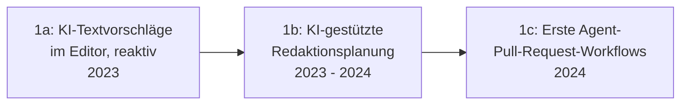

# Evolution und Architekturen digitaler Agentischer Content-Ökosysteme

Agentische & autonome Content-Ökosysteme bilden Generation 5 — die aktuelle und letzte Generation — der [Evolution digitaler Content-Management-Systeme](evolution-digitaler-cms.md). Diese eigenständige Zeitachse zoomt in genau diese Architekturlinie hinein: von reaktiven KI-Textvorschlägen über automatisierte Redaktionsplanung und Multi-Agenten-Redaktionsteams bis zu KI-orchestrierten Composable Stacks und performance-getriebener autonomer Content-Pflege.

!!! note "Hinweis: Generationen überlappen sich — und diese Generation ist noch jung"
    Die Zeiträume sind grobe Orientierung, keine scharfen Grenzen. Anders als bei den übrigen Spezialisierungs-Artikeln dieser Reihe existieren für Generation 5/6 dieser Zeitachse noch wenige vollständig ausgereifte, breit dokumentierte Referenzsysteme — die Einordnung stützt sich stärker auf allgemeine Architekturprinzipien aus verwandten Agenten-Zeitachsen als auf etablierte Einzelprodukte.

---

## Generation 1: Vom KI-Assistenten zum autonomen Redaktions-Workflow, 2023 – 2024

Die Gründergeneration eint drei Prinzipien: **reaktive KI-Unterstützung** als Ausgangspunkt, **schrittweise wachsende Autonomie** über den Redaktionsprozess und **Mensch-in-der-Schleife** als durchgängige Konstante statt vollständiger Automatisierung. Sie lässt sich in drei technologische Entwicklungsstufen unterteilen:

### 1a. KI-Textvorschläge im Editor — reaktiv, 2023

- **Architektur:** direkte Fortsetzung von [Generation 2 der KI-Content-Erstellung](evolution-digitaler-ki-content-erstellung.md#generation-2-ki-textgenerierung-direkt-im-block-editor-ab-2023) — der Redakteur initiiert jede KI-Aktion einzeln.

### 1b. KI-gestützte Redaktionsplanung, 2023 – 2024

- **Architektur:** ein KI-System recherchiert Themen und schlägt einen Redaktionsplan vor, statt nur einzelne Textbausteine zu generieren — die Planungsphase wird erstmals mit einbezogen.

### 1c. Erste Agent-Pull-Request-Workflows für Content, 2024

- **Architektur:** ein Agent erstellt einen vollständigen Content-Entwurf und legt ihn als Freigabe-Vorschlag an — analog zum [Git-nativen Human-in-the-Loop-Prinzip der Multi-Agenten-Wissensökosysteme](evolution-digitaler-multiagenten-wissensoekosysteme.md#generation-4-git-native-human-in-the-loop-wissenspflege-2024-2025), hier auf redaktionellen Content statt Dokumentation übertragen.

---

## Generation 2: Multi-Agenten-Redaktionsteams, ab 2024

Statt eines einzelnen KI-Assistenten übernehmen mehrere spezialisierte Agenten arbeitsteilig unterschiedliche Rollen im Redaktionsprozess — dieselbe Architekturantwort wie in [Generation 3 der Multi-Agenten-Wissensökosysteme](evolution-digitaler-multiagenten-wissensoekosysteme.md#generation-3-koordinierte-multi-agenten-frameworks-2023-2024), hier auf Content-Produktion statt Wissenspflege angewendet.

| Rolle | Aufgabe |
|---|---|
| **Recherche-Agent** | Sammelt Quellen und Fakten zu einem vorgegebenen Thema. |
| **Schreib-Agent** | Verfasst den Entwurf basierend auf den recherchierten Fakten und Stilrichtlinien. |
| **Prüf-Agent** | Kontrolliert den Entwurf gegen Stil- und Faktenrichtlinien, bevor er zur menschlichen Freigabe geht. |

---

## Generation 3: KI-orchestrierte Composable Stacks, ab 2024

Statt einzelne Editor-Funktionen zu unterstützen, übernimmt KI die **Steuerungsebene über den gesamten MACH-Stack** — dieselbe Entwicklung wie in [Generation 6 der Composable-CMS-Zeitachse](evolution-digitaler-composable-cms.md#generation-6-ki-orchestrierung-des-gesamten-composable-stacks-ab-2023).

| Baustein | Rolle |
|---|---|
| **Contentful als „Composable Stack Hub"** | KI koordiniert Content-, Such- und Personalisierungs-Microservices als zusammenhängenden Workflow statt isolierter Einzeltools. |

---

## Generation 4: Performance-getriebene autonome Content-Aktualisierung, ab 2024

Agenten überwachen Analytics-Daten kontinuierlich und aktualisieren bestehenden Content eigenständig, wenn Performance-Kennzahlen (Absprungrate, Conversion) das nahelegen — statt auf eine manuelle Redaktionsentscheidung zu warten.

| Baustein | Rolle |
|---|---|
| **Autonome Performance-Überwachung** | Ein Agent identifiziert unterdurchschnittlich performende Seiten anhand von Analytics-Schwellenwerten. |
| **Automatisierte Aktualisierungsvorschläge** | Der Agent schlägt konkrete Textänderungen vor, statt nur einen Hinweis auf schlechte Performance zu geben. |

---

## Generation 5: Human-in-the-Loop-Freigabe-Routing, ab 2024

Freigabe-Workflows werden selbst zum Agenten-gesteuerten Prozess — der Agent entscheidet, welcher menschliche Reviewer für welche Art von Änderung zuständig ist, statt eines starren, vordefinierten Genehmigungspfads.

| Baustein | Rolle |
|---|---|
| **Autonomes Freigabe-Routing** | Ordnet Content-Änderungen automatisch dem fachlich zuständigen Reviewer zu, analog zum [Human-in-the-Loop-Prinzip der Wiki-Pflege-Agenten](llm-first-wiki-tools-agenten.md#4-autonome-wiki-pflege-agenten-agent-schreibt-in-ein-bestehendes-wiki). |

---

## Generation 6: Vollautonome Content-Ökosysteme mit punktueller Kontrolle, ab 2025

Die Ausblick-Generation: Recherche, Entwurf, Freigabe-Routing, Veröffentlichung und kontinuierliche Aktualisierung laufen als durchgängiger Agenten-Workflow, der menschliche Redakteure nur noch an strategischen statt operativen Kontrollpunkten einbindet — deckungsgleich mit der Beschreibung in [Generation 5 der übergeordneten CMS-Zeitachse](evolution-digitaler-cms.md#generation-5-agentische-autonome-content-okosysteme).

!!! tip "Bezug zu diesem Repository"
    Wissen Ahrensburg ist selbst kein CMS im hier beschriebenen Sinn, nutzt aber mit dem [LLM-Wiki-Pattern (Karpathy-Muster)](llm-wiki-pattern-karpathy.md) bereits ein einfaches agentengestütztes Pflegeprinzip aus dieser Generation — mit demselben Human-in-the-Loop-Vorbehalt wie Generation 1c/5 dieses Artikels.

---

## Alternative Sortier- & Klassifikationskriterien für agentische Content-Ökosysteme

### 1. Autonomiegrad

- **Reaktiv, mensch-initiiert** — Generation 1a.
- **Proaktiv, agent-initiiert mit Freigabe** — Generation 1c–5.
- **Vollautonom mit punktueller Kontrolle** — Generation 6 (Ausblick).

### 2. Akteurszahl

- **Einzelner KI-Assistent** — Generation 1.
- **Koordiniertes Multi-Agenten-Team** — Generation 2.

### 3. Auslöser der Aktion

- **Nutzeranfrage** — Generation 1.
- **Analytics-Schwellenwert** — Generation 4.
- **Kontinuierlicher Hintergrundprozess** — Generation 6.

---

## Verwandte Themen

- [Evolution und Architekturen digitaler Content-Management-Systeme](evolution-digitaler-cms.md) — übergeordnetes Generationenmodell, Generation 5 dort entspricht diesem Artikel im Ganzen
- [Evolution und Architekturen digitaler KI-Content-Erstellung](evolution-digitaler-ki-content-erstellung.md) — vorausgehende Generation
- [Evolution und Architekturen digitaler Composable-CMS](evolution-digitaler-composable-cms.md) — technische Grundlage für Generation 3 dieses Artikels
- [Evolution und Architekturen digitaler Multi-Agenten-Wissensökosysteme](evolution-digitaler-multiagenten-wissensoekosysteme.md) — analoges Orchestrierungsprinzip für Wissenspflege statt Content-Produktion
- [LLM-Wiki-Pattern (Karpathy-Muster)](llm-wiki-pattern-karpathy.md) — verwandtes Prinzip, das dieses Repository selbst nutzt
