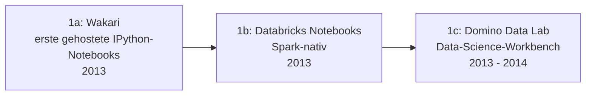

# Evolution und Architekturen digitaler Cloud-Notebooks

Cloud-gehostete Notebook-Plattformen bilden Generation 3 der [Evolution digitaler Notebook-Systeme](evolution-digitaler-notebook-systeme.md). Diese eigenständige Zeitachse zoomt in genau diese Architekturlinie hinein: von den ersten generischen Cloud-Notebook-Diensten über Binders reproduzierbare Ad-hoc-Umgebungen, wettbewerbsgebundene Kaggle-Kernels und Googles kostenlosen GPU-Zugriff bis zu Enterprise-ML-Plattformen und spezialisierten GPU-Cloud-Anbietern.

!!! note "Hinweis: Generationen überlappen sich"
    Die Zeiträume sind grobe Orientierung, keine scharfen Grenzen — Databricks Notebooks (Generation 1) laufen bis heute produktiv parallel zu spezialisierten GPU-Cloud-Anbietern (Generation 6). Entscheidend ist die **Architektur** (Multi-Tenancy, Ressourcen-Bereitstellungsmodell), nicht allein das Erscheinungsjahr.

---

## Generation 1: Frühe generische Cloud-Notebook-Dienste, 2013 – 2014

Die Gründergeneration eint drei Prinzipien: **kein lokales Setup** mehr nötig, **Multi-Tenant-Infrastruktur** statt eigenem Server und ein **noch generischer, nicht spezialisierter Fokus** auf eine bestimmte Nutzergruppe. Sie lässt sich in drei technologische Entwicklungsstufen unterteilen:

### 1a. Wakari — erste gehostete IPython-Notebooks, 2013

- **Architektur:** Continuum Analytics (heute Anaconda) bietet mit Wakari einen der ersten Cloud-Dienste speziell für gehostete IPython-Notebooks.

### 1b. Databricks Notebooks — Spark-nativ, 2013

- **Architektur:** direkt an die Apache-Spark-Big-Data-Engine gekoppelte, kollaborative Notebooks — Fokus auf verteilte Datenverarbeitung statt reiner Einzelplatz-Exploration, siehe [Generation 3 der übergeordneten Zeitachse](evolution-digitaler-notebook-systeme.md#generation-3-cloud-gehostete-notebook-plattformen-2013-2017).

### 1c. Domino Data Lab — Data-Science-Workbench, 2013 – 2014

- **Architektur:** kombiniert gehostete Notebooks mit Modell-Versionierung und Deployment-Pipeline in einer Enterprise-Data-Science-Plattform.

---

## Generation 2: Binder — reproduzierbare, temporäre Umgebungen aus Git, 2016 – 2017

Statt einer dauerhaften Nutzerinstanz erzeugt **Binder** eine temporäre, exakt reproduzierbare Notebook-Umgebung direkt aus einem Git-Repository — inklusive aller Abhängigkeiten.

| Baustein | Rolle |
|---|---|
| **Binder / mybinder.org** | Ein von Project Jupyter selbst betriebener Dienst, der aus einem GitHub-Repository mit Abhängigkeitsdatei eine live, temporäre Jupyter-Umgebung baut — ideal, um ein Notebook ohne jede lokale Installation nachvollziehbar zu teilen. |

---

## Generation 3: Kaggle Kernels — an Wettbewerbe gekoppelte Notebooks, 2016

Notebooks werden direkt mit **Datensätzen und Wettbewerben** verknüpft — Analyse und Community-Austausch finden auf derselben Plattform statt.

| Baustein | Rolle |
|---|---|
| **Kaggle Kernels** (heute Kaggle Notebooks) | Gehostete Notebooks mit direktem Zugriff auf Wettbewerbs-Datensätze, öffentlich teilbar innerhalb der Kaggle-Community. |

---

## Generation 4: Google Colaboratory — kostenloser GPU-Zugriff für die Masse, 2017

**Google Colab** senkt die Einstiegshürde für GPU-beschleunigtes maschinelles Lernen auf nahezu null — kostenloser Zugriff direkt im Browser, ohne eigene Hardware oder Cloud-Rechnung.

| Baustein | Rolle |
|---|---|
| **Google Colaboratory** | Kostenloser Zugriff auf GPU-/TPU-Beschleunigung direkt im Browser, aus einem internen Google-Tool öffentlich weiterentwickelt. |

---

## Generation 5: Enterprise-ML-Plattformen mit integrierten Notebooks, ab 2017

Große Cloud-Anbieter integrieren gehostete Notebooks als einen Baustein einer vollständigen ML-Pipeline-Plattform statt eines eigenständigen Produkts — direkte Schnittmenge zu [Generation 3 der übergeordneten Cloud-KI-API-Zeitachse](../../künstliche-intelligenz/evolution-digitaler-cloud-ki-apis.md#generation-5-mlops-modell-deployment-as-a-service-2017-2020).

| System | Anbieter | Rolle |
|---|---|---|
| **AWS SageMaker Notebook Instances** | Amazon | Gehostete Jupyter-Instanzen als Teil der vollständigen SageMaker-ML-Pipeline. |
| **Azure Notebooks / Azure ML** | Microsoft | Analoges Angebot innerhalb der Azure-Cloud-Infrastruktur. |

---

## Generation 6: Spezialisierte GPU-Cloud-Anbieter, ab 2018

Statt eines Allzweck-Notebook-Dienstes fokussieren sich diese Anbieter explizit auf **GPU-intensives ML-Training** — Preis- und Hardware-Transparenz statt eines allgemeinen Enterprise-Pakets.

| System | Prinzip |
|---|---|
| **Paperspace Gradient** | GPU-Cloud-Notebooks mit nutzungsbasierter Abrechnung nach Hardware-Klasse. |
| **Lightning.ai Studios** | Kombiniert gehostete Notebooks mit direktem Übergang zu produktivem Modelltraining und -Deployment. |

---

## Alternative Sortier- & Klassifikationskriterien für Cloud-Notebooks

### 1. Persistenzmodell

- **Dauerhafte Nutzerinstanz** — Databricks, Domino Data Lab, Google Colab.
- **Temporär, aus Git generiert** — Binder.

### 2. Zielgruppe

- **Allgemeine Data Science** — Wakari, Domino Data Lab.
- **Big-Data/Spark-spezifisch** — Databricks.
- **Wettbewerbs-/Community-zentriert** — Kaggle Kernels.
- **ML-Training-spezialisiert** — Paperspace Gradient, Lightning.ai.

### 3. Kostenmodell

- **Kostenlos mit Limits** — Google Colab (Basisversion).
- **Nutzungsbasiert nach Hardware** — Paperspace Gradient, AWS SageMaker.
- **Enterprise-Lizenz** — Databricks, Domino Data Lab.

---

## Verwandte Themen

- [Beste Cloud-Notebook-Plattformen 2026 (Top 20)](cloud-notebooks-2026-topliste.md) — Momentaufnahme 2026, die diese Chronologie in eine gerankte Topliste übersetzt
- [Produktionsreife Open-Source-Cloud-Notebooks nach Generation (Top 1)](produktionsreife-cloud-notebooks-generationen-2026-topliste.md) — dieselbe Chronologie durch ein striktes Fünf-Filter-Sieb; nur Binder/BinderHub besteht
- [Evolution und Architekturen digitaler Notebook-Systeme](evolution-digitaler-notebook-systeme.md) — übergeordnetes Generationenmodell, Generation 3 dort entspricht diesem Artikel im Ganzen
- [Evolution und Architekturen digitaler IPython- & Jupyter-Systeme](evolution-digitaler-ipython-jupyter.md) — vorausgehende Generation, JupyterHub als technische Grundlage von Generation 1 dieses Artikels
- [Evolution und Architekturen digitaler Cloud-KI-APIs](../../künstliche-intelligenz/evolution-digitaler-cloud-ki-apis.md) — direkte Schnittmenge bei Enterprise-ML-Plattformen (Generation 5 dieses Artikels)
