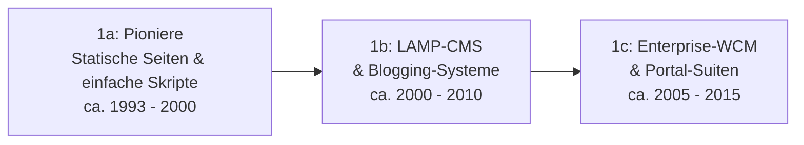

# Evolution und Architekturen digitaler Content-Management-Systeme

Content-Management-Systeme (CMS) lassen sich — analog zu [Evolution und Architekturen digitaler Wissenssysteme](evolution-digitaler-wissenssysteme.md) — nach **technologischen Generationen** ordnen: von handcodierten Seiten über monolithische LAMP-CMS und Enterprise-WCM-Suiten bis zu headless/API-first-Architekturen, komponierbaren MACH-Plattformen und schließlich KI- bzw. agentengetriebenen Content-Systemen. Dieses Kapitel gibt den historischen Überblick; die konkrete LLM-Nachrüstung einzelner Systeme behandelt [Klassische Wissensmanagement-, KB- & CMS-Systeme mit LLM-Integration](klassische-wissensmanagement-cms-llm-integration.md), die MCP-Anbindung die [CMS-Topliste mit MCP-Server](cms-mcp-server-topliste.md).

!!! note "Hinweis: Generationen überlappen sich"
    Die Zeiträume sind grobe Orientierung, keine scharfen Grenzen — WordPress (Generation 1b) wird bis heute produktiv weiterentwickelt und deckt inzwischen über sein REST-API-Fundament auch Headless-Einsatzszenarien (Generation 2) ab. Entscheidend ist die **Architektur**, nicht allein das Erscheinungsjahr.

---

## Generation 1: Klassische, monolithische CMS — Datenbank, Templates, serverseitiges Rendering

Die erste Generation eint drei Prinzipien: eine **zentrale Datenbank** (oder zumindest ein zentrales Dateisystem) als Content-Speicher, **Templates** zur Trennung von Inhalt und Präsentation und **serverseitiges Rendering** der ausgelieferten Seite. Sie lässt sich in drei technologische Entwicklungsstufen unterteilen:

### 1a. Die Pioniere (statische Seiten & einfache Skripte), ca. 1993 – 2000

- **Architektur:** statisches HTML, Server Side Includes (SSI), einfache Perl-/CGI-Skripte; noch keine echte Trennung von Content und Layout.
- **Fokus:** handgepflegte Seiten, erste serverseitige Template-Fragmente, keine Nutzerverwaltung.
- **Vertreter:** Apache-SSI-Seiten, frühe Perl-CGI-Portale, **Vignette StoryServer** (1995, gilt als erstes kommerzielles Web-Content-Management-System).

### 1b. LAMP-Content-Management & Blogging-Systeme, ca. 2000 – 2010

- **Architektur:** Klassischer LAMP-Stack (PHP/Perl/Python mit MySQL/PostgreSQL).
- **Fokus:** WYSIWYG-Editoren, Plugin-/Theme-Ökosysteme, Rollen- und Rechteverwaltung, SEO-Grundfunktionen.

| System | Speicher | Besonderheit |
|---|---|---|
| **WordPress** (2003) | MySQL/MariaDB | Ursprünglich Blog-Software, heute mit Abstand größtes CMS-Ökosystem weltweit. |
| **Joomla** (2005, Mambo-Fork) | MySQL | Ausgewogenes Verhältnis aus Bedienkomfort und Erweiterbarkeit, drittgrößtes CMS-Ökosystem. |
| **Drupal** (2001) | MySQL/PostgreSQL/SQLite | Modulares Kernsystem, siehe [Evolution und Architekturen von Drupal](drupal/evolution-digitaler-drupal.md) für die eigene Versions-/Architektur-Geschichte und [Drupal AI-Modul](klassische-wissensmanagement-cms-llm-integration.md#3-klassische-headless-cms) für die aktuelle KI-Integration. |
| **TYPO3** (2000) | MySQL/PostgreSQL | Enterprise-tauglicher LAMP-Ableger mit granularem Rechtemodell, in Deutschland stark verbreitet. |
| **PHP-Nuke** (1997) | MySQL | Eines der ersten portalartigen Open-Source-CMS, heute historisch. |

### 1c. Enterprise-WCM & Portal-Suiten, ca. 2005 – 2015

- **Architektur:** Java- (oft JCR/Content-Repository-Standard, z. B. Apache Sling) oder .NET-Stacks, relationale Datenbanken, Cluster-Betrieb.
- **Fokus:** Multi-Site-Management, Digital Asset Management (DAM), mehrstufige Freigabe-Workflows, Personalisierung, LDAP/Active-Directory-Anbindung.

| System | Speicher | Besonderheit |
|---|---|---|
| **Adobe Experience Manager (AEM)** | JCR (Apache Jackrabbit) | Aus Day CQ5 hervorgegangen, tief mit der Adobe-Experience-Cloud verzahnt. |
| **Sitecore** | SQL Server | .NET-basierte Enterprise-Suite mit starkem Fokus auf Personalisierung/Marketing-Automation. |
| **Liferay Portal** | relationale DB | Java-Portalserver mit Fokus auf Intranets und Kundenportale statt reiner Webseiten. |
| **Alfresco** | relationale DB + Content-Repository | Ursprünglich Enterprise-Content-Management (ECM) mit starkem Dokumentenmanagement-Fokus. |

---

## Generation 2: Headless & Decoupled CMS (API-first), ca. 2015 – 2021

Die Trennung von Content und Präsentation wird radikalisiert: Statt server­seitig gerenderter Templates liefert das CMS Inhalte ausschließlich über **REST- oder GraphQL-APIs** aus ("Content-as-a-Service"), das Frontend (React/Vue/Next.js, oft als JAMstack) ist ein eigenständiges Projekt. Das ermöglicht Omnichannel-Publishing — dieselben Inhalte gleichzeitig auf Website, App und IoT-Gerät.

**Architektur:** Node.js/Go/Ruby/PHP-Backends, JSON-APIs, getrennte Frontend-Deployments, oft Cloud-SaaS.

| System | Prinzip |
|---|---|
| **Contentful** | Marktführendes SaaS-Headless-CMS, siehe [KI-Positionierung als „Composable Stack Hub"](klassische-wissensmanagement-cms-llm-integration.md#3-klassische-headless-cms). |
| **Sanity** | Strukturierter Content als Echtzeit-editierbares JSON-Dokument, beliebtes Entwickler-Toolkit. |
| **Strapi** | Selbstgehostetes, quelloffenes Node.js-Headless-CMS mit Plugin-Architektur, siehe [CMS-Topliste Rang 2](cms-mcp-server-topliste.md#top-20-im-uberblick). |
| **Prismic** | SaaS-Headless-CMS mit Fokus auf Slice-basiertes, wiederverwendbares Seiten-Layout. |
| **Directus** | „Daten-first": legt sich über bestehende SQL-Datenbanken statt ein eigenes Schema zu erzwingen. |
| **Storyblok** | Visueller Editor auf Headless-Basis („Visual Headless"), beliebt bei Marketing-Teams. |

### Parallelstrang: Git-basierte & Flat-File-CMS

Eine dateibasierte Ausnahme dieser Ära — analog zu DokuWiki in der Wiki-Generation 1b: Inhalte liegen als Markdown/YAML-Dateien im Dateisystem oder Git-Repository statt in einer Datenbank.

| System | Prinzip |
|---|---|
| **Grav, Kirby, Statamic, Pico CMS** | Flat-File-CMS ohne Datenbank-Overhead, siehe [Grav in der CMS-Topliste](cms-mcp-server-topliste.md#top-20-im-uberblick). |
| **Decap CMS** (ehem. Netlify CMS), **Tina CMS** | Git-basierte Editier-Oberfläche vor einem Static-Site-Generator — Änderungen landen direkt als Git-Commits. |

---

## Generation 3: Composable & MACH-Architektur / Digital Experience Platforms (DXP), ab ca. 2020

Headless wird zum Baustein eines größeren Prinzips: **MACH** (Microservices, API-first, Cloud-native, Headless). Statt einer monolithischen Plattform kombinieren Teams austauschbare Best-of-Breed-Services — Content, Commerce, Search, Personalisierung — über APIs zu einer individuellen "Digital Experience Platform" (DXP).

**Architektur:** Microservices, API-Gateways, Cloud-native Skalierung, Echtzeit-Personalisierungs-Engines.

| System | Prinzip |
|---|---|
| **Contentstack** | Enterprise-Headless-CMS mit explizitem MACH-Alliance-Zertifikat. |
| **Kontent.ai** | API-first-Plattform mit strukturierten Content-Modellen und Workflow-Engine. |
| **Optimizely** (ehem. Episerver) | DXP mit starkem Fokus auf A/B-Testing und Personalisierung. |
| **Adobe Experience Manager as a Cloud Service** | Cloud-native Neuausrichtung des Enterprise-WCM aus Generation 1c. |
| **Bloomreach, Hygraph** (ehem. GraphCMS) | Kombination aus Headless-Content und KI-gestützter Discovery/Suche. |

---

## Generation 4: KI-gestützte Content-Erstellung & Personalisierung, ab ca. 2023

Generative KI wandert direkt in den Editor: Textentwürfe, Bildgenerierung, automatische Übersetzung, SEO-Optimierung und Echtzeit-Personalisierung laufen als eingebaute oder angebundene LLM-Funktionen. Ausführlich behandelt in [Klassische Wissensmanagement-, KB- & CMS-Systeme mit LLM-Integration](klassische-wissensmanagement-cms-llm-integration.md#3-klassische-headless-cms).

| System | KI-Funktion |
|---|---|
| **WordPress + Jetpack AI** | Content-Generierung, Übersetzung, Grammatikkorrektur im Gutenberg-Editor. |
| **Drupal AI-Modul** | Content-Erstellung, semantische Suche, automatischer Alt-Text; über Symfony AI an 48+ Modell-Provider anbindbar. |
| **Builder.io** | Visueller Editor mit generativer KI zur Umsetzung von Figma-Designs in Live-Content. |
| **Webflow AI** | KI-gestützte Layout- und Textvorschläge im visuellen No-Code-Builder. |

---

## Generation 5: Agentische & autonome Content-Ökosysteme

Zukunftsorientierte Architekturen, in denen KI-Agenten den Content-Lebenszyklus nicht nur unterstützen, sondern eigenständig steuern: Recherche, Entwurf, Freigabe-Routing, Veröffentlichung und kontinuierliche Aktualisierung anhand von Performance-Daten laufen als Agenten-Workflow, der menschliche Redakteure nur noch an Freigabepunkten einbindet.

- **Autonome Redaktions-Agenten** (Multi-Agenten-Frameworks auf Basis von Claude Code, OpenAI AgentKit): recherchieren Themen, erstellen Entwürfe, prüfen sie gegen Stil-/Faktenrichtlinien und stellen sie als Pull Request zur menschlichen Freigabe — konzeptionell deckungsgleich mit dem [agentischen Human-in-the-Loop-Prinzip](llm-first-wiki-tools-agenten.md#4-autonome-wiki-pflege-agenten-agent-schreibt-in-ein-bestehendes-wiki) aus den LLM-first-Wiki-Werkzeugen.
- **KI-orchestrierte Composable Stacks** (z. B. Contentful als „Composable Stack Hub"): KI übernimmt die Steuerungsebene über den gesamten MACH-Stack statt nur einzelne Editor-Funktionen.

!!! tip "Bezug zu diesem Repository"
    Wissen Ahrensburg ist selbst kein CMS im hier beschriebenen Sinn, sondern ein statisch gebautes Docs-as-Code-Repository (siehe [Generation 2 der Wissenssysteme](evolution-digitaler-wissenssysteme.md#generation-2-workspace-kollaborations-docs-as-code-plattformen-ca-2015-2021)) — nutzt aber mit dem [LLM-Wiki-Pattern (Karpathy-Muster)](llm-wiki-pattern-karpathy.md) bereits ein einfaches agentengestütztes Pflegeprinzip aus Generation 5/6.

---

## Alternative Sortier- & Klassifikationskriterien für CMS

Neben dem chronologischen/technologischen Generationenmodell lassen sich CMS nach folgenden Dimensionen einordnen:

### 1. Architektur-Modell

- **Monolithisch** — Backend und Frontend-Rendering in einem System, z. B. WordPress, Joomla, TYPO3.
- **Decoupled/Headless** — Content-API und Präsentationsschicht als getrennte Projekte, z. B. Contentful, Strapi.
- **Hybrid** — klassisches CMS, das zusätzlich eine Headless-API anbietet, z. B. WordPress über die REST-API.
- **Composable/MACH** — mehrere austauschbare Microservices statt eines Content-Backends, z. B. Contentstack, Kontent.ai.

### 2. Speicherarchitektur

- **Relationale Datenbank** — MySQL/PostgreSQL/SQL Server, z. B. WordPress, Drupal, Sitecore.
- **Dateibasiert / Flat-File** — Markdown/YAML im Dateisystem, z. B. Grav, Kirby, Statamic.
- **Cloud-API / SaaS-Speicher** — Content liegt beim Anbieter, Zugriff ausschließlich über API, z. B. Contentful, Sanity.

### 3. Hosting- & Betriebsmodell

- **Self-hosted Open Source** — eigene Infrastruktur, volle Datenhoheit, z. B. Drupal, Strapi, Grav.
- **SaaS/Cloud** — Anbieter betreibt Backend und Skalierung, z. B. Contentful, Storyblok, Webflow.
- **Enterprise on-premise** — Lizenzsoftware im eigenen Rechenzentrum, z. B. AEM (klassisch), Sitecore.

### 4. Primärer Einsatzzweck

- **Blogging/Redaktion** — WordPress, Ghost.
- **Enterprise-DXP/Portal** — AEM, Sitecore, Liferay.
- **E-Commerce-CMS** — Magento/Adobe Commerce, WooCommerce, Shopify.
- **Entwickler-zentriertes Headless** — Strapi, Directus, Sanity.

---

## Verwandte Themen

- [Dokumentenerstellung, Wikis & Notebooks](index.md) — Gesamtübersicht aller Dokumentations-Systeme
- [Evolution und Architekturen digitaler Wissenssysteme](evolution-digitaler-wissenssysteme.md) — analoges Generationenmodell für Wikis & PKM-Systeme
- [Evolution und Architekturen digitaler LMS](../e-learning/evolution-digitaler-lms.md) — analoges Generationenmodell für Lernmanagement-Systeme
- [Evolution und Architekturen digitaler Web-Frameworks](../../entwicklung/webentwicklung/evolution-digitaler-webframeworks.md) — analoges Generationenmodell für Web-Frameworks, direkte Schnittmenge bei Headless-Frontends
- [Evolution und Architekturen digitaler KI-Anwendungen](../../künstliche-intelligenz/evolution-digitaler-ki-anwendungen.md) — analoges Generationenmodell für KI-Anwendungen
- [Klassische Wissensmanagement-, KB- & CMS-Systeme mit LLM-Integration](klassische-wissensmanagement-cms-llm-integration.md) — LLM-Integration konkreter CMS (2026)
- [Beste CMS-Systeme (Open Source) mit MCP-Server (Top 20)](cms-mcp-server-topliste.md) — Agenten-/MCP-Anbindung konkreter CMS
- [Open-Source Systeme mit vollständiger LLM-, Agenten- & MCP-Unterstützung](open-source-llm-agent-mcp-systeme.md) — Gesamtübersicht über Wiki, Wissensmanagement & CMS
- [LLM-Wiki-Pattern (Karpathy-Muster)](llm-wiki-pattern-karpathy.md) — agentisches Pflegeprinzip, das dieses Repository selbst nutzt
