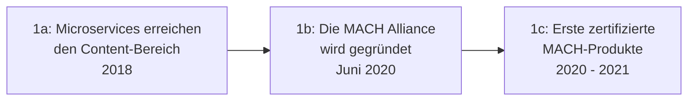

# Evolution und Architekturen digitaler Composable-CMS

Composable & MACH-Architektur / Digital Experience Platforms bilden Generation 3 der [Evolution digitaler Content-Management-Systeme](evolution-digitaler-cms.md). Diese eigenständige Zeitachse zoomt in genau diese Architekturlinie hinein: von den ersten Microservice-Prinzipien im Content-Bereich über die Gründung der MACH Alliance, Enterprise-Headless-Zertifizierung und die Migration klassischer DXP-Anbieter bis zu KI-gestützter Discovery und Composable Commerce als Nachbardisziplin.

!!! note "Hinweis: Generationen überlappen sich"
    Die Zeiträume sind grobe Orientierung, keine scharfen Grenzen — klassische DXP-Suiten (Generation 1c der CMS-Zeitachse) migrieren teils erst Jahre nach der MACH-Alliance-Gründung zu Composable-Prinzipien. Entscheidend ist die **Architektur** (austauschbare Microservices statt einer monolithischen Plattform), nicht allein das Erscheinungsjahr.

---

## Generation 1: Die MACH-Prinzipien entstehen, 2018 – 2021

Die Gründergeneration eint drei Prinzipien: **Microservices statt Monolith**, **API-first als Grundvoraussetzung statt Zusatzfeature** und ein **formalisierter Branchenstandard** statt loser Einzelentscheidungen. Sie lässt sich in drei technologische Entwicklungsstufen unterteilen:

### 1a. Microservices erreichen den Content-Bereich, 2018

- **Beobachtung:** Enterprise-Teams kombinieren zunehmend mehrere spezialisierte Cloud-Dienste (Content, Suche, Personalisierung) statt einer monolithischen DXP-Suite — noch ohne gemeinsamen Namen oder Standard.

### 1b. Die MACH Alliance wird gegründet, Juni 2020

- **Architektur:** **MACH** steht für **M**icroservices, **A**PI-first, **C**loud-native, **H**eadless — vier Prinzipien, die zusammen ein austauschbares „Best-of-Breed"-Ökosystem statt einer geschlossenen Plattform definieren.
- **Gründungsmitglieder:** **Contentstack**, **commercetools**, **Valtech**, **EPAM** gründen im Juni 2020 die MACH Alliance als gemeinnützige Organisation zur Förderung dieser Prinzipien.

### 1c. Erste zertifizierte MACH-Produkte, 2020 – 2021

- **Bedeutung:** die MACH Alliance vergibt ein formales Zertifikat an Produkte, die alle vier Prinzipien nachweislich erfüllen — aus einem informellen Architekturtrend wird ein prüfbarer Standard.

---

## Generation 2: Enterprise-Headless mit MACH-Zertifikat, 2018 – 2021

Aufbauend auf [Generation 2 der Headless-CMS-Zeitachse](evolution-digitaler-headless-cms.md) positionieren sich mehrere Anbieter explizit für Enterprise-Anforderungen — mit MACH-Zertifikat als Vertrauenssignal für große Organisationen.

| System | Prinzip |
|---|---|
| **Contentstack** | Gründungsmitglied der MACH Alliance, Enterprise-Headless-CMS mit explizitem MACH-Zertifikat. |
| **Kontent.ai** | API-first-Plattform mit strukturierten Content-Modellen und eingebauter Workflow-Engine. |

---

## Generation 3: DXP-Anbieter migrieren zu Composable, 2019 – 2022

Etablierte Digital-Experience-Platform-Anbieter aus [Generation 1c der klassischen CMS-Zeitachse](evolution-digitaler-klassische-cms.md#generation-1-pioniere-lamp-cms-enterprise-wcm-1993-2015) bauen ihre monolithischen Suiten schrittweise zu Composable-Architekturen um, statt komplett neue Produkte zu entwickeln.

| System | Vorher | Nachher |
|---|---|---|
| **Optimizely** (ehem. Episerver) | Monolithische DXP mit A/B-Testing-Fokus | Composable-Module für Content, Experimentierung, Commerce einzeln kombinierbar. |
| **Adobe Experience Manager as a Cloud Service** | On-Premise-JCR-Suite | Cloud-native Neuausrichtung mit stärkerer API-Anbindung. |

---

## Generation 4: KI-gestützte Discovery & Search als MACH-Baustein, 2020 – 2023

Suche und Personalisierung werden als **eigenständiger, austauschbarer Microservice** angeboten — ein weiterer MACH-Baustein neben dem reinen Content-Backend.

| System | Prinzip |
|---|---|
| **Bloomreach** | Kombiniert Headless-Content mit KI-gestützter Produktsuche und Discovery. |
| **Hygraph** (ehem. GraphCMS) | GraphQL-natives Headless-CMS mit KI-gestützten Content-Federation-Funktionen. |

---

## Generation 5: Composable Commerce als Nachbardisziplin, 2019 – 2022

Dasselbe MACH-Prinzip überträgt sich parallel auf den E-Commerce-Bereich — austauschbare Commerce-Microservices statt einer monolithischen Shop-Plattform, oft im selben Composable Stack wie das Content-Backend kombiniert.

| System | Prinzip |
|---|---|
| **commercetools** | Gründungsmitglied der MACH Alliance, API-first-Commerce-Engine ohne eigenes Frontend. |
| **Shopify Hydrogen** | React-basiertes Framework für Headless-Commerce-Frontends auf Shopify-Basis. |

---

## Generation 6: KI-Orchestrierung des gesamten Composable Stacks, ab 2023

Die aktuelle Generation verschiebt KI von einzelnen Editor-Funktionen (vgl. [KI-gestützte Content-Erstellung](evolution-digitaler-ki-content-erstellung.md)) auf die **Steuerungsebene des gesamten Stacks** — ein KI-System koordiniert mehrere MACH-Microservices statt nur eine einzelne Anwendung zu unterstützen.

| Baustein | Rolle |
|---|---|
| **Contentful als „Composable Stack Hub"** | KI übernimmt die Steuerungsebene über den gesamten MACH-Stack statt nur einzelner Editor-Funktionen, siehe [Generation 5 der übergeordneten CMS-Zeitachse](evolution-digitaler-cms.md#generation-5-agentische-autonome-content-okosysteme). |

---

## Alternative Sortier- & Klassifikationskriterien für Composable-CMS

### 1. Zertifizierungsstatus

- **MACH-zertifiziert** — formal geprüft gegen alle vier Prinzipien (Contentstack, commercetools).
- **MACH-konform ohne Zertifikat** — erfüllt die Prinzipien faktisch, ohne formale Prüfung.

### 2. Migrationsweg

- **Von Grund auf Composable** — Contentstack, Kontent.ai.
- **Migriert aus monolithischer DXP** — Optimizely, AEM as a Cloud Service.

### 3. Domäne

- **Content** — Contentstack, Kontent.ai, Hygraph.
- **Commerce** — commercetools, Shopify Hydrogen.
- **Suche/Discovery** — Bloomreach.

---

## Verwandte Themen

- [Beste Composable-CMS & MACH-Systeme 2026 (Top 20)](composable-cms-2026-topliste.md) — aktuelle Top-20-Topliste, die diese Chronologie in eine Momentaufnahme 2026 übersetzt
- [Evolution und Architekturen digitaler Content-Management-Systeme](evolution-digitaler-cms.md) — übergeordnetes Generationenmodell, Generation 3 dort entspricht diesem Artikel im Ganzen
- [Evolution und Architekturen digitaler Headless-CMS](evolution-digitaler-headless-cms.md) — vorausgehende Generation, deren API-first-Prinzip hier zum Standard wird
- [Evolution und Architekturen digitaler KI-Content-Erstellung](evolution-digitaler-ki-content-erstellung.md) — nachfolgende Generation
- [Evolution und Architekturen digitaler klassischer CMS](evolution-digitaler-klassische-cms.md) — Ursprung der migrierenden DXP-Anbieter aus Generation 3 dieses Artikels
