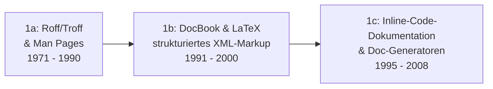

# Evolution und Architekturen digitaler Docs-as-Code

Docs-as-Code — die Praxis, Dokumentation wie Quellcode zu behandeln (Klartext-Dateien, Git-Versionierung, Code-Review via Pull Request, automatisierter Build) — lässt sich analog zu den Generationenmodellen für [Wissenssysteme](evolution-digitaler-wissenssysteme.md) und [Content-Management-Systeme](evolution-digitaler-cms.md) nach **technologischen Generationen** ordnen: von früher Markup-basierter Technikdokumentation über die Geburt des eigentlichen Docs-as-Code-Workflows mit Sphinx/Read the Docs, Markdown-native YAML-Frameworks und komponentenbasierte Docs-Frameworks bis zu KI-gestützter und schließlich agentischer Dokumentationspflege. Die produkt-/tool-orientierte Übersicht der „Book-First"- und „Docs-First"-Generatoren bietet [Dokumentenerstellung, Wikis & Notebooks](index.md).

!!! note "Hinweis: Generationen überlappen sich"
    Die Zeiträume sind grobe Orientierung, keine scharfen Grenzen — Sphinx (Generation 2) wird bis heute produktiv für große Python-Projekte genutzt, parallel zu agentisch gepflegten Markdown-Docs (Generation 6). Entscheidend ist die **Architektur** (wie Inhalt, Layout und Versionierung getrennt und automatisiert werden), nicht allein das Erscheinungsjahr.

---

## Generation 1: Vorläufer — strukturierte Textauszeichnung & inline Code-Dokumentation, 1971 – 2008

Vor dem eigentlichen Docs-as-Code-Workflow etabliert sich das Grundprinzip „Dokumentation als Klartext statt Binärformat" in drei technologischen Entwicklungsstufen — Versionierung erfolgt hier meist noch über CVS/SVN statt Git, der spätere PR-Review-Workflow fehlt noch vollständig.

### 1a. Roff/Troff & Man Pages, 1971 – 1990

- **Architektur:** Unix-Textformatierungssysteme (**troff**, **nroff**), Dokumentation als Plain-Text-Quelle mit eingebetteten Formatierungsbefehlen, kompiliert zu druckfertigem Text.
- **Fokus:** Man-Pages als Referenzdokumentation direkt neben dem Unix-System, keine Trennung von Autor- und Publikationswerkzeug.
- **Vertreter:** **man-Pages** (seit Unix Version 1, 1971), **groff** (GNU-Nachfolger von troff).

### 1b. DocBook & LaTeX — strukturiertes XML-/Markup-Publishing, 1991 – 2000

- **Architektur:** semantisches XML-Markup (**DocBook**, 1991) bzw. TeX-basiertes Satzsystem (**LaTeX**, 1984/erste Docbook-ähnliche Verbreitung in den 1990ern) trennt erstmals Inhalt konsequent von Layout — ein zentrales Docs-as-Code-Prinzip nimmt hier seinen Ursprung.
- **Fokus:** wissenschaftliche und technische Referenzwerke, Mehrfachausgabe aus einer Quelle (Single-Source-Publishing) in PDF, HTML und Druckformate.
- **Vertreter:** **DocBook** (O'Reilly-Verlag, technische Bücher), **LaTeX** (wissenschaftliche Publikationen), frühe **Linux-Dokumentationsprojekte** (LDP).

### 1c. Inline-Code-Dokumentation & Doc-Generatoren, 1995 – 2008

- **Architektur:** Dokumentation als strukturierte Kommentare direkt im Quellcode, ein Generator extrahiert daraus eine separate Referenzseite — Inhalt lebt damit erstmals im selben Repository wie der Code, wenn auch ohne eigenständiges Prosa-Doku-System.
- **Fokus:** API-Referenzdokumentation synchron zum Code halten, statt sie in einem getrennten Werkzeug zu pflegen.
- **Vertreter:** **Javadoc** (1995, Sun Microsystems), **Doxygen** (1997, C/C++/Java), **Perl POD** (Plain Old Documentation).

---

## Generation 2: Sphinx & die Geburt des eigentlichen Docs-as-Code-Workflows, 2008 – 2014

Mit **Sphinx** (2008, ursprünglich für die Python-Dokumentation selbst entwickelt) und **Read the Docs** (2010) entsteht der Workflow, der den Namen „Docs as Code" erst rechtfertigt: Dokumentation liegt als Klartext im selben Git-Repository wie der Code, wird per Pull Request reviewt und automatisiert gebaut und gehostet — nicht länger in einem separaten CMS oder Autorenwerkzeug gepflegt.

**Architektur:** **reStructuredText (RST)** als Markup-Sprache, Python-basierter Sphinx-Generator mit **autodoc**-Erweiterung (automatischer Import von Docstrings aus dem Code), Cross-Referenzierung über eindeutige Labels statt manueller Links.

| Baustein | Rolle |
|---|---|
| **Sphinx** (2008) | Generator, der RST-Quelldateien zu HTML/PDF/ePub kompiliert — bis heute Standard für Python- und viele Systemsoftware-Projekte (z. B. Linux-Kernel-Doku). |
| **Read the Docs** (2010) | Automatisiert Build und Hosting direkt aus dem Git-Repository heraus — jeder Push löst einen neuen Doku-Build aus, der zentrale Auslöser der Docs-as-Code-Bewegung. |
| **reStructuredText (RST)** | Markup-Sprache mit expliziter Direktiven-Syntax, mächtiger als frühes Markdown, aber lernintensiver. |

---

## Generation 3: Markdown-native Docs-as-Code-Frameworks & YAML-Konfiguration, 2014 – 2020

Der Umstieg von RST auf das leichter zugängliche **Markdown** und die Konfiguration der gesamten Seitenstruktur über eine einzige YAML-Datei senken die Einstiegshürde erheblich — Docs-as-Code wird damit auch für Teams praktikabel, die keine RST-Erfahrung mitbringen. Anne Gentles Buch „Docs Like Code" (2017) prägt in dieser Phase den bis heute gebräuchlichen Namen der Bewegung.

**Architektur:** Markdown als Quellformat, zentrale `mkdocs.yml`/`_config.yml` für Navigation und Theme, statischer Build ohne Server-Backend, GitHub-Pages-taugliches Output.

| System | Sprache | Besonderheit |
|---|---|---|
| **MkDocs** (2014) | Python | YAML-konfigurierter Generator, mit dem Theme **Material for MkDocs** (ab 2017, Martin Donath) zum heute wohl meistgenutzten Docs-as-Code-Stack für technische Dokumentation avanciert — auch die Basis dieses Repositories. |
| **Jekyll + GitHub Pages** | Ruby | Nativ von GitHub gehostet, senkt die Hosting-Hürde für Docs-as-Code-Projekte auf nahezu null. |
| **Docusaurus v1** (2017) | React/Node.js | Meta-Framework, führt React-Komponenten in die Docs-as-Code-Welt ein, noch vor der MDX-Reife von Generation 4. |
| **GitBook (Legacy CLI)** | Node.js | Frühes Markdown-zu-Buch-Tool, heute größtenteils als Open-Source-Fork **HonKit** fortgeführt. |

---

## Generation 4: Komponentenbasierte & interaktive Docs-Frameworks, 2020 – 2023

Dokumentation wird zur waschechten Web-Anwendung: **MDX** verschmilzt Markdown mit eingebetteten UI-Komponenten, Volltextsuche wandert von einfachen Lunr-Indizes zu gehosteten Suchdiensten, Versionierung und Mehrsprachigkeit werden Standard-Features statt Zusatzaufwand.

**Architektur:** MDX (Markdown + JSX-Komponenten), Zero-JS-by-default-Rendering (Astro-Islands-Architektur), gehostete Volltextsuche (Algolia DocSearch), eingebautes Multi-Version-/i18n-Routing.

| System | Stack | Besonderheit |
|---|---|---|
| **Docusaurus v2** (2020) | React/MDX | Vollständige MDX-Integration, Versionierung und i18n direkt im Core. |
| **Nextra** | Next.js/MDX | Von Vercel getragen, kombiniert Next.js-Rendering mit dokuzentrierten Themes. |
| **Astro Starlight** (2023) | Astro | Zero-JS-Standard, exzellente Ladezeiten, integrierte Barrierefreiheits-Defaults. |
| **Algolia DocSearch** | Hosted Service | Kostenloser, gecrawlter Suchindex für Open-Source-Docs-as-Code-Projekte — ersetzt lokale Lunr-/FlexSearch-Indizes bei großen Projekten. |

---

## Generation 5: KI-gestützte Docs-as-Code — automatisierte Qualitätssicherung & RAG-Suche, 2023 – 2025

Large Language Models übernehmen unterstützende Rollen im Docs-as-Code-Workflow, ohne den Menschen aus dem Autoren- und Review-Prozess zu verdrängen: Linting-Tools erkennen Stil- und Konsistenzfehler über reine Grammatikprüfung hinaus, RAG-gestützte Chatbots beantworten Nutzerfragen direkt auf der Doku-Seite.

**Architektur:** LLM-gestützte Linter in der CI-Pipeline (ergänzend zu regelbasierten Tools wie **Vale**), In-Doku-Chat-Widgets mit Retrieval-Augmented Generation über den eigenen Doku-Bestand — vgl. [Praxis-Guide: Lokales RAG & LLM-Serving mit Ollama & ChromaDB](../../künstliche-intelligenz/coding/lokales-rag-ollama.md).

| Baustein | Rolle |
|---|---|
| **Vale + LLM-Ergänzung** | Regelbasiertes Prosa-Linting (Terminologie, Stil-Guides), ergänzt um LLM-Prüfschritte für Kontext, den reine Regex-Regeln nicht erfassen. |
| **Mintlify AI, Kapa.ai** | In Doku-Seiten eingebettete RAG-Chatbots, die Nutzerfragen direkt aus dem indizierten Doku-Bestand beantworten statt auf Volltextsuche zu verweisen. |
| **Docstring-zu-Seite-Generierung** | LLMs formulieren aus knappen Code-Kommentaren vollständige Prosa-Referenzseiten — Weiterentwicklung des Doxygen/Javadoc-Prinzips aus Generation 1c. |

---

## Generation 6: Agentische Docs-as-Code — autonome Pflege durch KI-Agenten, ab ca. 2025

KI-Agenten schreiben, prüfen und committen Dokumentationsänderungen selbstständig direkt im Git-Repository — Docs-as-Code wird damit erstmals nicht nur *wie* Code behandelt, sondern *von denselben agentischen Werkzeugen gepflegt*, die auch den Quellcode bearbeiten.

**Architektur:** Agent-Loops mit Datei-, Build- und Git-Zugriff, Pre-Commit-Hooks, die Builds/Prüfungen automatisch vor jedem Commit ausführen, spezialisierte Subagenten für Doku-Qualitätssicherung statt manueller Review-Checklisten.

| Baustein | Rolle |
|---|---|
| **Claude Code / Antigravity CLI** | Agentische Coding-Werkzeuge, die Doku-Seiten direkt im Repository anlegen, verlinken und pflegen — siehe [AI Agents Praxis-Handbuch](../../künstliche-intelligenz/coding/ai-agents-praxis.md). |
| **Zensical** (Nachfolger von MkDocs + Material) | Liest `mkdocs.yml` nativ weiter, baut damit auf dem YAML-Konfigurationsmodell aus Generation 3 auf, statt es zu ersetzen. |
| **Pre-Commit-Hooks & Doc-Checker-Subagenten** | Automatisierte Build-, Link- und Navigations-Prüfung vor jedem Commit, statt manueller Checklisten vor dem Review. |

!!! tip "Bezug zu diesem Repository"
    Dieses Repository dokumentiert Generation 6 nicht nur, sondern nutzt sie aktiv: Es wird mit **Zensical** gebaut (siehe `CLAUDE.md`), die eigene Doku-Pflege folgt dem [LLM-Wiki-Pattern (Karpathy-Muster)](llm-wiki-pattern-karpathy.md), und ein `.gemini/hooks/pre-commit`-Hook führt vor jedem Commit automatisch einen vollständigen Build durch. Claude Code als Agent erstellt, verlinkt und prüft Artikel wie diesen direkt im Git-Repository.

---

## Alternative Sortier- & Klassifikationskriterien für Docs-as-Code

Neben dem chronologischen/technologischen Generationenmodell lassen sich Docs-as-Code-Werkzeuge nach folgenden Dimensionen einordnen:

### 1. Markup-Sprache

- **Strukturiertes XML** — DocBook, mächtige Semantik, hoher Erstellungsaufwand (Generation 1b).
- **reStructuredText (RST)** — explizite Direktiven-Syntax, mächtig aber lernintensiv (Generation 2).
- **Markdown** — flache Lernkurve, breiteste Werkzeug-Unterstützung, heutiger De-facto-Standard (Generation 3+).
- **MDX (Markdown + JSX)** — Markdown mit eingebetteten interaktiven Komponenten (Generation 4).

### 2. Konfigurationsmodell

- **Code-/Template-getrieben** — Layout direkt im Quellcode des Generators verdrahtet (frühe Roff-Skripte).
- **Zentrale YAML-Konfiguration** — eine Datei (`mkdocs.yml`) steuert Navigation, Theme und Plugins (Generation 3+, auch dieses Repository).
- **Komponentenbasiert** — Layout als wiederverwendbare UI-Komponenten statt reiner Konfiguration (Generation 4).

### 3. Automatisierungsgrad im Autoren-Workflow

- **Manuell** — Autor schreibt und formatiert ohne Werkzeugunterstützung (Generation 1).
- **CI-automatisiert** — Push löst automatisierten Build/Deploy aus, aber Inhalt bleibt rein menschlich verfasst (Generation 2–4).
- **KI-unterstützt** — LLM-Linting und RAG-Suche ergänzen den menschlichen Autor (Generation 5).
- **Agentisch** — ein KI-Agent verfasst, verlinkt und committet Änderungen eigenständig, Mensch reviewt nur noch (Generation 6).

### 4. Hosting-Modell

- **Self-Hosted/statisches Artefakt** — Build-Output liegt auf eigenem Webserver oder GitHub Pages (die meisten Docs-as-Code-Stacks, auch dieses Repository).
- **Gehosteter SaaS-Dienst** — Read the Docs, Mintlify, GitBook übernehmen Build und Hosting vollständig.
- **Hybrid** — statischer Build, aber gehostete Zusatzdienste (z. B. Algolia DocSearch, RAG-Chat-Widget) ergänzen die eigene Infrastruktur.

---

## Verwandte Themen

- [Beste Docs-as-Code-Werkzeuge 2026 (Top 15)](docs-as-code-2026-topliste.md) — Momentaufnahme 2026, die diese Chronologie in eine gerankte Topliste übersetzt
- [Beste Open-Source-Docs-as-Code-Werkzeuge 2026 (Top 20)](docs-as-code-open-source-2026-topliste.md) — dieselbe Momentaufnahme, gefiltert auf 20 Werkzeuge unter OSI-anerkannter Lizenz
- [Dokumentenerstellung, Wikis & Notebooks](index.md) — Gesamtübersicht aller Dokumentations-Systeme inkl. Book-First-/Docs-First-Generatoren
- [Evolution und Architekturen digitaler Static-Site-Generatoren](evolution-digitaler-static-site-generatoren.md) — Schwester-Chronologie nach Rendering-Architektur statt Anwendungsfall/Kollaborationsmodell
- [Evolution und Architekturen digitaler Wissenssysteme](evolution-digitaler-wissenssysteme.md) — analoges Generationenmodell, Generation 2 dort deckt sich mit Generation 3 dieses Artikels
- [Evolution und Architekturen digitaler Content-Management-Systeme](evolution-digitaler-cms.md) — analoges Generationenmodell für CMS
- [Evolution und Architekturen digitaler KI-Anwendungen](../../künstliche-intelligenz/evolution-digitaler-ki-anwendungen.md) — analoges Generationenmodell für KI-Anwendungen
- [LLM-Wiki-Pattern (Karpathy-Muster)](llm-wiki-pattern-karpathy.md) — agentisches Pflegeprinzip, das dieses Repository selbst nutzt (Generation 6)
- [AI Agents – Das Praxis-Handbuch & Architektur-Leitfaden](../../künstliche-intelligenz/coding/ai-agents-praxis.md) — Vertiefung zu Generation 6
- [Praxis-Guide: Lokales RAG & LLM-Serving mit Ollama & ChromaDB](../../künstliche-intelligenz/coding/lokales-rag-ollama.md) — Vertiefung zu Generation 5
- [Evolution und Architekturen digitaler Frameworks & Bibliotheken für Wissenssysteme](evolution-digitaler-wissenssystem-frameworks.md) — Pandoc als universeller Dokumentkonverter, oft im Hintergrund vieler hier genannten Docs-as-Code-Toolchains eingesetzt
- [Evolution und Architekturen digitaler Programmiersprachen für Wissenssysteme](evolution-digitaler-wissenssystem-programmiersprachen.md) — Python/Ruby als Sprachwahl hinter Sphinx, MkDocs und Jekyll aus diesem Artikel
