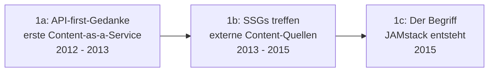

# Evolution und Architekturen digitaler Headless-CMS

Headless & Decoupled CMS bilden Generation 2 der [Evolution digitaler Content-Management-Systeme](evolution-digitaler-cms.md). Diese eigenständige Zeitachse zoomt in genau diese Architekturlinie hinein: vom JAMstack-Vorabend über den SaaS-Headless-Boom, Open-Source-Alternativen und Git-basierte Flat-File-Systeme bis zu visuellem Headless für Marketing-Teams und einer Hybrid-Renaissance, die Headless-Features direkt in klassische CMS zurückbringt.

!!! note "Hinweis: Generationen überlappen sich"
    Die Zeiträume sind grobe Orientierung, keine scharfen Grenzen — Contentful (Generation 2) läuft bis heute parallel zu visuellen Headless-Systemen (Generation 5) produktiv. Entscheidend ist die **Architektur** (Content-API getrennt von der Präsentationsschicht), nicht allein das Erscheinungsjahr.

---

## Generation 1: Der JAMstack-Vorabend, 2012 – 2015

Die Gründergeneration eint drei Prinzipien: **API-first statt Rendering-first**, **statische Site-Generatoren** als typisches Frontend-Gegenstück und eine **noch unbenannte, aber bereits praktizierte** Architektur. Sie lässt sich in drei technologische Entwicklungsstufen unterteilen:

### 1a. API-first-Gedanke — erste Content-as-a-Service-Pioniere, 2012 – 2013

- **Vertreter:** **Contentful** (2013, Berlin) — einer der ersten Anbieter, der Content ausschließlich über eine API statt eine Rendering-Engine bereitstellt.

### 1b. Static-Site-Generatoren treffen externe Content-Quellen, 2013 – 2015

- **Architektur:** Static-Site-Generatoren (Jekyll, vgl. [Generation 4 der Docs-as-Code-Zeitachse](evolution-digitaler-docs-as-code.md#generation-4-komponentenbasierte-interaktive-docs-frameworks-2020-2023)) beziehen Content erstmals über externe APIs statt lokaler Markdown-Dateien.

### 1c. Der Begriff „JAMstack" entsteht, 2015

- **Bedeutung:** Mathias Biilmann (Netlify) prägt 2015 den Begriff **JAMstack** (JavaScript, APIs, Markup) für die Kombination aus statischem Frontend und API-gelieferten Daten — der Sammelbegriff für die gesamte Generation.

---

## Generation 2: SaaS-Headless-CMS-Boom, 2013 – 2017

Vollständig gehostete Headless-CMS-Plattformen etablieren „Content-as-a-Service" als eigene Produktkategorie — Entwickler integrieren Content per API-Client statt eigenes Backend zu betreiben.

| System | Jahr | Prinzip |
|---|---|---|
| **Contentful** | 2013 | Marktführendes SaaS-Headless-CMS, siehe [KI-Positionierung als „Composable Stack Hub"](klassische-wissensmanagement-cms-llm-integration.md#3-klassische-headless-cms). |
| **Prismic** | 2013 | SaaS-Headless-CMS mit Fokus auf Slice-basiertes, wiederverwendbares Seiten-Layout. |
| **Sanity** | 2017 | Strukturierter Content als Echtzeit-editierbares JSON-Dokument. |

---

## Generation 3: Open-Source-Self-Hosted-Headless, 2015 – 2016

Als Antwort auf den Vendor-Lock-in reiner SaaS-Lösungen entstehen quelloffene Headless-CMS, die sich selbst hosten lassen — volle Datenhoheit statt Abhängigkeit vom Anbieter.

| System | Jahr | Prinzip |
|---|---|---|
| **Strapi** | 2015 | Selbstgehostetes, quelloffenes Node.js-Headless-CMS mit Plugin-Architektur, siehe [CMS-Topliste](cms-mcp-server-topliste.md#top-20-im-uberblick). |
| **Directus** | 2016 | „Daten-first": legt sich über bestehende SQL-Datenbanken statt ein eigenes Schema zu erzwingen. |

---

## Generation 4: Git-basierte Flat-File-Headless-CMS, 2015 – 2016

Statt Content in einer Datenbank oder Cloud-API zu speichern, landen Änderungen direkt als **Git-Commits** — eine direkte Schnittmenge zu [Generation 3 der Docs-as-Code-Zeitachse](evolution-digitaler-docs-as-code.md#generation-3-markdown-native-docs-as-code-frameworks-yaml-konfiguration-2014-2020).

| System | Jahr | Prinzip |
|---|---|---|
| **Netlify CMS** (heute Decap CMS) | 2015 | Git-basierte Editier-Oberfläche vor einem Static-Site-Generator. |
| **Forestry** (Vorläufer von Tina CMS) | 2016 | Ähnliches Prinzip, visuelle Vorschau direkt neben dem Git-gestützten Editor. |
| **Grav, Kirby, Statamic, Pico CMS** | 2013 – 2015 | Flat-File-CMS ohne Datenbank-Overhead, siehe [Grav in der CMS-Topliste](cms-mcp-server-topliste.md#top-20-im-uberblick). |

---

## Generation 5: Visual Headless & Marketer-Zugänglichkeit, 2017 – 2020

Frühe Headless-Systeme richten sich fast ausschließlich an Entwickler — diese Generation ergänzt einen **visuellen Editor mit Live-Vorschau**, ohne die API-first-Architektur aufzugeben.

| System | Jahr | Prinzip |
|---|---|---|
| **Storyblok** | 2017 | „Visual Headless" — visueller Editor mit Live-Vorschau auf Headless-Basis, beliebt bei Marketing-Teams statt reinen Entwicklerteams. |

---

## Generation 6: Hybrid-Renaissance — Headless-Features in klassischen CMS, ab 2016

Statt eines eigenständigen Headless-Produkts rüsten klassische, monolithische CMS ihre bestehende Codebasis um eine Headless-API nach — dieselbe Entwicklung wie in [Generation 6 der klassischen CMS-Zeitachse](evolution-digitaler-klassische-cms.md#generation-6-hybrid-ruckkehr-klassisches-cms-mit-optionaler-headless-api-ab-2016), hier aus Sicht der Headless-Bewegung betrachtet.

| Baustein | Rolle |
|---|---|
| **WordPress REST API** | Erschließt Headless-Einsatzszenarien für das größte CMS-Ökosystem weltweit, ohne den klassischen Rendering-Pfad zu ersetzen. |
| **Drupal JSON:API** | Analoges Prinzip für Drupal — der Kreis zwischen klassischem und headless CMS schließt sich. |

---

## Alternative Sortier- & Klassifikationskriterien für Headless-CMS

### 1. Speicherarchitektur

- **Cloud-API/SaaS-Speicher** — Contentful, Sanity, Prismic.
- **Selbst gehostete Datenbank** — Strapi, Directus.
- **Git-Repository** — Netlify/Decap CMS, Tina CMS.
- **Flat-File ohne Datenbank** — Grav, Kirby, Statamic.

### 2. Zielgruppe

- **Entwickler-zentriert** — Strapi, Directus, Sanity.
- **Marketer-zugänglich** — Storyblok, Prismic.

### 3. Betriebsmodell

- **SaaS/Cloud** — Contentful, Sanity, Storyblok.
- **Self-hosted Open Source** — Strapi, Directus, Grav.

---

## Verwandte Themen

- [Evolution und Architekturen digitaler Content-Management-Systeme](evolution-digitaler-cms.md) — übergeordnetes Generationenmodell, Generation 2 dort entspricht diesem Artikel im Ganzen
- [Evolution und Architekturen digitaler klassischer CMS](evolution-digitaler-klassische-cms.md) — vorausgehende Generation, deren Generation 6 (Hybrid) diese Zeitachse spiegelt
- [Evolution und Architekturen digitaler Composable-CMS](evolution-digitaler-composable-cms.md) — nachfolgende Generation
- [Evolution und Architekturen digitaler Docs-as-Code](evolution-digitaler-docs-as-code.md) — direkte Schnittmenge bei Git-basierten Systemen (Generation 4 dieses Artikels)
- [Beste Headless-CMS 2026 (Top 20)](headless-cms-2026-topliste.md) — aktuelle Top-20-Topliste, die diese Chronologie in eine Momentaufnahme 2026 übersetzt
- [Produktionsreife Open-Source-Headless-CMS nach Generation (Top 3)](produktionsreife-headless-cms-generationen-2026-topliste.md) — dieselbe Chronologie durch ein striktes Fünf-Filter-Sieb; nur Strapi, Grav und Drupal (Decoupled) bestehen
- [Beste CMS-Systeme (Open Source) mit MCP-Server (Top 20)](cms-mcp-server-topliste.md) — Agenten-/MCP-Anbindung konkreter Headless-CMS
