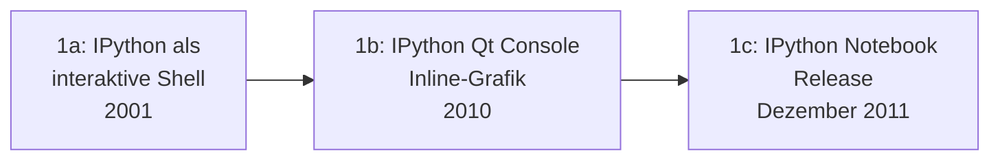

# Evolution und Architekturen digitaler IPython- & Jupyter-Systeme

IPython Notebook & die Geburt von Jupyter bilden Generation 2 der [Evolution digitaler Notebook-Systeme](evolution-digitaler-notebook-systeme.md). Diese eigenständige Zeitachse zoomt in genau diese Architekturlinie hinein: von IPython als reiner interaktiver Shell über inline Plotting, die Notebook-Veröffentlichung selbst, Export-Pipelines und die sprachunabhängige Jupyter-Abspaltung bis zur Kernel-Ökosystem-Explosion und Multi-User-Deployments über JupyterHub.

!!! note "Hinweis: Generationen überlappen sich"
    Die Zeiträume sind grobe Orientierung, keine scharfen Grenzen — die klassische IPython-Shell (Generation 1a) wird bis heute als Jupyter-Kernel-Unterbau produktiv genutzt. Entscheidend ist die **Architektur** (Kernel-Frontend-Trennung, Sprachunabhängigkeit), nicht allein das Erscheinungsjahr.

---

## Generation 1: IPython vor dem Notebook, 2001 – 2011

Die Gründergeneration eint drei Prinzipien: eine **interaktive, verbesserte Python-Shell** als Ausgangspunkt, **schrittweise wachsende grafische Fähigkeiten** und noch **keine Browser-Oberfläche**. Sie lässt sich in drei technologische Entwicklungsstufen unterteilen:

### 1a. IPython als interaktive Shell, 2001

- **Architektur:** Fernando Pérez veröffentlicht IPython als verbesserte interaktive Python-Kommandozeile — Tab-Vervollständigung, Objekt-Introspektion, Magic Commands statt der einfachen Standard-Python-Shell.

### 1b. IPython Qt Console — Inline-Grafik, 2010

- **Architektur:** eine grafische Desktop-Konsole ergänzt die reine Terminal-Shell um Inline-Grafikausgabe — ein direkter Zwischenschritt zum späteren Browser-Notebook.

### 1c. IPython Notebook — Release, Dezember 2011

- **Architektur:** Version 0.12 bringt das erste vollständige, browserbasierte Notebook-Interface für Python, siehe [Generation 2 der übergeordneten Zeitachse](evolution-digitaler-notebook-systeme.md#generation-2-ipython-notebook-die-geburt-von-jupyter-2011-2014).

---

## Generation 2: matplotlib inline & das wissenschaftliche Python-Ökosystem, 2011 – 2012

Die schnelle Adoption des neuen Notebook-Interfaces hängt eng mit der Möglichkeit zusammen, Diagramme direkt im Dokument statt in einem separaten Fenster darzustellen.

| Baustein | Rolle |
|---|---|
| **`%matplotlib inline`** | Magic Command, das Diagramme direkt unter der erzeugenden Codezelle einbettet — einer der Hauptgründe für die schnelle Verbreitung des Notebooks in der wissenschaftlichen Community. |

---

## Generation 3: nbconvert & die Export-Pipeline, 2013

Ein Notebook soll nicht nur interaktiv nutzbar, sondern auch als eigenständiges Dokument teilbar sein — **nbconvert** übersetzt die `.ipynb`-Datei in andere Formate.

| Baustein | Rolle |
|---|---|
| **nbconvert** | Konvertiert Notebooks in HTML, PDF, Markdown, Reveal.js-Präsentationen oder ausführbare Skripte, siehe [Office- & Dokumentenerstellung, Abschnitt 3](index.md#3-interaktive-executable-notebook-systeme). |

---

## Generation 4: Project Jupyter — die Abspaltung, 2014

Der entscheidende Architekturbruch: IPython trennt Notebook-Frontend und Ausführungs-Kernel vollständig — aus einem Python-spezifischen Werkzeug wird eine sprachunabhängige Plattform.

**Architektur:** standardisiertes Kernel-Protokoll über ZeroMQ-Sockets, das Frontend kommuniziert mit jedem konformen Kernel unabhängig von dessen Implementierungssprache.

| Baustein | Rolle |
|---|---|
| **Project Jupyter** | Der Name verweist auf **Ju**lia, **Pyt**hon und **R** — die ersten drei offiziell unterstützten Kernel-Sprachen bei der Abspaltung von IPython. |
| **Jupyter-Kernel-Protokoll** | Definiert die Nachrichtenformate zwischen Frontend und Kernel, unabhängig von der Implementierungssprache des Kernels. |

---

## Generation 5: Kernel-Ökosystem-Explosion, 2014 – 2017

Sobald das Kernel-Protokoll offen dokumentiert ist, entstehen Kernel-Implementierungen für dutzende weitere Sprachen — Jupyter wird zur gemeinsamen Oberfläche für praktisch jede Programmiersprache.

| Kernel | Sprache |
|---|---|
| **IRkernel** | R (parallel zur eigenständigen [R-Markdown-Linie](evolution-digitaler-rmarkdown-quarto.md)). |
| **IJulia** | Julia. |
| **IRuby, IHaskell, Xeus-Cling (C++)** | Weitere Sprachen aus einem inzwischen über 100 Kernel umfassenden Ökosystem. |

---

## Generation 6: JupyterHub & Multi-User-Deployments, 2014 – 2016

Statt einer lokalen Einzelinstallation entsteht eine Infrastruktur für **viele gleichzeitige Nutzer** auf gemeinsam betriebenen Servern — zentral für Hochschul-Rechenzentren und Forschungscomputing.

| Baustein | Rolle |
|---|---|
| **JupyterHub** | Verwaltet Authentifizierung und startet für jeden Nutzer eine eigene, isolierte Notebook-Server-Instanz — Grundlage für Klassenraum- und Forschungscomputing-Deployments. |

!!! tip "Übergang zur nächsten Generation"
    Die Multi-User-Infrastruktur aus JupyterHub bereitet [Generation 3 der übergeordneten Zeitachse](evolution-digitaler-notebook-systeme.md#generation-3-cloud-gehostete-notebook-plattformen-2013-2017) vor — dort wird dieselbe Idee zu vollständig gehosteten, kommerziellen Cloud-Plattformen weiterentwickelt.

---

## Alternative Sortier- & Klassifikationskriterien für IPython & Jupyter

### 1. Frontend-Backend-Trennung

- **Monolithisch, ein Prozess** — frühe IPython-Shell (Generation 1a).
- **Kernel-Frontend-Protokoll** — Jupyter ab Generation 4, sprachunabhängig.

### 2. Betriebsmodell

- **Lokale Einzelinstallation** — klassisches `jupyter notebook`.
- **Multi-User-Server** — JupyterHub.

### 3. Sprachunterstützung

- **Nur Python** — IPython Notebook (Generation 1c).
- **Julia/Python/R namensgebend** — Jupyter bei der Abspaltung (Generation 4).
- **Dutzende Sprachen** — Kernel-Ökosystem (Generation 5).

---

## Verwandte Themen

- [Beste IPython- & Jupyter-Systeme 2026 (Top 20)](ipython-jupyter-2026-topliste.md) — Momentaufnahme 2026, die diese Chronologie in eine gerankte Topliste übersetzt
- [Evolution und Architekturen digitaler Notebook-Systeme](evolution-digitaler-notebook-systeme.md) — übergeordnetes Generationenmodell, Generation 2 dort entspricht diesem Artikel im Ganzen
- [Evolution und Architekturen digitaler Notebook-Vorläufer](evolution-digitaler-notebook-vorlaeufer.md) — vorausgehende Generation
- [Evolution und Architekturen digitaler cloud-gehosteter Notebooks](evolution-digitaler-cloud-notebooks.md) — nachfolgende Generation
- [Evolution und Architekturen digitaler R-Markdown- & Quarto-Publishing](evolution-digitaler-rmarkdown-quarto.md) — Schwester-Zeitachse für die R-Ökosystem-Linie
