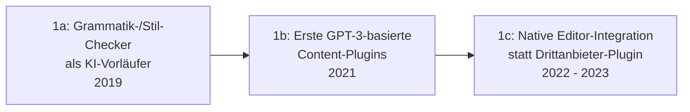

# Evolution und Architekturen digitaler KI-Content-Erstellung

KI-gestützte Content-Erstellung & Personalisierung bilden Generation 4 der [Evolution digitaler Content-Management-Systeme](evolution-digitaler-cms.md). Diese eigenständige Zeitachse zoomt in genau diese Architekturlinie hinein: von externen Grammatik-Plugins über native Editor-Integration, Text- und Bildgenerierung im Block-Editor bis zu Design-zu-Code-Umsetzung, semantischer Content-Discovery und vollintegrierten KI-Modul-Ökosystemen.

!!! note "Hinweis: Generationen überlappen sich"
    Die Zeiträume sind grobe Orientierung, keine scharfen Grenzen — externe Grammatik-Plugins (Generation 1) laufen bis heute parallel zu vollintegrierten KI-Modulen (Generation 6). Entscheidend ist die **Architektur** (KI als externes Plugin vs. native Editor-/Core-Integration), nicht allein das Erscheinungsjahr.

---

## Generation 1: Frühe KI-Schreibhilfen als externes Plugin, 2019 – 2023

Die Gründergeneration eint drei Prinzipien: **KI als Drittanbieter-Add-on** statt Core-Feature, **reaktive Textkorrektur** statt proaktiver Generierung und ein **schrittweiser Übergang** von reiner Grammatikprüfung zu generativen Vorschlägen. Sie lässt sich in drei technologische Entwicklungsstufen unterteilen:

### 1a. Grammatik-/Stil-Checker als KI-Vorläufer, 2019

- **Architektur:** Browser-Erweiterungen und CMS-Plugins prüfen Text auf Grammatik und Stil, noch ohne generative Textvorschläge.
- **Vertreter:** Grammarly-Integrationen in gängigen CMS-Editoren.

### 1b. Erste GPT-3-basierte Content-Plugins, 2021

- **Architektur:** externe SaaS-Dienste generieren Textentwürfe außerhalb des CMS, Redakteure kopieren Ergebnisse manuell in den Editor.
- **Vertreter:** Jasper, Copy.ai als eigenständige Content-Generatoren vor jeder CMS-Integration.

### 1c. Native Editor-Integration statt Drittanbieter-Plugin, 2022 – 2023

- **Architektur:** KI-Funktionen wandern erstmals direkt in den CMS-Editor selbst — kein Kopieren zwischen externem Tool und CMS mehr nötig.

---

## Generation 2: KI-Textgenerierung direkt im Block-Editor, ab 2023

Aufbauend auf [Generation 3 der klassischen CMS-Zeitachse](evolution-digitaler-klassische-cms.md#generation-3-gutenberg-das-block-editor-paradigma-ab-2018) wird Textgenerierung zum eingebauten Block-Feature statt externer Ergänzung.

| System | Jahr | Funktion |
|---|---|---|
| **WordPress + Jetpack AI** | 2023 | Content-Generierung, Übersetzung, Grammatikkorrektur direkt im Gutenberg-Editor. |

---

## Generation 3: KI-Bildgenerierung & Asset-Erstellung im CMS, 2022 – 2023

Neben Text wird auch Bildmaterial direkt im CMS generiert — kein Wechsel zu einem externen Bildgenerierungs-Tool mehr nötig.

| System | Prinzip |
|---|---|
| **Webflow AI** | KI-gestützte Layout- und Textvorschläge im visuellen No-Code-Builder. |
| **Adobe-Firefly-Integration in AEM** | Generative Bilderstellung direkt im Enterprise-WCM-Workflow. |

---

## Generation 4: KI-gestützte Design-zu-Code-Umsetzung, ab 2023

Statt Text oder Bilder zu generieren, übersetzt diese Generation vollständige **Design-Vorlagen direkt in produktionsreifen Code** — die Brücke zwischen Design-Tool und CMS wird KI-gestützt automatisiert.

| System | Prinzip |
|---|---|
| **Builder.io Visual Copilot** | Übersetzt Figma-Designs automatisiert in Live-Content-Komponenten. |

---

## Generation 5: Semantische Suche & automatisches Content-Tagging, 2023 – 2024

Aufbauend auf [Generation 4 der Composable-CMS-Zeitachse](evolution-digitaler-composable-cms.md#generation-4-ki-gestutzte-discovery-search-als-mach-baustein-2020-2023) wandert KI-gestützte Discovery auch in klassische Editor-Workflows — automatische Verschlagwortung und semantische Suche direkt im Redaktionssystem statt nur im separaten Such-Microservice.

| Baustein | Rolle |
|---|---|
| **Automatisches Content-Tagging** | KI schlägt Kategorien und Schlagworte basierend auf semantischer Analyse vor, statt manueller Redakteurs-Eingabe. |

---

## Generation 6: Vollintegrierte KI-Modul-Ökosysteme, ab 2024

Die aktuelle Generation bündelt Textgenerierung, Bilderstellung, semantische Suche und automatischen Alt-Text in einem **einzigen, im Core integrierten KI-Modul** mit Anbindung an viele austauschbare Modell-Provider — statt mehrerer getrennter Einzelfunktionen.

| System | Jahr | Funktion |
|---|---|---|
| **Drupal AI-Modul** | 2024 | Content-Erstellung, semantische Suche, automatischer Alt-Text; über **Symfony AI** an über 48 Modell-Provider anbindbar, siehe [Generation 5 von Drupal](drupal/evolution-digitaler-drupal.md#generation-5-ki-natives-drupal-recipe-basierte-distributionen-ab-2024). |

!!! tip "Bezug zu diesem Repository"
    Ausführlich behandelt in [Klassische Wissensmanagement-, KB- & CMS-Systeme mit LLM-Integration](klassische-wissensmanagement-cms-llm-integration.md#3-klassische-headless-cms) — dort auch der praktische Vergleich mit der KI-Integration in Wiki-Systemen aus [Generation 5 der Wiki-Engines-Zeitachse](evolution-digitaler-wiki-engines.md#generation-5-semantische-anreicherung-trifft-rag-ab-ca-2022).

---

## Alternative Sortier- & Klassifikationskriterien für KI-Content-Erstellung

### 1. Integrationstiefe

- **Externes Plugin/Drittanbieter-Tool** — Grammarly, Jasper (Generation 1).
- **Native Editor-Funktion** — Jetpack AI im Gutenberg-Editor (Generation 2).
- **Core-Modul mit Multi-Provider-Anbindung** — Drupal AI-Modul (Generation 6).

### 2. Content-Typ

- **Text** — Jetpack AI, Jasper.
- **Bild/Asset** — Webflow AI, Adobe Firefly.
- **Code/Layout** — Builder.io Visual Copilot.

### 3. Reaktiv vs. proaktiv

- **Reaktiv** — Grammatikkorrektur nach Eingabe (Generation 1a).
- **Proaktiv generierend** — vollständige Textentwürfe aus kurzer Anweisung (Generation 2+).

---

## Verwandte Themen

- [Beste KI-Content-Erstellung in CMS-Editoren 2026 (Top 20)](ki-content-erstellung-2026-topliste.md) — aktuelle Top-20-Topliste, die diese Chronologie in eine Momentaufnahme 2026 übersetzt
- [Evolution und Architekturen digitaler Content-Management-Systeme](evolution-digitaler-cms.md) — übergeordnetes Generationenmodell, Generation 4 dort entspricht diesem Artikel im Ganzen
- [Evolution und Architekturen digitaler Composable-CMS](evolution-digitaler-composable-cms.md) — vorausgehende Generation, Discovery-Microservices als Grundlage von Generation 5 dieses Artikels
- [Evolution und Architekturen digitaler Agentischer Content-Ökosysteme](evolution-digitaler-agentische-content-oekosysteme.md) — nachfolgende Generation
- [Klassische Wissensmanagement-, KB- & CMS-Systeme mit LLM-Integration](klassische-wissensmanagement-cms-llm-integration.md) — Vertiefung zu konkreten LLM-Integrationen
- [Evolution und Architekturen von Drupal](drupal/evolution-digitaler-drupal.md) — Vertiefung zum Drupal-AI-Modul aus Generation 6
