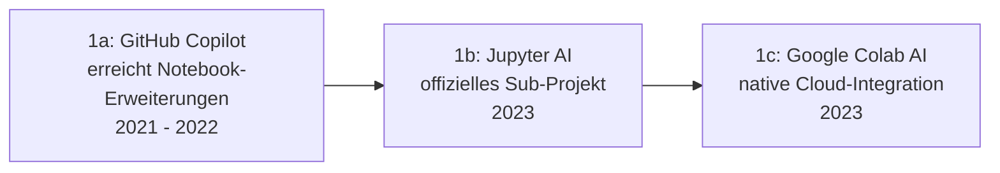

# Evolution und Architekturen digitaler KI-nativer Notebook-Umgebungen

KI-native & agentengestützte Notebook-Umgebungen bilden Generation 6 — die aktuelle und letzte Generation — der [Evolution digitaler Notebook-Systeme](evolution-digitaler-notebook-systeme.md). Diese eigenständige Zeitachse zoomt in genau diese Architekturlinie hinein: von KI-Vervollständigung in der Zelle über native Chat-Assistenten im Notebook, autonome Code-Ausführungs-Agenten und allgemeine agentische Sandboxes bis zu Cloud-Datenanalyse-Copiloten und mehrzelliger Analyseplanung.

!!! note "Hinweis: Generationen überlappen sich — und diese Generation ist noch jung"
    Die Zeiträume sind grobe Orientierung, keine scharfen Grenzen. Wie bei den agentischen Generationen der CMS-, LMS- und Wissenssysteme-Zeitachsen existieren für die spätesten Stufen dieser Zeitachse noch wenige vollständig ausgereifte, breit dokumentierte Referenzsysteme.

---

## Generation 1: Von Autovervollständigung zu KI-generiertem Code in der Zelle, 2021 – 2023

Die Gründergeneration eint drei Prinzipien: **KI als externe Editor-Erweiterung**, ein **schrittweiser Übergang** zu nativer Notebook-Integration und **noch reaktive statt autonome** Code-Vorschläge. Sie lässt sich in drei technologische Entwicklungsstufen unterteilen:

### 1a. GitHub Copilot erreicht Notebook-Erweiterungen, 2021 – 2022

- **Architektur:** direkte Fortsetzung von [Generation 1a der KI-nativen Web-Frameworks](../../entwicklung/webentwicklung/evolution-digitaler-ki-native-webframeworks.md#1a-github-copilot-externer-code-assistent-2021) — Copilot-Vervollständigung wird auf die Jupyter-Notebook-Oberfläche in VS Code ausgeweitet.

### 1b. Jupyter AI — offizielles Sub-Projekt, 2023

- **Architektur:** Project Jupyter selbst veröffentlicht **Jupyter AI** mit `%%ai`-Magic-Commands und einem Chat-Interface direkt innerhalb von JupyterLab, statt KI-Funktionen ausschließlich Drittanbietern zu überlassen.

### 1c. Google Colab AI — native Cloud-Integration, 2023

- **Architektur:** Google integriert KI-Codegenerierung direkt in die gehostete Colab-Oberfläche aus [Generation 4 der Cloud-Notebooks-Zeitachse](evolution-digitaler-cloud-notebooks.md#generation-4-google-colaboratory-kostenloser-gpu-zugriff-fur-die-masse-2017).

---

## Generation 2: Autonome Code-Ausführungs-Agenten, Juli 2023

**ChatGPT Code Interpreter** (später „Advanced Data Analysis") übernimmt erstmals nicht nur die Code-Generierung, sondern auch dessen **Ausführung** in einer sandboxed Umgebung — der Agent selbst entscheidet, welchen Code er als Nächstes ausführt.

| Baustein | Rolle |
|---|---|
| **ChatGPT Code Interpreter** | Führt selbstständig Python-Code in einer isolierten Sandbox aus, interpretiert die Ausgabe und passt den nächsten Schritt entsprechend an — eine Notebook-ähnliche Ausführungsschleife ohne sichtbare klassische Notebook-Oberfläche. |

---

## Generation 3: Notebook-artige Agenten-Sandboxes als allgemeines Agenten-Werkzeug, ab 2023

Das Sandbox-Prinzip aus Generation 2 löst sich von einer sichtbaren Notebook-Oberfläche und wird zum allgemeinen Baustein größerer Agenten-Frameworks — dieselbe Architekturlinie wie [Generation 3 der Autonomen-KI-Agenten-Zeitachse](../../künstliche-intelligenz/evolution-digitaler-autonome-ki-agenten.md#generation-3-autonome-coding-agenten-2023-2025).

| Baustein | Rolle |
|---|---|
| **Code-Execution-Tools in Agenten-Frameworks** | Stellen Agenten eine isolierte Python-/Shell-Ausführungsumgebung zur Verfügung, unabhängig von einer sichtbaren Notebook-UI. |

---

## Generation 4: KI-gestützte Datenanalyse-Copiloten in Cloud-Plattformen, 2023 – 2024

Cloud-Notebook-Anbieter aus [Generation 3 der übergeordneten Zeitachse](evolution-digitaler-cloud-notebooks.md) integrieren KI-Assistenten mit Kontext über den **gesamten Notebook-Verlauf** statt nur die aktuelle Zelle.

| System | Rolle |
|---|---|
| **Databricks Assistant** | KI-Copilot mit Kontext über Notebook-Historie und angebundene Datenquellen innerhalb der Databricks-Plattform. |
| **Google Colab Gemini-Integration** | Analoge Kontext-übergreifende KI-Unterstützung innerhalb von Colab. |

---

## Generation 5: Multi-Zellen-Planung statt Einzelzellen-Vervollständigung, ab 2024

Statt einzelner Codezeilen planen und schreiben Agenten **mehrere zusammenhängende Zellen** als kohärenten Analyseablauf — Planungsschritt und Codegenerierung verschmelzen zu einem zusammenhängenden Agenten-Workflow.

| Baustein | Rolle |
|---|---|
| **Mehrschritt-Analyseplanung** | Ein Agent zerlegt eine Analyseaufgabe in mehrere aufeinander aufbauende Zellen, statt nur die aktuelle Zeile zu vervollständigen. |

---

## Generation 6: Vollautonome Notebook-Erstellung aus Aufgabenbeschreibung, ab 2024/2025

Die Ausblick-Generation: Ein Agent erstellt ein **komplettes, lauffähiges Analyse-Notebook** aus einer kurzen, natürlichsprachigen Aufgabenbeschreibung — der Mensch reviewt nur noch das fertige Ergebnis statt jeden Zwischenschritt zu begleiten.

!!! tip "Bezug zu diesem Repository"
    Dasselbe Grundprinzip — ein Agent erzeugt ein vollständiges Artefakt aus einer kurzen Anweisung, Mensch reviewt vor Veröffentlichung — nutzt dieses Repository selbst über das [LLM-Wiki-Pattern (Karpathy-Muster)](llm-wiki-pattern-karpathy.md), dort auf Dokumentationsartikel statt Notebooks angewendet.

---

## Alternative Sortier- & Klassifikationskriterien für KI-native Notebooks

### 1. Integrationstiefe

- **Externe Editor-Erweiterung** — GitHub Copilot (Generation 1a).
- **Natives Notebook-Feature** — Jupyter AI, Colab AI.
- **Eigenständige Agenten-Sandbox ohne sichtbare Notebook-UI** — ChatGPT Code Interpreter, allgemeine Agenten-Frameworks.

### 2. Autonomiegrad

- **Vorschlagend, mensch-bestätigt** — klassische Code-Vervollständigung.
- **Selbstständig ausführend** — Code Interpreter, Multi-Zellen-Planung.
- **Vollautonome Artefakt-Erstellung** — Generation 6 (Ausblick).

### 3. Kontextfenster

- **Aktuelle Zelle** — frühe Vervollständigung.
- **Gesamter Notebook-Verlauf** — Databricks Assistant, Colab Gemini.

---

## Verwandte Themen

- [Evolution und Architekturen digitaler Notebook-Systeme](evolution-digitaler-notebook-systeme.md) — übergeordnetes Generationenmodell, Generation 6 dort entspricht diesem Artikel im Ganzen
- [Evolution und Architekturen digitaler Reaktiver Notebooks](evolution-digitaler-reaktive-notebooks.md) — vorausgehende Generation
- [Evolution und Architekturen digitaler cloud-gehosteter Notebooks](evolution-digitaler-cloud-notebooks.md) — technische Grundlage für Generation 1c/4 dieses Artikels
- [Evolution und Architekturen digitaler Autonomer KI-Agenten](../../künstliche-intelligenz/evolution-digitaler-autonome-ki-agenten.md) — allgemeine Agenten-Zeitachse, Generation 3 dort entspricht Generation 3 dieses Artikels
- [Evolution und Architekturen digitaler KI-nativer Web-Frameworks](../../entwicklung/webentwicklung/evolution-digitaler-ki-native-webframeworks.md) — analoges Prinzip für Web-Frameworks statt Notebooks
- [LLM-Wiki-Pattern (Karpathy-Muster)](llm-wiki-pattern-karpathy.md) — verwandtes Prinzip, das dieses Repository selbst nutzt
