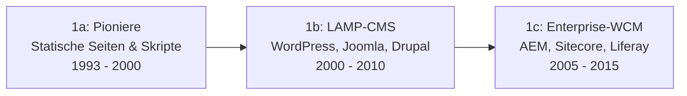

# Evolution und Architekturen digitaler klassischer CMS

Klassische, monolithische Content-Management-Systeme bilden Generation 1 der [Evolution digitaler Content-Management-Systeme](evolution-digitaler-cms.md). Diese eigenständige Zeitachse zoomt in genau diese Architekturlinie hinein: von statischen Pionier-Seiten über LAMP-CMS und Enterprise-WCM-Suiten bis zu Page-Buildern, dem Block-Editor-Paradigma, No-Code-Website-Buildern, der Cloud-Migration klassischer Enterprise-Suiten und schließlich einer Hybrid-Rückkehr, die den Monolithen um eine Headless-API ergänzt statt ihn zu ersetzen.

!!! note "Hinweis: Generationen überlappen sich"
    Die Zeiträume sind grobe Orientierung, keine scharfen Grenzen — WordPress (Generation 1) deckt über sein REST-API-Fundament inzwischen auch Headless-Einsatzszenarien ab. Entscheidend ist die **Architektur** (Rendering und Content-Speicher im selben System), nicht allein das Erscheinungsjahr.

---

## Generation 1: Pioniere, LAMP-CMS & Enterprise-WCM, 1993 – 2015

Die Gründergeneration eint drei Prinzipien: eine **zentrale Datenbank** als Content-Speicher, **Templates** zur Trennung von Inhalt und Präsentation und **serverseitiges Rendering**. Sie deckt sich mit [Generation 1 der übergeordneten CMS-Zeitachse](evolution-digitaler-cms.md#generation-1-klassische-monolithische-cms-datenbank-templates-serverseitiges-rendering) und lässt sich in dieselben drei Entwicklungsstufen unterteilen:

### 1a. Die Pioniere, 1993 – 2000

- **Vertreter:** Apache-SSI-Seiten, **Vignette StoryServer** (1995, erstes kommerzielles Web-Content-Management-System).

### 1b. LAMP-Content-Management & Blogging-Systeme, 2000 – 2010

- **Vertreter:** **WordPress** (2003), **Joomla** (2005), **Drupal** (2001, siehe [Evolution und Architekturen von Drupal](drupal/evolution-digitaler-drupal.md)), **TYPO3** (2000).

### 1c. Enterprise-WCM & Portal-Suiten, 2005 – 2015

- **Vertreter:** **Adobe Experience Manager**, **Sitecore**, **Liferay Portal**, **Alfresco**.

---

## Generation 2: WordPress-Ökosystem-Dominanz & Page-Builder, 2010 – 2018

Statt Themes zu programmieren, ermöglichen visuelle Page-Builder das Layout per Drag-and-Drop — die Einstiegshürde für individuelles Design sinkt drastisch, ohne den monolithischen WordPress-Kern zu verlassen.

| System | Jahr | Prinzip |
|---|---|---|
| **WooCommerce** | 2011 | Verwandelt WordPress in eine vollwertige E-Commerce-Plattform, ohne eigenständiges Content-Management aufzugeben. |
| **Divi** | 2013 | Visueller Page-Builder mit Echtzeit-Vorschau direkt im Frontend. |
| **Elementor** | 2016 | Wird zum meistgenutzten WordPress-Page-Builder, senkt die Design-Einstiegshürde für Nicht-Entwickler weiter. |

---

## Generation 3: Gutenberg & das Block-Editor-Paradigma, ab 2018

**WordPress Gutenberg** (2018) verlagert Block-basiertes Bearbeiten vom Plugin-Ökosystem (Generation 2) in den Core selbst — jeder Inhaltsabschnitt wird zum eigenständigen, wiederverwendbaren Block.

**Architektur:** React-basierter Block-Editor im Core, Block-Patterns als wiederverwendbare Layout-Vorlagen, Full Site Editing (2022) erweitert das Block-Prinzip auf Header/Footer/Templates.

| Baustein | Rolle |
|---|---|
| **Gutenberg-Core** | Ersetzt den klassischen TinyMCE-Editor durch ein Block-Datenmodell, beeinflusst spätere Layout-Systeme anderer CMS. |
| **Full Site Editing** | Erweitert Block-Bearbeitung 2022 auf die gesamte Seitenstruktur statt nur den Inhaltsbereich. |

---

## Generation 4: No-Code/Low-Code-Website-Builder, 2004 – 2020

Parallel zum Open-Source-Ökosystem entstehen vollständig gehostete, visuelle Website-Builder ohne jeden Code-Zugriff — Zielgruppe sind Einzelunternehmer und kleine Teams statt Entwickler.

| System | Jahr | Prinzip |
|---|---|---|
| **Squarespace** | 2004 | Design-fokussierter, vollständig gehosteter Website-Baukasten. |
| **Wix** | 2006 | Drag-and-Drop-Editor mit App-Marktplatz für Zusatzfunktionen. |
| **Webflow** | 2013 | Visueller Editor mit vollem CSS-/HTML-Kontrolle statt reiner Template-Auswahl — Brücke zwischen No-Code und professionellem Webdesign. |

---

## Generation 5: Cloud-Migration klassischer Enterprise-WCM, 2018 – 2022

Enterprise-Suiten aus Generation 1c migrieren zu cloud-nativem Betrieb, ohne den grundlegenden Monolith-Charakter aufzugeben — Skalierung und Wartung wandern zum Anbieter, die Kernarchitektur bleibt.

| System | Jahr | Veränderung |
|---|---|---|
| **Adobe Experience Manager as a Cloud Service** | 2020 | Cloud-native Neuausrichtung des klassischen AEM, siehe [Generation 3 der CMS-Zeitachse](evolution-digitaler-cms.md#generation-3-composable-mach-architektur-digital-experience-platforms-dxp-ab-ca-2020). |
| **Sitecore XM Cloud** | 2022 | Cloud-Betrieb der Sitecore-Plattform, engere Anlehnung an Composable-Prinzipien. |

---

## Generation 6: Hybrid-Rückkehr — klassisches CMS mit optionaler Headless-API, ab 2016

Statt zwischen monolithisch und headless zu wählen, bieten diese Systeme **beides gleichzeitig** — der klassische Rendering-Pfad bleibt bestehen, eine zusätzliche API erschließt Headless-Einsatzszenarien.

| Baustein | Jahr | Rolle |
|---|---|---|
| **WordPress REST API** | 2016 | Macht WordPress-Inhalte zusätzlich als JSON-API abrufbar — „Headless WordPress" ohne den klassischen Rendering-Pfad aufzugeben. |
| **Drupal JSON:API** | 2018 (Core-stabil) | Analoges Prinzip für Drupal, siehe [Generation 4 von Drupal](drupal/evolution-digitaler-drupal.md#generation-4-api-first-headless-reife-2022-2024). |

!!! tip "Übergang zur nächsten Generation"
    Generation 6 dieses Artikels bildet die direkte Brücke zu [Generation 2 der übergeordneten CMS-Zeitachse](evolution-digitaler-cms.md#generation-2-headless-decoupled-cms-api-first-ca-2015-2021) — dort radikalisiert sich die Trennung von Content und Präsentation vollständig, statt nur optional zu sein.

---

## Alternative Sortier- & Klassifikationskriterien für klassische CMS

### 1. Zielgruppe

- **Entwickler-zentriert** — Drupal, TYPO3.
- **Redakteur-zentriert** — WordPress mit Gutenberg, Joomla.
- **Nicht-technische Einzelnutzer** — Wix, Squarespace.

### 2. Layout-Erstellung

- **Theme-Code** — klassisches PHP-Templating (Generation 1).
- **Visueller Page-Builder als Plugin** — Elementor, Divi (Generation 2).
- **Block-Editor im Core** — Gutenberg (Generation 3).

### 3. API-Verfügbarkeit

- **Keine API** — reines serverseitiges Rendering (frühe Generation 1).
- **Optionale Zusatz-API** — WordPress REST API, Drupal JSON:API (Generation 6).

---

## Verwandte Themen

- [Beste klassische CMS 2026 (Top 20)](klassische-cms-2026-topliste.md) — aktuelle Top-20-Topliste, die diese Chronologie in eine Momentaufnahme 2026 übersetzt
- [Evolution und Architekturen digitaler Content-Management-Systeme](evolution-digitaler-cms.md) — übergeordnetes Generationenmodell, Generation 1 dort entspricht diesem Artikel im Ganzen
- [Evolution und Architekturen von Drupal](drupal/evolution-digitaler-drupal.md) — vertiefende Produkt-Geschichte innerhalb dieser Generation
- [Evolution und Architekturen digitaler Headless-CMS](evolution-digitaler-headless-cms.md) — nachfolgende Generation
- [Klassische Wissensmanagement-, KB- & CMS-Systeme mit LLM-Integration](klassische-wissensmanagement-cms-llm-integration.md) — LLM-Integration konkreter CMS
