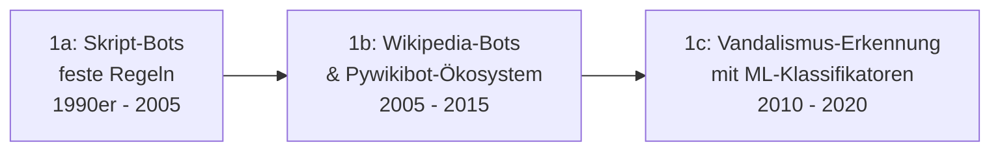

# Evolution und Architekturen digitaler Multi-Agenten-Wissensökosysteme

Multimodale und selbstorganisierende Multi-Agenten-Wissensökosysteme bilden Generation 6 — die aktuelle und letzte Generation — der [Evolution digitaler Wissenssysteme](evolution-digitaler-wissenssysteme.md). Wo [Semantische & RAG-Wissenssysteme](evolution-digitaler-semantische-rag-wissenssysteme.md) und [Visuelle, Local-First & Agentische Wissenssysteme](evolution-digitaler-visuell-agentische-wissenssysteme.md) die zugrundeliegenden Speicher- und Gedächtnis-Architekturen nachzeichnen, folgt dieser Artikel einer eigenen Zeitachse: der **Orchestrierung** — von einzelnen deterministischen Wiki-Bots über den ersten autonomen Einzel-Agenten und koordinierte Multi-Agenten-Teams bis zu schwarmartig selbstorganisierenden, multimodalen Wissensökosystemen.

!!! note "Hinweis: Generationen überlappen sich"
    Die Zeiträume sind grobe Orientierung, keine scharfen Grenzen — regelbasierte Wiki-Bots (Generation 1) laufen bis heute produktiv neben LLM-Multi-Agenten-Teams (Generation 3/4). Entscheidend ist die **Architektur der Koordination** (ein Akteur vs. mehrere kooperierende Akteure, deterministisch vs. autonom), nicht allein das Erscheinungsjahr.

---

## Generation 1: Regelbasierte Einzel-Bots, 1990er – 2010er

Die Vorgeschichte jedes Multi-Agenten-Systems ist der **einzelne, deterministische Bot** — ein Skript mit fest programmierter Logik, kein Sprachmodell, keine Autonomie über die eine zugewiesene Aufgabe hinaus.

### 1a. Skript-Bots mit festen Regeln, 1990er – 2005

- **Architektur:** einfache Skripte, die nach starrem Muster Inhalte einfügen oder korrigieren — keine Wahrnehmung von Kontext über die eine Regel hinaus.
- **Fokus:** repetitive Pflegeaufgaben (Rechtschreibkorrekturen, Formatierungsvereinheitlichung) statt inhaltlicher Kuration.

### 1b. Wikipedia-Bots & Pywikibot-Ökosystem, 2005 – 2015

- **Architektur:** das **Pywikibot**-Framework standardisiert Bot-Zugriff auf MediaWiki-APIs — siehe [MediaWiki Python Bot Automatisierung](mediawiki/mediawiki-python-bot.md) für die praktische Umsetzung in diesem Repository.
- **Fokus:** Massenbearbeitungen (Kategorien pflegen, Interwiki-Links setzen), weiterhin ohne inhaltliches Verständnis der bearbeiteten Texte.

### 1c. Vandalismus-Erkennung mit ML-Klassifikatoren, 2010 – 2020

- **Architektur:** statistische Klassifikatoren (vgl. [Generation 1c der KI-Anwendungen](../../künstliche-intelligenz/evolution-digitaler-ki-anwendungen.md#1c-statistisches-maschinelles-lernen-fruhe-anwendungen-1990-2010)) bewerten einzelne Bearbeitungen und machen automatisiert rückgängig.
- **Vertreter:** **ClueBot NG** (Wikipedia, ab 2010) — erkennt und revertiert Vandalismus vollautomatisch, bleibt aber ein einzelner, eng spezialisierter Klassifikator ohne generatives Sprachverständnis.

---

## Generation 2: Der autonome Einzel-Agent, 2022 – 2023

Mit LLMs entsteht erstmals ein Akteur, der **selbstständig plant, handelt und reflektiert** — aber noch als einzelner Agent ohne Aufteilung in spezialisierte Rollen.

**Architektur:** das **ReAct-Muster** (Reasoning + Acting, Yao et al., 2022) verschränkt Denkschritte und Werkzeugaufrufe in einer Schleife; ein einzelner Agent übernimmt Recherche, Bewertung und Ausführung gleichzeitig, ohne Aufgabenteilung.

| System | Jahr | Grenze dieser Generation |
|---|---|---|
| **ReAct-Paper** | 2022 | Formalisiert den Plan-Handle-Reflektiere-Zyklus, den alle späteren Agenten-Architekturen weiterentwickeln. |
| **AutoGPT** | 2023 | Erster breit bekannter autonomer Einzel-Agent für offene Rechercheaufgaben — zeigte ebenso deutlich die Grenzen: Endlosschleifen, fehlende Selbstkorrektur ohne zweite prüfende Instanz. |

---

## Generation 3: Koordinierte Multi-Agenten-Frameworks, 2023 – 2024

Die Antwort auf die Schwächen von Generation 2: **mehrere spezialisierte Agenten** mit klar getrennten Rollen (Recherche, Verfassen, Prüfen) statt eines überforderten Generalisten — ein Supervisor- oder Graph-basiertes Orchestrierungsmuster koordiniert die Übergaben zwischen ihnen.

**Architektur:** Rollentrennung (Researcher/Writer/Reviewer), Orchestrierung über Zustandsgraphen oder Crew-Hierarchien, ein Agent prüft die Ausgabe eines anderen, bevor sie weiterverwendet wird.

| Framework | Prinzip |
|---|---|
| **LangGraph** | Zustandsgraph-basierte Orchestrierung arbeitsteiliger Agenten, siehe [Agentic Workflows (LangGraph)](../../künstliche-intelligenz/coding/agentic-workflows-langgraph.md). |
| **CrewAI** | Rollenbasierte „Crews" aus Agenten mit fest zugewiesenen Aufgaben und Zielen. |
| **AutoGen** | Konversationsbasierte Multi-Agenten-Koordination, bei der Agenten sich gegenseitig Nachrichten schicken statt über einen starren Graphen geführt zu werden, siehe [AutoGen Multi-Agent Framework](../../künstliche-intelligenz/coding/autogen-multiagent-framework.md). |

---

## Generation 4: Git-native Human-in-the-Loop-Wissenspflege, 2024 – 2025

Multi-Agenten-Teams wenden sich konkret der **Dokumentations- und Wissenspflege** zu — mit einer entscheidenden Einschränkung gegenüber vollautomatischen Systemen: Agenten committen nicht direkt in die Live-Dokumentation, sondern arbeiten in **isolierten Branches** und legen **Pull Requests** an, die ein Mensch vor dem Merge prüft.

**Architektur:** Agent-Branch → automatisierte Prüfung (Build, Link-Check) → Pull Request → menschlicher Review → Merge — dasselbe Muster, das dieses Repository für seine eigene Pflege nutzt.

| Baustein | Rolle |
|---|---|
| **Co-Wiki-Konzept** | Mensch und Agent arbeiten arbeitsteilig am selben Wiki, siehe [Dokumentenerstellung, Wikis & Notebooks, Abschnitt 6](index.md#6-rag-ki-zentrierte-wissensdatenbanken-rag-co-wikis). |
| **Autonome Wiki-Pflege-Agenten** | Agenten schreiben direkt in ein bestehendes Wiki, review-pflichtig vor Veröffentlichung, siehe [Native „LLM-first" Wiki-Tools & Agenten, Abschnitt 4](llm-first-wiki-tools-agenten.md#4-autonome-wiki-pflege-agenten-agent-schreibt-in-ein-bestehendes-wiki). |
| **Selfhosting-Migration mit KI-Strukturierung** | Konkretes Beispiel für denselben Human-in-the-Loop-Ablauf bei der Übertragung KI-strukturierter Inhalte ins Live-System, siehe [KI strukturiert das Wiki autonom & Selfhosting-Migration](ki-autonome-wiki-strukturierung-selfhosting-migration.md). |

!!! tip "Bezug zu diesem Repository"
    Dieses Repository setzt exakt diese Generation um: Das [LLM-Wiki-Pattern (Karpathy-Muster)](llm-wiki-pattern-karpathy.md) beschreibt den Kompilierungsprozess, `doc-checker` und der `.gemini/hooks/pre-commit`-Hook übernehmen die automatisierte Prüfung, ein menschlicher Review bleibt vor jedem Merge Pflicht — ohne dass mehrere Agenten dabei gleichzeitig als koordiniertes Team auftreten müssten.

---

## Generation 5: Selbstorganisierende Wissensgraphen & Schwarm-Verifikation, ab ca. 2025

Statt eines linearen Recherche-Verfassen-Prüfen-Ablaufs verifizieren mehrere Agenten gegenseitig ihre Ergebnisse und pflegen gemeinsam einen strukturierten Wissensgraphen — Widersprüche werden nicht von einem Menschen, sondern **von einem anderen Agenten** erkannt und zur Korrektur zurückgespielt.

**Architektur:** mehrere Agenten mit sich überschneidenden Zuständigkeiten prüfen sich gegenseitig (Cross-Verification statt Einzelprüfung), gemeinsam gepflegter Wissensgraph als geteiltes Gedächtnis statt isolierter Einzelkontexte je Agent — direkte Fortsetzung von [GraphRAG aus der Semantische-&-RAG-Zeitachse](evolution-digitaler-semantische-rag-wissenssysteme.md#generation-6-graphrag-agentische-multi-hop-wissenssysteme-ab-2024), nun mit mehreren aktiv schreibenden statt nur lesenden Agenten.

| Baustein | Rolle |
|---|---|
| **Agentische Fakten-Verifikations-Schwärme** | Mehrere Agenten prüfen dieselbe Aussage unabhängig voneinander, bevor sie in die Wissensbasis übernommen wird. |
| **Gemeinsam gepflegte Wissensgraphen** | Agenten schreiben Entitäten und Beziehungen in denselben Graphen statt in isolierte Einzeldokumente. |
| **MCP als gemeinsame Werkzeugschicht** | Standardisierter Werkzeugzugriff über das Model Context Protocol erlaubt mehreren Agenten denselben Wissensbestand konsistent zu durchsuchen und zu ändern, siehe [Beste Wissensmanagement-Systeme mit MCP-Server (Top 20)](wissensmanagement-mcp-server-topliste.md). |

---

## Generation 6: Multimodale Multi-Agenten-Ökosysteme, ab ca. 2025/2026

Die aktuelle Generation erweitert die Wissensbasis über reinen Text hinaus: Agenten nehmen **Audio, Video und Bilder** als gleichwertige Wissensquellen auf und verarbeiten sie in denselben, gemeinsam gepflegten Wissensbestand — Recherche, Verifikation und Pflege laufen über Modalitäten hinweg statt nur innerhalb von Textdokumenten.

**Architektur:** spezialisierte Agenten pro Modalität (Transkription, Bildbeschreibung, Video-Zusammenfassung) übergeben ihre Ergebnisse an dieselbe Orchestrierungsschicht wie textbasierte Agenten, ein gemeinsamer, multimodaler Wissensgraph statt getrennter Silos je Medientyp.

| Baustein | Rolle |
|---|---|
| **Multimodale Recherche-Agenten** | Kombinieren Text-, Audio- und Video-Verständnis (vgl. [Multimodale Modelle](../../künstliche-intelligenz/index.md#3-multimodale-modelle)) innerhalb derselben Agenten-Pipeline. |
| **OpenAI AgentKit, Claude Code als Orchestrator** | Herstellerseitige und agentische Coding-Werkzeuge als Basis für domänenübergreifende Wissensökosysteme, siehe [AI Agents – Das Praxis-Handbuch](../../künstliche-intelligenz/coding/ai-agents-praxis.md). |
| **Selbstorganisierende Wissensökosysteme** | Der Endpunkt dieser Zeitachse: eine Wissensbasis, die kontinuierlich, multimodal und weitgehend ohne menschliches Zutun recherchiert, verifiziert und aktualisiert wird — mit menschlicher Kontrolle nur noch an strategischen statt operativen Kontrollpunkten. |

---

## Alternative Sortier- & Klassifikationskriterien für Multi-Agenten-Wissensökosysteme

Neben dem chronologischen/technologischen Generationenmodell lassen sich diese Systeme nach folgenden Dimensionen einordnen:

### 1. Akteurszahl & Koordination

- **Einzelner Bot/Agent** — eine Instanz, keine Rollenteilung (Generation 1, 2).
- **Koordinierte Rollenteilung** — mehrere Agenten mit fest zugewiesenen, sich ergänzenden Aufgaben (Generation 3, 4).
- **Schwarm mit Selbstorganisation** — Agenten übernehmen Aufgaben dynamisch, prüfen sich gegenseitig ohne feste Hierarchie (Generation 5, 6).

### 2. Grad menschlicher Kontrolle

- **Vollautomatisch, eng begrenzt** — Bot handelt ohne Review, aber nur innerhalb einer engen, risikoarmen Regel (Generation 1).
- **Human-in-the-Loop vor Veröffentlichung** — jede Änderung durchläuft Review/PR vor dem Merge (Generation 3, 4).
- **Human-on-the-Loop** — Mensch überwacht stichprobenartig statt jede Änderung einzeln zu prüfen (Generation 5, 6).

### 3. Verifikationsmechanismus

- **Keine Verifikation** — Bot-Ausgabe wird ungeprüft übernommen (frühe Generation 1).
- **Menschliche Prüfung** — ein Mensch validiert vor Übernahme (Generation 3, 4).
- **Agent-zu-Agent-Verifikation** — ein anderer Agent prüft Konsistenz und Faktentreue (Generation 5, 6).

### 4. Modalität der Wissensquelle

- **Rein textuell** — Quellen und Ausgabe ausschließlich Text (Generation 1–5).
- **Multimodal** — Audio, Video und Bild als gleichwertige Wissensquellen neben Text (Generation 6).

---

## Verwandte Themen

- [Beste Multi-Agenten-Wissensökosysteme 2026 (Top 20)](multiagenten-wissensoekosysteme-2026-topliste.md) — aktuelle Top-20-Topliste, die diese Chronologie in eine Momentaufnahme 2026 übersetzt
- [Evolution und Architekturen digitaler Wissenssysteme](evolution-digitaler-wissenssysteme.md) — übergeordnetes Generationenmodell, Generation 6 dort entspricht diesem Artikel im Ganzen
- [Evolution und Architekturen digitaler Semantischer & RAG-Wissenssysteme](evolution-digitaler-semantische-rag-wissenssysteme.md) — GraphRAG als technische Grundlage von Generation 5 dieses Artikels
- [Evolution und Architekturen digitaler Visueller, Local-First & Agentischer Wissenssysteme](evolution-digitaler-visuell-agentische-wissenssysteme.md) — analoges Generationenmodell zu agentischen Gedächtnisarchitekturen (Einzel-Agent statt Multi-Agenten-Fokus)
- [LLM-Wiki-Pattern (Karpathy-Muster)](llm-wiki-pattern-karpathy.md) — das konkrete Kompilierungs- und Pflegeprinzip, das dieses Repository selbst nutzt (Generation 4)
- [KI strukturiert das Wiki autonom & Selfhosting-Migration](ki-autonome-wiki-strukturierung-selfhosting-migration.md) — praktisches Beispiel für Generation 4
- [Native „LLM-first" Wiki-Tools & Agenten](llm-first-wiki-tools-agenten.md) — Werkzeuglandschaft zu Generation 2–4
- [AI Agents – Das Praxis-Handbuch & Architektur-Leitfaden](../../künstliche-intelligenz/coding/ai-agents-praxis.md) — Vertiefung zu Generation 3/6
- [AutoGen Multi-Agent Framework](../../künstliche-intelligenz/coding/autogen-multiagent-framework.md) und [Agentic Workflows (LangGraph)](../../künstliche-intelligenz/coding/agentic-workflows-langgraph.md) — Vertiefung zu Generation 3
- [Beste Wissensmanagement-Systeme (Open Source) mit MCP-Server (Top 20)](wissensmanagement-mcp-server-topliste.md) — Vertiefung zur MCP-Werkzeugschicht aus Generation 5
- [Evolution und Architekturen digitaler KI-Anwendungen](../../künstliche-intelligenz/evolution-digitaler-ki-anwendungen.md) — Generation 6 dort (Autonome KI-Agenten & Multi-Agenten-Ökosysteme) bildet das allgemeine Gegenstück zu diesem wissenssystem-spezifischen Artikel
