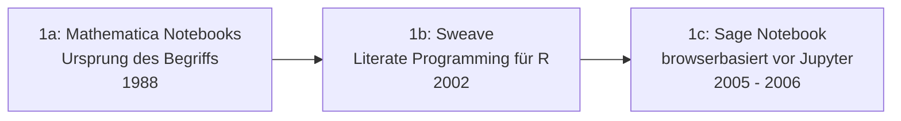

# Evolution und Architekturen digitaler Notebook-Systeme

Interaktive „Executable"-Notebook-Systeme lassen sich — analog zu den Generationenmodellen für [Wissenssysteme](evolution-digitaler-wissenssysteme.md), [Content-Management-Systeme](evolution-digitaler-cms.md) und [Lernmanagement-Systeme](../e-learning/evolution-digitaler-lms.md) — nach **technologischen Generationen** ordnen: von den ersten Literate-Programming-Vorläufern über die Geburt von Jupyter, cloud-gehostete Notebook-Plattformen und das R-Markdown-/Quarto-Publishing-Ökosystem bis zu reaktiven Notebooks ohne verstecktem Zustand und schließlich KI-nativen, agentengestützten Notebook-Umgebungen. Die produkt-/tool-orientierte Übersicht konkreter Notebook-Systeme bietet [Dokumentenerstellung, Wikis & Notebooks, Abschnitt 3](index.md#3-interaktive-executable-notebook-systeme), eine aktuelle, cluster-übergreifende Rangliste die [Top-20-Topliste 2026](notebook-systeme-2026-topliste.md).

!!! note "Hinweis: Generationen überlappen sich"
    Die Zeiträume sind grobe Orientierung, keine scharfen Grenzen — klassische Jupyter-Notebooks (Generation 2) laufen bis heute produktiv parallel zu reaktiven Alternativen (Generation 5) und KI-gestützten Umgebungen (Generation 6). Entscheidend ist die **Architektur** (lineare Zellausführung mit verstecktem Zustand vs. reaktive Neuberechnung, Dateiformat, Ausführungsort), nicht allein das Erscheinungsjahr.

!!! note "Rust als quer liegende Implementierungsachse"
    Quer zu allen sechs Generationen dieser Zeitachse liegt eine eigene Rust-Implementierungsachse — von der Python-Rust-Brücke über massentaugliche DataFrame-Bibliotheken wie Polars bis zu Rust-gestützter Paket- und Umgebungsverwaltung. Details in [Evolution und Architekturen digitaler Rust-Notebooks](evolution-digitaler-rust-notebooks.md).

---

## Generation 1: Literate-Programming-Vorläufer & erste Notebook-Interfaces, 1988 – 2007

Die Gründergeneration eint drei Prinzipien: **Code, Ausgabe und erklärender Text in einem einzigen Dokument** statt getrennter Dateien, **sequenzielle Zellausführung** als Grundinteraktionsmodell und **noch keine breite Sprachunabhängigkeit** — jedes System ist eng an eine einzelne Sprache oder Software gebunden. Sie lässt sich in drei technologische Entwicklungsstufen unterteilen — eine tiefergehende Betrachtung dieser Architekturlinie bietet [Evolution und Architekturen digitaler Notebook-Vorläufer](evolution-digitaler-notebook-vorlaeufer.md):

### 1a. Mathematica Notebooks — der Ursprung des Begriffs, 1988

- **Architektur:** Wolframs Mathematica 1.0 führt das „Notebook"-Interface ein — Eingabezellen, Berechnungsergebnisse, Grafiken und erklärender Text leben gemeinsam in einem einzigen, strukturierten Dokument.
- **Bedeutung:** prägt den Begriff „Notebook" für diese gesamte Systemkategorie, Jahrzehnte vor Jupyter.

### 1b. Sweave — Literate Programming für R, 2002

- **Architektur:** kombiniert LaTeX-Textsatz mit eingebetteten R-Codeblöcken („Chunks"), die beim Kompilieren durch ihre Ausgabe ersetzt werden — Berechnung und Dokumentation bleiben in derselben Quelldatei synchron.
- **Bedeutung:** direkter konzeptioneller Vorläufer von R Markdown (Generation 4).

### 1c. Sage Notebook — browserbasiert vor Jupyter, 2005 – 2006

- **Architektur:** die Mathematik-Software Sage bringt ein browserbasiertes Notebook-Interface, Jahre bevor IPython sein eigenes Notebook vorstellt.
- **Bedeutung:** eine direkte Inspirationsquelle für das spätere IPython-Notebook-Interface aus Generation 2.

---

## Generation 2: IPython Notebook & die Geburt von Jupyter, 2011 – 2014

Aus einer interaktiven Python-Kommandozeile wird ein vollwertiges, browserbasiertes Notebook — und aus diesem wiederum ein sprachunabhängiges Ökosystem.

**Architektur:** Kernel-Server-Modell (der Kernel führt Code aus, das Notebook-Frontend zeigt Zellen und Ausgaben im Browser), `.ipynb`-Dateiformat als JSON-Struktur.

| Meilenstein | Jahr | Bedeutung |
|---|---|---|
| **IPython Notebook** | 2011 | Erstes browserbasiertes Notebook-Interface für Python, direkt aus der interaktiven IPython-Shell hervorgegangen. |
| **Project Jupyter** | 2014 | Löst sich von IPython und wird sprachunabhängig — der Name „Jupyter" verweist auf **Ju**lia, **Pyt**hon und **R**, die ersten drei unterstützten Kernel-Sprachen. |

Eine eigene, tiefergehende Generationen-Zeitachse speziell für diese Architekturlinie bietet [Evolution und Architekturen digitaler IPython- & Jupyter-Systeme](evolution-digitaler-ipython-jupyter.md).

---

## Generation 3: Cloud-gehostete Notebook-Plattformen, 2013 – 2017

Notebooks wandern von der lokalen Installation in gehostete, oft GPU-beschleunigte Cloud-Umgebungen — kein eigenes Setup mehr nötig, um mit Data-Science-Workloads zu starten.

| System | Jahr | Prinzip |
|---|---|---|
| **Databricks Notebooks** | 2013 | Kollaborative, Spark-integrierte Notebooks für Big-Data-Workloads im Enterprise-Umfeld. |
| **Kaggle Kernels** | 2016 | Direkt an Datensätze und Wettbewerbe gekoppelte, gehostete Notebooks. |
| **Google Colaboratory** | 2017 | Kostenloser Zugriff auf GPU-/TPU-Beschleunigung direkt im Browser, ohne lokale Installation. |

Eine eigene, tiefergehende Generationen-Zeitachse speziell für diese Architekturlinie bietet [Evolution und Architekturen digitaler Cloud-Notebooks](evolution-digitaler-cloud-notebooks.md).

---

## Generation 4: R-Markdown-Ökosystem & Multi-Sprachen-Publishing, 2012 – 2022

Parallel zum Jupyter-Strang entwickelt sich aus Sweave (Generation 1b) ein eigenständiges Publishing-Ökosystem, das Notebooks nicht nur interaktiv ausführt, sondern in hochwertige Enddokumente (PDF, HTML, Bücher, Präsentationen) umwandelt.

| System | Jahr | Prinzip |
|---|---|---|
| **R Markdown** | 2012/2014 | Kombiniert Markdown-Text mit ausführbaren Code-Chunks (`knitr`-Engine), mehrere Ausgabeformate aus einer Quelldatei. |
| **Quarto** | 2022 | Modernes Nachfolgesystem von R Markdown, sprachunabhängig (Python, R, Julia, Observable JS statt nur R). |
| **Jupyter Book** | 2020 | Veröffentlicht eine Sammlung von Jupyter-Notebooks als zusammenhängendes, durchsuchbares Online-Buch. |

Eine eigene, tiefergehende Generationen-Zeitachse speziell für diese Architekturlinie bietet [Evolution und Architekturen digitaler R-Markdown- & Quarto-Publishing-Systeme](evolution-digitaler-rmarkdown-quarto.md).

---

## Generation 5: Reaktive Notebooks ohne versteckten Zustand, 2018 – 2024

Klassische Jupyter-Notebooks leiden unter einem bekannten Architekturproblem: Zellen lassen sich in beliebiger Reihenfolge ausführen, wodurch der sichtbare Code nicht mehr zwingend dem tatsächlichen Ausführungszustand entspricht. Diese Generation löst das durch **automatische, dataflow-basierte Neuberechnung** abhängiger Zellen.

| System | Jahr | Prinzip |
|---|---|---|
| **Observable** | 2018 | Reaktives JavaScript-Notebook — ändert sich eine Zelle, berechnen sich alle abhängigen Zellen automatisch neu, unabhängig von ihrer Position im Dokument. |
| **Pluto.jl** | 2020 | Reaktives Notebook für Julia nach demselben Dataflow-Prinzip. |
| **Marimo** | 2023/2024 | Reaktives Python-Notebook, das als reine `.py`-Datei statt JSON gespeichert wird — dadurch Git-diff-freundlich und ohne verstecktem Zustand. |

Eine eigene, tiefergehende Generationen-Zeitachse speziell für diese Architekturlinie bietet [Evolution und Architekturen digitaler Reaktiver Notebooks](evolution-digitaler-reaktive-notebooks.md).

---

## Generation 6: KI-native & agentengestützte Notebook-Umgebungen, ab 2023

Generative KI wandert direkt in die Zelle: Code wird aus natürlicher Sprache generiert, und autonome Agenten schreiben und führen ganze Analyseschritte selbstständig aus, statt nur Vervollständigungsvorschläge zu liefern.

| System | Rolle |
|---|---|
| **Jupyter AI / GitHub Copilot in Notebooks** | LLM-gestützte Code-Generierung direkt in der Notebook-Zelle statt externem Editor-Assistenten. |
| **ChatGPT Code Interpreter (Advanced Data Analysis)** | Ein Agent schreibt, führt und interpretiert Python-Code in einer sandboxed Notebook-ähnlichen Umgebung eigenständig, siehe [Generation 3 der Autonomen-KI-Agenten-Zeitachse](../../künstliche-intelligenz/evolution-digitaler-autonome-ki-agenten.md#generation-3-autonome-coding-agenten-2023-2025). |
| **Google Colab AI-Integration** | Native Modell-Anbindung direkt in der gehosteten Cloud-Notebook-Umgebung aus Generation 3. |

Eine eigene, tiefergehende Generationen-Zeitachse speziell für diese Architekturlinie bietet [Evolution und Architekturen digitaler KI-nativer Notebook-Umgebungen](evolution-digitaler-ki-native-notebooks.md).

---

## Alternative Sortier- & Klassifikationskriterien für Notebook-Systeme

Neben dem chronologischen/technologischen Generationenmodell lassen sich Notebook-Systeme nach folgenden Dimensionen einordnen:

### 1. Ausführungsmodell

- **Linear, mit verstecktem Zustand** — Zellen in beliebiger Reihenfolge ausführbar, sichtbarer Code kann vom tatsächlichen Zustand abweichen (klassisches Jupyter).
- **Reaktiv/dataflow-basiert** — abhängige Zellen berechnen sich automatisch neu (Observable, Pluto.jl, Marimo).
- **Agentisch gesteuert** — ein KI-Agent entscheidet selbst, welcher Code als Nächstes ausgeführt wird (ChatGPT Code Interpreter).

### 2. Dateiformat

- **JSON-basiert** (`.ipynb`) — Jupyter-Notebooks, enthält Code, Ausgaben und Metadaten in einer Struktur.
- **Klartext-Quelldatei** — R Markdown/Quarto (`.qmd`), Marimo (`.py`) — Git-diff-freundlicher als JSON.

### 3. Sprachunabhängigkeit

- **Sprachgebunden** — Mathematica Notebooks, Sweave (nur R), Observable (nur JavaScript).
- **Sprachunabhängig über Kernel-Protokoll** — Jupyter (Julia/Python/R und viele weitere über zusätzliche Kernel).
- **Sprachunabhängig über Rendering-Engine** — Quarto (Python, R, Julia, Observable JS im selben Dokument).

### 4. Ausführungsort

- **Lokal** — klassische Jupyter-/JupyterLab-Installation.
- **Gehostet/Cloud** — Google Colab, Kaggle Kernels, Databricks.
- **Vollständig im Browser (WebAssembly)** — JupyterLite, Marimo im WASM-Modus, ohne jeden Server.

---

## Verwandte Themen

- [Dokumentenerstellung, Wikis & Notebooks, Abschnitt 3](index.md#3-interaktive-executable-notebook-systeme) — Gesamtübersicht konkreter Notebook-Werkzeuge (JupyterLab, Quarto, Livebook, Marimo, Voila, Papermill u. a.)
- [Evolution und Architekturen digitaler Notebook-Vorläufer](evolution-digitaler-notebook-vorlaeufer.md) — vertiefendes Generationenmodell speziell für Generation 1 dieses Artikels
- [Evolution und Architekturen digitaler IPython- & Jupyter-Systeme](evolution-digitaler-ipython-jupyter.md) — vertiefendes Generationenmodell speziell für Generation 2 dieses Artikels
- [Evolution und Architekturen digitaler Cloud-Notebooks](evolution-digitaler-cloud-notebooks.md) — vertiefendes Generationenmodell speziell für Generation 3 dieses Artikels
- [Evolution und Architekturen digitaler R-Markdown- & Quarto-Publishing-Systeme](evolution-digitaler-rmarkdown-quarto.md) — vertiefendes Generationenmodell speziell für Generation 4 dieses Artikels
- [Evolution und Architekturen digitaler Reaktiver Notebooks](evolution-digitaler-reaktive-notebooks.md) — vertiefendes Generationenmodell speziell für Generation 5 dieses Artikels
- [Evolution und Architekturen digitaler KI-nativer Notebook-Umgebungen](evolution-digitaler-ki-native-notebooks.md) — vertiefendes Generationenmodell speziell für Generation 6 dieses Artikels
- [Evolution und Architekturen digitaler Rust-Notebooks](evolution-digitaler-rust-notebooks.md) — quer zu allen sechs Generationen liegende Implementierungsachse (Rust-Kerne hinter DataFrame-Bibliotheken, Linting und Paketverwaltung)
- [Evolution und Architekturen digitaler Wissenssysteme](evolution-digitaler-wissenssysteme.md) — analoges Generationenmodell für Wikis & PKM-Systeme
- [Evolution und Architekturen digitaler Docs-as-Code](evolution-digitaler-docs-as-code.md) — analoges Generationenmodell für Docs-as-Code-Werkzeuge, direkte Schnittmenge bei Jupyter Book/Quarto als Publishing-Engines
- [Evolution und Architekturen digitaler Content-Management-Systeme](evolution-digitaler-cms.md) — analoges Generationenmodell für CMS
- [Evolution und Architekturen digitaler LMS](../e-learning/evolution-digitaler-lms.md) — analoges Generationenmodell für Lernmanagement-Systeme
- [Evolution und Architekturen digitaler Autonomer KI-Agenten](../../künstliche-intelligenz/evolution-digitaler-autonome-ki-agenten.md) — Vertiefung zu Generation 6 dieses Artikels
- [Evolution und Architekturen digitaler Interpreter](../../entwicklung/system/evolution-digitaler-interpreter.md) — ChatGPT Code Interpreter aus Generation 6 dieses Artikels als Produktbeispiel für Sandbox-Interpreter-Architektur
